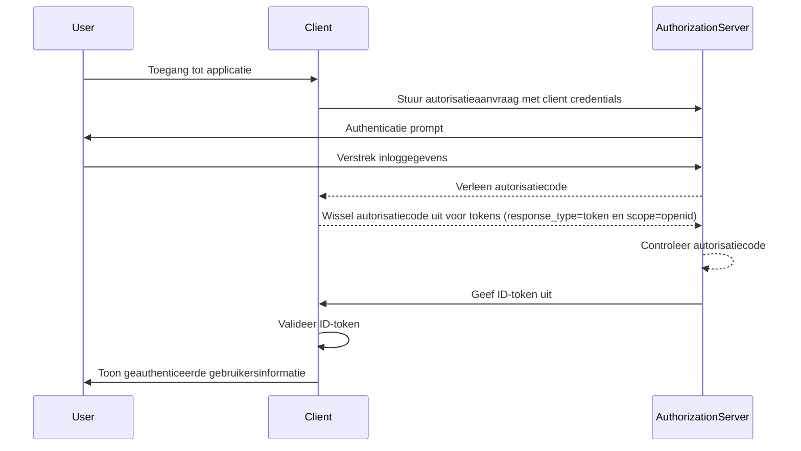

## Wat is een ID-token?

Een ID-token is een specifiek type beveiligingstoken dat informatie bevat over de geauthenticeerde gebruiker, geleverd aan de clienttoepassing na een succesvolle authenticatie. Een ID-token is het kenmerk dat OpenID Connect (OIDC) onderscheidt van OAuth 2.0. Terwijl OAuth 2.0 zich uitsluitend richt op autorisatie, bouwt OIDC hierop voort door gebruikersauthenticatie toe te voegen door middel van het introduceren van het ID-token.

In het OIDC-authenticatieproces initieert een clienttoepassing (vertrouwende partij) authenticatie door de gebruiker naar een autorisatieserver door te verwijzen. Na geslaagde authenticatie reageert de server met een ID-token, naast andere tokens zoals het access token (toegangstoken). Het ID-token wordt doorgaans gecodeerd als een JWT (JSON Web Token) en bevat belangrijke claims zoals de gebruikersidentificatie (sub), de issuer (uitgever) (iss), audience (doelgroep) (aud) en andere gebruikersspecifieke informatie.

De primaire functie van het ID-token is het verifiëren van de identiteit van de gebruiker en het overdragen van deze informatie aan de clienttoepassing. Hierdoor kan de toepassing de gebruiker authenticeren zonder direct met inloggegevens om te gaan. Aangezien de client het ID-token alleen ontvangt nadat de gebruiker is geauthenticeerd door de autorisatieserver, kan het ID-token worden gebruikt als een veilige manier om de identiteit van de gebruiker te verifiëren.

## Hoe werkt een ID-token?

De clienttoepassing initieert het authenticatieproces door de gebruiker naar de autorisatieserver door te verwijzen. De gebruiker authenticeert zich bij de server, die vervolgens een ID-token uitgeeft samen met andere tokens zoals het access token (toegangstoken). Het ID-token wordt teruggestuurd naar de clienttoepassing, die het vervolgens kan gebruiken om de identiteit van de gebruiker te verifiëren.

Aangezien OIDC een populaire en gestandaardiseerde protocol is, bieden veel bibliotheken en frameworks ingebouwde ondersteuning voor het omgaan met ID-tokens. Dit maakt ID-tokens gemakkelijk te integreren in clienttoepassingen en zijn ze veel gebruikt in single sign-on (SSO) en federatieve identiteitsscenario's.

## Claims in een ID-token

Een ID-token is een JWT (JSON Web Token) die een reeks claims over de geauthenticeerde gebruiker bevat. Deze claims omvatten zowel standaard JWT-claims die zijn gedefinieerd in de [JWT-specificatie](https://datatracker.ietf.org/doc/html/rfc7519#section-4), als OIDC-specifieke claims die worden gebruikt om gebruikersidentiteitsinformatie over te brengen.

Standaard token claims volgens JWT:

- **iss (Issuer)**: VEREIST. De issuer claim identificeert de uitgever van het ID-token. Dit is doorgaans de URL van de autorisatieserver die het token heeft uitgegeven.
- **sub (Subject)**: VEREIST. De subject claim identificeert de gebruiker waar het ID-token van toepassing is. Dit is doorgaans een unieke identificatie voor de gebruiker.
- **aud (Audience)**: VEREIST. De audience claim identificeert de doelgroep voor het ID-token. Dit is doorgaans de clienttoepassing die het token heeft aangevraagd.
- **exp (Expiration time)**: VEREIST. De vervaltijd claim identificeert het tijdstip waarop het token verloopt. Na dit tijdstip mag het token niet meer worden geaccepteerd voor verwerking.
- **iat (Issued at)**: VEREIST. De uitgegeven op claim identificeert het tijdstip waarop het token is uitgegeven.
- **auth_time (Authentication time)**: OPTIONEEL. De authenticatietijd claim identificeert het moment waarop de gebruiker is geauthenticeerd. Deze claim is alleen aanwezig als de gebruiker tijdens de huidige sessie is geauthenticeerd.
- **nonce**: OPTIONEEL. De nonce claim wordt gebruikt om een clientsessie te associëren met een ID-token. Het wordt doorgaans gebruikt om replay aanvallen te voorkomen.

OIDC-standaard claims voor gebruikersinformatie:

- **name**: De volledige naam van de gebruiker.
- **given_name**: De voornaam van de gebruiker.
- **family_name**: De achternaam van de gebruiker.
- **middle_name**: De tweede naam van de gebruiker.
- **nickname**: De bijnaam of andere korte naam van de gebruiker.
- **preferred_username**: De door de gebruiker geprefereerde gebruikersnaam.
- **profile**: Een URL die verwijst naar de profielpagina van de gebruiker.
- **picture**: Een URL die verwijst naar de profielfoto van de gebruiker.
- **website**: Een URL die verwijst naar de website van de gebruiker.
- **email**: Het e-mailadres van de gebruiker.
- **email_verified**: Een boolean waarde die aangeeft of het e-mailadres van de gebruiker is geverifiëerd.
- **gender**: Het geslacht van de gebruiker.
- **birthdate**: De geboortedatum van de gebruiker, weergegeven als een string in het formaat JJJJ-MM-DD.
- **zoneinfo**: De tijdzone van de gebruiker. String uit de [IANA Time Zone Database](https://www.iana.org/time-zones).
- **locale**: De lokale instelling van de gebruiker. Vertegenwoordigt de door de gebruiker geprefereerde taal en regio voor het opmaken van datums, tijden en getallen.
- **phone_number**: Het telefoonnummer van de gebruiker.
- **phone_number_verified**: Een boolean waarde die aangeeft of het telefoonnummer van de gebruiker is geverifiëerd.
- **address**: Het postadres van de gebruiker. De waarde is een JSON-object dat de adresinformatie van de gebruiker bevat.
- **updated_at**: Het moment waarop de informatie van de gebruiker voor het laatst is bijgewerkt.

Deze claims bieden een gestandaardiseerde manier om gebruikersidentiteitsinformatie over te brengen in het ID-token. Terwijl de specificatie alleen een reeks standaard claims definieert, kunnen ook aangepaste claims worden opgenomen in het ID-token om aanvullende gebruikersspecifieke informatie over te brengen indien nodig.

## Validatie van ID-token

Wanneer de clienttoepassing een ID-token ontvangt, moet het token worden gevalideerd om de authenticiteit en integriteit ervan te waarborgen. Het validatieproces omvat doorgaans de volgende stappen:

1. **Controleer de handtekening**: De client moet de handtekening van het ID-token verifiëren met behulp van de openbare sleutel van de autorisatieserver. Dit zorgt ervoor dat het token niet is gemanipuleerd en is uitgegeven door de verwachte partij.
2. **Controleer de uitgevende instantie**: De client moet verifiëren dat de `iss`-claim in het ID-token overeenkomt met de URL van de autorisatieserver die het token heeft uitgegeven. Dit helpt om tokensubstitutie-aanvallen te voorkomen.
3. **Controleer de doelgroep**: De client moet verifiëren dat de `aud`-claim in het ID-token overeenkomt met de `client_id` van de clienttoepassing. Dit zorgt ervoor dat het token is uitgegeven voor de clienttoepassing.
4. **Controleer de vervaltijd**: De client moet verifiëren dat de `exp`-claim in het ID-token niet is verstreken. Als het token is verlopen, mag het niet worden geaccepteerd. Implementaties kunnen een klein tijdsmarge bieden om rekening te houden met klokverschillen.
5. **Controleer de nonce**: Als de client een `nonce`-parameter heeft opgenomen in de authentication request (authenticatieverzoek), moet worden geverifieerd dat de `nonce`-claim in het ID-token overeenkomt met de waarde van de `nonce`-parameter. Dit helpt om replay aanvallen te voorkomen.

## ID-token versus access token

Hoewel zowel ID-tokens als access tokens veel worden gebruikt in OIDC, dienen ze verschillende doelen en hebben ze verschillende kenmerken:

|              | ID-token                                                                                   | Access token (toegangstoken)                                                                                                   |
| ------------ | --------------------------------------------------------------------------------------- | ---------------------------------------------------------------------------------------------------------------------------- |
| **Doel**     | Verifieert de identiteit van de gebruiker en brengt gebruikersinformatie over naar de clienttoepassing.      | Verstrekt toegang tot beveiligde bronnen namens de gebruiker.                                                                |
| **Formaat**  | Doorgaans een JWT dat gebruikersidentiteitsclaims bevat.                                  | Kan zowel een JWT zijn als een opaque token (onduidelijk token, willekeurige string).                                         |
| **Doelgroep**| Bedoeld voor de clienttoepassing die het token heeft aangevraagd.                         | Bedoeld voor de resource server die de beveiligde bronnen host.                                                              |
| **Levensduur**| Kortdurend token dat doorgaans slechts enkele minuten geldig is. Eenmalig gebruik.        | Langdurend token dat voor een langere periode geldig is (bijv. uren). Kan meerdere keren worden gebruikt binnen zijn geldigheid. |
| **Inhoud**   | Bevat gebruikersidentiteitsinformatie zoals naam, e-mail en andere gebruikersspecifieke gegevens. | Bevat informatie over de permissies (scopes) van de gebruiker voor specifieke bronnen.                                       |

## Best practices voor het gebruik van ID-tokens

Bij het werken met ID-tokens in OIDC is het belangrijk om best practices te volgen om de beveiliging en integriteit van het authenticatieproces te waarborgen. Enkele belangrijke best practices zijn:

1. **Valideer ID-tokens**: Valideer altijd het ID-token dat van de autorisatieserver is ontvangen om de authenticiteit en integriteit ervan te waarborgen. Dit helpt om tokensubstitutie-aanvallen en ongeautoriseerde toegang te voorkomen.
2. **Gebruik veilige kanalen**: Zorg ervoor dat ID-tokens worden verzonden via veilige kanalen (bijv. HTTPS) om onderschepping en manipulatie te voorkomen.
3. **Bescherm gevoelige informatie**: Aangezien JWT's doorgaans worden gecodeerd maar niet versleuteld, waardoor de inhoud transparant is. Vermijd het opnemen van gevoelige informatie in de payload van het ID-token om blootstelling van gevoelige gegevens te voorkomen in geval van tokenlekkage.
4. **Niet voor autorisatie**: ID-tokens zijn bedoeld voor gebruikersauthenticatie en mogen niet worden gebruikt voor autorisatiedoeleinden. Gebruik access tokens om toegang te krijgen tot beschermde bronnen.
5. **Eenmalig gebruik**: ID-tokens zijn over het algemeen bedoeld voor eenmalig gebruik. Zodra een client-toepassing een ID-token heeft gevalideerd, mag het niet opnieuw worden gebruikt voor daaropvolgende verzoeken of sessiebehoud. Om de sessietoestand van de gebruiker te behouden, zouden clienttoepassingen mechanismen moeten gebruiken zoals refresh tokens en tokenuitwisseling aanvragen. (Refresh tokens zijn langlevende opaque tokens die kunnen worden gebruikt om nieuwe access tokens en ID-tokens te verkrijgen wanneer ze verlopen.)

<SeeAlso slugs={["openid-connect", "jwt", "signing-key", "access-token"]} />
