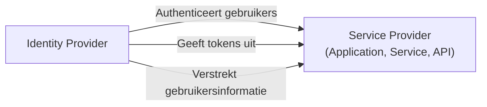
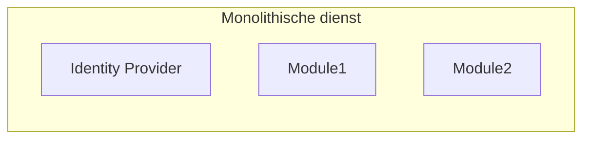
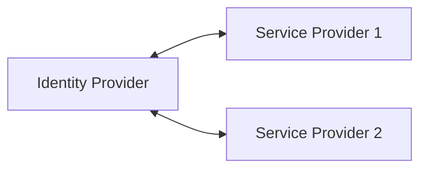

## Wat is een identiteitsprovider (IdP)?

In het domein van <Ref slug="iam" />, is een identiteitsprovider (IdP) de centrale dienst voor het beheren van identiteiten. Het is verantwoordelijk voor het authenticeren van gebruikers, het uitgeven van identity tokens, en het verstrekken van gebruikersinformatie aan <Ref slug="service-provider">service providers</Ref> (bijv. applicaties, diensten, API's).

Naast <Ref slug="authentication" /> zijn moderne identiteitsproviders ook verantwoordelijk voor <Ref slug="authorization" /> (het handhaven van <Ref slug="access-control" /> beleidsregels) en het ondersteunen van geavanceerde functies zoals <Ref slug="single-sign-on" /> en <Ref slug="multi-tenancy" />.

## Standaarden voor identiteitsproviders

Vanwege de aard van identiteitsbeheer en de behoefte aan interoperabiliteit, zal het onpraktisch en inefficiënt zijn om identiteitsproviders te bouwen zonder standaarden. Hier zijn enkele typische scenario's:

- Twee identiteitsproviders moeten met elkaar communiceren om gebruikersinformatie uit te wisselen (bijv. sociale login).
- Een applicatie moet gebruikers authenticeren met behulp van meerdere identiteitsproviders (bijv. federatieve identiteit).
- Een identiteitsprovider moet meerdere typen clients ondersteunen (bijv. web, mobiel, IoT).

Om deze scenario's aan te pakken, heeft de industrie verschillende populaire standaarden voor identiteitsproviders ontwikkeld:

- <Ref slug="oauth-2.0" />: Een veelgebruikt autorisatieframework waarmee applicaties toegang kunnen verkrijgen namens gebruikers of diensten.
- <Ref slug="openid-connect" />: Een identiteitslaag bovenop OAuth 2.0 die authenticatie en gebruikersinformatie biedt.
- <Ref slug="saml" />: Een standaard voor het uitwisselen van authenticatie- en autorisatiegegevens tussen beveiligingsdomeinen.

Voor nieuwe applicaties wordt OpenID Connect (OIDC) aanbevolen als standaard om te gebruiken voor het bouwen van een identiteitsprovider of voor integratie met bestaande identiteitsproviders.

## Architectuur van identiteitsproviders

De term "identiteitsprovider" specificeert geen bepaalde architectuur of implementatie. Dat wil zeggen dat een identiteitsprovider ook een monolithische applicatie, een microdienst of een clouddienst kan zijn.

Vanwege de complexiteit en het cruciale karakter van identiteitsbeheer, neigen moderne applicaties naar het gebruik van gespecialiseerde identiteitsproviders die standalone diensten of leveranciersoplossingen zijn.

## Kenmerken van identiteitsproviders

Moderne identiteitsproviders bieden een breed scala aan functies om verschillende gebruikssituaties en vereisten te ondersteunen. Hier zijn enkele veelvoorkomende functies:

- <Ref slug="authentication" />: Verifieer de identiteit van gebruikers met behulp van verschillende methoden (bijv. gebruikersnaam/wachtwoord, sociale login, <Ref slug="mfa" />).
- <Ref slug="authorization" />: Handhaaf access control beleid en beheer gebruikersrechten (bijv. <Ref slug="rbac" />, <Ref slug="abac" />).
- **Gebruikersbeheer**: Maak, werk bij en verwijder gebruikersaccounts en profielen; verstrek gebruikersgegevens aan <Ref slug="service-provider">service providers</Ref>.
- **Tokenbeheer**: Uitgeven en beheren van identity tokens (bijv. ID token, access token, refresh token).
- <Ref slug="single-sign-on" />: Sta gebruikers toe om eenmalig te authenticeren en toegang te krijgen tot meerdere applicaties.
- <Ref slug="multi-tenancy" />: Ondersteuning van meerdere organisaties of tenants met gescheiden gebruikersgegevens en configuraties.

<SeeAlso slugs={["service-provider", "iam", "openid-connect", "oauth-2.0"]} />

<Resources
  urls={[
    "https://blog.logto.io/secure-cloud-apps-with-oauth-and-openid-connect",
    "https://blog.logto.io/incorporate-identity-solution",
    "https://blog.logto.io/centralized-identity-system"
  ]}
/>
