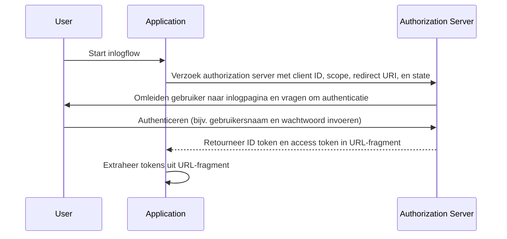

## Wat is implicit flow

De OIDC (OpenID Connect) implicit flow (impliciete flow) is een authenticatieproces dat voornamelijk wordt gebruikt door clienttoepassingen die in een browser zijn geïmplementeerd met behulp van een scripttaal, bijvoorbeeld single-page applications (SPAs). Het stelt clienttoepassingen in staat om direct ID tokens (ID-token) en access tokens (toegangstokens) van de authorization server (autorisatieserver) te verkrijgen zonder de client authentication (clientauthenticatie) uit te voeren.

## Hoe werkt de implicit flow?

De hoofdtappen van de implicit flow zijn als volgt:

1. **Verzenden van authentication request (authenticatieverzoek)**: De gebruiker start de flow meestal door op een link of knop in de applicatie te klikken om in te loggen. De applicatie stuurt een authentication request naar de authorization server's authorization endpoint (autorisatie-eindpunt). De authorization server valideert de parameters en leidt de gebruiker om om zich te authentiseren op de inlogpagina van de authorization server.
2. **Gebruikersauthenticatie**: De gebruiker authentiseert zich op de authorization server (bijv. door gebruikersnaam en wachtwoord in te voeren).
3. **Authorization server reageert**: De authorization server retourneert een ID token en, indien gevraagd, een access token aan de clienttoepassing als URL-fragment.
4. **Client verwerkt tokens**: De clienttoepassing extraheert de tokens uit het URL-fragment.



### Authentication request (Authenticatieverzoek)

Verzoekparameters zijn als volgt:
- **client_id**: VEREIST. Geldige OAuth 2.0-clientidentifier, die in Logto beschikbaar is als de application ID (applicatie-ID) (of app ID).
- **scope**: VEREIST. Deze waarde specificeert een reeks resources die de gebruiker van de authorization server aanvraagt. Bijv. `openid profile email`
- **response_type**: VEREIST. De waarde is ofwel `id_token` of `id_token token`. Er wordt geen access token geretourneerd wanneer de waarde `id_token` is.
- **redirect_uri**: VEREIST. De URI waarnaar de authentication response (authenticatierespons) wordt verzonden en moet exact overeenkomen met de redirect URI die de client vooraf heeft geregistreerd bij de <Ref slug="openid-connect" headingId="openid-provider-op" />. Bijv. `Sign-in redirect URI` in Logto Admin Console.
- **nonce**: VEREIST. Een willekeurige string die wordt gebruikt om replay-aanvallen te verminderen, die ongemodificeerd wordt doorgegeven van de authentication request naar de ID token claim.

### Voorbeeld van een authentication request

```bash
curl -X GET "https://authorization-server.com/auth" \
  -d "response_type=id_token token" \
  -d "client_id=YOUR_APPLICATION_ID" \
  -d "redirect_uri=https://yourapp.com/callback" \
  -d "scope=openid profile email" \
  -d "nonce=RANDOM_STRING"
```

## Beperkingen

De implicit flow werd ontwikkeld in een tijd waarin browsers Cross-Origin Resource Sharing (CORS) niet wijdverspreid ondersteunden. Daarom is het verzenden van POST-verzoeken naar een authorization server die op een ander domein is gehost, verboden.

Vanwege deze beperking retourneert de authorization server direct de tokens in het URL-fragment, wat hen kan blootstellen aan de eindgebruiker en aan toepassingen die toegang hebben tot de User Agent van de eindgebruiker.

Bovendien wordt de client authentication niet uitgevoerd in de implicit flow, wat betekent dat elke applicatie kan doen alsof het die client is die om authentication vraagt, aangezien de client ID altijd is blootgesteld in browsergebaseerde toepassingen.

Vanwege bovenstaande beperkingen wordt implicit flow meestal als minder veilig beschouwd dan de Authorization Code Flow.

## Alternatieven voor implicit flow

Gezien de beveiligingsbeperkingen van de implicit flow, worden vaak andere flows aanbevolen:
- **Authorization Code Flow**: Deze flow omvat een extra stap waarbij de client een authorization code inwisselt voor tokens, wat een extra beveiligingslaag biedt.
- **PKCE (Proof Key for Code Exchange)**: Een uitbreiding van de Authorization Code Flow die een extra beveiligingslaag toevoegt door gebruik te maken van een code verifier en code challenge.

<SeeAlso slugs={['device-flow', 'authorization-code-flow', 'client-credentials-flow']} />

<Resources
  urls={[
    "https://blog.logto.io/implicit-flow-is-dead",
    {
      url: "https://tools.ietf.org/html/rfc6749#section-4.2",
      result: {
        ogTitle: "The OAuth 2.0 Authorization Framework: Implicit Grant",
        ogDescription: "The implicit grant type is used to obtain access tokens (it does not support the issuance of refresh tokens) and is optimized for public clients known to operate a particular redirection URI. These clients are typically implemented in a browser using a scripting language such as JavaScript."
      }
    },
    "https://openid.net/specs/openid-connect-core-1_0.html",
  ]}
/>
