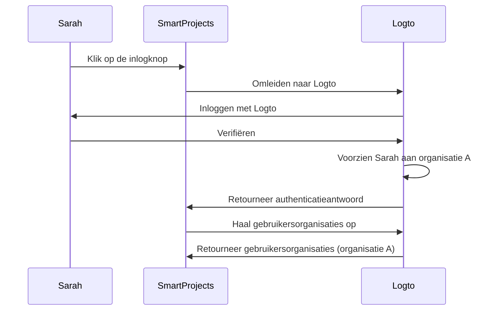
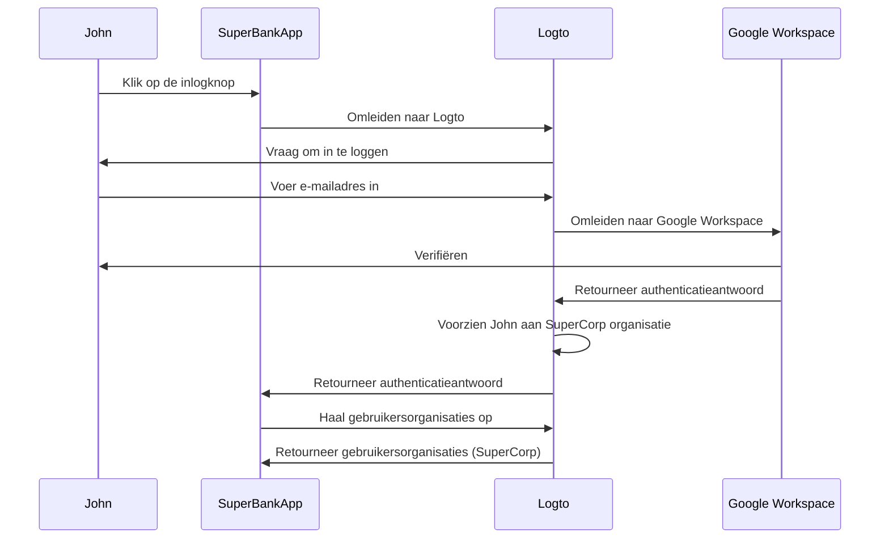

## Wat is just-in-time provisioning?

Just-in-time (JIT) provisioning is een proces dat wordt gebruikt in <Ref slug="iam" />, waarbij gebruikersaccounts worden ingericht volgens de identiteit van de gebruiker en de configuratie van het systeem op het moment dat de gebruiker voor het eerst probeert in te loggen.

## Wat zijn de gebruikssituaties voor just-in-time provisioning?

Deze gevallen komen vaak voor bij het bouwen van een B2B-app die een multi-tenant architectuur, Enterprise SSO of team onboarding-functies omvat. Hier zijn enkele voorbeeldscenario's die jij of je klant kunnen tegenkomen.

### Medewerker onboarding

Stel je voor dat een van je klanten *SuperFantasy* frequente aanwervingen of snelle groei ervaart en JIT provisioning kan gebruiken om snel gebruikersaccounts voor nieuwe medewerkers in te stellen. *SuperFantasy* gebruikt Logto voor identiteits- en toegangsbeheer en SmartProjects voor projectbeheer. Wanneer een nieuwe medewerker, Sarah, voor de eerste keer inlogt bij SmartProjects, wordt haar account automatisch aangemaakt en geconfigureerd op basis van haar Logto-referenties.

Volgens het bovenstaande diagram, wanneer Sarah voor de eerste keer inlogt bij SmartProjects, wordt haar account automatisch ingericht voor organisatie A in Logto. Dit proces zorgt ervoor dat Sarah de nodige toegang heeft tot SmartProjects zonder dat er handmatige tussenkomst van het IT-team nodig is.

### Onboarding van zakelijke klanten

Stel je voor dat een andere klant *SuperBank* een financiële instelling is die online bankdiensten aan zijn klanten aanbiedt. *SuperBank* gebruikt Logto voor identiteits- en toegangsbeheer en SuperBankApp voor online bankieren. *SuperBank* heeft onlangs een contract getekend met een nieuwe zakelijke klant, *SuperCorp*, om online bankdiensten aan zijn medewerkers te bieden.

*SuperCorp* gebruikt Google Workspace voor zijn medewerkersaccounts. SuperBankApp moet ervoor zorgen dat wanneer een medewerker van *SuperCorp* voor de eerste keer inlogt, zijn account automatisch wordt toegevoegd aan de *SuperCorp* organisatie in Logto.

In het bovenstaande diagram, wanneer John voor de eerste keer inlogt bij SuperBankApp, wordt zijn account automatisch ingericht voor de SuperCorp organisatie in Logto volgens zijn Google Workspace identiteit.

## Is het specifiek voor SAML en Enterprise SSO?

Just-in-time (JIT) provisioning wordt vaak geassocieerd met <Ref slug="enterprise-sso" /> in SAML-authenticatie, maar het is niet exclusief voor <Ref slug="saml" />. JIT provisioning kan ook worden gebruikt met andere authenticatieprotocollen zoals <Ref slug="oauth-2.0" /> en <Ref slug="openid-connect" />, en het vereist niet altijd een <Ref slug="enterprise-sso" />-opstelling.

Bijvoorbeeld, e-mailgebaseerde JIT provisioning kan worden gebruikt wanneer je <Ref slug="identity-provider" /> deze functie ondersteunt. In dit geval is het e-mailadres van de gebruiker het enige vereiste attribuut voor provisioning, ongeacht het authenticatieprotocol of de SSO-configuratie.

## Is het van toepassing op nieuwe of bestaande gebruikers van de app?

Just-in-time (JIT) provisioning verwijst over het algemeen naar de eerste poging om toegang te krijgen tot een app. Verschillende producten zien deze functionaliteit echter anders. Sommige gebruiken JIT provisioning alleen voor identiteit en accountcreatie, terwijl anderen ook just-in-time accountupdates omvatten, zoals herprovisioning en attribuutsynchronisatie.

Bijvoorbeeld, SAML JIT Provisioning staat toe om groepslidmaatschappen toe te kennen en in te trekken als onderdeel van provisioning. Het kan ook geprovisioneerde gebruikers bijwerken om hun attributen in de <Ref slug="service-provider" /> opslag in overeenstemming te houden met de <Ref slug="identity-provider" /> gebruikersopslagattributen.

Als je het scenario van het inloggen van bestaande gebruikers wilt overwegen, zorg er dan voor dat je een robuust provisioning systeem hebt naast je JIT systeem. Bijvoorbeeld:

- **Conflictresolutie**: Je systeem moet een strategie hebben voor het omgaan met conflicten als er al een account bestaat met andere informatie dan wat door de IdP wordt verstrekt tijdens het JIT-proces. Dit kan gedetailleerde controle vereisen over het beleid van je organisatie en de IdP-configuratie.
- **Audit trails**: Het is belangrijk om logs bij te houden van zowel nieuwe accountcreaties als updates van bestaande accounts via JIT-processen voor beveiligings- en nalevingsredenen.
- **Prestaties**: Hoewel JIT provisioning snel gebeurt, overweeg de potentiële impact op inlogtijden, vooral voor bestaande gebruikers als je hun informatie bij elke inlog bijwerkt.
- **Gegevensconsistentie**: Zorg ervoor dat je JIT provisioning proces gegevensconsistentie behoudt, vooral bij het bijwerken van bestaande gebruikersaccounts.

## Wat is het verschil tussen JIT en System for Cross-domain Identity Management (SCIM)?

SCIM is een open standaardprotocol dat is ontworpen om gebruikersidentiteitsbeheer over verschillende systemen en domeinen te vereenvoudigen en te automatiseren. Het wordt vaak gebruikt in directory sync-scenario's.

Het belangrijkste verschil tussen JIT en SCIM is dat JIT vaak verwijst naar de eerste poging om toegang te krijgen tot een app (of onboarding van nieuwe gebruikers), en het is een brede term die het proces beschrijft van dynamisch inrichten van gebruikersaccounts; terwijl SCIM een specifiek protocol is voor het beheren van de gebruikerslevenscyclus over systemen en het is niet beperkt tot de eerste inlog.

Bovendien ontbreekt het JIT aan een gestandaardiseerde implementatie over systemen, terwijl SCIM een gestandaardiseerd protocol is gedefinieerd in [RFC 7644](https://datatracker.ietf.org/doc/html/rfc7644) voor identiteitsbeheer.

Sommige grotere organisaties gebruiken SCIM voor accountprovisioning en integreren het met hun eigen systemen. Dit kan zeer complex zijn en variëren per geval. Voor de meeste gebruikssituaties is JIT provisioning een eenvoudigere en meer directe benadering.

<Resources urls={['https://blog.logto.io/jit-provisioning', 'https://datatracker.ietf.org/doc/html/rfc7644']} />