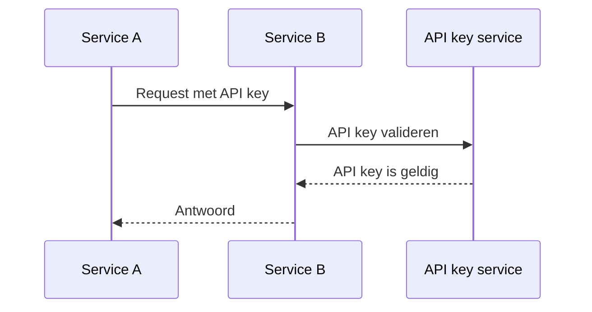
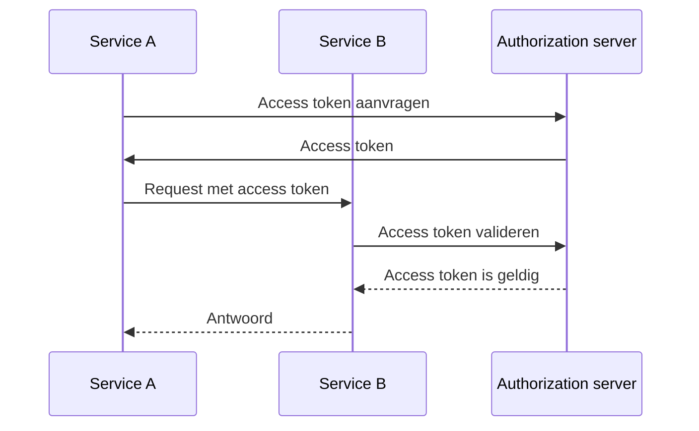
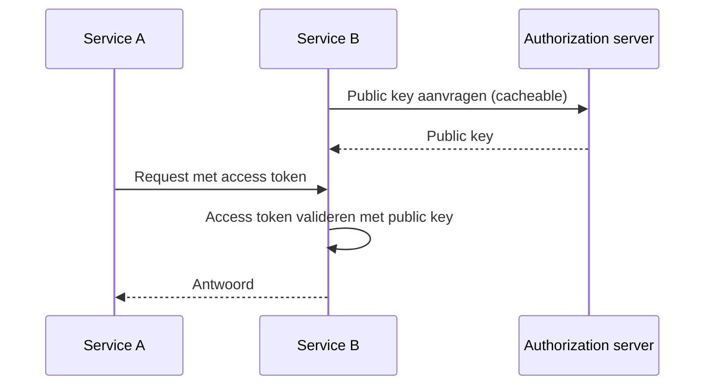

## Wat is machine-tot-machine (machine-to-machine) communicatie?

Machine-to-machine (M2M) communicatie verwijst naar de geautomatiseerde uitwisseling van gegevens tussen apparaten zonder menselijke tussenkomst. In de context van authenticatie (authentication) en autorisatie (authorization), omvat M2M communicatie vaak een client applicatie die toegang nodig heeft tot resources, waarbij de client applicatie een machine (service) is of een machine die namens een gebruiker handelt.

## Waarom moeten we omgaan met machine-tot-machine (machine-to-machine) communicatie?

Wanneer je slechts één service hebt zonder afhankelijkheden, is het waarschijnlijk niet nodig om met andere diensten te communiceren. Naarmate je systeem groeit of je wilt integreren met een identity and access management (IAM) systeem, moet je machine-to-machine (M2M) communicatie afhandelen.

Het lijkt echter nog steeds eenvoudig - alles wat je hoeft te doen is de service identificeren en deze authenticeren. Maar in de praktijk zijn er verschillende uitdagingen die je moet aanpakken:

### 1. Authenticatie (Authentication)

Hoe authenticeer (authenticate) je de service? Je kunt geen gebruikersnaam en wachtwoord gebruiken, omdat er geen mens is om ze in te voeren. Je moet een andere mechanismen gebruiken, zoals API keys, client certificaten of OAuth client credentials.

### 2. Autorisatie (Authorization)

Zodra je de service hebt geauthenticeerd, hoe bepaal je dan wat de service kan doen? Je moet de rechten (permissions) en rollen (roles) voor de service definiëren, vergelijkbaar met hoe je ze voor gebruikers definieert. Het laatste wat je wilt, is de rechten hardcoderen in je code.

### 3. Beveiliging

Hoe zorg je ervoor dat de communicatie tussen services veilig is? Zullen de credentials regelmatig worden bijgewerkt? Hoe monitor en controleer je de communicatie?

### 4. Schaalbaarheid

Naarmate het aantal services groeit, hoe beheer je de authenticatie en autorisatie voor elke service?

## De gebruikelijke benaderingen voor machine-tot-machine (machine-to-machine) communicatie

Met de uitdagingen in gedachten, zijn er verschillende gebruikelijke benaderingen in de industrie:

### 1. API keys

<Ref slug="api-key">API keys</Ref> zijn een eenvoudige manier om services te authenticeren. Elke service kan een of meer API keys hebben, die worden gebruikt voor authenticatie (en soms autorisatie). Je ziet mogelijk dat sommige services je vragen een API key op te geven in de request header, zoals `X-API-Key: your-api-key`.

Een niet-normatief voorbeeld van hoe API keys werken:

Voordelen:

- Eenvoudig te implementeren en te gebruiken.
- Met veilige willekeurige generatie en lang genoeg, zijn API keys moeilijk te raden.
- Validatie is dynamisch, wat betekent dat je een API key op elk moment kunt intrekken.

Nadelen:

- Vereist netwerkommunicatie om de API key te valideren.
- Het is niet zelf-bevattend, wat betekent dat een service nodig is voor introspectie.
- De andere service heeft hetzelfde toegangslevel als de service die de API key bezit (het zou gedeeltelijk kunnen worden gemitigeerd door gebruik van API gateway).
- Het is moeilijk om een groot aantal API keys te beheren over verschillende services.

### 2. OAuth client credentials

OAuth (of OIDC, aangezien OpenID Connect is gebaseerd op OAuth 2.0) <Ref slug="client-credentials-flow" /> is een meer geavanceerde manier om services te authenticeren. Het is gebaseerd op het OAuth 2.0 framework, dat veel wordt gebruikt voor gebruikersauthenticatie en autorisatie. Met OAuth client credentials kan een service een access token verkrijgen door zijn client ID en client secret aan de authorization server te presenteren.

Een niet-normatief voorbeeld van hoe OAuth client credentials werken:

Gewoonlijk is het access token een JSON Web Token (JWT), dat informatie bevat over de service en zijn rechten. Dan kan de andere service het access token valideren zonder te communiceren met de authorization server (zolang het de public key heeft om de JWT-handtekening te verifiëren). De workflow wordt dan:

Voor meer informatie over JSON Web Tokens, zie <Ref slug="jwt" />.

Voordelen (met JWT):

- Zelf-bevattend, wat betekent dat de andere service direct de nodige informatie zoals rechten kan weten zonder extra netwerkcommunicatie.
- Het access token kan van korte duur zijn, waardoor het risico op misbruik wordt verminderd.
- De andere service hoeft het client secret niet te weten, alleen de public key om de JWT-handtekening te verifiëren.
- Het access token kan worden gebruikt om de acties van de service te auditen (bijvoorbeeld, welke service heeft welke resource benaderd).
- Het is eenvoudiger om een groot aantal services te beheren, aangezien het een duidelijke grens zet tussen services en rechten.

Nadelen:

- Iets complexer te implementeren en te gebruiken dan API keys.
- Als de andere service alleen offline validatie uitvoert, weet het mogelijk niet of het access token is ingetrokken.

### 3. Mutual TLS

Mutual TLS (mTLS) is een manier om services te authenticeren met behulp van client certificaten. Met mTLS heeft elke service een client certificaat met een private key, en de andere service verifieert het certificaat met de public key. Echter, mTLS richt zich op de TLS-laag, wat betekent dat het alleen meestal niet past bij de applicatieniveau authenticatie en autorisatie.

Voor geavanceerde use cases kan mTLS worden gecombineerd met certificaatgebonden access tokens om de communicatie verder te beveiligen. Zie [RFC 8705: OAuth 2.0 Mutual-TLS Client Authentication and Certificate-Bound Access Tokens](https://datatracker.ietf.org/doc/html/rfc8705) voor meer informatie.

Voordelen:

- Sterke authenticatie, omdat het gebaseerd is op public-key cryptografie.
- De communicatie is standaard versleuteld en veilig.
- Het client certificaat kan worden gebruikt om de service te identificeren, vergelijkbaar met hoe een JWT werkt.

Nadelen:

- Complexer te implementeren en te beheren dan API keys en OAuth client credentials.
- Het client certificaat moet regelmatig worden bijgewerkt.
- Meer technische kennis is vereist om client certificaten correct te beheren.
- De andere service ondersteunt mogelijk geen mTLS, wat betekent dat je een fallback-mechanisme nodig hebt.

<SeeAlso slugs={["api-key", "client-credentials-flow", "jwt"]} />
