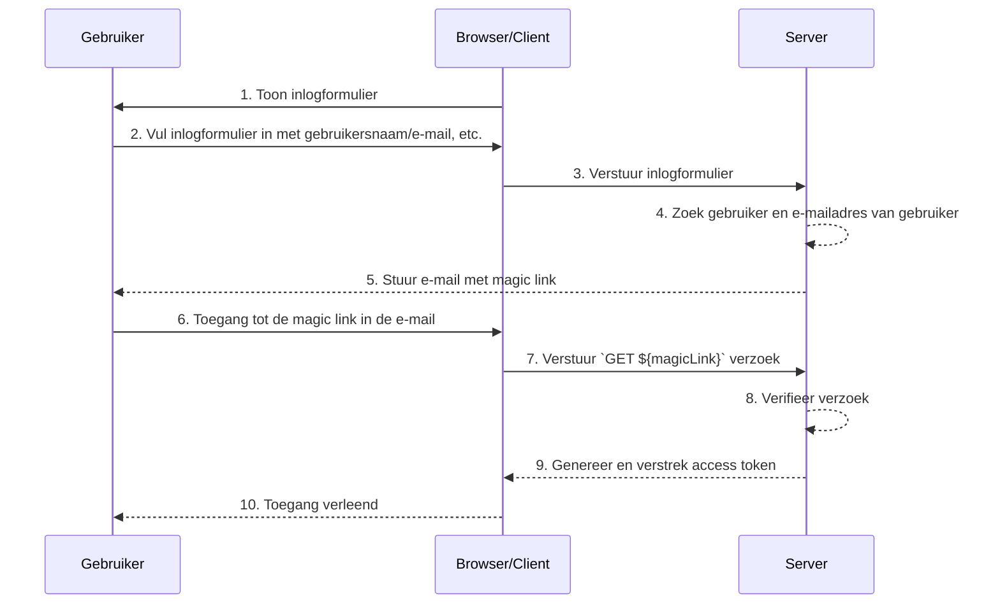

## Wat zijn magic links?

Een magic link is een eenmalig te gebruiken link die naar de gebruiker wordt gestuurd tijdens het authenticatieproces.

Door toegang te krijgen tot deze link voltooit de gebruiker de autorisatieflow (authorization flow) die nodig is om toegang te krijgen tot de gewenste bron en wordt de juiste toegang tot de bronnen verleend. Daarna wordt de magic link ongeldig.

## Wat is het verschil tussen een magic link en een eenmalig wachtwoord (OTP)?

Laten we aannemen dat de gebruiker e-mail gebruikt om een magic link of <Ref slug='otp' /> te ontvangen.

In veel gevallen gebruiken gebruikers e-mail om een OTP te ontvangen om in te loggen of als een extra verificatiefactor voor <Ref slug='mfa' />. Wat is het verschil tussen het gebruik van een e-mail magic link en een e-mail OTP?

Met OTP moet de gebruiker zijn e-mail controleren, de OTP onthouden en deze vervolgens invoeren in het inlog-/verificatieproces. Dit vereist dat de gebruiker herhaaldelijk handmatig schakelt tussen verschillende apps of pagina's.

Bij het gebruik van een e-mail magic link hoeft de gebruiker alleen de e-mail met de magic link in zijn e-mailapp te openen en op de link te klikken. Dit biedt een eenvoudigere gebruikerservaring.

Bovendien maakt het gebruik van een magic link het mogelijk om informatie op te nemen die verder gaat dan een eenmalige token in de link, zoals sessiegerelateerde informatie voor inloggen. Dit kan zowel de beveiliging als de gebruikerservaring verbeteren.

## Hoe werkt een magic link?

In dit sequentiediagram illustreren we hoe een gebruiker inlogt en toegang krijgt tot de juiste bronnen met behulp van een magic link.

In dit sequentiediagram gaan we ervan uit dat de magic link via e-mail wordt verzonden. Er zijn echter andere mogelijke methoden om een magic link te verzenden, zoals het verzenden via een sms-bericht naar een mobiele telefoon. Deze alternatieven worden hier niet behandeld, aangezien de flows bijna hetzelfde zijn.

1. **Toon inlogformulier**
De browser/client start het authenticatieproces door de gebruiker een inlogformulier te tonen.
2. **Gebruiker vult het inlogformulier in**
De gebruiker voert zijn identificatiegegevens in, zoals gebruikersnaam, e-mailadres of telefoonnummer, in het inlogformulier.
De verstrekte informatie moet voldoende zijn om het systeem te helpen een unieke gebruiker te identificeren. Bijvoorbeeld, in de meeste systemen zijn gebruikersnamen die worden gebruikt om in te loggen uniek. In dergelijke systemen hoeven gebruikers alleen hun gebruikersnaam op te geven om het systeem te helpen het account dat ze willen inloggen uniek te identificeren.
3. **Verstuur inlogformulier**
De browser/client verstuurt het formulier naar de server, met de gebruikersinformatie beschreven in stap 2.
4. **Zoek gebruiker en e-mail**
De server verwerkt het verzoek door de unieke gebruiker in de database te lokaliseren en het bijbehorende e-mailadres van de gebruiker op te halen.
5. **Stuur e-mail met magic link**
De server stuurt een e-mail naar het e-mailadres van de gebruiker. Deze e-mail bevat een magic link voor authenticatie.
6. **Gebruiker opent de magic link**
De gebruiker ontvangt de e-mail en klikt op de magic link die erin staat.
7. **Verstuur GET-verzoek met magic link**
De browser/client stuurt een `GET`-verzoek naar de server, met behulp van de URL van de magic link.
8. **Verifieer verzoek**
De server verifieert het verzoek om ervoor te zorgen dat de magic link geldig is, niet gebruikt en niet verlopen.
9. **Genereer en verstrek access token**
Zodra het verzoek is geverifieerd, genereert de server een access token en verstrekt deze aan de browser/client.
10. **Verleen toegang**
De browser/client ontvangt het access token en stelt de gebruiker in staat toegang te krijgen tot de gevraagde bron.

## Wat is het voordeel van magic links?

Magic links verbeteren de beveiligingsarchitectuur van authenticatiesystemen door gebruik te maken van een token-gebaseerd interactiemodel. Elke link is uniek versleuteld en bevat doorgaans een vervaltijdstempel. Vanwege hun vluchtige aard, zelfs als een magic link wordt onderschept of gelekt, beperkt het korte geldigheidsvenster de kans op kwaadwillig misbruik.

Bovendien, omdat het gebruik van magic links een door de gebruiker gecontroleerde ontvangstmethode vereist, zoals een vertrouwd e-mailadres of telefoonnummer, biedt het een extra verificatiemethode naast gebruikersnaam en wachtwoord, wat extra accountbeveiliging biedt. En omdat magic links de noodzaak om inloggegevens in te voeren elimineren, wordt de accountbeveiliging van gebruikers beter beschermd en is het proces handiger.