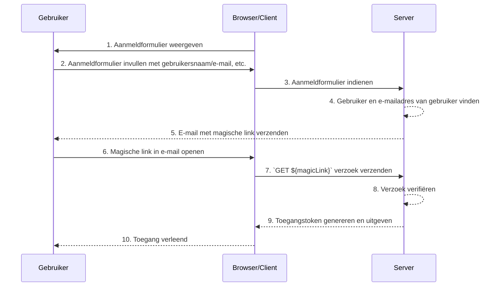

## Wat zijn magische links (Magic links)?

Een magische link (Magic link) is een eenmalig te gebruiken link die naar de gebruiker wordt gestuurd tijdens het authenticatieproces.

Door toegang te krijgen tot deze link, voltooit de gebruiker de autorisatieflow (Authorization Code Flow) die nodig is om toegang te krijgen tot de gewenste bron en wordt de juiste toegangsrechten verleend. Daarna wordt de magische link ongeldig.

## Wat is het verschil tussen een magische link (Magic link) en een eenmalig wachtwoord (OTP)?

Laten we aannemen dat de gebruiker e-mail gebruikt om een magische link of OTP te ontvangen.

In veel gevallen gebruiken gebruikers e-mail om een OTP te ontvangen ter verificatie van inloggen of als extra verificatiefactor voor MFA. Wat is het verschil tussen het gebruik van een e-mail magische link en een e-mail OTP?

Met een OTP moet de gebruiker zijn/haar e-mail bekijken, de OTP onthouden en deze vervolgens invoeren in het inlog-/verificatieproces. Dit vereist dat de gebruiker herhaaldelijk handmatig moet schakelen tussen verschillende apps of pagina's.

Met een magische link in een e-mail hoeft de gebruiker alleen de e-mail met de magische link in de e-mailapp te openen en op de link te klikken. Dit biedt een eenvoudigere gebruikerservaring.

Bovendien maakt het gebruik van een magische link het mogelijk om informatie op te nemen die verder gaat dan een eenmalig token in de link, zoals sessiegerelateerde informatie voor inloggen. Dit kan zowel de beveiliging als de gebruikerservaring verbeteren.

## Hoe werkt een magische link (Magic link)?

In dit sequentiediagram laten we zien hoe een gebruiker inlogt en toegang krijgt tot de juiste bronnen met behulp van een magische link.

In dit sequentiediagram gaan we ervan uit dat de magische link per e-mail wordt verzonden. Er zijn echter ook andere mogelijke methoden om een magische link te verzenden, zoals het sturen van een sms naar een mobiele telefoon. Deze alternatieven worden hier niet behandeld, aangezien de flows bijna dezelfde zijn.

1. **Aanmeldformulier weergeven**
De browser/client start het authenticatieproces door de gebruiker een aanmeldformulier te tonen.
2. **Gebruiker vult het aanmeldformulier in**
De gebruiker voert hun identificatiegegevens in, zoals gebruikersnaam, e-mailadres of telefoonnummer, in het aanmeldformulier.
De verstrekte informatie moet voldoende zijn om het systeem te helpen een unieke gebruiker te identificeren. Bijvoorbeeld, in de meeste systemen zijn gebruikersnamen die worden gebruikt voor inloggen uniek. In dergelijke systemen hoeven gebruikers alleen hun gebruikersnaam op te geven om het systeem te helpen het account uniek te identificeren waarop ze willen inloggen.
3. **Aanmeldformulier indienen**
De browser/client verstuurt het formulier naar de server, met de gebruikersinformatie zoals beschreven in stap 2.
4. **Gebruiker en e-mail vinden**
De server verwerkt het verzoek door de unieke gebruiker in de database te lokaliseren en het bijbehorende e-mailadres op te halen.
5. **E-mail met magische link verzenden**
De server stuurt een e-mail naar het e-mailadres van de gebruiker. Deze e-mail bevat een magische link voor authenticatie.
6. **Gebruiker opent de magische link**
De gebruiker ontvangt de e-mail en klikt op de magische link daarin.
7. **GET-verzoek met magische link verzenden**
De browser/client stuurt een `GET`-verzoek naar de server, met behulp van de URL van de magische link.
8. **Verzoek verifiëren**
De server controleert het verzoek om ervoor te zorgen dat de magische link geldig, niet gebruikt en niet verlopen is.
9. **Toegangstoken genereren en uitgeven**
Zodra het verzoek is geverifieerd, genereert de server een toegangstoken en geeft het uit aan de browser/client.
10. **Toegang verlenen**
De browser/client ontvangt het toegangstoken en geeft de gebruiker toegang tot de aangevraagde bron.

## Wat is het voordeel van magische links (Magic links)?

Magische links verbeteren de beveiligingsarchitectuur van authenticatiesystemen door een op tokens gebaseerd interactiemodel te gebruiken. Elke link is uniek versleuteld en bevat doorgaans een vervaltijdstempel. Gezien hun vluchtige aard, zelfs als een magische link wordt onderschept of gelekt, beperkt het korte geldigheidsvenster de mogelijkheid voor kwaadwillende exploitatie.

Bovendien, omdat het gebruik van magische links een door de gebruiker gereguleerde ontvangstmethode vereist, zoals een betrouwbaar e-mailadres of telefoonnummer, biedt het een aanvullende verificatiemethode naast gebruikersnaam en wachtwoord, wat extra beveiliging van het account biedt. En aangezien magische links ervoor zorgen dat het invoeren van inloggegevens niet nodig is, wordt de accountbeveiliging van gebruikers beter beschermd en is het proces gebruiksvriendelijker.
