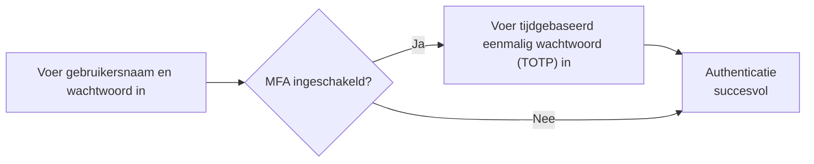

## Wat is multifactor authenticatie (MFA)?

Multifactor authenticatie (MFA) verbetert de beveiliging door gebruikers te vragen meerdere vormen van identificatie te verstrekken om hun identiteit te verifiëren. Het voegt een extra beveiligingslaag toe aan het <Ref slug="authentication" /> proces, waardoor het voor aanvallers moeilijker wordt om ongeautoriseerde toegang te krijgen.

Hier is een voorbeeld van MFA:

### De definitie van "factor"

In het bovenstaande voorbeeld zijn er twee factoren:

1. Gebruikersnaam en wachtwoord
2. <Ref slug="totp" /> van een mobiele app

Elke factor vertegenwoordigt een andere categorie van inloggegevens die kunnen worden gebruikt om een gebruiker te authenticeren (bewijzen dat je bent wie je zegt dat je bent). In de praktijk kunnen factoren worden gecategoriseerd in drie hoofdtypen:

|            | Wat het betekent   | Verificatiefactoren                                                                      |
| ---------- | ------------------ | ---------------------------------------------------------------------------------------- |
| Kennis     | Iets wat je weet   | Wachtwoord, E-mailverificatiecode, Back-upcode                                           |
| Bezit      | Iets wat je hebt   | SMS-verificatiecode, Authenticator-app OTP, Hardware-OTP (Beveiligingssleutel), Smartcard |
| Ervaring   | Iets wat je bent   | Biometrie zoals vingerafdrukken, gezichts-ID                                             |

Een veelvoorkomende MFA-setup omvat het combineren van twee factoren uit verschillende categorieën, zoals een wachtwoord (kennis) en een <Ref slug="totp" /> van een authenticator-app (bezit).

### Waarom is MFA belangrijk?

> Er bestaat niet zoiets als perfecte beveiliging, alleen verschillende niveaus van onveiligheid. —Salman Rushdie

Het belang van MFA blijkt uit de cijfers: MFA vermindert het risico op compromittering met 99,22% over de gehele bevolking en met 98,56% in gevallen van uitgelekte inloggegevens[^1]. Met behulp van MFA kunnen meer kritieke acties met vertrouwen worden ondernomen, zoals toegang tot gevoelige gegevens en het uitvoeren van financiële transacties. Het is een eenvoudige maar effectieve manier om een veel hoger beveiligingsniveau te bieden dan alleen een wachtwoord of single factor authenticatie.

## MFA in moderne toepassingen

Zoals de naam al doet vermoeden, kan MFA meer dan twee factoren omvatten. Naarmate het aantal factoren toeneemt, neemt ook het beveiligingsniveau en de complexiteit van het authenticatieproces toe, waardoor het mogelijk minder gebruiksvriendelijk wordt. Terwijl <Ref slug="totp" /> de laatste jaren een populaire keuze is, zijn er nieuwe technologieën zoals <Ref slug="passkey" /> in opkomst om een nog veiligere en gebruiksvriendelijkere MFA-ervaring te bieden.

Moderne applicaties kunnen bijvoorbeeld de <Ref slug="webauthn" /> API gebruiken om MFA met passkeys te implementeren, die phishing-bestendige inloggegevens zijn beveiligd door openbare sleutelcryptografie. Bedrijven zoals Apple hebben passkeys geïntegreerd met biometrische authenticatie (Touch ID, Face ID) om de ervaring factor direct aan het MFA-proces toe te voegen, waardoor de beveiliging wordt verhoogd en het gebruiksgemak toeneemt.

Laten we een snelle vergelijking maken voor een beter begrip. Stel dat we een gebruiker hebben die:

1. Een authenticator-app op hun telefoon heeft geïnstalleerd om TOTP-codes te genereren.
2. Een passkey heeft geïntegreerd met de biometrische authenticatie van hun apparaat.

Wanneer ze zich aanmelden bij een website met MFA ingeschakeld op hun laptop, zouden de twee processen er als volgt uitzien:

```mermaid
graph TD
  subgraph TOTP
    A[Voer gebruikersnaam en wachtwoord in]
    A -->|MFA ingeschakeld| B[Vraag om TOTP-code]
    B --> C[Open authenticator-app]
    C --> D[Vind de TOTP voor de website]
    D --> E[Voer de TOTP-code in]
    E --> F[Authenticatie<br/>succesvol]
  end

  subgraph WebAuthn
    G[Voer gebruikersnaam en wachtwoord in]
    G -->|MFA ingeschakeld| H[Vraag om biometrische authenticatie]
    H --> I["Authenticeer met biometrie (bijv. Touch ID)"]
    I --> J[Authenticatie<br/>succesvol]
  end
```

Het is duidelijk dat het WebAuthn-proces minder stappen en veel minder tijd voor gebruikers in beslag neemt. Bovendien ondersteunen bedrijven zoals Apple passkeysynchronisatie over apparaten (bijv. iPhone, iPad, Mac) om het MFA-proces soepeler te laten verlopen, terwijl een hoog beveiligingsniveau behouden blijft.

## Beveiligingsoverwegingen

Bij de implementatie van MFA moeten enkele beveiligingsoverwegingen in acht worden genomen:

- Gebruik een combinatie van factoren uit verschillende categorieën om een hoger beveiligingsniveau te waarborgen. Bijvoorbeeld het combineren van een wachtwoord (kennis) met een TOTP-code (bezit).
- Vermijd het gebruik van SMS als een MFA-factor vanwege de kwetsbaarheid voor SIM-swapping-aanvallen.
- Herstelopties mogen MFA niet omzeilen. Als een gebruiker bijvoorbeeld hun authenticator-app kwijtraakt, moeten ze worden verplicht om een back-upcode of een andere MFA-factor te gebruiken om toegang te krijgen.
- Leg koelperioden op tussen mislukte MFA-pogingen om brute-force-aanvallen te voorkomen.

[^1]: [Hoe effectief is multifactor authenticatie bij het afschrikken van cyberaanvallen?](https://query.prod.cms.rt.microsoft.com/cms/api/am/binary/RW166lD)

<SeeAlso slugs={["totp", "webauthn", "passkey"]} />

<Resources
  urls={[
    "https://blog.logto.io/elaborate-mfa",
    "https://blog.logto.io/web-authn-and-passkey-101",
    "https://blog.logto.io/webauthn-base-knowledge",
  ]}
/>
