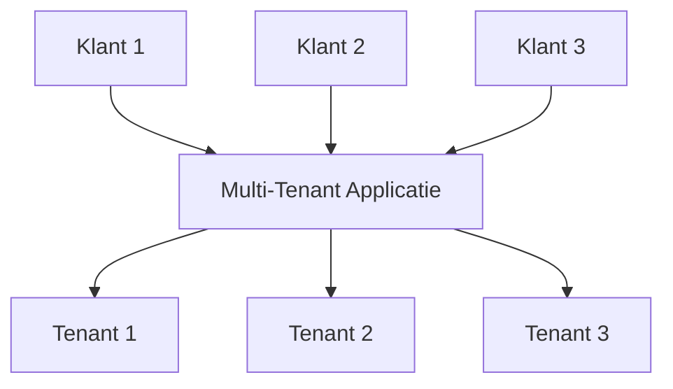
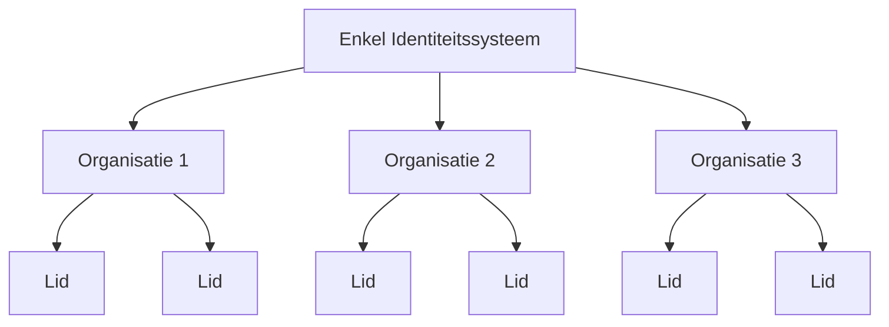

## Wat is multi-tenancy?

Software multi-tenancy is een software waarin een enkele instantie van software op een server draait en meerdere tenants bedient. Systemen die op deze manier zijn ontworpen, zijn "gedeeld" (in plaats van "dedicated" of "geïsoleerd").

Een tenant is een groep gebruikers die gemeenschappelijke toegang delen met specifieke privileges tot de software-instantie.

Een voorbeeld hiervan is dat CRM (Customer Relationship Management) systemen vaak gebruikmaken van een multi-tenant architectuur om dezelfde service aan alle klanten te bieden.

Een belangrijk principe van multi-tenancy is "delen". Dit betekent niet dat **elke** onderdeel van de oplossing wordt gedeeld; het betekent dat ten minste **enkele** componenten worden hergebruikt over meerdere tenants. Het begrijpen van dit bredere concept kan je helpen beter in te spelen op de behoeften van je klanten.

## Wat zijn de use cases voor multi-tenant producten?

Multi-tenant apps worden vaak gebruikt in software-as-a-service (SaaS) producten zoals productiviteitstools, samenwerkingssoftware, enzovoort. In deze opzet vertegenwoordigt elke "tenant" meestal een zakelijke klant, met meerdere gebruikers (meestal werknemers). In verschillende producten kan het worden aangeduid als een tenant, werkruimte of project, afhankelijk van de context. Een enkel bedrijf kan ook meerdere tenants hebben om verschillende afdelingen of organisaties te vertegenwoordigen.

In complexere gevallen, zoals B2B-applicaties buiten SaaS, bieden multi-tenant apps een gedeeld platform voor verschillende teams, zakelijke klanten en partnerbedrijven om toegang te krijgen tot je diensten.

## Waarom zou je multi-tenancy gebruiken in een SaaS-product?

### Schalen met multi-tenancy

Voor zakelijke ondernemingen is multi-tenancy de sleutel tot het effectief voldoen aan hun eisen voor beschikbaarheid, middelenbeheer, kostenbeheer en gegevensbeveiliging. Op technisch niveau stroomlijnt het aannemen van een multi-tenant benadering je ontwikkelingsprocessen, minimaliseert het technische uitdagingen en bevordert het naadloze uitbreiding.

### Creëren van een uniforme ervaring

Bij het onderzoeken van de wortels van SaaS-producten is het vergelijkbaar met een gebouw dat verschillende appartementen huisvest. Alle tenants delen gemeenschappelijke voorzieningen zoals water, elektriciteit en gas, maar behouden onafhankelijke controle over het beheer van hun eigen ruimte en middelen. Deze aanpak vereenvoudigt het vastgoedbeheer.

### Beveiliging garanderen door tenant-isolatie

In een multi-tenancy architectuur wordt de term "tenant" geïntroduceerd om grenzen te creëren die de middelen en gegevens van verschillende tenants binnen een gedeelde instantie scheiden en beveiligen. Dit zorgt ervoor dat de gegevens en operaties van elke tenant afzonderlijk en veilig blijven, zelfs als ze dezelfde onderliggende middelen gebruiken.

## Hoe bereik je tenant-isolatie in een multi-tenancy architectuur?

Bij het bespreken van multi-tenant applicaties is het altijd noodzakelijk om **tenant-isolatie** te bereiken. Dit betekent het gescheiden en veilig houden van de gegevens en middelen van verschillende tenants binnen een gedeeld systeem (bijvoorbeeld een cloudinfrastructuur of een multi-tenant applicatie). Dit voorkomt ongeoorloofde pogingen om toegang te krijgen tot de middelen van een andere tenant.

### Tenant-isolatie sluit aan bij het "gedeelde" concept van multi-tenancy

Dat komt omdat tenant-isolatie niet noodzakelijkerwijs een constructie op infrastructuurniveau is. In het domein van multi-tenancy en isolatie zien sommigen isolatie als een strikte scheiding tussen daadwerkelijke infrastructuurmiddelen. Dit leidt meestal tot een model waarin elke tenant aparte databases, computerinstanties, accounts of private clouds heeft. In gedeelde middelen scenario's, zoals multi-tenant apps, kan de manier om isolatie te bereiken een logische constructie zijn.

### Authenticatie en autorisatie zijn niet gelijk aan "isolatie"

Het gebruik van authenticatie en autorisatie om toegang tot je SaaS-omgeving te controleren is belangrijk, maar het garandeert geen "isolatie". Isolatie betekent het gescheiden houden van verschillende gebruikers of datasets zodat de gegevens of acties van de ene gebruiker niet kunnen interfereren met of toegankelijk zijn voor een andere.

Bijvoorbeeld, zelfs als je authenticatie en autorisatie hebt ingesteld, waarbij gebruikers inloggen en een token ontvangen dat hun permissies definieert, verbetert dit de beveiliging maar zorgt het er niet voor dat gebruikers volledig van elkaar geïsoleerd zijn. Een andere context moet worden geïntroduceerd om "isolatie" te bereiken.

### Gebruik "organisatie" als een context om de SaaS-producttenant te vertegenwoordigen, voor het bereiken van tenant-isolatie

Authenticatie en autorisatie alleen zullen niet voorkomen dat een gebruiker met de juiste rol toegang krijgt tot de middelen van een andere tenant. Om toegang te beperken, moeten we een "tenant" context toevoegen, zoals een tenant-ID, organisatie-ID of werkruimte-ID. Deze identificatoren fungeren als muren, deuren en sloten, die tenants gescheiden houden.

De term "organisatie" wordt vaak gebruikt voor tenant-isolatie. Veel <Ref slug="identity-provider" /> bevatten een "organisatie" functie om tenants te isoleren terwijl ze een verenigd identiteitssysteem behouden. De gebruiker binnen de organisatie wordt "lid" genoemd.

## Hoe worden identiteiten beheerd in multi-tenant apps?

De eerste belangrijke vraag is om na te denken over of delen van je bedrijf of product aparte identiteitssystemen vereisen. Dit zal je systeemontwerp begeleiden. Hier zijn twee voorbeelden:

1. Eén identiteitssysteem: Een enkele persoon kan twee identiteiten hebben binnen hetzelfde identiteitssysteem. Bijvoorbeeld, Sarah kan een persoonlijk e-mailadres geregistreerd hebben en ook een zakelijk e-mailadres gebruiken dat verbonden is via <Ref slug="enterprise-sso" />.
2. Meerdere identiteitssystemen: Gebruikers kunnen ook twee verschillende identiteiten hebben in aparte identiteitssystemen voor volledig niet-gerelateerde producten.

In de meeste multi-tenant apps worden identiteiten meestal beheerd in een enkele pool, terwijl de middelen van elke tenant gescheiden worden gehouden.

## Overwegingen voor het plannen en bouwen van multi-tenant apps

1. Focus op je model: B2B of B2C.
2. Wie zal de identiteitstaken beheren: ontwikkelaars, de beheerder van je klant, of eindgebruikers?
3. Voor B2B, moeten je klanten de identiteiten van hun organisatie beheren?
4. Identificeer welke permissies (<Ref slug="scope" />) en <Ref slug="role" /> moeten worden gedefinieerd voor de organisatie en welke niet.
5. Vereist je klant <Ref slug="enterprise-sso" />?
6. Overweeg het toevoegen van samenwerkingsfuncties, zoals uitnodigingen.

<Resources
  urls={[
    "https://blog.logto.io/implement-multi-tenancy",
    "https://blog.logto.io/multi-tenant-ultimate-guide",
    "https://blog.logto.io/case-study-multi-tenancy",
    "https://blog.logto.io/multi-tenancy-explained",
    "https://blog.logto.io/are-multi-tenant-apps-equal-saas",
    "https://blog.logto.io/tenancy-models",
    "https://blog.logto.io/do-you-need-multiple-tenants-identity-model",
  ]}
/>