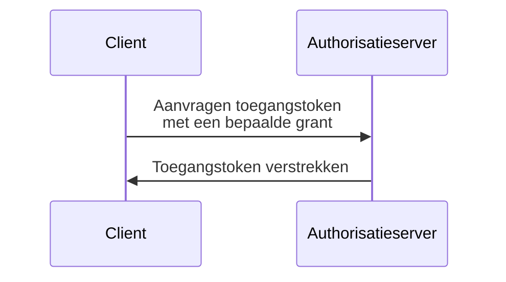

## Wat is een OAuth 2.0 grant?

Een OAuth 2.0 grant is een autorisatieproces dat een <Ref slug="client" /> in staat stelt om een <Ref slug="access-token" /> aan te vragen bij een <Ref slug="authorization-server" />. Je kunt ook andere termen tegenkomen die met dit concept te maken hebben, dus laten we deze verduidelijken voordat we dieper ingaan:

- **OAuth 2.0 grant**: Ook bekend als een "OAuth 2.0 grant type", "OAuth 2.0 flow", of "OAuth 2.0 autorisatiegrant". In de meeste contexten verwijzen deze termen naar hetzelfde concept.
- <Ref slug="authorization-server" />: De server die toegangstokens verstrekt aan de client. In OpenID Connect (OIDC) is de autorisatieserver hetzelfde als de <Ref slug="openid-connect" headingId="openid-provider-op" />.
- <Ref slug="authorization-request" />: Het verzoek dat de client aan de autorisatieserver doet om een toegangstoken te verkrijgen. In OpenID Connect (OIDC) wordt het ook aangeduid als een <Ref slug="authentication-request" />.

Omwille van de duidelijkheid zullen we de termen die hierboven worden vermeld, consequent gebruiken in dit artikel.

Het hoog-niveau proces van een OAuth 2.0 grant is vrij eenvoudig:

Nadat de client het toegangstoken ontvangt, kan het dit gebruiken om toegang te krijgen tot beveiligde bronnen (bijv. API's) namens een gebruiker of zichzelf.

Let op dat afhankelijk van de specifieke grant, de client en de autorisatieserver aanvullende informatie kunnen uitwisselen en meer stappen kunnen omvatten in het proces. Bijvoorbeeld, de <Ref slug="authorization-code-flow">autorisatiecodegrant</Ref> omvat gebruikersauthenticatie en autorisatie, codegeneratie en uitwisseling van token.

## Verschillende OAuth 2.0 grants

De basis OAuth 2.0 specificatie definieert vier grants die clients kunnen gebruiken om toegangstokens te verkrijgen:

1. <Ref slug="authorization-code-flow">Autorisatiecodegrant</Ref>: De meest veilige en aanbevolen grant voor de meeste toepassingen. Het is verplicht om <Ref slug="pkce" /> te gebruiken voor alle clients in <Ref slug="oauth-2.1" />.
2. <Ref slug="implicit-flow">Impliciete grant</Ref>: Een vereenvoudigde grant die is verouderd in OAuth 2.1 vanwege beveiligingsproblemen.
3. [Resource eigenaar wachtwoordreferenties (ROPC) grant](https://datatracker.ietf.org/doc/html/rfc6749#section-4.3): Een grant waarbij de gebruikersgegevens rechtstreeks worden uitgewisseld voor een toegangstoken. Het wordt niet aanbevolen voor de meeste toepassingen vanwege veiligheidsrisico's.
4. <Ref slug="client-credentials-flow">Clientreferentiesgrant</Ref>: Een grant gebruikt door <Ref slug="client" headingId="confidential-clients" /> om een toegangstoken te verkrijgen zonder gebruikersbetrokkenheid.

Naarmate de industrie evolueert, worden impliciete en ROPC-grants [uitgefaseerd](https://blog.logto.io/oauth-2-1) ten gunste van veiligere en gestandaardiseerde flows. Voor nieuwe toepassingen zijn de keuzes eenvoudig:

- Voor gebruikersauthenticatie en autorisatie, gebruik de autorisatiecodegrant met PKCE.
- Voor <Ref slug="machine-to-machine" /> communicatie, gebruik de clientreferentiesgrant.

### Andere OAuth 2.0 grants

Naast de vier basisgrants zijn er andere extensies die nieuwe grants definiëren voor specifieke gebruikssituaties. Bijvoorbeeld:

- <Ref slug="device-flow">Device autorisatiegrant</Ref> is een grant ontworpen voor apparaten met beperkte invoermogelijkheden, zoals smart tv's en IoT-apparaten.
- <Ref slug="hybrid-flow">Hybride flow</Ref> is een OpenID Connect grant die de autorisatiecodegrant combineert met de impliciete grant.

## Grants in OpenID Connect (OIDC)

In <Ref slug="openid-connect" />, wordt het concept van grants uitgebreid om <Ref slug="id-token">ID tokens</Ref> te omvatten die gebruikersidentiteitsinformatie vertegenwoordigen naast toegangstokens. OIDC breidt twee OAuth 2.0 grants uit (autorisatiecode en impliciet) om ID tokens op te nemen, en introduceert een nieuwe grant genaamd de <Ref slug="hybrid-flow">hybride flow</Ref> die beide combineert.

> Net als bij OAuth 2.0 wordt aanbevolen om de autorisatiecodegrant met PKCE in OIDC te gebruiken voor gebruikersauthenticatie en autorisatie.

Intussen, aangezien OIDC bovenop OAuth 2.0 is gebouwd, kunnen andere grants zoals de clientreferentiesgrant nog steeds worden gebruikt op dezelfde autorisatieserver, zolang de server ze ondersteunt.

<SeeAlso slugs={["pkce", "oauth-2.1", "authorization-code-flow", "implicit-flow", "client-credentials-flow", "device-flow"]} />

<Resources
  urls={[
    "https://blog.logto.io/implicit-flow-is-dead",
    "https://datatracker.ietf.org/doc/html/rfc6749",
    "https://openid.net/specs/openid-connect-core-1_0.html"
  ]}
/>
