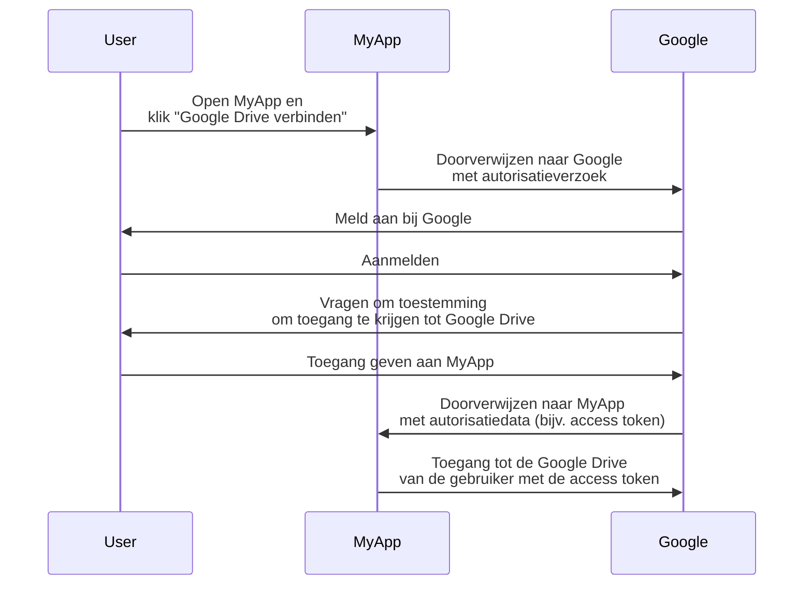
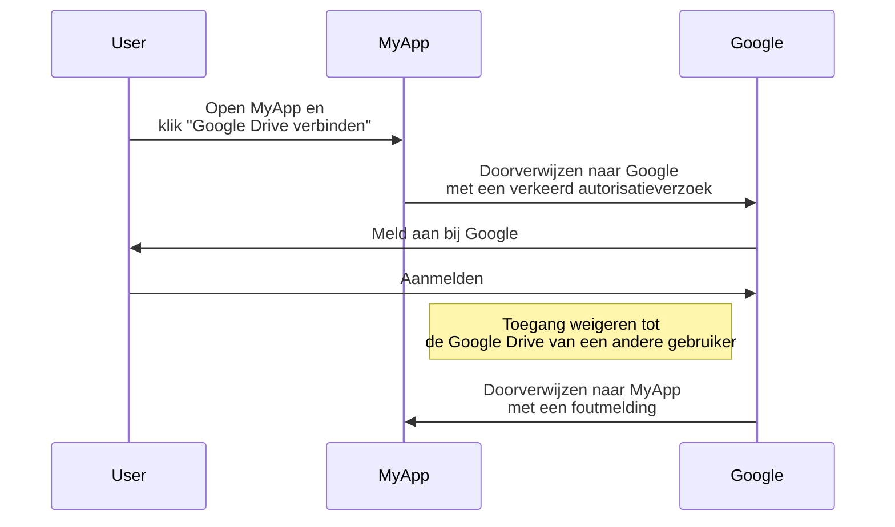
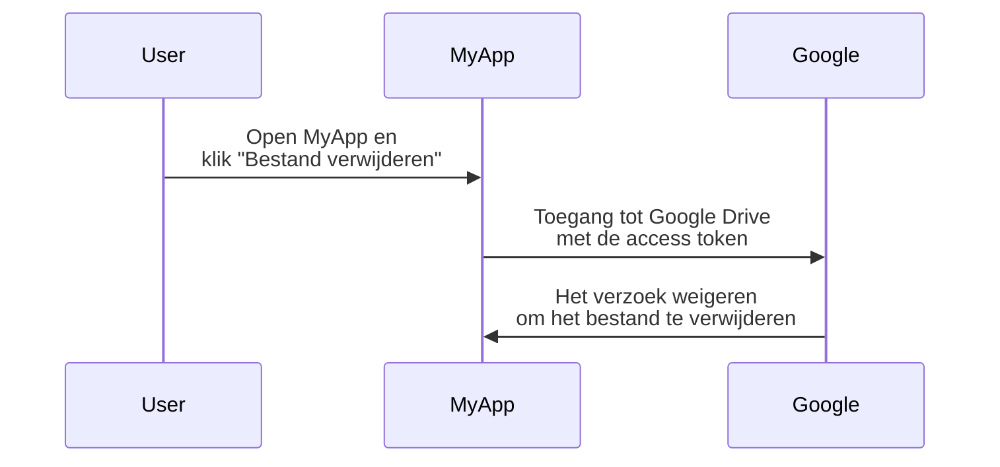

## Wat is OAuth 2.0?

OAuth 2.0 is de de facto standaard voor autorisatie en wordt veel gebruikt op het web. Het stelt een applicatie in staat om veilig beperkte toegang te krijgen tot beschermde bronnen op een andere applicatie, zoals het profiel of de gegevens van een gebruiker, zonder inloggegevens zoals wachtwoorden bloot te leggen.

Laten we een praktijkvoorbeeld bekijken om het beter te begrijpen. Je hebt een webapplicatie MyApp die toegang wil tot de Google Drive van de gebruiker. In plaats van de gebruiker te vragen hun Google Drive inloggegevens te delen, kan MyApp OAuth 2.0 gebruiken om toegang tot Google Drive te vragen namens de gebruiker. Hier is een vereenvoudigde flow:

In deze flow ziet MyApp nooit de inloggegevens van de Google Drive van de gebruiker. In plaats daarvan ontvangt het een <Ref slug="access-token" /> van Google waarmee het toegang kan krijgen tot Google Drive namens de gebruiker.

### Belangrijke componenten van OAuth 2.0

In het bovenstaande voorbeeld is MyApp de <Ref slug="client" />, Google is zowel de <Ref slug="authorization-server" /> als de <Ref slug="resource-server" />, en de gebruiker is de <Ref slug="resource-owner" />. De flow omvat alle belangrijke componenten van OAuth 2.0:

- **Client**: De applicatie die toegang wil krijgen tot de beschermde bronnen. "Client" en "applicatie" worden vaak door elkaar gebruikt.
- **Resource owner**: De gebruiker die eigenaar is van de beschermde bronnen. De resource owner kan toegang aan de client verlenen (autoriseren) of weigeren.
- **Authorization server**: De server die autorisatie (meestal met authenticatie) uitvoert en access tokens aan de client uitgeeft.
- **Resource server**: De server die de beschermde bronnen host. Het verifieert de access token en levert de beschermde bronnen aan de client.

## OAuth 2.0 grants (flows)

<Ref slug="oauth-2.0-grant">Grant</Ref> vormt de basis van OAuth 2.0 en definieert hoe de client een access token van de authorization server kan verkrijgen. De basis OAuth 2.0-specificatie definieert vier grants:

- <Ref slug="authorization-code-flow">Authorization code grant</Ref>
- <Ref slug="implicit-flow">Implicit grant</Ref>
- [Resource owner password credentials (ROPC) grant](https://datatracker.ietf.org/doc/html/rfc6749#section-4.3)
- <Ref slug="client-credentials-flow">Client credentials grant</Ref>

Zonder in detail te treden over elke grant, kunnen we deze grants in twee categorieën verdelen:

- **Authorization grants**: Wordt gebruikt wanneer de client toegang nodig heeft tot bronnen namens een gebruiker, d.w.z. gebruikersautorisatie is vereist.
- **Client credentials grant**: Wordt gebruikt wanneer de client toegang moet krijgen tot bronnen namens zichzelf. Deze grant is geschikt voor <Ref slug="machine-to-machine" /> communicatie.

### Authorization grants

Ongeacht het soort grant hebben authorization grants de volgende gemeenschappelijke stappen:

1. De client initieert een <Ref slug="authorization-request" /> naar de authorization server.
2. De authorization server authenticeert de gebruiker (resource owner) en vraagt om toestemming om toegang te krijgen tot de bronnen.
3. De gebruiker verleent toestemming aan de client.
4. De authorization server geeft een access token aan de client.
5. De client gebruikt de access token om toegang te krijgen tot de beschermde bronnen op de <Ref slug="resource-server" />.

Let op dat de exacte stappen en parameters kunnen variëren afhankelijk van het type grant. Bijvoorbeeld, de <Ref slug="authorization-code-flow">authorization code grant</Ref> omvat meer stappen zoals codegeneratie en -uitwisseling.

### Client credentials grant

De <Ref slug="client-credentials-flow">client credentials grant</Ref> is veel eenvoudiger en omvat geen gebruikersautorisatie. Hier is een vereenvoudigde flow:

1. De client stuurt een <Ref slug="token-request" /> naar de authorization server.
2. De authorization server authenticeert de client en geeft een access token uit.
3. De client gebruikt de access token om toegang te krijgen tot de beschermde bronnen op de <Ref slug="resource-server" />.

---

Voor diepgaande discussies over OAuth 2.0 grants, zie <Ref slug="oauth-2.0-grant" /> en de specifieke grantartikelen.

## Toegangscontrole met OAuth 2.0

OAuth 2.0 definieert de <Ref slug="scope" /> parameter om de machtigingen aan te geven die de client aanvraagt. De authorization server kan de gevraagde scopes volledig of gedeeltelijk negeren en toegang verlenen op basis van zijn eigen toegangscontrolebeleid.

Echter, OAuth 2.0 laat de authorization server eigen discretie over hoe <Ref slug="access-control" /> te handhaven. Dit betekent dat de authorization server kan beslissen welke bronnen het onderwerp (gebruiker of client) kan benaderen en welke acties zij mogen uitvoeren op die bronnen.

Laten we nog steeds het voorbeeld van Google Drive gebruiken. MyApp kan per ongeluk een autorisatieverzoek indienen om toegang te krijgen tot de Google Drive van een andere gebruiker. In dit geval zou de authorization server van Google het verzoek moeten weigeren omdat de gebruiker niet de nodige machtigingen heeft om toegang te krijgen tot de Google Drive van een andere gebruiker.

Een ander geval is wanneer MyApp een access token ontvangt van Google waarmee het bestanden van de Google Drive van de gebruiker kan lezen. Echter, MyApp probeert een bestand te verwijderen in plaats van te lezen. De resource server (Google) zou het verzoek moeten weigeren.

Beide gevallen tonen aan waarom <Ref slug="access-control" /> vereist is bij het implementeren van OAuth 2.0. De <Ref slug="authorization-server" /> en de <Ref slug="resource-server" /> moeten samenwerken om toegangscontrolebeleid af te dwingen en de bronnen te beschermen.

### Modellen voor toegangscontrole

Om toegangscontrole correct te beheren, wordt aanbevolen om de standaardmodellen voor toegangscontrole zoals <Ref slug="rbac" /> en <Ref slug="abac" /> te gebruiken. Deze modellen hebben hun effectiviteit in de industrie bewezen en bieden de schaalbaarheid voor toekomstige vereisten.

## OAuth 2.1

<Ref slug="oauth-2.1" /> is een voorgestelde update van de OAuth 2.0-specificatie met als doel de beveiliging en bruikbaarheid te verbeteren op basis van de ervaringen uit de industrie door de jaren heen. Hoewel OAuth 2.1 nog niet is gefinaliseerd, kunnen we nog steeds leren over de voorgestelde veranderingen en begrijpen hoe deze de huidige OAuth 2.0-implementaties kunnen beïnvloeden. OAuth 2.1 kan worden beschouwd als een formalisatie van de beste praktijken en beveiligingsaanbevelingen die breed zijn aangenomen in de industrie.

## OAuth 2.0 en OpenID Connect (OIDC)

OAuth 2.0 definieert alleen het autorisatieproces en dekt geen gebruikersauthenticatie of identiteit. Om deze reden werd <Ref slug="openid-connect" /> geïntroduceerd als een identiteitslaag bovenop OAuth 2.0. OIDC breidt OAuth 2.0 uit om gebruikersauthenticatie en identiteitsinformatie te bieden in de vorm van <Ref slug="id-token" />.

OpenID Connect breidt twee OAuth 2.0 grants uit (authorization code en implicit) om ID-token's op te nemen, en introduceert een nieuwe grant genaamd <Ref slug="hybrid-flow">hybrid flow</Ref> die beide combineert.

Dat wil zeggen, al je OAuth 2.0-kennis en -praktijken kunnen direct worden toegepast op OIDC; alle OAuth 2.0-extensies zoals <Ref slug="pkce" /> en <Ref slug="resource-indicator" /> kunnen ook worden gebruikt in OIDC.

<SeeAlso slugs={["oauth-2.0-grant", "oauth-2.1", "openid-connect"]} />

<Resources
  urls={[
    "https://blog.logto.io/secure-cloud-apps-with-oauth-and-openid-connect",
    "https://blog.logto.io/oauth-2-1",
    "https://datatracker.ietf.org/doc/html/rfc6749",
    "https://datatracker.ietf.org/doc/draft-ietf-oauth-v2-1/",
  ]}
/>
