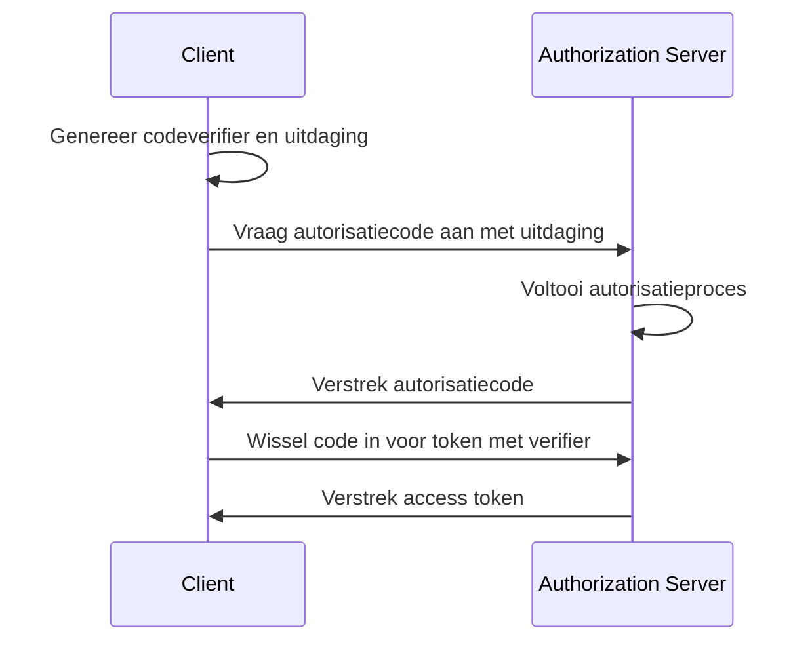

## Wat is OAuth 2.1?

OAuth 2.1 is een voorgestelde update van het <Ref slug="oauth-2.0" /> autorisatieframework. Het omvat een reeks wijzigingen en aanbevelingen voor de bestaande OAuth 2.0 specificatie, die de best practices en beveiligingsverbeteringen consolideert die in de loop der jaren in de industrie breed zijn aangenomen.

De belangrijkste updates van OAuth 2.1 zijn:

1. Verouderden van <Ref slug="implicit-flow">impliciete vergunning</Ref> en [Resource Owner Password Credentials (ROPC) grant](https://datatracker.ietf.org/doc/html/rfc6749#section-4.3) wegens beveiligingsproblemen.
2. Verplichten van het gebruik van <Ref slug="pkce" /> voor alle clients, inclusief <Ref slug="client" headingId="confidential-clients">vertrouwelijke (private) clients</Ref>.
3. Exacte matching van <Ref slug="redirect-uri">redirect-URIs</Ref>.
4. Duidelijke definitie van <Ref slug="client">client</Ref>-types (openbare en vertrouwelijke clients).
5. Beveiligingseisen voor <Ref slug="refresh-token">refresh tokens</Ref>.

## Veroudering van impliciete vergunning

De impliciete vergunning was ontworpen voor single-page applicaties (SPAs) en browsergebaseerde applicaties die geen clientgeheimen veilig kunnen opslaan. De beveiligingsrisico's hebben echter geleid tot de veroudering ervan: de vergunning retourneert de access token in het front channel (URL-fragment), wat blootgesteld kan worden aan aanvallers via de browsergeschiedenis en referrer headers.

OAuth 2.1 raadt aan om de <Ref slug="authorization-code-flow">autorisatiecodegrant</Ref> met <Ref slug="pkce" /> te gebruiken voor browsergebaseerde applicaties.

## Veroudering van ROPC-verlening

De ROPC-verlening staat de client toe om de gebruikersreferenties direct in te wisselen voor een access token. Het was ontworpen voor legacy-toepassingen die de authorization code flow niet kunnen ondersteunen. Echter, de verlening vormt beveiligingsrisico's door:

- Het blootstellen van de gebruikersreferenties aan de client.
- Het omzeilen van het toestemmingsscherm van de authorization server.
- Het beperken van het vermogen van de authorization server om andere beveiligingsmaatregelen af te dwingen, zoals <Ref slug="mfa" />.

OAuth 2.1 raadt aan om de <Ref slug="authorization-code-flow">autorisatiecodegrant</Ref> met <Ref slug="pkce" /> te gebruiken voor gebruikersauthenticatie en -autorisatie.

## Verplichting van PKCE voor alle clients

<Ref slug="pkce" /> is een beveiligingsuitbreiding van de authorization code flow die het risico op het onderscheppen van autorisatiecodes vermindert. Het omvat dat de client een codeverifier en een code-uitdaging genereert, en dat de authorization server de uitdaging verifieert tijdens de tokenuitwisseling.

Hier is een vereenvoudigd sequentiediagram van de authorization code flow met PKCE:

Het werd aanvankelijk aanbevolen voor <Ref slug="client" headingId="public-clients">openlijke clients</Ref> om PKCE te gebruiken, maar OAuth 2.1 breidt deze aanbeveling uit tot een verplichte eis voor alle clients, inclusief <Ref slug="client" headingId="confidential-clients">vertrouwelijke (private) clients</Ref>.

## Exacte matching van redirect-URIs

<Ref slug="redirect-uri">Redirect-URIs</Ref> worden gebruikt door de client om autorisatieresponsen van de authorization server te ontvangen. OAuth 2.1 introduceert een nieuwe vereiste dat de redirect URI die in de autorisatieaanvraag wordt gebruikt precies moet overeenkomen met de redirect URI die door de client bij de <Ref slug="authorization-server" /> is geregistreerd, inclusief het schema, de host en het pad.

In sommige OAuth 2.0-implementaties was de redirect URI-matching soepel, waardoor gedeeltelijke overeenkomsten of wildcardtekens mogelijk waren. Deze flexibiliteit kan echter beveiligingsrisico's introduceren, zoals open redirect-kwetsbaarheden.

## Duidelijke definitie van client-types

OAuth 2.0 definieert client-types niet expliciet. Je kunt verschillende categoriseringen in de industrie zien, zoals op basis van toegangsniveau (publiek vs. vertrouwelijk) of op basis van applicatietype (webapp vs. mobiele app). Voor het OAuth-framework maakt het niet uit hoe de client is geïmplementeerd (aangezien ze meer gaan over de zakelijke attributen van de client), maar het toegangs niveau maakt een verschil in de beveiligingseisen.

Daarom introduceert OAuth 2.1 een duidelijke definitie van client-types:

- <Ref slug="client" headingId="public-clients" />: Clients die de vertrouwelijkheid van hun referenties NIET kunnen handhaven (bijv. SPAs, mobiele apps).
- <Ref slug="client" headingId="confidential-clients" />: Clients die de vertrouwelijkheid van hun referenties WEL kunnen handhaven (bijv. server-side webapps, native desktop-apps).

## Beveiligingseisen voor refresh tokens

<Ref slug="refresh-token">Refresh tokens</Ref> zijn langlevende tokens die door de client worden gebruikt om nieuwe access tokens te verkrijgen zonder gebruikersinteractie. Ondertussen zijn ze ook waardevolle doelen voor aanvallers. Aangezien publieke clients geen referenties veilig kunnen opslaan, specificeert OAuth 2.1 dat de <Ref slug="authorization-server" /> een van de volgende methoden moet gebruiken om refresh tokens te beveiligen:

- Verstrek <Ref slug="refresh-token" headingId="sender-constrained-refresh-tokens">zender-beperkte refresh tokens</Ref>.
- Gebruik <Ref slug="refresh-token" headingId="refresh-token-rotation">refresh token-rotatie</Ref> om de bruikbaarheid en levensduur van refresh tokens te beperken.

## OAuth 2.1 en OpenID Connect (OIDC)

Aangezien <Ref slug="openid-connect" /> bovenop OAuth 2.0 is gebouwd, zijn de veranderingen in OAuth 2.1 ook van toepassing op OIDC. Bijvoorbeeld, alle OIDC-clients moeten authorization code flow met PKCE gebruiken voor gebruikersauthenticatie en -autorisatie.

<SeeAlso slugs={["oauth-2.0", "authorization-code-flow", "pkce", "implicit-flow", "openid-connect"]} />

<Resources
  urls={[
    "https://datatracker.ietf.org/doc/draft-ietf-oauth-v2-1/",
    "https://blog.logto.io/oauth-2-1",
  ]}
/>
