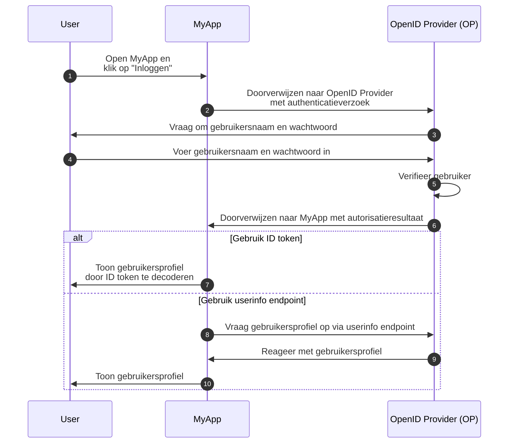
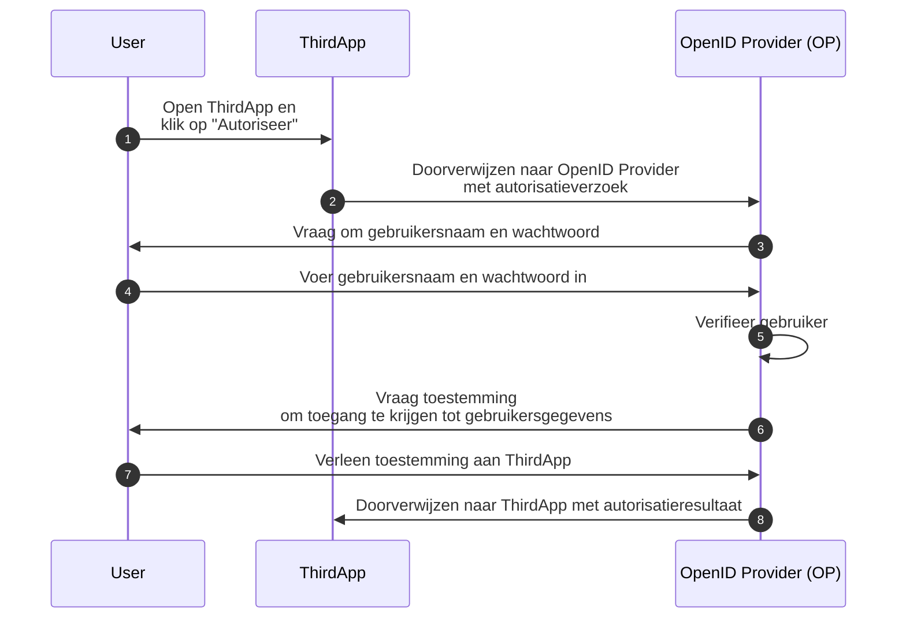

## Wat is OpenID Connect (OIDC)?

OpenID Connect (OIDC) voegt de authenticatiemogelijkheden toe aan <Ref slug="oauth-2.0" />, een autorisatiekader, door een identiteitslaag bovenop te introduceren. OIDC stelt clients in staat om gebruikers te authenticeren en identiteitsinformatie te verkrijgen in de vorm van <Ref slug="id-token">ID tokens</Ref> en <Ref slug="userinfo-endpoint" /> antwoorden.

Laten we eens kijken naar een voorbeeld. Stel dat je een webapplicatie hebt genaamd MyApp en gebruikers kunnen inloggen met gebruikersnaam en wachtwoord; na het inloggen kunnen ze hun profielinformatie bekijken. Hier is een vereenvoudigde flow:



Sommige termen kunnen nieuw voor je zijn, laten we ze verduidelijken:

### OpenID Provider (OP)

Een OpenID Provider (OP) is een <Ref slug="identity-provider" /> die de OIDC- en OAuth 2.0-specificatie implementeert. Dat wil zeggen, een OP is ook een OAuth 2.0 <Ref slug="authorization-server" />.

OP's zijn verantwoordelijk voor het authenticeren van gebruikers en het uitgeven van ID tokens en access tokens aan clients.

### Tokens

- <Ref slug="id-token">ID tokens</Ref> zijn <Ref slug="jwt">JSON Web Tokens</Ref> die gebruikt worden om gebruikersidentiteitsinformatie te vertegenwoordigen, zoals naam, e-mail en profielfoto.
- <Ref slug="access-token">Access tokens</Ref> worden gebruikt om toegang te krijgen tot beveiligde resources namens de gebruiker (hetzelfde als in OAuth 2.0), bijvoorbeeld het userinfo endpoint.

### Authenticatieverzoek en -resultaat

- <Ref slug="authentication-request" /> is een verzoek gedaan door de client aan de OP om de gebruiker te authenticeren. Het bevat parameters om bepaalde vereisten op te geven en zal het authenticatieproces beïnvloeden.
- Afhankelijk van het authenticatieverzoek kan het authenticatieresultaat variëren. Voor nu hoef je alleen te weten dat het resultaat de benodigde informatie bevat voor de client om de gebruiker te identificeren.

### Userinfo endpoint

<Ref slug="userinfo-endpoint" /> is een OIDC-specifiek endpoint dat clients in staat stelt gebruikersprofielinformatie op te vragen. Het is een alternatief voor het gebruik van ID tokens aangezien het userinfo endpoint doorgaans gedetailleerdere gebruikersinformatie biedt dan de ID token.

OIDC laat het aan de OpenID Provider (OP) over om te beslissen welke informatie moet worden opgenomen in de ID token en de userinfo respons. Dus voordat je de ID token ontleedt of het userinfo endpoint aanroept, moet je de documentatie van de OP raadplegen om te begrijpen welke informatie beschikbaar is.

## Term verschillen tussen OAuth 2.0 en OIDC

Aangezien OIDC is gebouwd bovenop OAuth 2.0, worden veel termen gedeeld tussen de twee specificaties. Echter, terwijl OAuth 2.0 zich richt op autorisatie, introduceert OIDC authenticatie en identiteit, waardoor sommige termen ongeschikt zijn in de context van OIDC. Hier zijn enkele opmerkelijke verschillen:

| OAuth 2.0             | OpenID Connect (OIDC)  |
|-----------------------|------------------------|
| Authorization server  | OpenID Provider (OP)   |
| Authorization request | Authentication request |
| Grant                 | Flow                   |

In essentie kunnen de bovenstaande termen naar hetzelfde onderwerp verwijzen, maar hebben ze verschillende betekenissen in de context van OAuth 2.0 en OIDC:

- **OpenID Provider (OP)** is een OAuth 2.0 <Ref slug="authorization-server" /> die de mogelijkheid heeft om gebruikers te authenticeren en ID tokens uit te geven.
- **<Ref slug="authentication-request" />** is een OAuth 2.0 <Ref slug="authorization-request" /> die OIDC-specifieke parameters gebruikt om eindgebruikerauthenticatie aan te vragen en een ID token te verkrijgen.
- **Flow** is een meer algemene term die wordt gebruikt in OIDC om het gebruikersauthenticatie- en autorisatieproces te beschrijven, dat meerdere stappen en interacties kan omvatten in plaats van een enkele verzoek-antwoordsessie. Het is eigenlijk hetzelfde als een <Ref slug="oauth-2.0-grant" />.

## OIDC flows

Zoals het bovenstaande voorbeeld laat zien, worden OIDC flows geïnitieerd door de client (bv. MyApp) met een authenticatieverzoek aan de OP. Het authenticatieverzoek specificeert de te gebruiken flow, dat kan een van de volgende zijn:

- **<Ref slug="authorization-code-flow" />**: De meest veilige en aanbevolen flow voor gebruikersauthenticatie en autorisatie. <Ref slug="pkce" /> is verplicht voor alle clients in <Ref slug="oauth-2.1" />.
- **<Ref slug="implicit-flow" />**: Een vereenvoudigde flow die is verouderd in OAuth 2.1 vanwege beveiligingsproblemen.
- **<Ref slug="hybrid-flow" />**: Een OIDC-flow die de autorisatiecodeflow combineert met de impliciete flow. Het wordt ook niet aanbevolen voor nieuwe toepassingen vanwege beveiligingsproblemen.

Authorize code flow en impliciete flow zijn uitgebreid van OAuth 2.0 om ID tokens op te nemen, terwijl de hybride flow een OIDC-specifieke flow is die beide combineert. Klik op de links hierboven om meer te leren over elke flow.

## OIDC scopes en claims

Net als OAuth 2.0 gebruikt OIDC <Ref slug="scope" /> waarden om de machtigingen te specificeren die de client aanvraagt. Aangezien <Ref slug="id-token">ID tokens</Ref> <Ref slug="jwt">JSON Web Tokens</Ref> zijn, kunnen ze <Ref slug="claim">claims</Ref> (naam-waardeparen) bevatten die gebruikersidentiteitsinformatie vertegenwoordigen volgens de aangevraagde scopes in het <Ref slug="authentication-request" />. Dergelijke claims worden ook geretourneerd in de <Ref slug="userinfo-endpoint" /> response.

OIDC definieert verschillende standaard scopes en bijbehorende claims die clients kunnen aanvragen in het authenticatieverzoek:

- **openid**: Geeft aan dat de client een OIDC-client is en een ID token aanvraagt.
- **profile**: Vraagt toegang tot de standaard profielclaims van de gebruiker, die zijn: `name`, `family_name`, `given_name`, `middle_name`, `nickname`, `preferred_username`, `profile`, `picture`, `website`, `gender`, `birthdate`, `zoneinfo`, `locale`, en `updated_at`.
- **email**: Vraagt toegang tot de claims `email` en `email_verified` van de gebruiker.
- **address**: Vraagt toegang tot de `address` claim van de gebruiker.
- **phone**: Vraagt toegang tot de claims `phone_number` en `phone_number_verified` van de gebruiker.
- **offline_access**: Vraagt een refresh token om de client in staat te stellen nieuwe access tokens te verkrijgen zonder gebruikersinteractie.

Bekijk [Standard Claims](https://openid.net/specs/openid-connect-core-1_0.html#StandardClaims) en [Requesting Claims using Scope Values](https://openid.net/specs/openid-connect-core-1_0.html#ScopeClaims) in de OIDC-specificatie voor meer informatie over scopes en claims. Bekijk ook <Ref slug="offline-access" /> voor een gedetailleerde uitleg van de `offline_access` scope.

> [!Note]
> OpenID Providers (OP's) kunnen extra scopes en claims ondersteunen naast de standaard. Raadpleeg de documentatie van de OP voor meer details.

## Autorisatie in OIDC

Als je bekend bent met OAuth 2.0, merk je misschien op dat het bovenstaande voorbeeld geen <Ref slug="authorization" /> proces bevat. Het voorbeeld laat het gebruikersconsent gedeelte achterwege omdat we aannemen dat MyApp een eigen toepassing is die geen toegang van derden tot gebruikersgegevens betreft. Autorisatie wordt nog steeds door de OP afgedwongen, maar het wordt niet expliciet in de flow getoond.

Het gebruikersconsent gedeelte is vereist wanneer een derde partij client (bv. een toepassing die niet eigendom is van de OP) toegang tot gebruikersgegevens aanvraagt. In dergelijke gevallen zal de OP de gebruiker vragen om toestemming te verlenen aan de client voordat de ID token of access token wordt uitgegeven. Stel dat er een derde partij toepassing is genaamd ThirdApp die toegang tot gebruikersgegevens wil:



Zodra het autorisatieproces is voltooid en ThirdApp het autorisatieresultaat heeft ontvangen (meestal een <Ref slug="access-token" />), kan het de gegevens van de gebruiker opvragen van de <Ref slug="resource-server" />.

Zie <Ref slug="oauth-2.0" /> voor meer informatie over OAuth 2.0 en autorisatiestromen.

### Scopes

Net als bij OAuth 2.0 gebruikt OIDC <Ref slug="scope" /> waarden om de machtigingen te specificeren die de client aanvraagt. We hebben de standaard scopes en claims behandeld in [OIDC scopes en claims](#oidc-scopes-en-claims). Het is vermeldenswaardig dat deze scopes en claims als gereserveerde waarden in OIDC moeten worden behandeld, wat betekent dat je ze NIET voor zakelijke doeleinden mag gebruiken.

In de praktijk kan je OpenID Provider (OP) aangepaste scopes en claims ondersteunen voor je zakelijke behoeften. Raadpleeg de documentatie van de OP voor meer informatie over aangepaste scopes en claims. Als je geen aangepaste scopes en claims definieert, kan de OP ze direct negeren of een foutrespons retourneren.

### Resource-indicatoren

Aangezien het framework zoals OIDC en de OP bepaalde scopes en claims kunnen reserveren voor specifieke doeleinden, raadt de OP meestal aan om een prefix of namespace te gebruiken om conflicten met gereserveerde waarden te vermijden bij het definiëren van aangepaste scopes en claims. Bijvoorbeeld, je zou je aangepaste scopes kunnen voorzien van het voorvoegsel `myapp:` om aan te geven dat ze specifiek zijn voor je toepassing.

```json
{
  "scope": "myapp:custom_scope"
}
```

Dit kan echter niet garanderen dat je aangepaste scopes en claims niet in conflict zijn met toekomstige gereserveerde waarden, en het kan de tokenomvang vergroten. Een OAuth 2.0-uitbreiding genaamd <Ref slug="resource-indicator">resource-indicatoren</Ref> biedt een meer flexibele en schaalbare manier om hetzelfde doel te bereiken. Resource-indicatoren zijn URI's die de gevraagde resources vertegenwoordigen en kunnen de daadwerkelijke API-eindpunten zijn om de echte wereldresources te weerspiegelen. Bijvoorbeeld, je kunt `https://api.myapp.com` gebruiken als een resource-indicator om de API-resources te vertegenwoordigen die je client wil benaderen.

Aangezien OIDC is gebouwd op OAuth 2.0, kun je resource-indicatoren gebruiken in OIDC-authenticatieverzoeken wanneer het correct is geconfigureerd. Hier is een niet-normatief voorbeeld van een authenticatieverzoek met een resource-indicator:

```http
GET /authorize?response_type=code
  &client_id=YOUR_CLIENT_ID
  &redirect_uri=https%3A%2F%2Fclient.example.com%2Fcallback
  &scope=openid%20profile
  &resource=https%3A%2F%2Fapi.example.com HTTP/1.1
Host: your-openid-provider.com
```

Om resource-indicatoren te gebruiken, moet je eerst bevestigen dat je OP deze extensie (RFC 8707) ondersteunt. Indien ondersteund, moet je een resource-indicator-URI registreren bij de OP en deze gebruiken in de `resource` parameter van het authenticatieverzoek.

Bekijk <Ref slug="resource-indicator" /> voor gedetailleerde informatie over resource-indicatoren.

## OIDC beveiligingsoverwegingen

### Veilige communicatie

Alle communicatie tussen de client, OP en resource server moet beveiligd zijn met HTTPS om afluisteren of knoeien met de gegevens te voorkomen.

### Kies veilige flows

Bij de implementatie van OIDC wordt aanbevolen om het volgende te gebruiken:

- <Ref slug="authorization-code-flow" /> met <Ref slug="pkce" /> voor gebruikersauthenticatie en autorisatie (verplicht in <Ref slug="oauth-2.1" />).
- <Ref slug="client-credentials-flow" /> voor machine to machine communicatie.

Impliciete flow en hybride flow zijn verouderd vanwege beveiligingsproblemen, dus vermijd het gebruik ervan voor nieuwe toepassingen en overweeg om bestaande toepassingen te migreren naar veiligere flows.

### ID token validatie

Wanneer een ID token van de OP wordt ontvangen, moet de client de token valideren om de integriteit en authenticiteit ervan te waarborgen. Het validatieproces moet TEN MINSTE de volgende controles omvatten:

- **Issuer** (Uitgever): De `iss` claim moet overeenkomen met de issuer-URL van de OP.
- **Audience** (Doelgroep): De `aud` claim moet overeenkomen met de client-ID van de client.
- **Expiration** (Vervaldatum): De `exp` claim moet in de toekomst liggen.
- **Signature** (Handtekening): De token moet ondertekend zijn door de <Ref slug="signing-key" /> van de OP.

### Access token gebruik

Access tokens worden gebruikt om toegang te krijgen tot beveiligde resources namens de gebruiker. Clients moeten access tokens behandelen als gevoelige informatie en de volgende best practices volgen:

- **Tokenopslag**: Sla access tokens veilig op en vermijd blootstelling aan ongeautoriseerde partijen.
- **Vervaldatum van token**: Access tokens moeten een korte vervaltijd instellen (bijv. 1 uur) om het risico van ongeautoriseerde toegang te verminderen als de token gecompromitteerd is.
- **Token intrekking**: Implementeer mechanismen voor het intrekken van tokens om access tokens indien nodig ongeldig te maken.

### Gebruikersconsent

Wanneer een derde partij client toegang tot gebruikersgegevens aanvraagt, moet de OP ervoor zorgen dat de gebruiker op de hoogte is van de gevraagde machtigingen en zijn toestemming verleent. Het gebruikersconsentproces moet transparant zijn en duidelijke informatie verstrekken over de toegang tot de gegevens en hoe deze zullen worden gebruikt.

<SeeAlso slugs={["oauth-2.0", "authorization-code-flow", "implicit-flow", "hybrid-flow", "pkce", "resource-indicator"]} />

<Resources
  urls={[
    "https://blog.logto.io/secure-cloud-apps-with-oauth-and-openid-connect",
    "https://openid.net/specs/openid-connect-core-1_0.html",
  ]}
/>