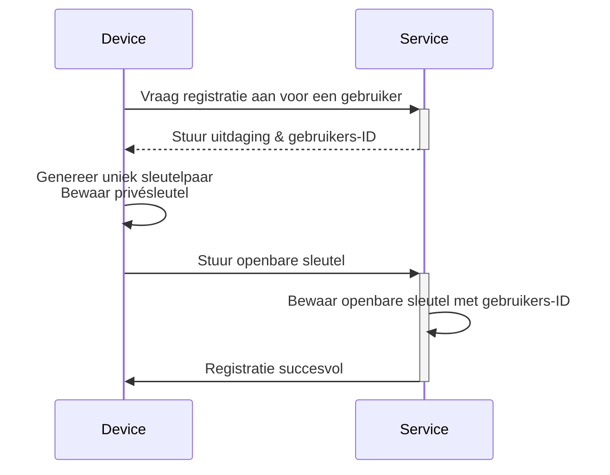
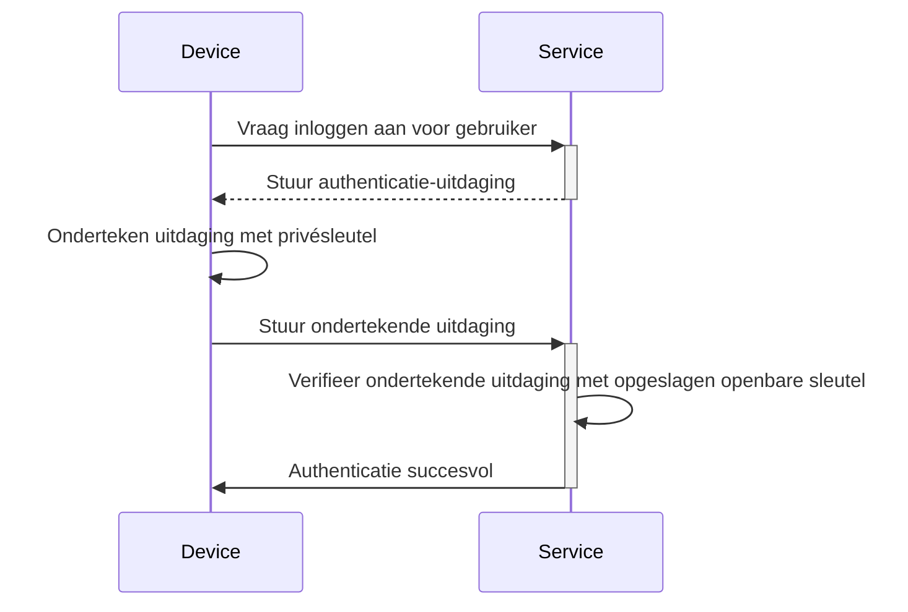

## Wat is een passkey?

**Passkey** is een [FIDO](https://fidoalliance.org/)-gebaseerd, veilig en handig alternatief voor traditionele wachtwoorden. Ze gebruiken geavanceerde cryptografie om je accounts te beschermen tegen [phishing](https://en.wikipedia.org/wiki/Phishing) aanvallen.

- **Uniek voor elke dienst**: Wanneer je je registreert voor een dienst, maakt je apparaat een unieke passkey aan die is gekoppeld aan het domein van die specifieke dienst.
- **Apparaatgebonden:** Passkeys zijn doorgaans gekoppeld aan een apparaat, zoals een telefoon, laptop, biometrische identificator of hardwarebeveiligingssleutels.
- **Openbaar-privé sleutel paar:** Het apparaat bewaart de privésleutel, terwijl de openbare sleutel wordt gedeeld met de dienst. Deze cryptografische sleutelpaar worden passkeys genoemd. (Geciteerd van [FIDO](https://fidoalliance.org/how-fido-works/))
- **Meerdere authenticatiemethoden:** Je kunt een vingerafdrukscan, gezichtsherkenning, apparaat-PIN, QR-code scannen of beveiligingssleutels gebruiken om je te authenticeren met een passkey.
- **Apparaatoverstijgende synchronisatie**: Passkeys kunnen worden gesynchroniseerd tussen apparaten met behulp van veilige cloudopslag (bijv. Apple's iCloud Sleutelhanger of Google Wachtwoordmanager), zodat je kunt inloggen vanaf elk ondersteund apparaat.

## Hoe ziet de passkey workflow eruit?

Hier is een voorbeeld uit de praktijk om je beter te helpen begrijpen. Je hebt een webdienst MyApp die Passkey-aanmelding wil implementeren in plaats van wachtwoordgebaseerde aanmelding. Gebruikers kiezen het huidige apparaat met vingerafdrukscanning als Passkey authenticatiemethode.

**Passkeys** werken door gebruik te maken van openbare-sleutelcryptografie om veilige referenties te bieden.

- **Passkey registratie**
    - Wanneer je je registreert voor een dienst, genereert je apparaat een uniek cryptografisch sleutelpaar dat is gekoppeld aan die dienst.
    - De **privésleutel** blijft op je apparaat, terwijl de **openbare sleutel** wordt gedeeld met de dienst.

- **Passkey authenticatie**
    - Wanneer je probeert in te loggen, stuurt de dienst een **uitdaging** naar je apparaat.
    - Je apparaat gebruikt de **privésleutel** om een cryptografische **handtekening** te genereren op basis van de uitdaging.
    - De **handtekening** wordt teruggestuurd naar de dienst, die deze verifieert met behulp van de **openbare sleutel**.
    - Als de handtekening geldig is, is de authenticatie succesvol.

Lees <Ref slug="webauthn" />, een API voor het implementeren van passkeys, om de details te leren.

## Hoe ziet de passkey eindgebruikersflow eruit?

Passkeys bieden flexibiliteit met twee soorten authenticators voor zowel lokaal als cloudgebruik, en gebruikers kunnen een of beide inschakelen voor de dienst.

- **Platform authenticator (Interne authenticator):** Gebonden aan een specifiek apparaat-OS (bijv. telefoon, laptop), met behulp van biometrie of apparaat toegangscode om te autoriseren. Het is snel en handig.
    - Voorbeelden: iCloud Sleutelhanger op Apple-apparaten (verifiëren via Touch ID, Face ID of apparaat toegangscode), Windows Hello, Google Wachtwoordmanager op Android.
- **Roaming authenticator (Externe authenticator):** Draagbare apparaten of software, bijv. beveiligingssleutels, smartphones. Kan worden gebruikt op meerdere apparaten, maar kan extra stappen vereisen zoals QR-code scannen of NFC/Bluetooth koppeling.
    - Voorbeelden: YubiKey en cloud-gebaseerde accounts op smartphones. Mobiele authenticators vereisen vaak QR-code scannen om te koppelen met desktopapparaten, en apparaatoverschrijdende authenticatie moet verbinding maken via Bluetooth, NFC of USB om ervoor te zorgen dat de authenticator in de buurt is.

## Wanneer gebruik je een passkey?

Passkeys zijn een moderne authenticatiefactor die kan worden gebruikt als eerste of tweede factor.

- **Passkey aanmelding:** Passkeys bieden een snellere en veiligere wachtwoordloze authenticatiemethode vergeleken met traditionele wachtwoorden.
    - Moderne applicaties hebben doorgaans een "Aanmelden met passkey" knop op de aanmeldpagina, waarmee gebruikers proactief deze optie kunnen selecteren.
    - Bovendien kan de aanmeldpagina automatisch een passkey-aanmeldpop-up weergeven als het herkent dat de gebruiker toegang heeft tot hetzelfde apparaat en dezelfde browser waar hun passkey is geregistreerd.
- **Passkey MFA:** Passkeys kunnen ook dienen als tweede factor voor MFA.
    - Wanneer een gebruiker probeert in te loggen, voert hij eerst zijn e-mail en wachtwoord in (of andere eerste factoren), waarna de dienst hen vraagt om de 2-staps verificatie te voltooien met een passkey.
    - Als er bestaande sessies in de browser zijn, kan de dienst gebruikers direct vragen om in te loggen met hun passkey zonder dat ze hun wachtwoord opnieuw hoeven in te voeren. Dit proces, bekend als het voltooien van MFA, omdat passkey een hoog beveiligingsniveau biedt door te binden aan het huidige apparaat en gebruikers te verifiëren via biometrie, PIN's of andere hardwaremethoden.
- **Beveiligingsverificatie**: In omgevingen met hoge beveiliging worden passkeys vaak gebruikt om de identiteit van de gebruiker dubbel te controleren. Bijvoorbeeld bij toegang tot gevoelige financiële informatie of het uitvoeren van kritieke operaties (bankieren, overheid, bedrijfsysteem).

### Waarom zijn passkeys de meest veilige authenticatiemethode?

Passkeys zijn een van de meest veilige manieren voor gewone klanten om in te loggen omdat ze gebruik maken van **openbare-sleutelcryptografie**. In tegenstelling tot wachtwoorden of eenmalige codes (TOTPs), verlaat je privésleutel nooit je apparaat. Zelfs als een aanvaller de openbare sleutel steelt, die vrij beschikbaar is, kunnen ze geen geldige inlogpoging vervalsen.

Hier is een vergelijking om te illustreren waarom passkeys aanzienlijk veiliger zijn:

| Aanvallen | Passkeys | Software TOTP (Authenticator) |
| --- | --- | --- |
| **Phishing aanvallen** | Zeer resistent tegen phishing, omdat de privésleutel nooit het apparaat verlaat of ergens handmatig wordt ingevoerd, waardoor het moeilijker is om te stelen. | Kwetsbaar voor phishing, omdat Software TOTP op je scherm wordt weergegeven, zodat aanvallers je kunnen misleiden om het op een nepwebsite te onthullen. |
| **Man-in-the-middle aanvallen (MitM)** | Sterke bescherming tegen MitM, omdat robuuste cryptografische protocollen ervoor zorgen dat de privésleutels alleen op je apparaat blijven. | Kwetsbaar voor MitM, omdat de TOTPs kunnen worden onderschept door een MitM-aanvaller die ze vervolgens kan gebruiken om als jou in te loggen. |
| **Replay aanvallen** | Sterke bescherming tegen replay aanval, omdat elke passkey-aanvraag uniek is, waardoor het nutteloos is voor een aanvaller om te onderscheppen en later opnieuw af te spelen. | Mogelijk om replay aanval, omdat TOTP periodiek verandert, maar als ze worden onderschept voordat ze verlopen, kunnen ze opnieuw worden gebruikt voor ongeautoriseerde toegang. |

<SeeAlso slugs={["webauthn", "authentication", "authorization"]} />

<Resources
  urls={[
    "https://fidoalliance.org/passkeys/",
    "https://webauthn.io/"
  ]}
/>