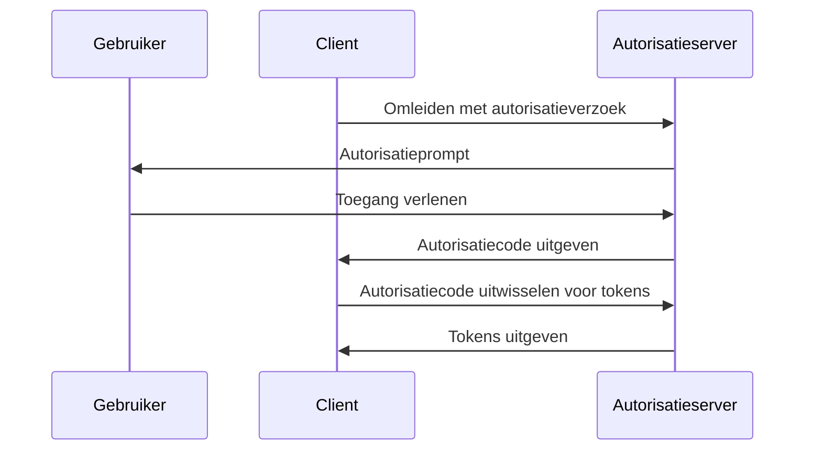

## Wat is Bewijs Sleutel voor Code Uitwisseling (PKCE)?

Bewijs Sleutel voor Code Uitwisseling (PKCE) dient als een beveiligingsuitbreiding voor <Ref slug="authorization-code-flow" /> in <Ref slug="oauth-2.0" />. Het is ontworpen om autorisatiecodes te beschermen tegen onderschepping en misbruik, vooral in openbare clients waar het clientgeheim niet veilig is.

Vanaf <Ref slug="oauth-2.1" /> is PKCE verplicht voor alle typen clients, inclusief <Ref slug="client" headingId="public-clients" /> en <Ref slug="client" headingId="confidential-clients">vertrouwelijke (privé) clients</Ref>.

## Hoe werkt PKCE?

PKCE introduceert een paar extra stappen in de authorization code flow om ervoor te zorgen dat de <Ref slug="client" /> die de autorisatiecode uitwisselt dezelfde client is die de flow initieerde.

> [!Note]
> PKCE is ook van toepassing op <Ref slug="openid-connect" /> flows die afhankelijk zijn van de authorization code flow. Voor eenvoudigheid zullen we ons concentreren op de OAuth 2.0 implementatie.

Laten we snel de standaard authorization code flow herzien voordat we dieper ingaan op PKCE:



Laten we nu bekijken hoe PKCE de authorization code flow verbetert.

### 1. Het autorisatieverzoek voorbereiden

#### 1.1. Client genereert een code verifier

Voordat het <Ref slug="authorization-request" /> wordt geïnitieerd, moet de client een willekeurige string genereren genaamd **code verifier**. De string moet een cryptografisch willekeurige URL-veilige string zijn met hoge entropie, met een minimale lengte van 43 tekens en een maximale lengte van 128 tekens.
  
Hier is een voorbeeld van het genereren van een code verifier in JavaScript:

```javascript
// `js-base64` is een universele bibliotheek die zowel in Node.js als browsers kan worden gebruikt
import { fromUint8Array } from 'js-base64';

// Het tweede argument `true` geeft aan dat de uitvoer URL-veilig moet zijn
const codeVerifier = fromUint8Array(crypto.getRandomValues(new Uint8Array(64)), true);
```

#### 1.2. Client creëert een code challenge

De client moet de **code verifier** hashen met een cryptografische hashfunctie, zoals SHA-256, en de hash coderen in een URL-veilige Base64 string. De resulterende string wordt de **code challenge** genoemd.

Hier is een voorbeeld van het maken van een code challenge in JavaScript:

```javascript
// `js-base64` is een universele bibliotheek die zowel in Node.js als browsers kan worden gebruikt
import { fromUint8Array } from 'js-base64';

const encodedCodeVerifier = new TextEncoder().encode(codeVerifier);
const codeChallenge = new Uint8Array(await crypto.subtle.digest('SHA-256', encodedCodeVerifier));

// Het tweede argument `true` geeft aan dat de uitvoer URL-veilig moet zijn
return fromUint8Array(codeChallenge, true);
```

#### 1.3. Client voegt de code challenge toe aan het autorisatieverzoek

Wanneer de client het autorisatieverzoek initieert, voegt het de parameters `code_challenge` en `code_challenge_method` toe aan het verzoek. De `code_challenge` parameter bevat de **code challenge** die in de vorige stap is gegenereerd, en de `code_challenge_method` parameter specificeert het hashing-algoritme dat is gebruikt om de **code challenge** te creëren (bijv. `S256` voor SHA-256).

De ondersteunde `code_challenge_method` waarden zijn `plain` en `S256`, waarbij `plain` aangeeft dat de **code challenge** ongewijzigd wordt verzonden zonder enige hashing. Meestal wordt `S256` aanbevolen voor betere beveiliging.

Hier is een niet-normatief voorbeeld van een autorisatieverzoek met PKCE:

```http
GET /authorize?response_type=code
  &client_id=YOUR_CLIENT_ID
  &redirect_uri=https%3A%2F%2Fclient.example.com%2Fcallback
  &scope=openid%20profile
  &code_challenge=YOUR_CODE_CHALLENGE
  &code_challenge_method=S256
  &state=abc123
  &nonce=123456 HTTP/1.1
```

### 2. De autorisatiecode uitwisselen voor tokens

De client moet de **code verifier** opslaan voor later gebruik en doorgaan met de authorization flow zoals gebruikelijk. Zodra de client de autorisatiecode ontvangt, moet deze het <Ref slug="token-request" /> met de **code verifier** naar de autorisatieserver sturen.

Hier is een niet-normatief voorbeeld van een tokenaanvraag met PKCE:

```http
POST /token HTTP/1.1
Host: your-authorization-server.com
Content-Type: application/x-www-form-urlencoded

grant_type=authorization_code
  &code=YOUR_AUTHORIZATION_CODE
  &redirect_uri=https%3A%2F%2Fclient.example.com%2Fcallback
  &client_id=YOUR_CLIENT_ID
  &code_verifier=YOUR_CODE_VERIFIER
```

De autorisatieserver zal de **code challenge** controleren tegen de **code verifier** om ervoor te zorgen dat de client dezelfde entiteit is die de flow initieerde. Als de verificatie mislukt, zal de autorisatieserver het tokenverzoek afwijzen.

## Hoe PKCE de beveiliging verbetert

Het belangrijkste beveiligingsvoordeel van PKCE is dat het voorkomt dat autorisatiecode onderscheppingsaanvallen plaatsvinden, die kunnen optreden in openbare clients. Bijvoorbeeld, als een aanvaller de autorisatiecode onderschept, kunnen ze deze niet uitwisselen voor tokens zonder de **code verifier**. PKCE zorgt ervoor dat alleen de client die de flow heeft geïnitieerd, de tokenuitwisseling kan voltooien.

<SeeAlso slugs={['oauth-2.1', 'authorization-code-flow']} />

<Resources
  urls={[
    "https://blog.logto.io/how-pkce-protects-the-authorization-code-flow-for-native-apps",
    "https://datatracker.ietf.org/doc/html/rfc7636",
  ]}
/>
