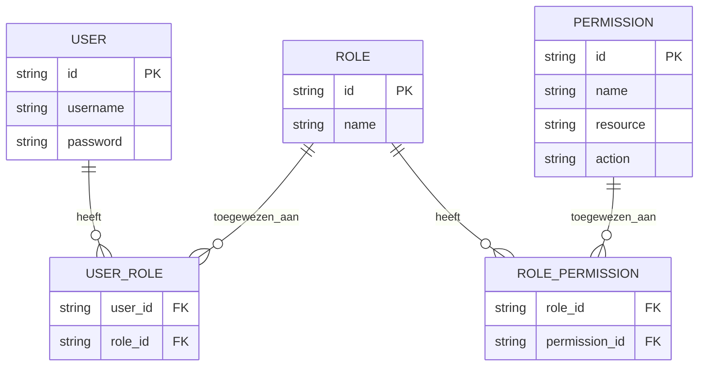
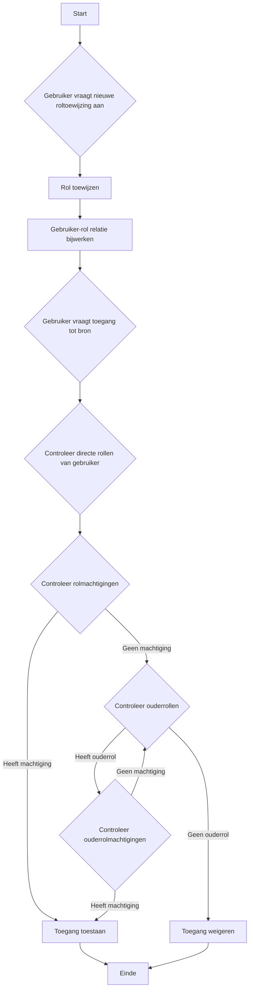
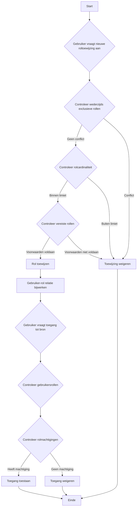

## Wat is rolgebaseerde toegangscontrole (RBAC)?

Rolgebaseerde toegangscontrole (RBAC) is een veelgebruikt toegangscontrolemodel dat het concept van "rollen" introduceert om gebruikers los te koppelen van machtigingen, resulterend in een flexibel en efficiënt machtigingsbeheersysteem.

Het kernidee achter RBAC is eenvoudig maar krachtig: in plaats van machtigingen direct aan gebruikers toe te wijzen, worden machtigingen toegewezen aan rollen, die vervolgens aan gebruikers worden toegewezen. Deze indirecte methode van machtigingstoewijzing vereenvoudigt het proces van het beheren van toegangsrechten aanzienlijk.

## Wat zijn de belangrijkste concepten in RBAC?

Het RBAC-model draait om vier hoofdcomponenten:

1. Gebruikers: Individuen binnen het systeem, meestal echte mensen.
2. Rollen: Representaties van functieomschrijvingen of verantwoordelijkheden binnen een organisatie.
3. Machtigingen: Autorisaties om specifieke bewerkingen op bepaalde bronnen uit te voeren.
4. Sessies: Dynamische omgevingen waarin gebruikers bepaalde rollen activeren.

De basisworkflow van RBAC kan als volgt worden samengevat:
1. Definieer rollen op basis van de organisatiestructuur of zakelijke vereisten.
2. Wijs passende machtigingen toe aan elke rol.
3. Wijs een of meer rollen toe aan gebruikers op basis van hun verantwoordelijkheden.
4. Wanneer een gebruiker probeert toegang te krijgen tot een bron, controleert het systeem of hun toegewezen rollen de benodigde machtigingen hebben.

## Hoe wordt RBAC vaak gebruikt in toepassingen in de echte wereld?

Bij het gebruik van RBAC in een typische zakelijke toepassing kun je beginnen met het beantwoorden van de volgende drie basisvragen:

1. Welke bronnen moeten in het systeem worden beschermd?
2. Welke bewerkingen moeten op die bronnen worden gecontroleerd?
3. In scenario's uit de echte wereld, welke rollen zijn verantwoordelijk voor het uitvoeren van deze bronnen en bewerkingen?

Neem een e-commercesysteem als voorbeeld.

Je kunt eerst de bronnen identificeren die moeten worden beschermd:

- Product
- Bestelling

Vervolgens kun je bepalen welke bewerkingen op deze bronnen moeten worden gecontroleerd, d.w.z. de machtigingen voor deze bronnen definiëren:

- Product
  - `read:product`
  - `create:product`
  - `delete:product`
- Bestelling
  - `read:order`
  - `create:order`
  - `delete:order`

Met de bovenstaande machtigingen kun je nu het volgende machtigingsbeheermodel definiëren op basis van de rollen in scenario's uit de echte wereld:

- Productbeheerder
  - Product
    - `read:product`
    - `create:product`
    - `delete:product`
- Bestellingsbeheerder
  - Bestelling
    - `read:order`
    - `create:order`
    - `delete:order`

Ten slotte wijs je de rollen toe aan gebruikers op basis van hun verantwoordelijkheden:

- Alice: Productbeheerder
- Bob: Bestellingsbeheerder

Wanneer een gebruiker toegang krijgt tot een bron, controleert het systeem of de toegewezen rollen van de gebruiker de benodigde machtigingen hebben.

Bijvoorbeeld, wanneer Alice probeert productinformatie te lezen, haalt het systeem eerst haar rolinformatie op en ontdekt dat ze de rol van productbeheerder heeft.

Vervolgens vraagt het systeem de machtigingen op die aan die rol zijn gekoppeld, waaronder `read:product`, `create:product` en `delete:product`.

Het systeem controleert vervolgens of de vereiste `read:product` machtiging in haar machtigingslijst staat.

Aangezien deze machtiging bestaat, staat het systeem Alice toe om toegang te krijgen tot de productlijst. Als de vereiste machtiging niet in de lijst staat, weigert het systeem het toegangsverzoek.

## Waarom je rollen niet direct zou moeten gebruiken voor toegangscontrole

Een veelgemaakte fout bij de implementatie van RBAC is het direct gebruiken van rollen voor toegangscontrole:

```typescript
// ❌ Problematische aanpak
if (user.hasRole('product_admin')) {
  await deleteProduct(productId);
}
```

Hoewel deze aanpak eenvoudig lijkt, creëert het problemen naarmate je systeem groeit. Bijvoorbeeld:
- Wanneer het marketingteam productbeschrijvingen moet bijwerken, moet je de code aanpassen om te controleren op marketingrollen.
- Wanneer je wilt dat bepaalde productmanagers alleen producten publiceren maar niet verwijderen, moet je nieuwe rolcontroles maken voor gerelateerde bewerkingen.
- Wanneer een nieuw contentteam gedeeltelijke producttoegang nodig heeft, moet je opnieuw je code bijwerken.

In plaats daarvan moet je altijd controleren op specifieke machtigingen:

```typescript
// ✅ Aanbevolen aanpak
if (user.hasPermission('delete:product')) {
  await deleteProduct(productId);
}
```

Deze machtigingsgebaseerde aanpak biedt verschillende voordelen:

1. Fijngranulaire machtigingscontrole: machtigingen kunnen nauwkeurig worden gekoppeld aan specifieke bronbewerkingen:

- Product maken: `create:product`
- Product bijwerken: `update:product`
- Product verwijderen: `delete:product`
- Product publiceren: `publish:product`

2. Flexibele rolconfiguratie: machtigingen kunnen vrij worden gecombineerd in rollen zonder codewijzigingen:

```typescript
const roles = {
  product_admin: ['create:product', 'update:product', 'delete:product', 'publish:product'],
  content_editor: ['update:product'],
  publisher: ['publish:product']  // Nieuwe rollen kunnen eenvoudig worden toegevoegd
};
```

Dit ontwerp maakt je systeem aanpasbaar aan zakelijke groei:
- Het toevoegen van nieuwe rollen vereist alleen machtigingsconfiguratie
- Het aanpassen van rolmachtigingen gebeurt via configuratie
- Nieuwe functies hebben alleen nieuwe machtigingsvermeldingen nodig

Onthoud: rollen moeten alleen containers van machtigingen zijn, niet de basis voor toegangscontroledoorbeslissingen. Dit ontwerp stelt RBAC in staat om maximale waarde te bieden.

## RBAC-modellen en hun evolutie

### RBAC0: De basis

RBAC0 is het basismodel dat de kernconcepten van gebruikers, rollen, machtigingen en sessies definieert. Het dient als basis voor alle andere RBAC-modellen.

Belangrijkste kenmerken:
- Gebruiker-rol associatie: Veel-op-veel relatie
- Rol-machtiging associatie: Veel-op-veel relatie



Dit diagram illustreert de basisstructuur van RBAC0, met de relaties tussen gebruikers, rollen en machtigingen.

Belangrijkste operaties:
1. Rollen toewijzen aan gebruikers
2. Machtigingen toewijzen aan rollen
3. Controleren of een gebruiker een specifieke machtiging heeft

Hoewel RBAC0 een solide startpunt biedt, heeft het enkele beperkingen:
1. Rol-explosie: Naarmate de systeemcomplexiteit toeneemt, kan het aantal rollen snel groeien.
2. Machtigingsredundantie: Verschillende rollen kunnen vergelijkbare sets machtigingen vereisen, wat leidt tot duplicatie.
3. Gebrek aan hiërarchie: Het kan geen overervingsrelaties tussen rollen vertegenwoordigen.

### RBAC1: Invoering van rolhiërarchieën

RBAC1 bouwt voort op RBAC0 door het concept van rolovererving toe te voegen.

```plaintext
RBAC1 = RBAC0 + Rolovererving
```

Belangrijkste kenmerken:
- Rolhiërarchie: Rollen kunnen ouderrollen hebben
- Machtigingsovererving: Kindrollen erven alle machtigingen van hun ouderrollen


Dit diagram toont hoe rollen kunnen erven van andere rollen in RBAC1.

Belangrijkste operaties:



Dit stroomdiagram illustreert het proces van roltoewijzing en machtigingscontrole in RBAC1, inclusief het aspect van rolovererving.

RBAC1 biedt verschillende voordelen:
1. Verminderd aantal rollen: Minder basisrollen kunnen worden gecreëerd door overerving
2. Vereenvoudigd machtigingsbeheer: Eenvoudiger om organisatiestructuren te weerspiegelen

Echter, RBAC1 heeft nog steeds enkele beperkingen:
1. Gebrek aan beperkingsmechanismen: Niet in staat om gebruikers te beperken om tegelijkertijd potentieel conflicterende rollen te hebben
2. Prestatieoverwegingen: Machtigingscontroles kunnen vereisen dat de hele rolhiërarchie wordt doorlopen

### RBAC2: Implementatie van beperkingen

RBAC2 is ook gebaseerd op RBAC0 maar introduceert het concept van beperkingen.

```plaintext
RBAC2 = RBAC0 + Beperkingen
```

Belangrijkste kenmerken:
1. Wederzijds exclusieve rollen: Gebruikers kunnen niet tegelijkertijd aan deze rollen worden toegewezen
2. Rolcardinaliteit: Beperkt het aantal gebruikers dat aan een bepaalde rol kan worden toegewezen
3. Vereiste rollen: Gebruikers moeten een specifieke rol hebben voordat ze aan een andere rol worden toegewezen



Dit stroomdiagram demonstreert het proces van roltoewijzing en toegangscontrole in RBAC2, met inbegrip van de verschillende beperkingen.

RBAC2 verbetert de beveiliging door overmatige concentratie van machtigingen te voorkomen en biedt meer precieze toegangscontrole. Het verhoogt echter de systeemcomplexiteit en kan de prestaties beïnvloeden vanwege de noodzaak om meerdere beperkingsvoorwaarden voor elke roltoewijzing te controleren.

### RBAC3: Het uitgebreide model

RBAC3 combineert de kenmerken van RBAC1 en RBAC2, en biedt zowel rolovererving als beperkingsmechanismen:

```plaintext
RBAC3 = RBAC0 + Rolovererving + Beperkingen
```

Dit uitgebreide model biedt maximale flexibiliteit, maar presenteert ook uitdagingen in implementatie en prestatieoptimalisatie.

## Wat zijn de voordelen van RBAC (rolgebaseerde toegangscontrole)?

1. Vereenvoudigd machtigingsbeheer: Bulkautorisatie via rollen vermindert de complexiteit van het beheren van individuele gebruikersmachtigingen.
2. Verbeterde beveiliging: Nauwkeurigere controle over gebruikersmachtigingen verlaagt beveiligingsrisico's.
3. Verminderde administratieve kosten: Het wijzigen van rolmachtigingen beïnvloedt automatisch alle bijbehorende gebruikers.
4. Afstemming met bedrijfslogica: Rollen komen vaak overeen met organisatiestructuren of bedrijfsprocessen, waardoor ze gemakkelijker te begrijpen en te beheren zijn.
5. Ondersteuning voor scheiding van taken: Kritieke verantwoordelijkheden kunnen worden gescheiden door beperkingen zoals wederzijds exclusieve rollen.

## Wat zijn de praktische implementatieoverwegingen?

Bij het implementeren van RBAC in scenario's uit de echte wereld, moeten ontwikkelaars rekening houden met deze belangrijke aspecten:

1. Databaseontwerp: Gebruik relationele databases om RBAC-structuren effectief op te slaan en op te vragen.
2. Prestatieoptimalisatie: Implementeer cachingstrategieën en optimaliseer machtigingscontroles, vooral voor complexe RBAC3-modellen.
3. API- en frontend-integratie: Ontwerp duidelijke API's voor het beheren van gebruikers, rollen en machtigingen, en overweeg hoe RBAC in frontend-toepassingen kan worden gebruikt.
4. Beveiliging en auditing: Zorg voor de beveiliging van het RBAC-systeem zelf en implementeer gedetailleerde log- en auditfuncties.
5. Schaalbaarheid: Ontwerp met toekomstige uitbreidingen in gedachten, zoals het ondersteunen van complexere machtigingsregels of integratie met andere systemen.
6. Gebruikerservaring: Ontwerp intuïtieve interfaces voor systeembeheerders om de RBAC-structuur eenvoudig te configureren en te onderhouden.

<SeeAlso slugs={['abac', 'access-control']} />

<Resources
  urls={[
    "https://blog.logto.io/rbac-and-abac",
    "https://blog.logto.io/mastering-rbac",
    "https://blog.logto.io/organization-and-role-based-access-control",
    "https://docs.logto.io/docs/recipes/rbac/",
    "https://en.wikipedia.org/wiki/Role-based_access_control"
  ]}
/>