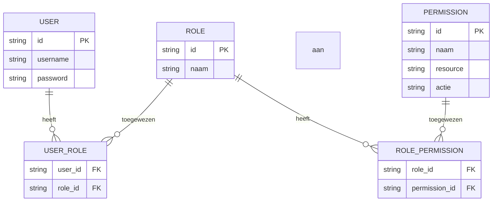
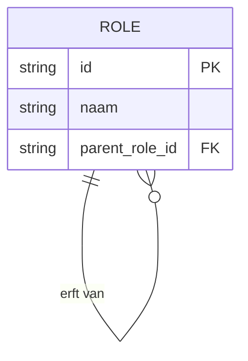
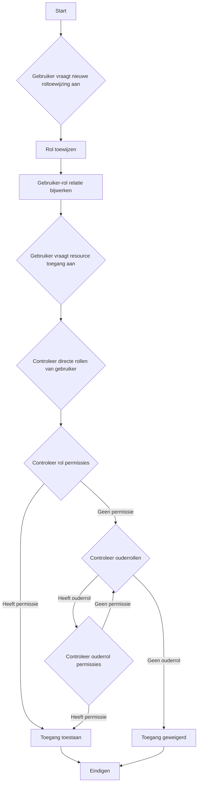
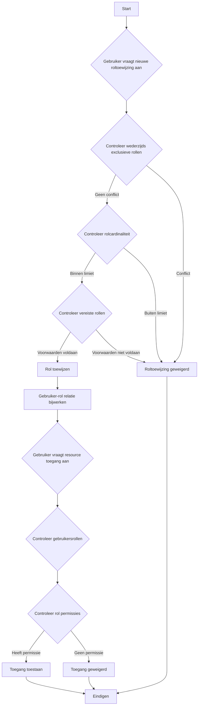

## Wat is role-gebaseerde toegangscontrole (RBAC)?

Role-gebaseerde toegangscontrole (RBAC) is een breed toegepast toegangscontrolemodel dat het concept van "rollen" introduceert om gebruikers los te koppelen van permissies, wat resulteert in een flexibel en efficiënt toestemmingsbeheersysteem.

Het kernidee achter RBAC is eenvoudig maar krachtig: in plaats van direct permissies aan gebruikers toe te wijzen, worden permissies toegewezen aan rollen, die vervolgens aan gebruikers worden toegewezen. Deze indirecte methode van toestemmingsallocatie vereenvoudigt het beheer van toegangsrechten aanzienlijk.

### Belangrijke concepten in RBAC

Het RBAC-model draait om vier hoofdonderdelen:

1. Gebruikers: Individuen binnen het systeem, meestal echte mensen.
2. Rollen: Representaties van functie- of verantwoordelijkheden binnen een organisatie.
3. Permissies: Autorisaties om specifieke handelingen op bepaalde resources uit te voeren.
4. Sessies: Dynamische omgevingen waarin gebruikers bepaalde rollen activeren.

Het basiswerkproces van RBAC kan als volgt worden samengevat:
1. Definieer rollen op basis van de organisatiestructuur of bedrijfsbehoeften.
2. Ken geschikte permissies toe aan elke rol.
3. Ken op basis van hun verantwoordelijkheden één of meer rollen toe aan gebruikers.
4. Wanneer een gebruiker probeert toegang te krijgen tot een resource, controleert het systeem of hun toegewezen rollen de benodigde permissies hebben.

### Types RBAC

#### RBAC0: De basis

RBAC0 is het basismodel dat de kernconcepten van gebruikers, rollen, permissies en sessies definieert. Het dient als fundament voor alle andere RBAC-modellen.

Belangrijkste kenmerken:
- Gebruiker-rol associatie: Veel-tot-veel relatie
- Rol-toestemmingsassociatie: Veel-tot-veel relatie



Dit diagram illustreert de basisstructuur van RBAC0 en toont de relaties tussen gebruikers, rollen en permissies.

Belangrijke operaties:
1. Rollen toewijzen aan gebruikers
2. Permissies toewijzen aan rollen
3. Controleren of een gebruiker een specifieke permissie heeft

Hoewel RBAC0 een solide startpunt biedt, heeft het enkele beperkingen:
1. Rol-explosie: Naarmate de complexiteit van het systeem toeneemt, kan het aantal rollen snel groeien.
2. Permissieredundantie: Verschillende rollen kunnen vergelijkbare sets van permissies vereisen, wat tot duplicatie leidt.
3. Gebrek aan hiërarchie: Het kan geen erfenisrelaties tussen rollen vertegenwoordigen.

#### RBAC1: Introductie van rolhiërarchieën

RBAC1 bouwt voort op RBAC0 door het concept van rolerfenis toe te voegen.

```plaintext
RBAC1 = RBAC0 + Role Inheritance
```

Belangrijkste kenmerken:
- Rolhiërarchie: Rollen kunnen ouderrollen hebben
- Permissie-erfenis: Kindrollen erven alle permissies van hun ouderrollen



Dit diagram laat zien hoe rollen van andere rollen kunnen erven in RBAC1.

Belangrijke operaties:



Dit stroomdiagram illustreert het proces van roltoewijzing en toestemmingscontrole in RBAC1, inclusief het aspect van rolerfenis.

RBAC1 biedt verschillende voordelen:
1. Verminderd aantal rollen: Minder basisrollen kunnen worden gecreëerd door middel van erfenis
2. Vereenvoudigd toestemmingsbeheer: Eenvoudiger om organisatiehiërarchieën te weerspiegelen

Echter, RBAC1 heeft nog steeds enkele beperkingen:
1. Gebrek aan beperkingsmechanismen: Niet in staat om te voorkomen dat gebruikers tegelijkertijd mogelijk conflicterende rollen hebben
2. Prestatieoverwegingen: Toestemmingscontroles vereisen mogelijk het doorlopen van de gehele rolhiërarchie

#### RBAC2: Implementatie van beperkingen

RBAC2 is ook gebaseerd op RBAC0, maar introduceert het concept van beperkingen.

```plaintext
RBAC2 = RBAC0 + Constraints
```

Belangrijkste kenmerken:
1. Wederzijds exclusieve rollen: Gebruikers kunnen niet tegelijkertijd aan deze rollen worden toegewezen
2. Rolcardinaliteit: Beperkt het aantal gebruikers dat aan een bepaalde rol kan worden toegewezen
3. Vereiste rollen: Gebruikers moeten een specifieke rol hebben voordat aan een andere rol kan worden toegewezen



Dit stroomdiagram demonstreert het proces van roltoewijzing en toegangscontrole in RBAC2, met inbegrip van de verschillende beperkingen.

RBAC2 verbetert de beveiliging door te voorkomen dat er te veel permissies worden geconcentreerd en biedt meer precieze toegangscontrole. Het verhoogt echter de systeemcomplexiteit en kan de prestaties beïnvloeden vanwege de noodzaak om meerdere beperkingsvoorwaarden voor elke roltoewijzing te controleren.

### RBAC3: Het uitgebreide model

RBAC3 combineert de kenmerken van RBAC1 en RBAC2 en biedt zowel rolerfenis als beperkingsmechanismen:

```plaintext
RBAC3 = RBAC0 + Role Inheritance + Constraints
```

Dit uitgebreide model biedt maximale flexibiliteit, maar presenteert ook uitdagingen bij implementatie en prestatieoptimalisatie.

## Wat zijn de voordelen van RBAC (role-gebaseerde toegangscontrole)?

1. Vereenvoudigd toestemmingsbeheer: Bulkautorisatie via rollen vermindert de complexiteit van het beheren van individuele gebruikerspermissies.
2. Verhoogde beveiliging: Meer precieze controle over gebruikerspermissies verlaagt beveiligingsrisico's.
3. Vermindering van administratieve kosten: Het wijzigen van rolpermissies heeft automatisch gevolgen voor alle geassocieerde gebruikers.
4. Afstemming met bedrijfslogica: Rollen komen vaak overeen met organisatiestructuren of bedrijfsprocessen, waardoor ze gemakkelijker te begrijpen en te beheren zijn.
5. Ondersteuning voor scheiding van taken: Kritieke verantwoordelijkheden kunnen worden gescheiden door beperkingen zoals wederzijds exclusieve rollen.

## Wat zijn de praktische implementatieoverwegingen?

Bij het implementeren van RBAC in realistische scenario's moeten ontwikkelaars de volgende belangrijke aspecten overwegen:

1. Databaseontwerp: Maak gebruik van relationele databases om RBAC-structuren effectief op te slaan en op te vragen.
2. Prestatieoptimalisatie: Implementeer caching-strategieën en optimaliseer toestemmingscontroles, vooral voor complexe RBAC3-modellen.
3. API- en frontendintegratie: Ontwerp duidelijke API's voor het beheren van gebruikers, rollen en permissies en overweeg hoe RBAC in frontendapplicaties kan worden gebruikt.
4. Beveiliging en auditing: Zorg voor de beveiliging van het RBAC-systeem zelf en implementeer gedetailleerde log- en auditfuncties.
5. Schaalbaarheid: Ontwerp met toekomstige uitbreidingen in gedachten, zoals ondersteuning voor complexere toestemmingsregels of integratie met andere systemen.
6. Gebruikerservaring: Ontwerp intuïtieve interfaces voor systeembeheerders om de RBAC-structuur gemakkelijk te configureren en te onderhouden.

<SeeAlso slugs={['abac', 'access-control']} />

<Resources
  urls={[
    "https://blog.logto.io/rbac-and-abac",
    "https://blog.logto.io/mastering-rbac",
    "https://blog.logto.io/organization-and-role-based-access-control",
    "https://docs.logto.io/docs/recipes/rbac/",
    "https://en.wikipedia.org/wiki/Role-based_access_control"
  ]}
/>
