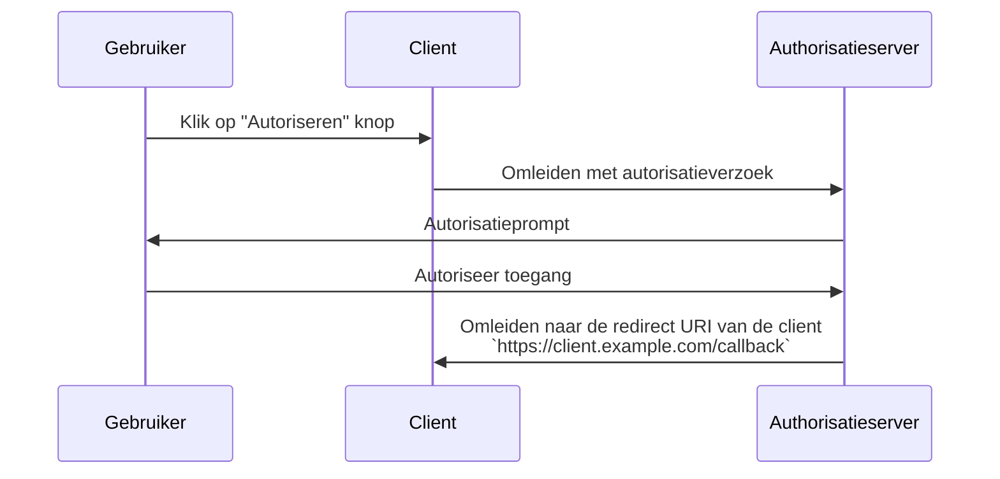

## Wat is een redirect URI?

Een redirect URI (ook bekend als een callback URL of redirect URL) is een URI om aan te geven waar de <Ref slug="authorization-server" /> de user-agent (gebruikersagent) naartoe moet leiden nadat de <Ref slug="authorization-request" /> is voltooid.

> Universal Resource Identifier (URI) wordt vaak verward met URL (Uniform Resource Locator). Voor meer informatie, bekijk [Unveiling URI, URL, and URN](https://blog.logto.io/unveiling-uri-url-and-urn).

Laten we een voorbeeld bekijken van een authorization request (autorisatieverzoek) dat een redirect URI bevat:

```http
GET /authorize?response_type=code
  &client_id=YOUR_CLIENT_ID
  &redirect_uri=https%3A%2F%2Fclient.example.com%2Fcallback
  &scope=openid%20profile%20email
  &state=abc123
  &nonce=123456 HTTP/1.1
```

In dit voorbeeld is de ruwe waarde van de `redirect_uri` parameter `https%3A%2F%2Fclient.example.com%2Fcallback`, wat URL-gecodeerd is. De daadwerkelijke waarde is `https://client.example.com/callback`.

## Hoe werkt een redirect URI?

> Binnen de context van <Ref slug="openid-connect" /> is de workflow voor OAuth 2.0's <Ref slug="authorization-request" /> en <Ref slug="authorization-server" /> vergelijkbaar. De redirect URI functioneert op dezelfde manier als in OAuth 2.0, voor zowel <Ref slug="authentication-request" /> als <Ref slug="openid-connect" headingId="openid-provider-op" />.

Stel dat de <Ref slug="client" /> het authorization request (autorisatieverzoek) initieert vanaf de URL `https://client.example.com`. Nadat de gebruiker het autorisatieproces heeft voltooid, zal de authorization server de user-agent (browser) terugleiden naar `https://client.example.com/callback`.



Het is duidelijk dat de redirect URI essentieel is voor de authorization server om de user-agent terug te leiden wanneer het autorisatieproces is voltooid. Bovendien wordt de redirect URI ook gebruikt om de authorization code (autorisatiecode) of tokens te ontvangen, afhankelijk van de flow.

Hier is een niet-normatief voorbeeld van hoe de daadwerkelijke redirect in een <Ref slug="authorization-code-flow" /> er uit zou kunnen zien:

```http
HTTP/1.1 302 Found
Location: https://client.example.com/callback?code=AUTHORIZATION_CODE&state=abc123
```

Merk op dat de URL-parameters `code` en `state`, die door de authorization server worden toegevoegd, zijn opgenomen in de redirect URI. De client moet de `code` en `state` parameters uit de URL halen om het autorisatieproces voort te zetten.

## Waarom hebben we een redirect URI nodig?

Zoals we in het bovenstaande voorbeeld kunnen zien, moet de authorization server weten waarheen om te leiden na een succesvolle authorization request (autorisatieverzoek). Dit is vooral nuttig wanneer er meerdere clients zijn (bijv. <Ref slug="single-sign-on" />), en elke client een andere redirect URI heeft.

Met <Ref slug="authorization-code-flow" /> wordt de redirect URI ook gebruikt om de authorization code (autorisatiecode) terug te sturen naar de client, in plaats van het front-channel (browser) te gebruiken om te voorkomen dat de tokens worden blootgesteld aan mogelijke aanvallen.

Voorheen was het mogelijk om de [Resource Owner Password Credentials (ROPC) grant](https://datatracker.ietf.org/doc/html/rfc6749#section-4.3) te gebruiken om tokens voor de gebruiker te verkrijgen zonder een redirect URI. Echter, het is afgeschaft in <Ref slug="oauth-2.1" /> vanwege beveiligingsredenen.

## Beveiligingsoverwegingen

De redirect URI is een cruciaal parameter en is een algemeen doelwit voor aanvallers. Hier zijn enkele beveiligingsoverwegingen om in gedachten te houden:

- **Witte lijst van redirect URIs**: De client zou alleen redirect URIs moeten accepteren die zijn geregistreerd bij de authorization server. Dit voorkomt dat aanvallers gebruikers naar kwaadaardige sites omleiden.
- **Gebruik HTTPS**: Gebruik altijd HTTPS voor de redirect URI om de communicatie tussen de client en de authorization server te beveiligen.
- **Exacte overeenkomst**: De redirect URI moet exact overeenkomen met de geregistreerde URI. Authorisatieservers kunnen strikte overeenkomstrichtlijnen afdwingen die brede overeenkomstpatronen niet toestaan.
- **State parameter**: Gebruik de `state` parameter om <Ref slug="csrf" /> aanvallen te voorkomen. De client moet de `state` parameter valideren om ervoor te zorgen dat deze overeenkomt met de waarde die in het authorization request (autorisatieverzoek) is verzonden.

<SeeAlso slugs={["csrf", "oauth-2.1", "authorization-code-flow"]} />

<Resources
  urls={[
    "https://blog.logto.io/oauth-2-1",
    "https://blog.logto.io/csrf",
    "https://blog.logto.io/redirect-uri-in-authorization-code-flow",
  ]}
/>
