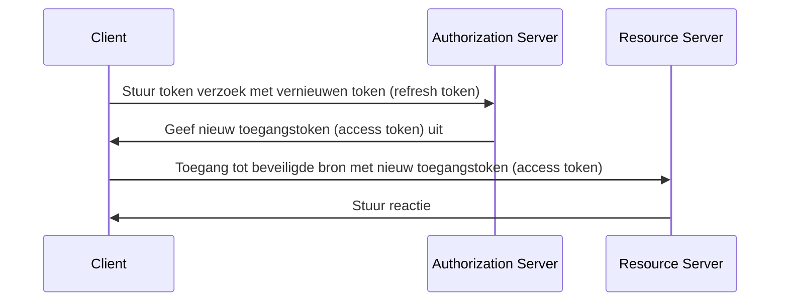

## Wat is een vernieuwen token (refresh token)?

Een vernieuwen token (refresh token) is een langlevende referentie, meestal een willekeurige reeks tekens, die wordt gebruikt om nieuwe <Ref slug="access-token">toegangstokens (access tokens)</Ref> te verkrijgen zonder dat de gebruiker zich opnieuw hoeft te authenticeren. In de context van OAuth 2.0 en OpenID Connect (OIDC) kunnen <Ref slug="authorization-server">autorisatieservers</Ref> vernieuwen tokens (refresh tokens) afgeven aan clients (applicaties) wanneer de client om <Ref slug="offline-access" /> vraagt.

Hoewel de [OAuth 2.0 RFC](https://datatracker.ietf.org/doc/html/rfc6749#section-1.5) de levenscyclus van een vernieuwen token (refresh token) in hoge mate definieert, kunnen de implementatiedetails verschillen tussen autorisatieservers en clients. We zullen deze in de volgende secties verkennen.

## Hoe werkt een vernieuwen token (refresh token)?

Een vernieuwen token (refresh token) wordt meestal uitgegeven samen met een toegangstoken (access token) wanneer de client om <Ref slug="offline-access" /> vraagt. De industrienorm om offline toegang aan te vragen is het opnemen van de `offline_access` scope in de <Ref slug="authorization-request" />, terwijl <Ref slug="openid-connect" /> officieel de `offline_access` scope definieert voor dit doel (beschikbaar in de <Ref slug="authentication-request" />).

Hier is een niet-normatief voorbeeld van een autorisatieverzoek dat de `offline_access` scope bevat:

```http
GET /authorize?response_type=code
  &client_id=YOUR_CLIENT_ID
  &redirect_uri=https%3A%2F%2Fclient.example.com%2Fcallback
  &scope=openid%20profile%20email%20offline_access
  &state=abc123
  &nonce=123456 HTTP/1.1
```

Zodra de client het vernieuwen token (refresh token) ontvangt, kan het dit gebruiken om nieuwe toegangstokens aan te vragen wanneer het huidige toegangstoken (access token) verloopt. Hier is een vereenvoudigd voorbeeld van het gebruik van een vernieuwen token (refresh token):



Zoals het sequentiediagram laat zien, moet het gebruik van een vernieuwen token (refresh token) worden ondersteund door zowel de client als de autorisatieserver:

- De client moet het vernieuwen token (refresh token) veilig opslaan en het gebruiken in het <Ref slug="token-request" /> om een nieuw toegangstoken (access token) te verkrijgen.
- De autorisatieserver moet het vernieuwen token (refresh token) valideren en een nieuw toegangstoken (access token) uitgeven wanneer de client een geldig vernieuwen token (refresh token) presenteert.

Het vernieuwen token (refresh token) is niet bedoeld om te worden gedeeld met de <Ref slug="resource-server" />. Toegangstokens (access tokens) zijn de enige tokens die de resource server moet controleren voor autorisatie.

Hier is een niet-normatief voorbeeld van een token verzoek met een vernieuwen token (refresh token):

```http
POST /token HTTP/1.1
Host: your-authorization-server.com
Content-Type: application/x-www-form-urlencoded

grant_type=refresh_token
  &refresh_token=YOUR_REFRESH_TOKEN
  &client_id=YOUR_CLIENT_ID
  &client_secret=YOUR_CLIENT_SECRET
  &scope=openid%20profile%20email
```

## Overwegingen voor beveiliging ||security-considerations||

Aangezien vernieuwen tokens (refresh tokens) langlevend zijn (bijvoorbeeld dagen, weken) en kunnen worden gebruikt om nieuwe toegangstokens (access tokens) te verkrijgen zonder gebruikersinteractie, vormen ze een hoger beveiligingsrisico dan toegangstokens (bijvoorbeeld minuten, uren). Het gebruik van vernieuwen tokens (refresh tokens) moet zorgvuldig worden overwogen en geïmplementeerd om potentiële beveiligingsrisico's te beperken. Hier zijn enkele beste praktijken om te overwegen:

### Veilige opslag

Bewaar vernieuwen tokens (refresh tokens) veilig aan clientzijde om ongeautoriseerde toegang te voorkomen. Dergelijke opslagmechanismen omvatten:

- **HTTP-only cookies**: Bewaar tokens in HTTP-only cookies om te voorkomen dat client-side JavaScript er toegang tot heeft.
- **Versleutelde opslag**: Gebruik beveiligde opslag zoals Keychain (iOS) of KeyStore (Android) op mobiele apparaten of versleutelde databases in webapplicaties.

### Vernieuwen token rotatie ||refresh-token-rotation||

Hoewel vernieuwen tokens (refresh tokens) langlevend kunnen zijn, kan het periodiek roteren ervan of op basis van bepaalde voorwaarden (bijvoorbeeld na een succesvolle tokenuitwisseling) het risico op ongeautoriseerde toegang aanzienlijk verminderen. De exacte rotatiestrategie kan variëren op basis van de beveiligingseisen van de applicatie en de mogelijkheden van de autorisatieserver.

Hier zijn twee veelvoorkomende tokenrotatiestrategieën:

- **Tijdgebaseerde rotatie**: Roteer vernieuwen tokens (refresh tokens) na een bepaalde periode (bijvoorbeeld elke 7 dagen).
- **Gebeurtenisgebaseerde rotatie**: Roteer vernieuwen tokens (refresh tokens) na specifieke gebeurtenissen (bijvoorbeeld succesvolle tokenuitwisseling, wachtwoordwijziging).

Wanneer een vernieuwen token (refresh token) wordt geroteerd, moet het vorige vernieuwen token (refresh token) ongeldig worden gemaakt om hergebruik ervan te voorkomen. Deze strategieën worden vaak gecombineerd met de sessie TTL (time-to-live) om ervoor te zorgen dat na een bepaalde tijd, ongeacht de geldigheid van het vernieuwen token (refresh token), de gebruiker opnieuw moet authenticeren.

### Zendergebonden vernieuwen tokens (Sender-constrained refresh tokens) ||sender-constrained-refresh-tokens||

Zendergebonden vernieuwen tokens (refresh tokens) zijn een beveiligingsmechanisme om het vernieuwen token (refresh token) te binden aan de client die het heeft aangevraagd, als de client geen <Ref slug="client" headingId="confidential-clients">vertrouwelijke client (confidential client)</Ref> is. Veelgebruikte methoden zijn [DPoP](https://datatracker.ietf.org/doc/html/rfc9449) en [mTLS](https://datatracker.ietf.org/doc/html/rfc8705).

### Type client

Het is een goede praktijk om het gebruik van vernieuwen tokens (refresh tokens) te beperken tot <Ref slug="client" headingId="confidential-clients">vertrouwelijke (private) clients</Ref>.

- Openbare clients (bijvoorbeeld single-page applicaties) stellen de broncode bloot aan de clientzijde, waardoor het voor aanvallers gemakkelijker wordt vernieuwen tokens (refresh tokens) te extraheren en te misbruiken. Gewoonlijk worden veiligere mechanismen zoals <Ref slug="pkce" /> en vernieuwen token rotatie gebruikt voor openbare clients als vernieuwen tokens (refresh tokens) noodzakelijk zijn om te gebruiken.
- Vertrouwelijke clients daarentegen draaien op een veilige serveromgeving waar de broncode en omgeving niet blootgesteld zijn aan de clientzijde. Vernieuwen tokens (refresh tokens) kunnen veiliger in dergelijke omgevingen worden gebruikt.

### Token intrekking (Token revocation)

Aangezien vernieuwen tokens (refresh tokens) meestal <Ref slug="opaque-token">ondoorzichtige tokens (opaque tokens)</Ref> zijn (d.w.z. geen betekenis voor de client) en moeten worden gevalideerd door de autorisatieserver, kan de autorisatieserver gemakkelijk tokenintrekkingsmechanismen implementeren om vernieuwen tokens (refresh tokens) indien nodig ongeldig te maken. Dit kan nuttig zijn in scenario's zoals gebruikersafmelding, compromittering van accounts of tokenmisbruik.

<SeeAlso slugs={["access-token", "id-token", "jwt", "opaque-token"]} />

<Resources urls={[
  "https://blog.logto.io/understanding-refresh-token-rotation",
  "https://blog.logto.io/understanding-tokens-in-oidc",
  {
    url: "https://openid.net/specs/openid-connect-core-1_0.html#OfflineAccess",
    result: {
      ogTitle: "Offline Access in OpenID Connect Core 1.0",
    }
  },
  {
    url: "https://datatracker.ietf.org/doc/html/rfc6749#section-1.5",
    result: {
      ogTitle: "Refresh Token in OAuth 2.0",
      ogDescription: "Refresh tokens zijn referenties die worden gebruikt om toegangstokens te verkrijgen."
    },
  },
]} />
