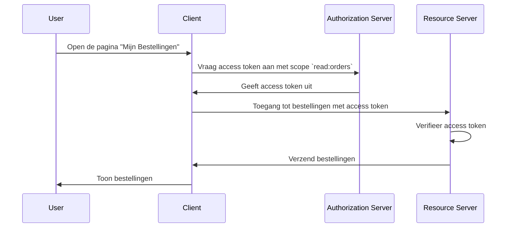

## Wat is een resource server?

In de context van <Ref slug="oauth-2.0" />, is een **resource server** een server die de **beschermde bronnen** host die de <Ref slug="client" /> wil benaderen. De resource server is ook verantwoordelijk voor het verifiëren van de <Ref slug="access-token" /> en het leveren van de beschermde bronnen aan de client volgens de <Ref slug="access-control" />-beleid.

Neem bijvoorbeeld een webapplicatie MyApp die toegang wil tot de Google Drive van de gebruiker. In dit scenario:

- **MyApp** is de client die toegang wil tot de beschermde bronnen.
- **Google** is de resource server die de Google Drive van de gebruiker host.
- **Google** is ook de <Ref slug="authorization-server" /> die het access token uitgeeft aan MyApp.

Laten we een ander voorbeeld bekijken waarbij een e-commercewebsite toegang wil tot de bestelgeschiedenis van een gebruiker van een interne bestellingsdienst. In dit geval:

- **E-commercewebsite** is de client die toegang wil tot de beschermde bronnen.
- **Bestellingsdienst** is de resource server die de bestelgeschiedenis van de gebruiker host.
- Als de e-commercewebsite integreert met een OAuth 2.0-service of OpenID-provider, fungeert die service (provider) als de authorization server.

## Hoe werkt een resource server?

OAuth 2.0 definieert de rollen van de resource server en de authorization server afzonderlijk om een duidelijke scheiding van verantwoordelijkheden te bieden. Echter, het definieert geen specifieke voorstelling van de resource server binnen het framework, waarbij het wordt verwezen als een virtueel concept dat de beschermde bronnen host; de <Ref slug="client" /> moet <Ref slug="scope">scopes</Ref> specificeren voor de beschermde bronnen die het wil benaderen.

Stel dat de client toegang wil tot de bestelgeschiedenis van de gebruiker bij de bestellingsdienst. Een niet-normatief voorbeeld van het verzenden van een <Ref slug="token-request" /> om toegang te krijgen tot de bestellingen kan er als volgt uitzien:



In het bovenstaande sequentiediagram vraagt de client een access token aan met de `read:orders` scope van de authorization server. We veronderstellen dat alle partijen het eens zijn over de betekenis van de `read:orders` scope: het specificeert dat de client `lees`-acties wil uitvoeren op de `bestellingen` geleverd door de resource server. De client gebruikt vervolgens het access token om toegang te krijgen tot de bestellingen van de resource server.

> [!Notitie]
> De betekenis en structuur van scopes worden niet gedefinieerd door OAuth 2.0 en moeten worden overeengekomen door de client, authorization server en resource server.

De resource server is verantwoordelijk voor het verifiëren van het access token en het bepalen of de client de benodigde rechten heeft om toegang te krijgen tot de gevraagde bronnen volgens de <Ref slug="access-control" />-beleid. Afhankelijk van de implementatie kan het access token een <Ref slug="opaque-token" /> of een <Ref slug="jwt" /> zijn.

## Naamgevingsconventies

Het is flexibel om de resource server te benoemen volgens de context van de applicatie. Aangezien OAuth 2.0 geen specifieke voorstelling definieert van de resource server in de <Ref slug="scope" />-parameter, kun je meerdere conventies in de industrie zien:

- Het weglaten van de resource server-naam en alleen de actie gebruiken: Bijvoorbeeld, `read` en `write`.
- `[werkwoord]:[bron]`: Een veelgebruikte conventie is om de combinatie van `werkwoord` en `bron` te gebruiken om de acties te specificeren die de client op de bron kan uitvoeren. Bijvoorbeeld, `read:orders` en `write:profile`. Soms worden ze omgekeerd als `orders:read` en `profile:write`.
- `[uri]:[actie]`: Een andere conventie is om de URI van de bron en de actie die de client kan uitvoeren te gebruiken. Bijvoorbeeld, `https://api.example.com/orders:read` en `https://api.example.com/profile:write`.

## Resource-indicatoren

Laten we een voorbeeld bekijken van de scope-parameter in een <Ref slug="authentication-request" /> (gedecodeerd):

```plaintext
openid profile email https://api.example.com/orders:read
```

In dit voorbeeld omvat de `scope`-parameter de `openid`, `profile` en `email` scopes, die <Ref slug="openid-connect" />-standaards opzetten, samen met de `https://api.example.com/orders:read` scope die de locatie van de resource server en de toestemming om de bronnen te lezen specificeert.

Het ziet er prima uit in dit specifieke geval, maar naarmate het aantal bronnen en scopes toeneemt, kan het moeilijk worden om de scopes te beheren en te begrijpen. Om dit probleem aan te pakken, introduceerde OAuth 2.0 een uitbreiding genaamd <Ref slug="resource-indicator">resource indicatoren</Ref> (RFC 8707) die clients in staat stelt om URI's te gebruiken om de bronnen die ze willen benaderen te specificeren, waardoor resource servers explicieter worden in het proces.

Na een resource-indicatorparameter toe te voegen aan de authentication request (`resource=https://api.example.com/orders`), kan de scope-parameter worden vereenvoudigd tot:

```plaintext
openid profile email read
```

Wat er schoner uitziet en gemakkelijker te beheren is.

> [!Notitie]
> Niet alle authorization servers (OpenID-providers) ondersteunen de resource-indicatoruitbreiding. Controleer alstublieft de documentatie van je authorization server voordat je het gebruikt.

<SeeAlso slugs={["access-control", "resource-indicator", "resource-owner", "client"]} />

<Resources
  urls={[
    "https://datatracker.ietf.org/doc/html/rfc8707",
  ]}
/>