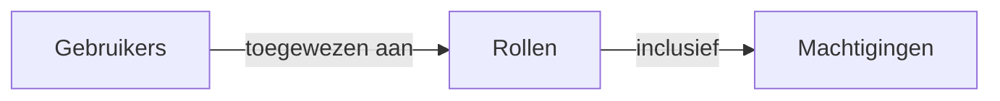

## Rol

Een rol is een van de kernelementen in <Ref slug="rbac" />. Het dient als een container voor machtigingen die aan gebruikers kunnen worden toegewezen en fungeert als een tussenpersoon tussen gebruikers en hun toegangsrechten.



Een typische rolstructuur bevat een naam en een set machtigingen:

```typescript
const role = {
  name: 'order_admin',
  permissions: [
    'read:orders',   // Bekijk bestelgegevens
    'write:orders',  // Bewerk bestellingen
    'read:products'  // Bekijk producten
  ]
}
```

> [!Opmerking]
> Rollen worden voornamelijk gebruikt voor machtigingsbeheer. Voor de implementatie van toegangscontrole wordt aanbevolen om machtigingen direct te controleren in plaats van rollen. Zie <Ref slug="rbac" /> voor meer informatie.

<SeeAlso slugs={["rbac", "authorization", "access-control"]} />