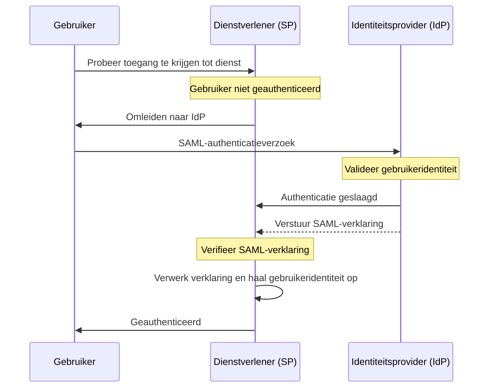

## Wat is SAML?

SAML (vaak aangeduid als SAML 2.0) is een op XML gebaseerde standaard voor het uitwisselen van authenticatie (authenticatie) en autorisatie (autorisatie) gegevens tussen twee partijen: de <Ref slug="identity-provider" /> en de <Ref slug="service-provider" />. Het wordt veel gebruikt voor identity federation en <Ref slug="enterprise-sso" /> oplossingen.

Zoals de naam al suggereert, brengt SAML verklaringen over de identiteit en attributen van de gebruiker over. Deze verklaringen worden digitaal ondertekend en optioneel versleuteld om hun integriteit en vertrouwelijkheid te waarborgen.

## Hoe werkt SAML?

Voordat we in de SAML-authenticatiestroom duiken, moeten we begrijpen hoe identity providers (identiteitsproviders) en service providers (dienstverleners) elkaar kunnen herkennen en vertrouwen. Dit vertrouwen wordt tot stand gebracht door middel van metadata-uitwisseling, waarbij beide partijen informatie delen over:

- **Entity ID**: Een unieke identificatie voor de identity provider of service provider.
- **Publieke sleutel**: Gebruikt voor het verifiëren van de digitale handtekeningen in SAML-verklaringen.
- **Endpoints**: URL's voor verschillende SAML-operaties, zoals authentication requests (authenticatieverzoeken) en responses (reacties).

Zodra het vertrouwen is gevestigd, kan de SAML-authenticatiestroom doorgaan:

### RelayState

In de SAML-stroom wordt de `RelayState` parameter gebruikt om de toestand van de gebruiker vast te houden gedurende het authenticatieproces. Het fungeert als een referentie naar het oorspronkelijke verzoek dat door de gebruiker is gedaan voordat hij werd omgeleid naar de identity provider (identiteitsprovider). De service provider (dienstverlener) kan deze parameter gebruiken om de gebruiker terug te leiden naar de oorspronkelijke pagina of bron na succesvolle authenticatie.

RelayState wordt ook gebruikt om <Ref slug="csrf" /> aanvallen te voorkomen door ervoor te zorgen dat de gebruiker na authenticatie naar de juiste pagina wordt teruggeleid.

### SAML-verklaringen

SAML-verklaringen zijn het kernonderdeel van het SAML-protocol. Ze bevatten informatie over de identiteit van de gebruiker, attributen en de authenticatiestatus. Er zijn drie soorten SAML-verklaringen:

- **Authenticatieverklaring**: Geeft aan dat de gebruiker is geauthenticeerd door de identity provider (identiteitsprovider).
- **Attribuutverklaring**: Bevat aanvullende informatie over de gebruiker, zoals rollen, rechten en profielgegevens.
- **Autorisatiebesluitverklaring**: Specificeert de toegangsrechten van de gebruiker tot specifieke bronnen.

## Overwegingen voor het aannemen van SAML

SAML is alom geaccepteerd in bedrijfsomgevingen sinds de introductie in het begin van de jaren 2000. Hier zijn enkele belangrijke overwegingen bij het adopteren van SAML voor jouw applicaties:

- Complexiteit: SAML-implementaties kunnen complex zijn bij het integreren met jouw applicaties, vooral vergeleken met moderne frameworks zoals <Ref slug="oauth-2.0" /> en <Ref slug="openid-connect" />.
- Transporteffectiviteit: SAML-berichten kunnen groot zijn door de XML-opmaak, wat van invloed kan zijn op de netwerkprestaties.
- Beveiliging: SAML-verklaringen moeten worden beschermd tegen manipulatie en afluisteren. Zorg ervoor dat jouw SAML-implementatie de beste praktijken volgt voor encryptie en digitale handtekeningen.

Ondanks deze overwegingen blijft SAML een robuuste en veelgebruikte standaard voor veilige identity federation en single sign-on oplossingen in bedrijfsomgevingen. Voor nieuwe applicaties of diensten wil je echter misschien moderne alternatieven zoals OAuth 2.0 en OpenID Connect overwegen voor een lichtere en gebruiksvriendelijke aanpak van authenticatie en autorisatie.

<SeeAlso slugs={["enterprise-sso", "oauth-2.0", "openid-connect"]} />

<Resources
  urls={[
    "https://blog.logto.io/saml-security-cheat-sheet",
    "https://blog.logto.io/picking-your-sso-method",
    "https://blog.logto.io/differences-between-saml-and-oidc",
  ]}
/>