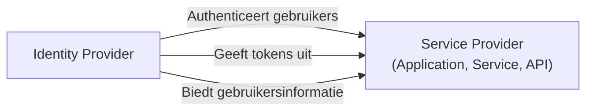

## Wat is een serviceprovider (SP)?

In het domein van <Ref slug="iam" /> is een serviceprovider (SP) (of een **relying party** in de context van <Ref slug="openid-connect" />) een applicatie of dienst die vertrouwt op een <Ref slug="identity-provider" /> voor authenticatie en autorisatie. Het is verantwoordelijk voor het leveren van diensten aan gebruikers en het handhaven van <Ref slug="access-control" /> beleid op basis van de tokens uitgegeven door de identity provider.

## Standaarden voor serviceproviders

Er is geen strikte standaard voor serviceproviders, aangezien ze elke soort applicatie of dienst kunnen zijn die identiteitsbeheer vereist. Serviceproviders volgen echter vaak de standaarden die zijn vastgesteld door de identity provider waarop ze vertrouwen. Bijvoorbeeld, als de identity provider <Ref slug="openid-connect" /> ondersteunt, zal de serviceprovider doorgaans OIDC gebruiken voor authenticatie en autorisatie.

## Architectuur van serviceproviders

De term "serviceprovider" specificeert geen bepaalde architectuur of implementatie. Meestal moeten serviceproviders geregistreerd zijn bij de identity provider om vertrouwen te vestigen en beveiligde communicatie mogelijk te maken. Het registratieproces omvat doorgaans het uitwisselen van metadata en client credentials.

In de context van OpenID Connect omvat de serviceprovider metadata bijvoorbeeld:

- **Client ID**: Een unieke identificator voor de serviceprovider.
- **Client secret**: Een gedeeld geheim dat wordt gebruikt om de serviceprovider te authenticeren.
- **<Ref slug="redirect-uri">Redirect URIs</Ref>**: De URI's waar de identity provider gebruikers na authenticatie en autorisatie naar terug zal leiden.

Zodra geregistreerd, kan de serviceprovider het <Ref slug="authentication" /> proces starten door gebruikers naar de door de identity provider opgegeven endpoint te sturen.

Wanneer serviceproviders gebouwd zijn voor niet-interactieve use cases, worden ze vaak aangeduid als <Ref slug="client">clients</Ref> die <Ref slug="machine-to-machine" /> communicatie vereisen.

<SeeAlso slugs={["identity-provider", "openid-connect", "oauth-2.0"]} />

<Resources
  urls={[
    "https://blog.logto.io/secure-cloud-apps-with-oauth-and-openid-connect",
    "https://blog.logto.io/incorporate-identity-solution",
    "https://blog.logto.io/centralized-identity-system"
  ]}
/>
