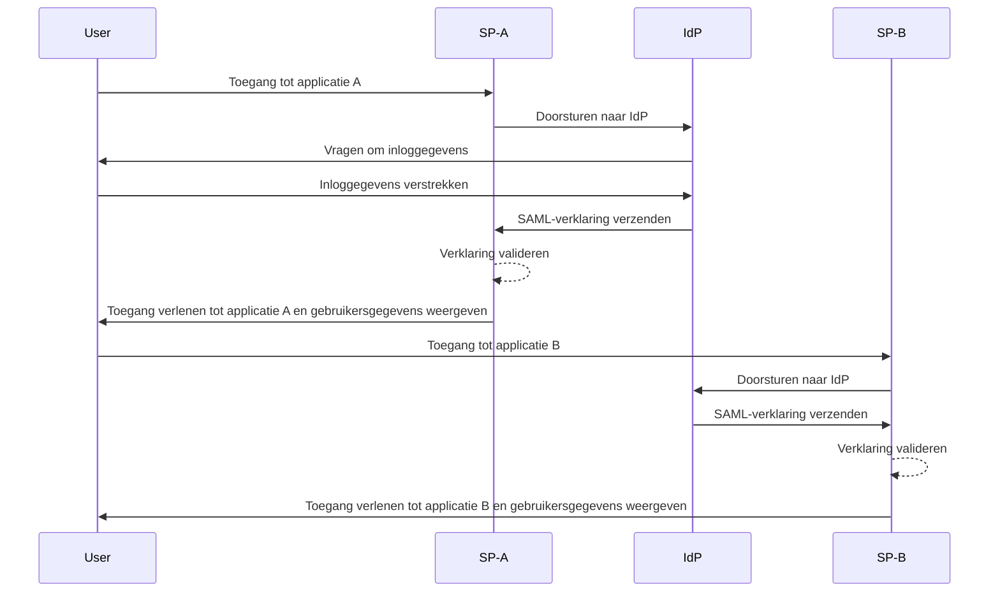
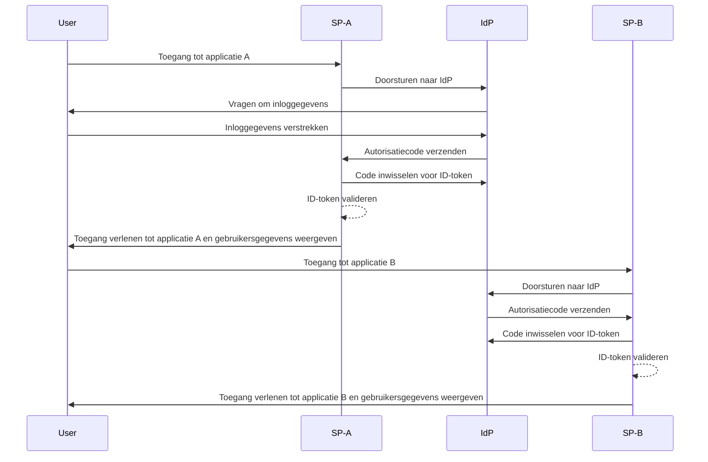

## Wat is single sign-on (SSO)?

Single sign-on (SSO) is een <Ref slug="authentication" />-methode die gebruikers in staat stelt om met één set inloggegevens toegang te krijgen tot meerdere applicaties of diensten. In plaats van afzonderlijke logins voor elk systeem te beheren, authenticeert de gebruiker zich eenmaal en wordt automatisch aangemeld bij alle verbonden platforms.

SSO wordt vaak gebruikt in zowel persoonlijke als zakelijke omgevingen, vooral in bedrijfsomgevingen waar werknemers of externe medewerkers afhankelijk zijn van verschillende SaaS-applicaties om hun werk te doen. Door SSO te implementeren, kunnen organisaties de beveiliging verbeteren, het toegangsbeheer stroomlijnen en de productiviteit van gebruikers verhogen.

Een bekend voorbeeld van SSO is de reeks diensten van Google, zoals Gmail, Google Drive en Google Agenda. Na inloggen op hun Google-account kunnen gebruikers eenvoudig toegang krijgen tot al deze diensten zonder hun inloggegevens opnieuw in te voeren.

## Hoe werkt single sign-on?

SSO opereert op basis van een vertrouwensrelatie tussen een applicatie of dienst, bekend als de <Ref slug="service-provider" /> en een <Ref slug="identity-provider" />. De IdP regelt de gebruikersauthenticatie en deelt veilig de benodigde informatie met de SP om toegang te verlenen. Dit vertrouwen wordt gevestigd via een proces genaamd federatie, waarbij zowel de SP als IdP overeenkomen over specifieke standaarden en protocollen om authenticatiegegevens veilig uit te wisselen.

Wanneer een gebruiker toegang probeert te krijgen tot een SSO-geactiveerde applicatie, leidt de SP hen door naar de IdP voor authenticatie. De IdP vraagt de gebruiker om hun inloggegevens, verifieert hun identiteit en genereert een beveiligingstoken of verklaring met de informatie van de gebruiker. Dit token wordt teruggestuurd naar de SP, die het vervolgens gebruikt om toegang te verlenen.

Als de gebruiker probeert toegang te krijgen tot een andere SSO-geactiveerde applicatie, wordt het proces automatisch herhaald zonder dat de gebruiker opnieuw hoeft in te loggen. De IdP stuurt de vereiste authenticatiegegevens rechtstreeks naar de SP, waardoor de gebruiker naadloos toegang heeft tot de nieuwe applicatie.

<Ref slug="saml" /> en <Ref slug="openid-connect" /> zijn twee veelgebruikte protocollen voor het implementeren van SSO. Deze standaarden definiëren hoe authenticatiegegevens worden uitgewisseld tussen de IdP en de SP, waardoor veilige en betrouwbare communicatie wordt gewaarborgd.

### SAML-gebaseerde SSO

Bij SAML-gebaseerde SSO, zodra de gebruiker is geauthenticeerd door de IdP, wordt er een XML-gebaseerde SAML-verklaring gegenereerd, ondertekend en veilig verzonden naar de SP. De SP valideert vervolgens de verklaring en verleent toegang op basis van de identiteit van de gebruiker.

### OIDC-gebaseerde SSO

OIDC daarentegen is gebouwd op <Ref slug="oauth-2.0" /> en biedt een modernere benadering van SSO. Het maakt gebruik van <Ref slug="jwt" /> om identiteitsinformatie tussen de IdP en SP uit te wisselen, wat zorgt voor verbeterde beveiliging en meer flexibiliteit.

## Voordelen van single sign-on

1. **Verbeterde beveiliging**: SSO vermindert het risico op wachtwoordgerelateerde beveiligingsinbreuken door het aantal inloggegevens dat gebruikers moeten onthouden te minimaliseren. Het stelt organisaties ook in staat om sterkere authenticatiemethoden, zoals <Ref slug="mfa" />, af te dwingen om gebruikersaccounts te beschermen.

2. **Verbeterde gebruikerservaring**: Gebruikers kunnen naadloos meerdere applicaties openen zonder telkens opnieuw in te loggen, wat de productiviteit verhoogt en frustraties vermindert. SSO vereenvoudigt het inlogproces en biedt een consistente gebruikerservaring over verschillende platforms.

3. **Gecentraliseerd toegangsbeheer**: Organisaties kunnen gebruikers toegang en machtigingen centraal beheren via de IdP, wat zorgt voor consistente beveiligingsbeleid en toegangscontroles over alle verbonden applicaties. Dit vereenvoudigt processen voor gebruikersprovisioning, deprovisioning en auditing.

## Wanneer single sign-on gebruiken

1. **Bedrijfs- en organisatorische omgevingen**: SSO is vooral nuttig voor bedrijven die afhankelijk zijn van meerdere applicaties en diensten om workflows te stroomlijnen. Het vereenvoudigt gebruikers toegang en vermindert de belasting voor IT-teams om individuele gebruikersaccounts te beheren. Bijvoorbeeld bedrijven die meerdere SaaS-applicaties gebruiken, zoals CRM, HR en samenwerkingshulpmiddelen.
2. **Applicaties voor klanten**: SSO kan ook de gebruikerservaring verbeteren voor klanten die toegang hebben tot online diensten of e-commerceplatforms. Bijvoorbeeld door gebruikers in staat te stellen in te loggen met hun sociale media-accounts of e-mailadressen in plaats van nieuwe accounts voor elke dienst aan te maken.
3. **Multiproductdiensten**: Bedrijven die een reeks onderling verbonden producten of diensten aanbieden, kunnen SSO benutten om een naadloze gebruikerservaring over hun aanbod te bieden. Gebruikers kunnen navigeren tussen verschillende applicaties zonder gedoe van herhaalde inlogprocedures. Bijvoorbeeld Google G Suite. Gebruikers kunnen eenmaal inloggen op hun Chrome-browser en toegang krijgen tot meerdere Google-diensten zonder hun inloggegevens opnieuw in te voeren.

Het gebruik van SSO is niet beperkt tot deze scenario's en kan worden aangepast aan verschillende use cases op basis van de specifieke behoeften van een organisatie of applicatie. Het wordt algemeen beschouwd als een best practice voor het verbeteren van beveiliging, gebruikerservaring en operationele efficiëntie in moderne digitale omgevingen.

<SeeAlso slugs={["enterprise-sso"]} />