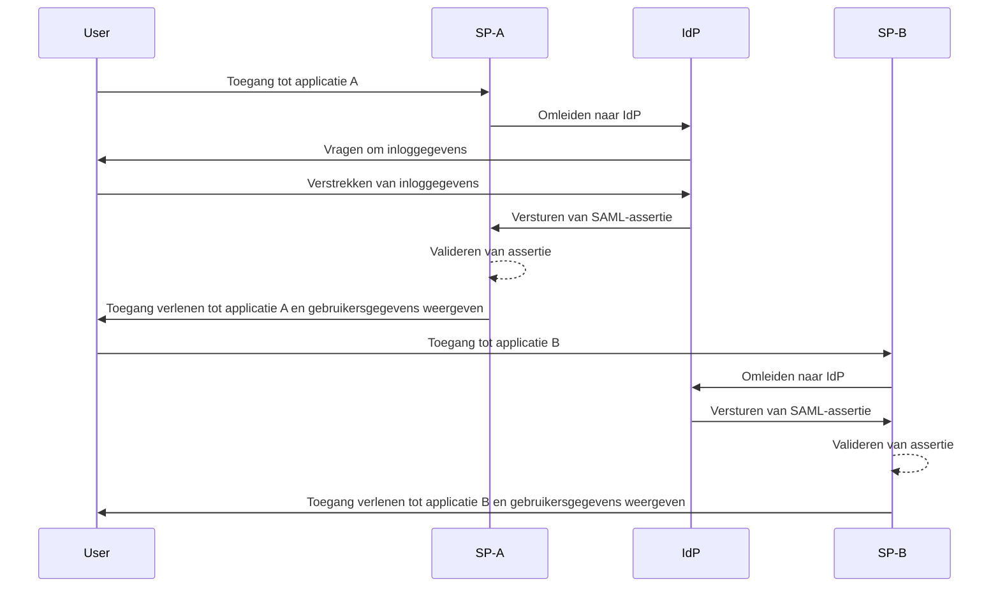
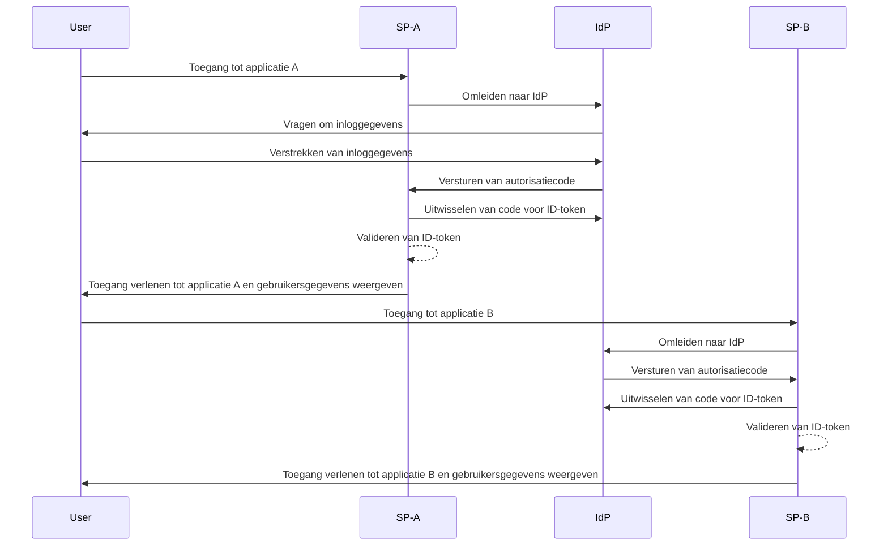

## Wat is single sign-on (SSO)?

Single sign-on (SSO) is een <Ref slug="authentication" /> methode waarmee gebruikers toegang hebben tot meerdere applicaties of diensten met één set inloggegevens. In plaats van aparte logins voor elk systeem te beheren, authenticeert de gebruiker zich één keer en wordt automatisch aangemeld bij alle verbonden platforms.

SSO wordt vaak gebruikt in zowel persoonlijke als zakelijke omgevingen, vooral in bedrijfsomgevingen waar werknemers of externe medewerkers afhankelijk zijn van verschillende SaaS-applicaties om hun werk te doen. Door SSO te implementeren, kunnen organisaties de beveiliging verbeteren, het toegangsbeheer stroomlijnen en de productiviteit van gebruikers verhogen.

Een bekend voorbeeld van SSO is de suite van diensten van Google, zoals Gmail, Google Drive en Google Agenda. Nadat gebruikers zich hebben aangemeld bij hun Google-account, kunnen ze eenvoudig toegang krijgen tot al deze diensten zonder hun inloggegevens opnieuw in te voeren.

## Hoe werkt single sign-on?

SSO vertrouwt op een vertrouwensrelatie tussen een applicatie of dienst, bekend als de <Ref slug="service-provider" />, en een <Ref slug="identity-provider" />. De IdP verzorgt de gebruikersauthenticatie en deelt de benodigde informatie veilig met de SP om toegang te verlenen. Dit vertrouwen wordt gevestigd via een proces genaamd federatie, waarbij de SP en IdP overeenkomen over specifieke standaarden en protocollen voor het veilig uitwisselen van authenticatiegegevens.

Wanneer een gebruiker probeert toegang te krijgen tot een SSO-ingeschakelde applicatie, wordt hij door de SP doorgestuurd naar de IdP voor authenticatie. De IdP vraagt de gebruiker om inloggegevens te verstrekken, verifieert hun identiteit en stelt een geauthenticeerde sessie in zijn systeem vast. Deze sessie wordt meestal onderhouden met behulp van een sessiecookie die veilig is opgeslagen onder het domein van de IdP.

Zodra de gebruiker is geauthenticeerd, genereert de IdP een beveiligingstoken of -assertie met de gebruikersinformatie die is goedgekeurd om te worden gedeeld met de SP. Dit token of deze assertie wordt veilig teruggestuurd naar de SP, die het valideert en de gebruiker toegang verleent.

Als de gebruiker toegang krijgt tot een andere SSO-ingeschakelde applicatie, verloopt het proces soepel zonder dat extra logins nodig zijn. Dit gemak wordt mogelijk gemaakt door de gebruikersauthenticatiesessie die door de IdP wordt onderhouden, waardoor de IdP automatisch de identiteit van de gebruiker kan verifiëren en een nieuw beveiligingstoken kan uitgeven zonder opnieuw om inloggegevens te vragen.

Protocollen zoals <Ref slug="saml" /> en <Ref slug="openid-connect" /> worden veel gebruikt om SSO te implementeren. Deze standaarden definiëren hoe authenticatiegegevens veilig worden uitgewisseld tussen de IdP en SP, waardoor betrouwbare en veilige communicatie wordt gegarandeerd terwijl de naadloze ervaring van de gebruiker over applicaties behouden blijft.

### SAML-gebaseerde SSO

In SAML-gebaseerde SSO, zodra de gebruiker is geauthenticeerd door de IdP, wordt een XML-gebaseerde SAML-assertie gegenereerd, ondertekend en veilig naar de SP gestuurd. De SP valideert vervolgens de assertie en verleent toegang op basis van de identiteit van de gebruiker.

### OIDC-gebaseerde SSO

OIDC daarentegen is gebouwd bovenop <Ref slug="oauth-2.0" /> en biedt een modernere benadering van SSO. Het gebruikt <Ref slug="jwt" /> om identiteitsinformatie uit te wisselen tussen de IdP en SP, wat verbeterde beveiliging en grotere flexibiliteit biedt.

## Voordelen van single sign-on

1. **Verbeterde beveiliging**: SSO vermindert het risico op wachtwoordgerelateerde beveiligingsinbreuken door het aantal inloggegevens dat gebruikers moeten onthouden te minimaliseren. Het stelt organisaties ook in staat om sterkere authenticatiemethoden af te dwingen, zoals <Ref slug="mfa" />, om gebruikersaccounts te beschermen.

2. **Verbeterde gebruikerservaring**: Gebruikers kunnen naadloos toegang krijgen tot meerdere applicaties zonder telkens opnieuw in te loggen, wat de productiviteit verhoogt en frustratie vermindert. SSO vereenvoudigt het inlogproces en biedt een consistente gebruikerservaring op verschillende platforms.

3. **Gecentraliseerd toegangsbeheer**: Organisaties kunnen gebruikers toegang en permissies centraal beheren via de IdP, waardoor consistente beveiligingsbeleid en toegangscontroles worden gewaarborgd over alle verbonden applicaties. Dit vereenvoudigt gebruikersprovisioning, deprovisioning en auditprocessen.

## Wanneer single sign-on gebruiken

1. **Bedrijfs- en organisatorische omgevingen**: SSO is bijzonder voordelig voor bedrijven die afhankelijk zijn van meerdere applicaties en diensten om werkstromen te stroomlijnen. Het vereenvoudigt gebruikers toegang en vermindert de last voor IT-teams om individuele gebruikersaccounts te beheren. Bijvoorbeeld bedrijven die meerdere SaaS-applicaties gebruiken, zoals CRM, HR en samenwerkingstools.
2. **Klantenapplicaties**: SSO kan ook de gebruikerservaring verbeteren voor klanten die toegang hebben tot online diensten of e-commerceplatforms. Bijvoorbeeld door gebruikers in staat te stellen in te loggen met hun sociale media-accounts of e-mailadressen in plaats van nieuwe accounts aan te maken voor elke dienst.
3. **Multiproductdiensten**: Bedrijven die een suite van onderling verbonden producten of diensten aanbieden, kunnen SSO benutten om een naadloze gebruikerservaring te bieden over hun aanbod. Gebruikers kunnen navigeren tussen verschillende applicaties zonder het gedoe van herhaalde logins. Bijvoorbeeld G Suite van Google. Gebruikers kunnen zich één keer aanmelden in hun Chrome-browser en toegang krijgen tot meerdere Google-diensten zonder hun inloggegevens opnieuw in te voeren.

Het gebruik van SSO is niet beperkt tot deze scenario's en kan worden aangepast aan verschillende use cases op basis van de specifieke behoeften van een organisatie of applicatie. Het wordt algemeen beschouwd als een best practice voor het verbeteren van beveiliging, gebruikerservaring en operationele efficiëntie in moderne digitale omgevingen.

<SeeAlso slugs={["enterprise-sso"]} />