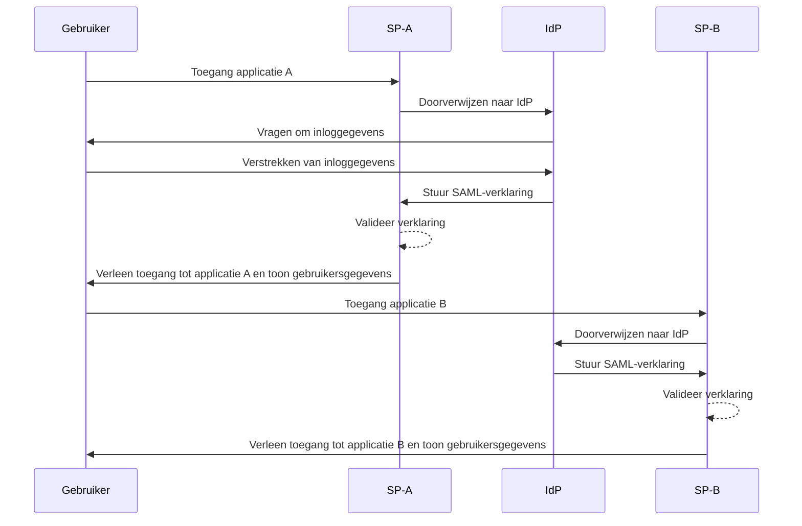
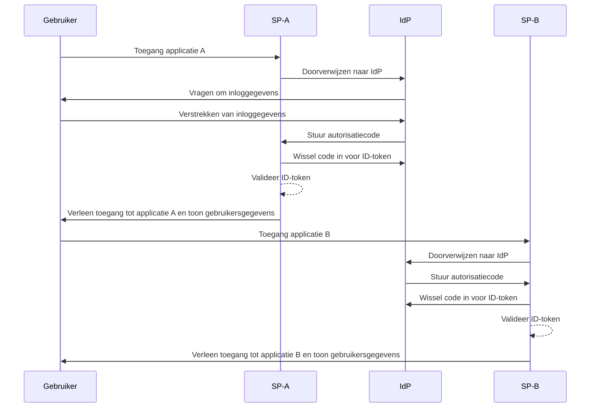

## Wat is single sign-on (SSO)?

Single sign-on (SSO) is een authenticatiemethode die gebruikers in staat stelt om met één set inloggegevens toegang te krijgen tot meerdere applicaties of diensten. In plaats van voor elk systeem afzonderlijke logins te beheren, authenticeert de gebruiker één keer en wordt automatisch ingelogd op alle gekoppelde platforms.

SSO wordt vaak gebruikt in zowel persoonlijke als zakelijke omgevingen, vooral in enterprise omgevingen waar werknemers of externe medewerkers afhankelijk zijn van verschillende SaaS applicaties om hun werk te doen. Door SSO te implementeren, kunnen organisaties de beveiliging verbeteren, toegang beheer stroomlijnen en de productiviteit van gebruikers verhogen.

Een bekend voorbeeld van SSO is de suite van diensten van Google, zoals Gmail, Google Drive en Google Calendar. Nadat gebruikers zijn ingelogd op hun Google-account, kunnen ze gemakkelijk toegang krijgen tot al deze diensten zonder hun inloggegevens opnieuw in te voeren.

## Hoe werkt single sign-on?

SSO werkt op basis van een vertrouwensrelatie tussen een applicatie of dienst, bekend als de <Ref slug="service-provider" /> en een <Ref slug="identity-provider" />. De IdP (identity provider) handelt de gebruikersauthenticatie af en deelt de benodigde informatie veilig met de SP (service provider) om toegang te verlenen. Dit vertrouwen wordt vastgesteld door een proces dat federatie wordt genoemd, waarbij zowel de SP als de IdP overeenstemming bereiken over specifieke standaarden en protocollen om authenticatiegegevens veilig uit te wisselen.

Wanneer een gebruiker probeert toegang te krijgen tot een SSO-ingeschakelde applicatie, verwijst de SP hen door naar de IdP voor authenticatie. De IdP vraagt de gebruiker om hun inloggegevens, verifieert hun identiteit en genereert een beveiligingstoken of -verklaring met de gebruikersinformatie. Dit token wordt teruggestuurd naar de SP, die het vervolgens gebruikt om toegang te verlenen.

Als de gebruiker probeert toegang te krijgen tot een andere SSO-ingeschakelde applicatie, wordt het proces automatisch herhaald zonder dat ze opnieuw hoeven in te loggen. De IdP stuurt de vereiste authenticatiegegevens rechtstreeks naar de SP, waardoor de gebruiker naadloos toegang krijgt tot de nieuwe applicatie.

SAML (Security Assertion Markup Language) en OIDC (OpenID Connect) zijn twee veelgebruikte protocollen voor de implementatie van SSO. Deze standaarden definiëren hoe authenticatiegegevens worden uitgewisseld tussen de IdP en de SP, wat zorgt voor veilige en betrouwbare communicatie.

### SAML-gebaseerde SSO

In SAML-gebaseerde SSO wordt, zodra de gebruiker is geauthenticeerd door de IdP, een op XML gebaseerde SAML-verklaring gegenereerd, ondertekend en veilig naar de SP gestuurd. De SP valideert vervolgens de verklaring en verleent toegang op basis van de identiteit van de gebruiker.

### OIDC-gebaseerde SSO

OIDC is daarentegen gebouwd op OAuth 2.0 en biedt een modernere benadering van SSO. Het maakt gebruik van JSON Web Tokens (JWT) om identiteitsinformatie uit te wisselen tussen de IdP en de SP, wat zorgt voor verbeterde beveiliging en grotere flexibiliteit.

## Voordelen van single sign-on

1. **Verbeterde beveiliging**: SSO vermindert het risico op wachtwoordgerelateerde beveiligingsinbreuken door het aantal inloggegevens dat gebruikers moeten onthouden, te minimaliseren. Het stelt organisaties ook in staat om sterkere authenticatiemethoden af te dwingen, zoals multi-factor authentication (MFA), om gebruikersaccounts te beschermen.

2. **Verbeterde gebruikerservaring**: Gebruikers kunnen naadloos toegang krijgen tot meerdere applicaties zonder telkens opnieuw in te loggen, waardoor de productiviteit wordt verhoogd en frustratie wordt verminderd. SSO vereenvoudigt het inlogproces en biedt een consistente gebruikerservaring op verschillende platforms.

3. **Gecentraliseerd toegang beheer**: Organisaties kunnen gebruikers toegang en rechten centraal beheren via de IdP, waardoor consistente beveiligingsbeleid en toegangscontroles worden gehandhaafd op alle gekoppelde applicaties. Dit vereenvoudigt gebruikersvoorziening, deprovisioning en auditprocessen.

## Wanneer single sign-on gebruiken

1. **Enterprise en organisatorische omgevingen**: SSO is vooral nuttig voor bedrijven die vertrouwen op meerdere applicaties en diensten om workflows te stroomlijnen. Het vereenvoudigt gebruikers toegang en vermindert de last voor IT-teams om individuele gebruikersaccounts te beheren. Bijvoorbeeld bedrijven die meerdere SaaS applicaties gebruiken, zoals CRM, HR en samenwerkingstools.
2. **Klantenplatformen**: SSO kan ook de gebruikerservaring verbeteren voor klanten die toegang hebben tot online diensten of e-commerceplatformen. Bijvoorbeeld door gebruikers te laten inloggen met hun sociale media-accounts of e-mailadressen in plaats van nieuwe accounts aan te maken voor elke dienst.
3. **Multi-product diensten**: Bedrijven die een suite van onderling verbonden producten of diensten aanbieden, kunnen gebruikmaken van SSO om een naadloze gebruikerservaring te bieden over hun aanbiedingen. Gebruikers kunnen navigeren tussen verschillende applicaties zonder het ongemak van herhaalde logins. Bijvoorbeeld, G Suite van Google. Gebruikers kunnen zich één keer aanmelden op hun Chrome-browser en toegang krijgen tot meerdere Google-diensten zonder hun inloggegevens opnieuw in te voeren.

Het gebruik van SSO is niet beperkt tot deze scenario's en kan worden aangepast aan verschillende use-cases op basis van de specifieke behoeften van een organisatie of applicatie. Het wordt algemeen beschouwd als een best practice voor het verbeteren van beveiliging, gebruikerservaring en operationele efficiëntie in moderne digitale omgevingen.

<SeeAlso slugs={['enterprise-sso']} />