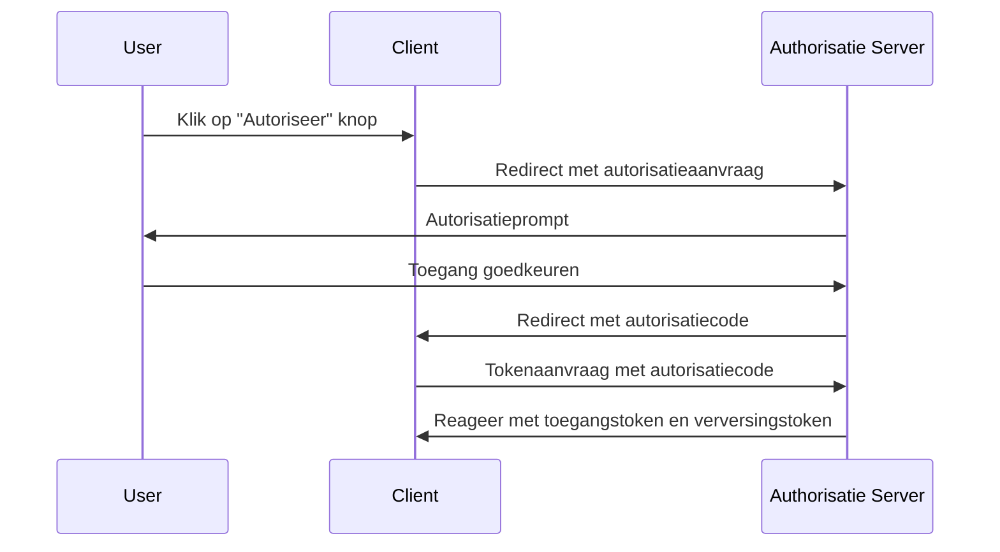
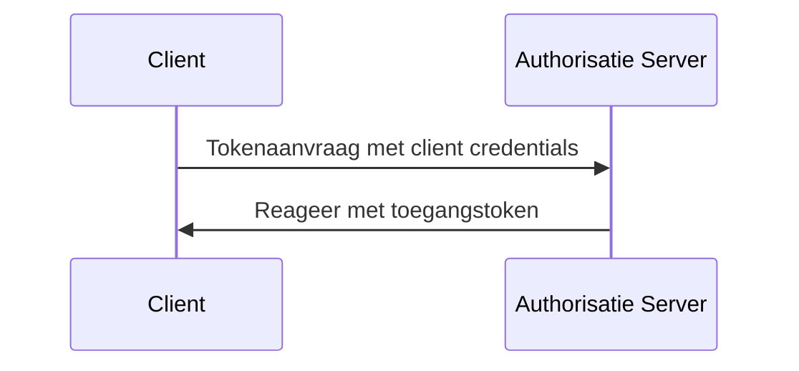

## Wat is een tokenaanvraag (token request)?

In <Ref slug="oauth-2.0" /> en <Ref slug="openid-connect" /> is een tokenaanvraag (token request) een aanvraag aan de <Ref slug="authorization-server" /> (of <Ref slug="openid-connect" headingId="openid-provider-op" /> in OIDC) voor het uitwisselen van inloggegevens (bijv. autorisatiecode, verversingstoken) voor een set tokens. De token set omvat doorgaans een of meer van de volgende:

- <Ref slug="access-token" />: Een token dat toegang verleent tot beschermde bronnen.
- <Ref slug="id-token" />: Een token dat gebruikersinformatie bevat (specifiek voor OIDC).
- <Ref slug="refresh-token" />: Een token dat kan worden gebruikt om een nieuw toegangstoken te verkrijgen zonder gebruikersinteractie.

Afhankelijk van het gebruikte <Ref slug="oauth-2.0-grant">verleen type (grant type)</Ref>, kan de aanvraag verschillende parameters bevatten en verschillende tokens retourneren.

Bijvoorbeeld, in de <Ref slug="client-credentials-flow" /> vraagt de <Ref slug="client" /> direct een <Ref slug="access-token" /> aan met client credentials. Hier is een niet-normatief voorbeeld van de tokenaanvraag:

```http
POST /token HTTP/1.1
Host: authorization-server.example.com
Content-Type: application/x-www-form-urlencoded

grant_type=client_credentials
  &client_id=client-id
  &client_secret=client-secret
  &scope=read
```

Als de aanvraag succesvol is, reageert de autorisatieserver met een toegangstoken (access token):

```http
HTTP/1.1 200 OK
Content-Type: application/json

{
  "access_token": "eyJhbGci...zHg",
  "token_type": "Bearer",
  "expires_in": 3600,
  "scope": "read"
}
```

## Hoe werkt een tokenaanvraag (token request)?

Zoals het bovenstaande voorbeeld laat zien, is de tokenaanvraag op zich eenvoudig. De client stuurt een HTTP-aanvraag naar het token-uiteinde van de autorisatieserver met de nodige parameters. De autorisatieserver valideert de aanvraag, verwerkt deze en retourneert de tokens in de reactie.

Echter, volgens het specifieke verleentype (flow) dat wordt gebruikt, kan de tokenaanvraag meer voorbereiding vereisen.

### Autorisatiecode flow (Authorization code flow)

In de <Ref slug="authorization-code-flow" /> verkrijgt de client eerst een autorisatiecode door een <Ref slug="authorization-request" /> (of <Ref slug="authentication-request" /> in OIDC) te initiëren met de autorisatieserver. Zodra de gebruiker toestemming verleent, wisselt de client de autorisatiecode uit voor een toegangstoken en optioneel een verversingstoken via de tokenaanvraag.

Hier is een vereenvoudigd sequentiediagram van de autorisatiecode flow:



### Client credentials flow

Zoals het voorbeeld in de eerste sectie laat zien, is de <Ref slug="client-credentials-flow" /> veel eenvoudiger. De client vraagt direct een toegangstoken aan met zijn client credentials. De autorisatieserver valideert de client credentials en geeft een toegangstoken uit indien succesvol.

Hier is een niet-normatief sequentiediagram van de client credentials flow:



### Verversingstoken (Refresh token)

In sommige verleentypes kan de client ook <Ref slug="offline-access" /> aanvragen door de `offline_access` scope op te nemen in de autorisatieaanvraag. Indien verleend, geeft de autorisatieserver een verversingstoken uit samen met het toegangstoken. De client kan het verversingstoken gebruiken om een nieuw toegangstoken te verkrijgen via de tokenaanvraag zonder gebruikersinteractie.

Hier is een niet-normatief voorbeeld van het gebruik van een verversingstoken om een nieuw toegangstoken te verkrijgen:

```http
POST /token HTTP/1.1
Host: authorization-server.example.com
Content-Type: application/x-www-form-urlencoded

grant_type=refresh_token
  &refresh_token=refresh-token
  &client_id=client-id
  &client_secret=client-secret
```

---

Andere <Ref slug="oauth-2.0-grant">verleentypes</Ref> kunnen ook tokenaanvragen omvatten, maar het basisidee blijft hetzelfde.

## Belangrijke parameters in een tokenaanvraag

Hier zijn enkele belangrijke parameters die vaak worden gebruikt in een tokenaanvraag:

- **`grant_type`**: Het type verleent dat wordt aangevraagd. Veelvoorkomende waarden zijn `authorization_code`, `client_credentials`, `refresh_token`, enz.
- **`client_id`**: De client identificatie uitgegeven door de autorisatieserver.
- **`client_secret`**: Het client geheim uitgegeven door de autorisatieserver (voor vertrouwelijke clients).
- **`code`**: De autorisatiecode verkregen van de autorisatieserver (voor de autorisatiecode flow).
- **`refresh_token`**: Het verversingstoken verkregen van de autorisatieserver (voor het verversen van toegangstokens).
- **`scope`**: De gevraagde <Ref slug="scope">scopes</Ref> (permissies) voor het toegangstoken.
- **`redirect_uri`**: De URI waar de autorisatieserver de respons naar stuurt (voor de autorisatiecode flow).
- **`code_verifier`**: De code verifier gebruikt in de <Ref slug="pkce" /> extensie (voor de autorisatiecode flow).

De daadwerkelijke parameters en hun waarden hangen af van het verleentype en de specifieke vereisten van de applicatie. Voordat je een tokenaanvraag doet, moet je de volledige lijst met parameters raadplegen voor het specifieke verleentype dat je gebruikt.

<SeeAlso slugs={["oauth-2.0", "openid-connect", "authorization-request", "authentication-request"]} />