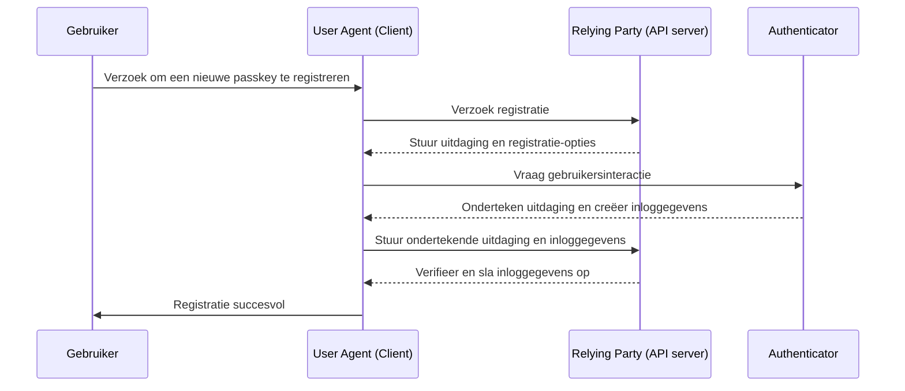
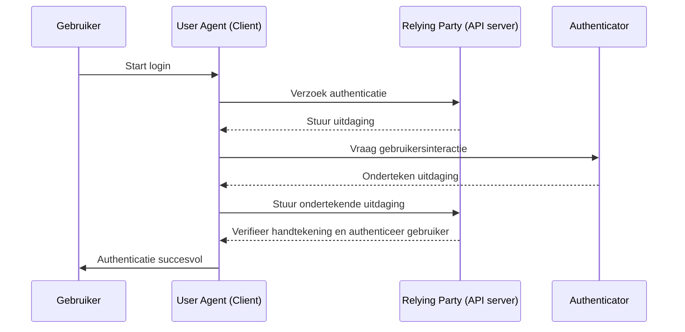

## Wat is WebAuthn?

WebAuthn (Web Authentication API), ontwikkeld door de [W3C](https://www.w3.org/) en de [FIDO Alliance](https://fidoalliance.org/), is een specificatie voor veilige webauthenticatie met behulp van FIDO2-standaarden. WebAuthn biedt een API waarmee websites <Ref slug="passkey" /> kunnen implementeren, die phishing-bestendige inloggegevens zijn beveiligd door publieke sleutelcryptografie. Passkeys kunnen wachtwoorden vervangen voor zowel wachtwoordloze logins als <Ref slug="mfa" />.

## Hoe ziet de WebAuthn workflow eruit?

Hier is een voorbeeld uit de praktijk om het beter te begrijpen. Je hebt een webapplicatie MyApp die de WebAuthn API wil integreren om Passkey te implementeren voor multi-factor authenticatie.

**Registratiefase:** Na het aanmelden met een e-mailverificatie en het instellen van een nieuw wachtwoord, wordt deze gebruiker gevraagd om een Passkey aan te maken. Ze kiezen ervoor om hun apparaat te koppelen met een vingerafdruk. Dit stelt de Passkey veilig in op hun apparaat.

**Authenticatiefase:** Bij de volgende aanmelding wordt de gebruiker gevraagd om hun Passkey te verifiëren na het invoeren van hun wachtwoord. Met slechts een snelle vingerafdrukscan kunnen ze eenvoudig het authenticatieproces voltooien.


Om een meer gedetailleerde uitleg te geven, kunnen we het proces verdelen in twee fasen: registratie en authenticatie. Eerst is het essentieel om de vier belangrijke entiteiten te begrijpen die betrokken zijn bij de WebAuthn flow.

### 4 belangrijke entiteiten

1. **Gebruiker:** De persoon die probeert toegang te krijgen tot een webapplicatie.
2. **User agent:** De webbrowser die de WebAuthn API-aanroepen afhandelt en het authenticatieproces beheert tussen de gebruiker, relying party en authenticator.
3. **Relying party:** De dienst, applicatie of API-server waartoe de gebruiker toegang zoekt.
4. **Authenticator:** De hardware- of softwarecomponent die wordt gebruikt om de identiteit van de gebruiker te verifiëren. Het kan verschillende vormen aannemen, afhankelijk van het platform of de browsermogelijkheden, zoals beveiligingssleutels (zoals Yubikeys), telefoons of tablets (verbonden via Bluetooth, NFC of USB), apparaat-gebaseerde biometrie of pincodes, enz.

### WebAuthn registratie

Asymmetrische publieke-sleutelcryptografie is het kernproces.

1. **Sleutelpaar generatie**: 
De user agent genereert een publiek-privaat sleutelpaar.
    - **Publieke sleutel**: Gedeeld met de relying party.
    - **Privésleutel**: Blijft veilig opgeslagen in de authenticator van de gebruiker.
2. **Registratie-uitdaging**: 
Wanneer de gebruiker probeert een passkey te registreren, stuurt de relying party een registratie-uitdaging naar de user agent.
3. **Gebruikersverificatie**: 
De user agent stuurt de uitdaging door naar de authenticator, die de gebruiker om verificatie vraagt (bijv. biometrische authenticatie of een hardwarebeveiligingssleutel).
4. **Cryptografische handtekening:** 
De authenticator gebruikt zijn privésleutel om de uitdaging te ondertekenen, waardoor een cryptografische handtekening ontstaat.
5. **Verificatie en toegang:** 
De user agent stuurt de ondertekende uitdaging terug naar de relying party, die de handtekening verifieert met behulp van de publieke sleutel en het registratieproces voltooit.



### WebAuthn authenticatie

1. **Authenticatie-uitdaging:**
Wanneer de gebruiker probeert in te loggen, stuurt de relying party een authenticatie-uitdaging naar de user agent.
2. **Gebruikersverificatie:**
De user agent stuurt de uitdaging naar de authenticator, die de gebruiker om verificatie vraagt (bijv. biometrische authenticatie of een hardwarebeveiligingssleutel).
3. **Cryptografische handtekening:**
De authenticator gebruikt zijn privésleutel om de uitdaging te ondertekenen, waardoor een cryptografische handtekening ontstaat.
4. **Verificatie en toegang:**
De user agent verifieert de handtekening met behulp van de publieke sleutel en informeert de relying party over een succesvolle authenticatie. Toegang wordt verleend als de verificatie succesvol is.



## Hoe gebruik je WebAuthn?

De WebAuthn API kan worden gebruikt om passkey inloggen of 2-staps verificatie te implementeren. Raadpleeg Passkey ervaring voor meer details.

Om de Web Authentication API (WebAuthn) te gebruiken voor veilige authenticatie, moet je twee hoofdprocessen afhandelen: registratie en authenticatie. Hier zijn eenvoudige codevoorbeelden van hoe je deze processen kunt implementeren met JavaScript.

**Registratie**

De relying party (jouw webapplicatie) start het registratieproces door de `navigator.credentials.create()` methode aan te roepen.

```jsx
// Registratie
navigator.credentials.create({
  publicKey: {
    rp: {
      name: "Your Relying Party Name",
      id: "your-relying-party-id"
    },
    user: {
      id: "user-id",
      displayName: "User Name",
      name: "User Name"
    },
    challenge: "your-challenge-value",
    timeout: 60000 // 60 seconden
  }
}).then(credential => {
  // Sla het id van de inloggegevens op voor toekomstige authenticatie
  localStorage.setItem("credentialId", credential.id);
}).catch(error => {
  console.error("Registratiefout:", error);
});
```

De relying party start het authenticatieproces door de `navigator.credentials.get()` methode aan te roepen.

```jsx
// Authenticatie
navigator.credentials.get({
  publicKey: {
    rp: {
      name: "Your Relying Party Name",
      id: "your-relying-party-id"
    },
    challenge: "your-challenge-value",
    timeout: 60000 // 60 seconden
  }
}).then(credential => {
  // Verifieer het id van de inloggegevens en andere eigenschappen
  if (credential.id === localStorage.getItem("credentialId")) {
    // Authenticatie succesvol
    console.log("Gebruiker succesvol geauthenticeerd");
  } else {
    console.error("Ongeldige inloggegevens");
  }
}).catch(error => {
  console.error("Authenticatiefout:", error);
});
```

Om de details te leren, lees de specificaties: https://fidoalliance.org/specifications/download/.

Opmerking: In WebAuthn-acties, of het nu gaat om registratie of authenticatie, is de "rp ID" (relying party ID) een verplicht veld. Het vertegenwoordigt de domeinnaam van de huidige webpagina. Als het niet overeenkomt met het huidige domein, zal de browser het verzoek afwijzen. Dit betekent dat passkeys gebonden zijn aan een specifiek domein en dat er momenteel geen manier is om bestaande passkeys naar een ander domein te migreren. Bovendien kunnen passkeys niet worden gebruikt over verschillende domeinen.

## WebAuthn en OpenID Connect (OIDC)

Door de sterke beveiliging van WebAuthn te combineren met het gestandaardiseerde identiteitsprotocol van OIDC, kunnen we een veiligere en gebruiksvriendelijkere authenticatie-ervaring creëren.

Leer hoe het werkt:

- **Registratiefase**: Gebruikers voltooien een standaard <Ref slug="openid-connect" /> registratieproces (bijv. e-mailverificatie en wachtwoordcreatie). WebAuthn genereert een publiek-privaat sleutelpaar, waarbij de publieke sleutel wordt opgeslagen bij de OIDC <Ref slug="identity-provider" /> en de privésleutel op het apparaat van de gebruiker blijft.
- **Authenticatiefase**: Gebruikers hebben toegang tot een OIDC-beschermde bron en worden doorgestuurd naar de inlogpagina. Na het verstrekken van basisgegevens (bijv. e-mail en wachtwoord), roept het systeem WebAuthn aan voor passkey authenticatie. Zodra de Passkey is geverifieerd, geeft OIDC een Access Token of ID Token uit voor gebruikers toegang.

## Wat is het verschil tussen WebAuthn en CTAP2?

**WebAuthn** en **CTAP2** zijn beide essentiële componenten van de FIDO2-standaard, maar ze dienen verschillende doeleinden:

- **CTAP2 (Client to Authenticator Protocol 2):** Dit protocol definieert hoe een apparaat, zoals een beveiligingssleutel of smartphone, communiceert met een webapplicatie. Het stelt een beveiligd kanaal in tussen de **authenticator** en het **apparaat van de gebruiker**, waardoor gevoelige authenticatiegegevens worden beschermd.
- **WebAuthn (Web Authentication API):** Deze API biedt een gestandaardiseerde manier voor webapplicaties om te communiceren met CTAP2-compatibele authenticators. Het handelt het authenticatieproces af, inclusief de uitwisseling van authenticatiegegevens tussen het **apparaat van de gebruiker** en de **relying party**.

<SeeAlso slugs={["passkey", "mfa", "openid-connect"]} />

<Resources
  urls={[
    "https://fidoalliance.org/specs/fido-v2.0-id-20180227/fido-client-to-authenticator-protocol-v2.0-id-20180227.html",
    "https://blog.logto.io/webauthn-nextjs",
    "https://blog.logto.io/webauthn-base-knowledge"
  ]}
/>