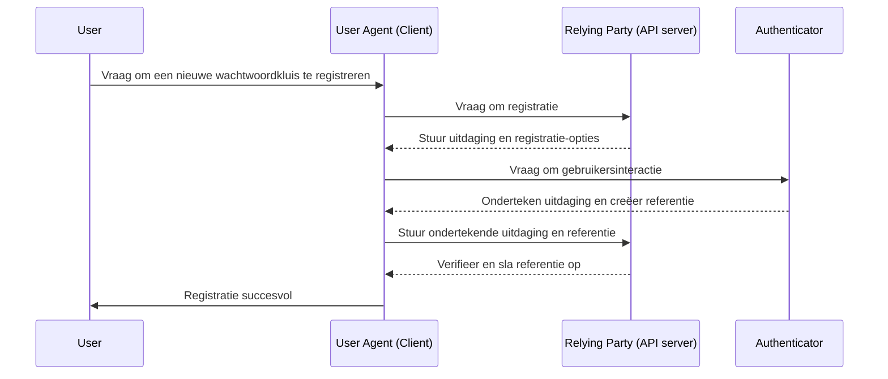
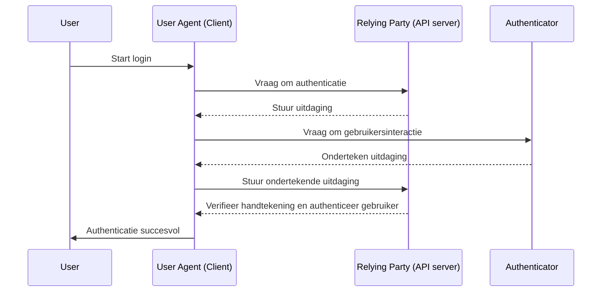

## Wat is WebAuthn?

WebAuthn (Web Authentication (Authenticatie) API), ontwikkeld door het [W3C](https://www.w3.org/) en [FIDO Alliance](https://fidoalliance.org/), is een specificatie voor veilige webauthenticatie met behulp van FIDO2-standaarden. WebAuthn biedt een API waarmee websites <Ref slug="passkey" /> kunnen implementeren, die phishingbestendige inloggegevens zijn beveiligd door openbare cryptografie van de openbare sleutel. Wachtwoordkluizen (Passkeys) kunnen wachtwoorden vervangen voor zowel wachtwoordloze inlogmethoden als multi-factor authenticatie (MFA).

## Hoe ziet de WebAuthn-werkstroom eruit?

Om een meer gedetailleerde uitleg te geven, kunnen we het proces verdelen in twee fasen: registratie en authenticatie. Ten eerste is het essentieel om de vier belangrijkste entiteiten die betrokken zijn bij de WebAuthn-flow te begrijpen.

### 4 belangrijkste entiteiten

1. **Gebruiker:** De persoon die probeert toegang te krijgen tot een webapplicatie.
2. **User agent:** De webbrowser die de WebAuthn API-aanroepen afhandelt en het authenticatieproces beheert tussen de gebruiker, relying party en authenticator.
3. **Relying party:** De service, applicatie of API-server waartoe de gebruiker toegang zoekt.
4. **Authenticator:** De hardware- of softwarecomponent die wordt gebruikt om de identiteit van de gebruiker te verifiëren. Dit kan verschillende vormen aannemen, afhankelijk van het platform of de mogelijkheden van de browser, zoals beveiligingssleutels (zoals Yubikeys), telefoons of tablets (verbonden via Bluetooth, NFC of USB), apparaatgebaseerde biometrie of PIN-codes, etc.

### WebAuthn-registratie

Asymmetrische cryptografie op basis van openbare sleutels is het kernproces.

1. **Sleutelpaar genereren:** 
De user agent genereert een publieke en private sleutel.
    - **Publieke sleutel:** Wordt gedeeld met de relying party.
    - **Private sleutel:** Blijft veilig opgeslagen in de authenticator van de gebruiker.
2. **Registratie-uitdaging:** 
Wanneer de gebruiker probeert een wachtwoordkluis te registreren, stuurt de relying party een registratie-uitdaging naar de user agent.
3. **Gebruikersverificatie:** 
De user agent stuurt de uitdaging naar de authenticator, die de gebruiker vraagt om verificatie (bijv. biometrische authenticatie of een hardwarebeveiligingssleutel).
4. **Cryptografische handtekening:** 
De authenticator gebruikt zijn private sleutel om de uitdaging te ondertekenen en creëert een cryptografische handtekening.
5. **Verificatie en toegang:** 
De user agent stuurt de ondertekende uitdaging terug naar de relying party, die de handtekening verifieert met de publieke sleutel en het registratieproces voltooit.



### WebAuthn-authenticatie

1. **Authenticatie-uitdaging:**
Wanneer de gebruiker probeert in te loggen, stuurt de relying party een authenticatie-uitdaging naar de user agent.
2. **Gebruikersverificatie:**
De user agent stuurt de uitdaging naar de authenticator, die de gebruiker vraagt om verificatie (bijv. biometrische authenticatie of een hardwarebeveiligingssleutel).
3. **Cryptografische handtekening:**
De authenticator gebruikt zijn private sleutel om de uitdaging te ondertekenen en creëert een cryptografische handtekening.
4. **Verificatie en toegang:**
De user agent verifieert de handtekening met de publieke sleutel en informeert de relying party over een succesvolle authenticatie. Toegang wordt verleend als de verificatie succesvol is.



## Hoe gebruik je WebAuthn?

WebAuthn API kan worden gebruikt om inloggen met wachtwoordkluizen of de tweestapsverificatie te implementeren. Raadpleeg Passkey experience voor meer details.

Om de Web Authentication (Authenticatie) API (WebAuthn) te gebruiken voor veilige authenticatie, moet je twee hoofdprocessen afhandelen: registratie en authenticatie. Hier zijn eenvoudige codevoorbeelden van hoe je deze processen zou kunnen implementeren met JavaScript.

**Registratie**

De relying party (jouw webapplicatie) start het registratieproces door de methode `navigator.credentials.create()` aan te roepen.

```jsx
// Registratie
navigator.credentials.create({
  publicKey: {
    rp: {
      name: "Je Relying Party Naam",
      id: "je-relying-party-id"
    },
    user: {
      id: "gebruiker-id",
      displayName: "Gebruiker Naam",
      name: "Gebruiker Naam"
    },
    challenge: "je-uitdaging-waarde",
    timeout: 60000 // 60 seconden
  }
}).then(credential => {
  // Sla de id van de referentie op voor toekomstige authenticatie
  localStorage.setItem("credentialId", credential.id);
}).catch(error => {
  console.error("Registratiefout:", error);
});
```

De relying party start het authenticatieproces door de methode `navigator.credentials.get()` aan te roepen.

```jsx
// Authenticatie
navigator.credentials.get({
  publicKey: {
    rp: {
      name: "Je Relying Party Naam",
      id: "je-relying-party-id"
    },
    challenge: "je-uitdaging-waarde",
    timeout: 60000 // 60 seconden
  }
}).then(credential => {
  // Verifieer de id van de referentie en andere eigenschappen
  if (credential.id === localStorage.getItem("credentialId")) {
    // Authenticatie geslaagd
    console.log("Gebruiker succesvol geauthenticeerd");
  } else {
    console.error("Ongeldige referentie");
  }
}).catch(error => {
  console.error("Authenticatiefout:", error);
});
```

Lees de specificaties voor meer details: https://fidoalliance.org/specifications/download/.

Opmerking: in WebAuthn-acties, of het nu voor registratie of authenticatie is, is het "rp ID" (relying party ID) een verplicht veld. Het vertegenwoordigt de domeinnaam van de huidige webpagina. Als het niet overeenkomt met het huidige domein, zal de browser het verzoek afwijzen. Dit betekent dat wachtwoordkluizen aan een specifiek domein zijn gebonden en dat er momenteel geen manier is om bestaande wachtwoordkluizen naar een ander domein te migreren. Bovendien kunnen wachtwoordkluizen niet worden gebruikt over verschillende domeinen.

## Wat is het verschil tussen WebAuthn en CTAP2?

**WebAuthn** en **CTAP2** zijn beide essentiële componenten van de FIDO2-standaard, maar ze dienen verschillende doeleinden:

- **CTAP2 (Client to Authenticator Protocol 2):** Dit protocol definieert hoe een apparaat, zoals een beveiligingssleutel of smartphone, communiceert met een webapplicatie. Het stelt een beveiligd kanaal in tussen de **authenticator** en het **apparaat van de gebruiker**, waarbij ervoor wordt gezorgd dat gevoelige authenticatiegegevens worden beschermd.
- **WebAuthn (Web Authentication (Authenticatie) API):** Deze API biedt een gestandaardiseerde manier voor webapplicaties om te communiceren met CTAP2-conforme authenticators. Het handelt het authenticatieproces af, inclusief de uitwisseling van authenticatiegegevens tussen het **apparaat van de gebruiker** en de **relying party**.

## Termen om te kennen

- <Ref slug="passkey" />
- FIDO
- FIDO2
- CTAP2
- MFA
- Authenticator

<Resources
  urls={[
    "https://fidoalliance.org/specs/fido-v2.0-id-20180227/fido-client-to-authenticator-protocol-v2.0-id-20180227.html",
    "https://blog.logto.io/webauthn-nextjs",
    "https://blog.logto.io/webauthn-base-knowledge"
  ]}
/>