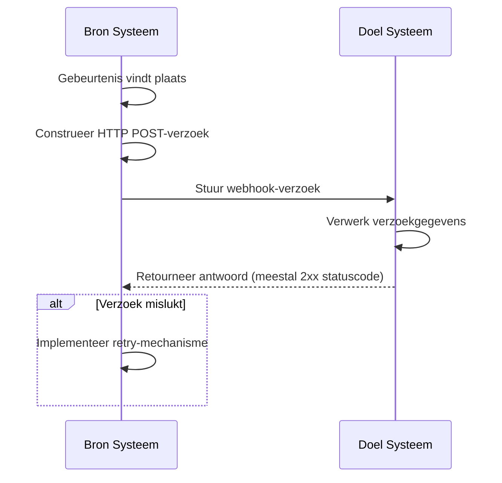
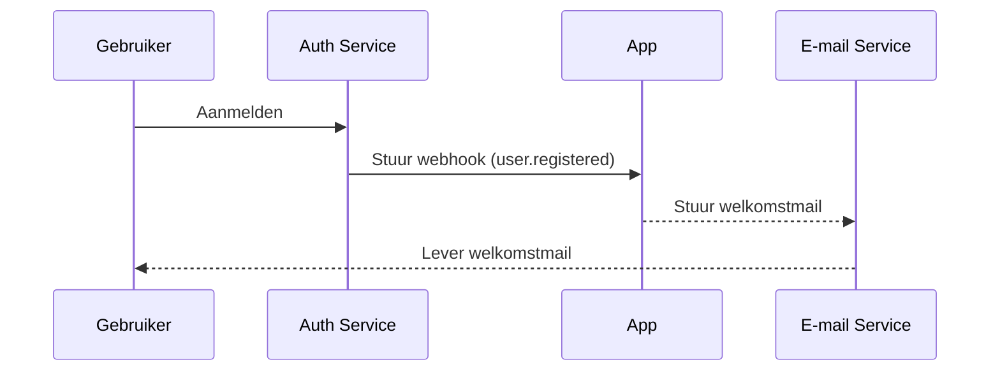

## Wat is een webhook?

Een webhook is een HTTP callback-mechanisme dat applicaties in staat stelt om real-time meldingen te sturen naar vooraf gedefinieerde URL's wanneer specifieke gebeurtenissen plaatsvinden. Dit mechanisme maakt geautomatiseerde gegevensuitwisseling en real-time communicatie tussen systemen mogelijk.

## Hoe werken webhooks?



1. Een specifieke gebeurtenis vindt plaats in het bron systeem
2. Het bron systeem construeert een HTTP POST-verzoek met gebeurtenisgegevens
3. Het bron systeem stuurt het verzoek naar de vooraf geconfigureerde URL van het doel systeem
4. Het doel systeem ontvangt het verzoek en verwerkt de gegevens
5. Het doel systeem retourneert een antwoord aan het bron systeem
6. Als het verzoek mislukt, kan het bron systeem een retry-mechanisme implementeren

## Hoe werken webhooks in een real-world scenario?

Laten we een applicatie nemen die is geïntegreerd met een auth service als voorbeeld. Wanneer een nieuwe gebruiker zich aanmeldt, zal de applicatie een welkomstmail naar de gebruiker sturen.

Typisch biedt de auth service een `user.registered` webhook-gebeurtenis die wordt geactiveerd wanneer een nieuwe gebruiker de registratie voltooit.

De payload van de webhook-gebeurtenis bevat de informatie van de gebruiker, zoals e-mail en gebruikersnaam, die kan worden gebruikt om de welkomstmail te sturen:

```json
// Opmerking: de werkelijke payload-structuur hangt af van de auth service.
{
  "event": "user.registered",
  "timestamp": "2024-03-21T08:00:00Z",
  "data": {
    "user_id": "u_1234567890",
    "email": "john@example.com",    // E-mailadres voor het verzenden van de welkomstmail
    "username": "johndoe",          // Gebruikersnaam om de e-mail te personaliseren
    "registered_at": "2024-03-21T08:00:00Z"
  }
}
```

Zo werkt de webhook-flow:



## Wat zijn best practices voor het implementeren van webhooks?

Wanneer je de verzender (producent) van webhooks bent, overweeg dan de volgende aspecten:

### Webhook-ontwerp

Ontwerp duidelijke en consistente webhook-structuren:

- Definieer duidelijke gebeurtenistypen: Bijvoorbeeld, `order.created`, `user.updated`, etc.
- Gebruik standaard JSON-formaat: Zorg ervoor dat de gegevensstructuur duidelijk en gemakkelijk te parseren is.
- Versiebeheer: Voeg versie-informatie toe in de request headers of payload. Bijvoorbeeld:

  ```javascript
  // In request headers
  headers: {
    'Content-Type': 'application/json',
    'X-Webhook-Version': '1.0'
  }
  
  // Of in de payload
  {
    "version": "1.0",
    "event_type": "order.created",
    "data": {
      // Gegevens van de gebeurtenis
    }
  }
  ```

- Bied voldoende context: Voeg tijdstempels toe van wanneer gebeurtenissen plaatsvonden, unieke identificatoren voor gerelateerde bronnen, etc.
- Behoud consistentie: Gebruik consistente naamgevingsconventies en gegevensstructuren voor alle gebeurtenistypen.

### Verzendmechanisme

Implementeer een betrouwbaar webhook-verzendmechanisme:

- Gebruik asynchrone taakwachtrijen: Vermijd het blokkeren van het hoofdprogramma en verbeter de systeemresponsiviteit.
- Implementeer retry-mechanismen: Behandel netwerkfouten of tijdelijke onbeschikbaarheid van de ontvanger.

### Retry-strategie

Ontwerp een geschikte retry-strategie:

- Implementeer exponentiële backoff: Vermijd frequente retries die het systeem en de ontvanger kunnen belasten.
- Stel een maximaal aantal retries in: Voorkom oneindige retries die systeembronnen verbruiken.
- Bied handmatige retry-mechanismen: Bied een interface voor handmatige retries voor webhooks die uiteindelijk falen.

### Beveiligingsimplementatie

Implementeer een handtekeningmechanisme om ontvangers in staat te stellen de authenticiteit van verzoeken te verifiëren:

```javascript
const crypto = require('crypto');

function generateSignature(payload, secret) {
  return crypto.createHmac('sha256', secret)
    .update(JSON.stringify(payload))
    .digest('hex');
}

function sendWebhookWithSignature(url, payload, secret) {
  const signature = generateSignature(payload, secret);
  return axios.post(url, payload, {
    headers: { 'X-Webhook-Signature': signature }
  });
}
```

### Prestatie-optimalisatie

Optimaliseer de prestaties van het verzenden van webhooks:

- Gebruik verbindingspools: Verminder de overhead van het tot stand brengen van verbindingen en verbeter de prestaties.
- Implementeer batchverwerking: Stuur webhooks in batches wanneer dat gepast is om het aantal netwerkinteracties te verminderen.

### Documentatie en testtools

Bied ondersteuning voor webhook-gebruikers:

- Gedetailleerde API-documentatie: Inclusief alle mogelijke gebeurtenistypen, requestformaten en veldbeschrijvingen.
- Bied testtools: Implementeer webhook-testendpoints om gebruikers in staat te stellen het ontvangen van webhook-meldingen te simuleren.
- Voorbeeldcode: Bied integratievoorbeelden in verschillende programmeertalen.

## Wat zijn best practices voor het gebruik van webhooks?

Wanneer je webhooks gebruikt als ontvanger (consument), overweeg dan de volgende aspecten:

### Beveiliging

Aangezien endpoints voor het ontvangen van webhooks over het algemeen openbaar toegankelijk zijn, is beveiliging een primaire zorg. Let op de volgende punten:

- Verifieer de authenticiteit van verzoeken: Implementeer een handtekeningverificatiemechanisme om ervoor te zorgen dat verzoeken van verwachte afzenders komen.
  
  ```javascript
  const crypto = require('crypto');

  function verifySignature(payload, signature, secret) {
    const expectedSignature = crypto
      .createHmac('sha256', secret)
      .update(JSON.stringify(payload))
      .digest('hex');
    
    return crypto.timingSafeEqual(
      Buffer.from(signature),
      Buffer.from(expectedSignature)
    );
  }
  ```

- Gebruik HTTPS: Zorg ervoor dat je webhook-ontvangend endpoint HTTPS gebruikt om te voorkomen dat gegevens tijdens de overdracht worden onderschept of gemanipuleerd.
- Implementeer IP-whitelisting: Accepteer alleen webhook-verzoeken van vertrouwde IP-adressen om het risico op aanvallen te verminderen.

### Betrouwbaarheid

Om een betrouwbare verwerking van ontvangen webhooks te garanderen:

- Implementeer idempotente verwerking: Ontwerp je systeem om dubbele webhook-meldingen correct te verwerken, aangezien afzenders mislukte verzoeken kunnen herhalen.
- Reageer snel: Retourneer een antwoord (meestal een 2xx statuscode) onmiddellijk na het ontvangen van een webhook-verzoek om te voorkomen dat de afzender het verzoek als mislukt beschouwt en een retry activeert.

### Prestaties

Zorg voor een efficiënte werking van het systeem:

- Asynchrone verwerking: Voer na het ontvangen van een webhook de daadwerkelijke gegevensverwerking op de achtergrond uit zonder de reactie te blokkeren.
- Stel tijdslimieten in: Stel redelijke tijdslimieten in voor de verwerking van webhooks om te voorkomen dat langlopende taken de systeemprestaties beïnvloeden.

### Foutafhandeling

Behandel mogelijke foutensituaties op de juiste manier:

- Logging: Houd gedetailleerde records bij van ontvangen webhook-verzoeken en verwerkingsprocedures om probleemonderzoek te vergemakkelijken.
- Gracieuze degradatie: Zorg voor passende foutafhandelingsmechanismen wanneer het niet mogelijk is om webhooks te verwerken, zodat andere delen van het systeem niet worden beïnvloed.

### Versiecompatibiliteit

Aangezien webhook-formaten in de loop van de tijd kunnen veranderen:

- Behandel versie-informatie: Wees voorbereid om verschillende versies van webhook-formaten te verwerken. Versie-informatie wordt meestal verstrekt in de URL of request headers.
- Achterwaartse compatibiliteit: Zorg ervoor dat je bij het bijwerken van je webhook-verwerkingslogica oudere formaatversies blijft ondersteunen.

### Monitoring

Houd de ontvangst en verwerking van webhooks continu in de gaten:

- Stel waarschuwingen in: Implementeer real-time monitoring en waarschuwingen voor abnormale situaties (zoals hoge faalpercentages of ongebruikelijk verkeer).
- Prestatiestatistieken: Volg prestatiestatistieken voor de verwerking van webhooks, zoals responstijd en succespercentage.

<Resources
  urls={[
    "https://docs.logto.io/docs/recipes/webhooks/",
    "https://docs.logto.io/docs/recipes/webhooks/securing-your-webhooks/",
    "https://en.wikipedia.org/wiki/Webhook"
  ]}
/>