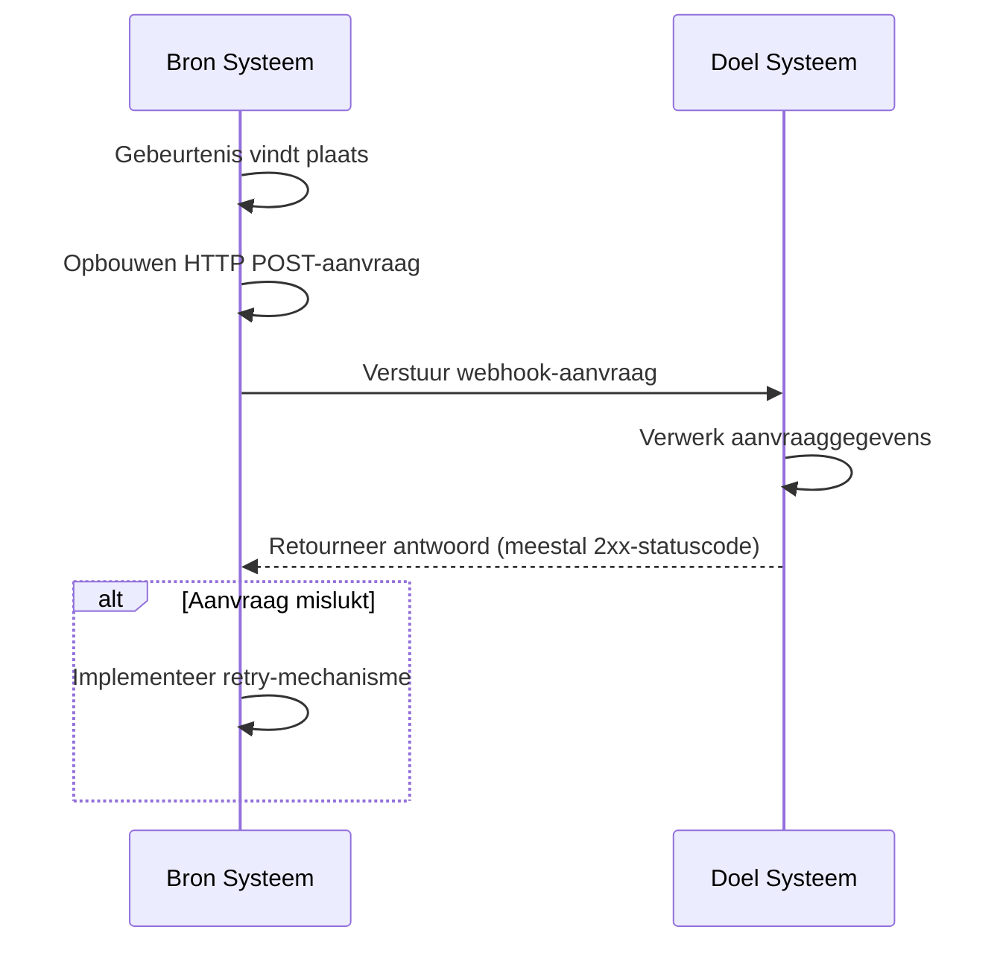
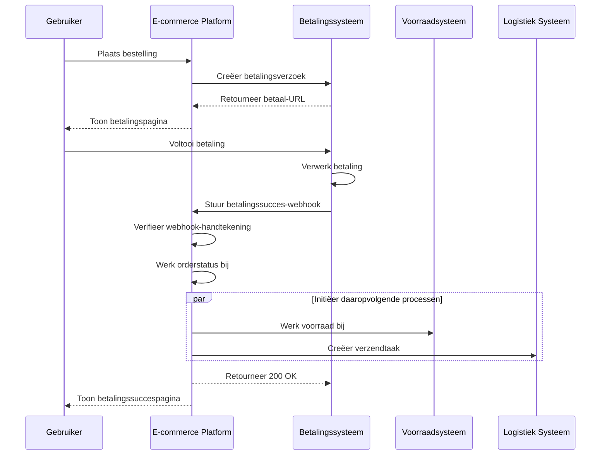

## Wat is een webhook?

Een webhook is een HTTP-callbackmechanisme dat applicaties in staat stelt realtime meldingen te verzenden naar vooraf gedefinieerde URL's wanneer specifieke gebeurtenissen plaatsvinden. Dit mechanisme maakt geautomatiseerde gegevensuitwisseling en realtime communicatie tussen systemen mogelijk.

## Hoe werken webhooks?



1. Een specifieke gebeurtenis vindt plaats in het bron systeem
2. Het bron systeem bouwt een HTTP POST-aanvraag met gebeurtenisgegevens op
3. Het bron systeem verstuurt de aanvraag naar de vooraf geconfigureerde URL van het doel systeem
4. Het doel systeem ontvangt de aanvraag en verwerkt de gegevens
5. Het doel systeem stuurt een antwoord naar het bron systeem
6. Als de aanvraag mislukt, kan het bron systeem een retry-mechanisme implementeren

## Wat zijn veelvoorkomende gebruiksscenario's voor webhooks?

1. Betalingssystemen: Meld wijzigingen in orderstatus
2. Versiebeheersystemen: Meld code commits, merge-aanvragen en andere gebeurtenissen
3. CRM-systemen: Meldingen over updates van klantinformatie
4. IoT-apparaten: Meld wijzigingen in apparaatstatus
5. Sociale media platforms: Meldingen van nieuwe berichten en opmerkingen

## Hoe werken webhooks in een scenario uit de praktijk?

Laten we een scenario bekijken waarbij een e-commerceplatform integreert met een extern betalingssysteem:

### Scenario

Een e-commerce platform gebruikt een extern betalingssysteem om betalingsverzoeken te verwerken. Wanneer een gebruiker een betaling voltooit, moet het betalingssysteem het e-commerceplatform in realtime op de hoogte stellen van de betalingsstatus via een webhook, waardoor het platform de orderstatus kan bijwerken en daaropvolgende processen kan activeren.

### Implementatiestroom van de webhook



1. Bestelling creatie en betalingsverzoek:
   - Gebruiker plaatst een bestelling op het e-commerceplatform.
   - Het platform stuurt een betalingsverzoek naar het betalingssysteem.
   - Het betalingssysteem retourneert een betaal-URL, die het platform aan de gebruiker toont.

2. Gebruiker betaling:
   - De gebruiker voltooit de betaling op het betalingssysteem.

3. Webhook activering:
   - Het betalingssysteem detecteert het "betaling geslaagd" evenement.
   - Het stelt een webhook-payload samen met betalingsdetails.

4. Verzending van webhook:
   - Het betalingssysteem verstuurt een POST-aanvraag naar de vooraf geconfigureerde URL van het e-commerceplatform.

5. Ontvanger verwerking:
   - Het e-commerceplatform ontvangt de webhook en controleert eerst de handtekening van het verzoek om de veiligheid te waarborgen.
   - Na verificatie werkt het platform de bijbehorende orderstatus bij naar "betaald".
   - Het platform initieert daaropvolgende processen, zoals het bijwerken van de voorraad en het creëren van verzendtaken.

6. Afhandeling van het antwoord:
   - Het e-commerceplatform stuurt onmiddellijk een 200 OK-antwoord terug zodra de webhook is ontvangen.
   - Als er tijdens de verwerking fouten optreden, zal het platform in de achtergrond opnieuw proberen of handmatige tussenkomst noodzakelijk maken.

7. Gebruikerservaring:
   - Het e-commerceplatform toont een betalingssuccespagina aan de gebruiker.

Dit voorbeeld demonstreert hoe webhooks realtime communicatie mogelijk maken tussen een extern betalingssysteem en een e-commerceplatform. Via webhooks kan het betalingssysteem het e-commerceplatform direct informeren wanneer een betaling is voltooid, waardoor onmiddellijke updates van de orderstatus mogelijk zijn en snelle activering van daaropvolgende bedrijfsprocessen. Dit verbetert de algehele systeemreactiesnelheid en efficiëntie, wat leidt tot een betere winkelervaring voor gebruikers.

## Wat zijn best practices voor het implementeren van webhooks?

Wanneer je de verzender (producent) van webhooks bent, overweeg dan de volgende aspecten:

### Webhookontwerp

Ontwerp duidelijke en consistente webhook-structuren:

- Definieer duidelijke evenementtypes: Bijvoorbeeld `order.created`, `user.updated`, enzovoort.
- Gebruik standaard JSON-formaat: Zorg ervoor dat de datastructuur duidelijk en gemakkelijk te parseren is.
- Versiebeheer: Voeg versie-informatie toe in de verzoekheaders of payload. Bijvoorbeeld:

  ```javascript
  // In request headers
  headers: {
    'Content-Type': 'application/json',
    'X-Webhook-Version': '1.0'
  }
  
  // Of in de payload
  {
    "version": "1.0",
    "event_type": "order.created",
    "data": {
      // Event details
    }
  }
  ```

- Bied voldoende context: Voeg tijdstempels toe wanneer evenementen plaatsvinden, unieke identificatoren voor gerelateerde bronnen, enzovoort.
- Handhaaf consistentie: Gebruik consistente naamgevingsconventies en datastructuren voor alle evenementtypes.

### Verzending mechanisme

Implementeer een betrouwbaar mechanisme voor het verzenden van webhooks:

- Gebruik asynchrone taakqueues: Voorkom dat het hoofdprogramma wordt geblokkeerd en verbeter de reactiesnelheid van het systeem.
- Implementeer retry-mechanismen: Handel netwerkaandoeningen of tijdelijke onbeschikbaarheid van de ontvanger af.

### Retry-strategie

Ontwerp een passende retry-strategie:

- Implementeer exponentiële backoff: Voorkom frequente retries die het systeem en de ontvanger kunnen belasten.
- Stel een maximaal aantal retries in: Voorkom dat eindeloze retries systeembronnen verbruiken.
- Bied handmatige retry-mechanismen aan: Bied een interface voor handmatige retries voor webhooks die uiteindelijk falen.

### Beveiligingsimplementatie

Implementeer een handtekeningmechanisme om ontvangers in staat te stellen de authenticiteit van verzoeken te verifiëren:

```javascript
const crypto = require('crypto');

function generateSignature(payload, secret) {
  return crypto.createHmac('sha256', secret)
    .update(JSON.stringify(payload))
    .digest('hex');
}

function sendWebhookWithSignature(url, payload, secret) {
  const signature = generateSignature(payload, secret);
  return axios.post(url, payload, {
    headers: { 'X-Webhook-Signature': signature }
  });
}
```

### Prestatie-optimalisatie

Optimaliseer de prestatie van het verzenden van webhooks:

- Gebruik connectiepoelen: Verminder de overhead van het maken van verbindingen en verbeter de prestatie.
- Implementeer batchverwerking: Verstuur webhooks in batches wanneer dat gepast is om het aantal netwerkinteracties te verminderen.

### Documentatie en testhulpmiddelen

Bied ondersteuning voor webhookgebruikers:

- Gedetailleerde API-documentatie: Bevat alle mogelijke evenementtypes, aanvraagformaten en veldbeschrijvingen.
- Bied testhulpmiddelen aan: Implementeer testendpoints voor webhooks om gebruikers in staat te stellen webhookmeldingen te simuleren.
- Voorbeeldcode: Bied integratievoorbeelden in verschillende programmeertalen.

## Wat zijn best practices voor het gebruiken van webhooks?

Wanneer je webhooks gebruikt als ontvanger (consument), overweeg dan de volgende aspecten:

### Beveiliging

Omdat eindpunten voor het ontvangen van webhooks over het algemeen openbaar toegankelijk zijn, is beveiliging een primaire zorg. Let op de volgende punten:

- Verifieer de authenticiteit van verzoeken: Implementeer een verificatiemechanisme voor handtekeningen om ervoor te zorgen dat verzoeken van verwachte verzenders komen.
  
  ```javascript
  const crypto = require('crypto');

  function verifySignature(payload, signature, secret) {
    const expectedSignature = crypto
      .createHmac('sha256', secret)
      .update(JSON.stringify(payload))
      .digest('hex');
    
    return crypto.timingSafeEqual(
      Buffer.from(signature),
      Buffer.from(expectedSignature)
    );
  }
  ```

- Gebruik HTTPS: Zorg ervoor dat je webhook-ontvangstendpoint HTTPS gebruikt om te voorkomen dat gegevens tijdens de overdracht worden onderschept of gewijzigd.
- Implementeer IP-vermelding: Accepteer alleen webhook-aanvragen van vertrouwde IP-adressen om het risico op aanvallen te verminderen.

### Betrouwbaarheid

Om betrouwbare verwerking van ontvangen webhooks te garanderen:

- Implementeer idempotente verwerking: Ontwerp je systeem om dubbele webhookmeldingen correct te verwerken, aangezien verzenders mogelijk mislukte aanvragen opnieuw proberen.
- Reageer snel: Stuur onmiddellijk een antwoord (meestal een 2xx-statuscode) terug na het ontvangen van een webhookaanvraag om te voorkomen dat de verzender de aanvraag als mislukt beschouwt en een retry start.

### Prestatie

Zorg voor een efficiënte werking van het systeem:

- Asynchrone verwerking: Voer na het ontvangen van een webhook de daadwerkelijke gegevensverwerking op de achtergrond uit zonder de reactie te blokkeren.
- Stel tijdslimieten in: Stel redelijke tijdlimieten voor webhookverwerking in om te voorkomen dat langdurige taken de systeemprestaties beïnvloeden.

### Foutafhandeling

Handel mogelijke foutensituaties gepast af:

- Loggen: Houd gedetailleerde verslagen bij van ontvangen webhook-aanvragen en verwerkingsprocedures om probleemoplossing te vergemakkelijken.
- Soepele degradatie: Heb geschikte foutafhandelingsmechanismen wanneer webhooks niet kunnen worden verwerkt om ervoor te zorgen dat andere delen van het systeem niet worden beïnvloed.

### Versiecompatibiliteit

Aangezien webhookformaten in de loop van de tijd kunnen veranderen:

- Handel versie-informatie af: Wees voorbereid op het verwerken van verschillende versies van webhookformaten. Versie-informatie wordt meestal in de URL of in de verzoekheaders voorzien.
- Achterwaartse compatibiliteit: Zorg bij het bijwerken van je webhook-verwerkingslogica ervoor dat je de oudere formaatversies blijft ondersteunen.

### Monitoring

Houd voortdurend toezicht op de ontvangst en verwerking van webhooks:

- Stel waarschuwingen in: Implementeer realtime bewaking en waarschuwingssystemen voor abnormale situaties (zoals hoge foutpercentages of ongebruikelijke verkeerspatronen).
- Prestatiestatistieken: Volg prestatiestatistieken voor webhookverwerking, zoals reactietijd en succesratio.

<Resources
  urls={[
    "https://docs.logto.io/docs/recipes/webhooks/",
    "https://docs.logto.io/docs/recipes/webhooks/securing-your-webhooks/",
    "https://en.wikipedia.org/wiki/Webhook"
  ]}
/>
