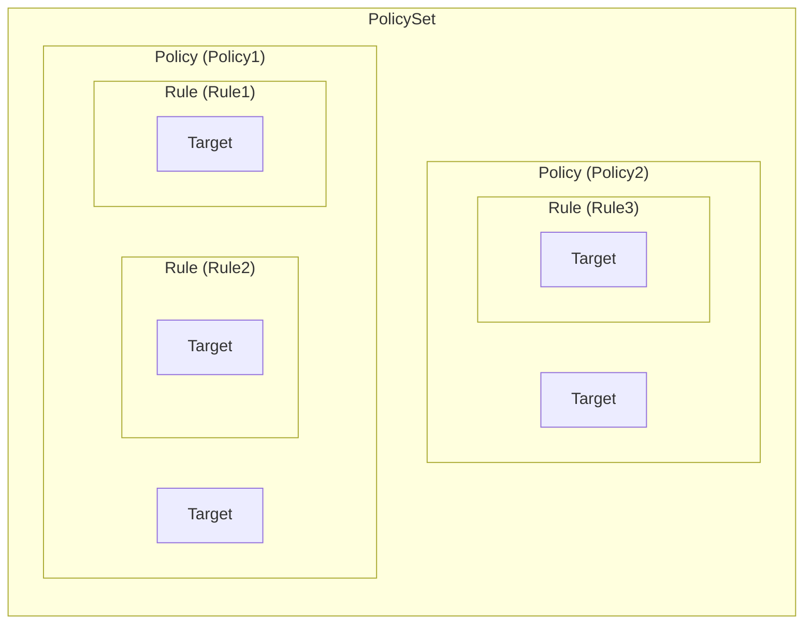
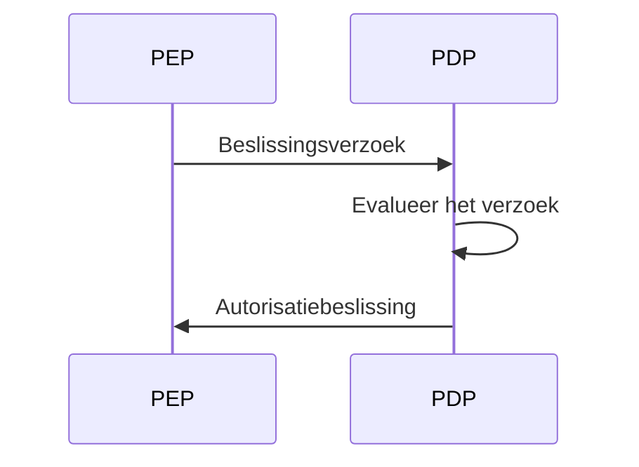
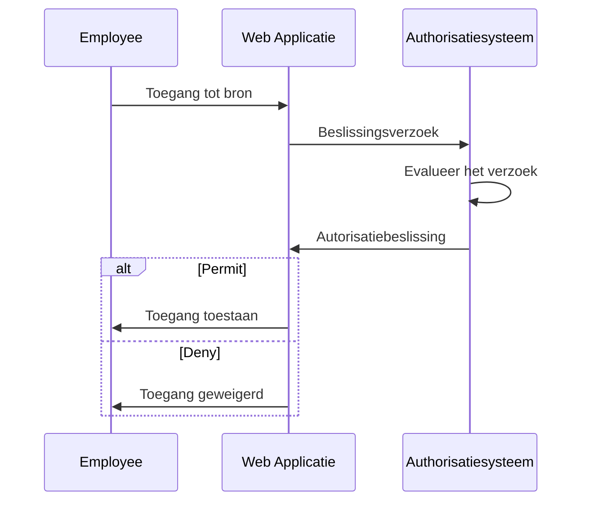
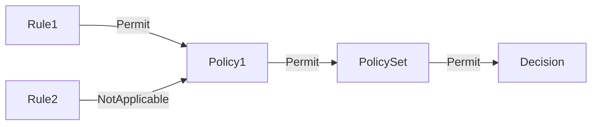
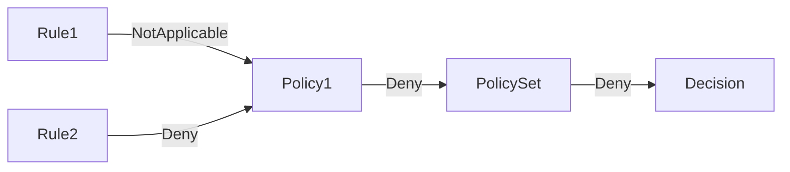

## Wat is XACML?

Zoals de naam al aangeeft, is eXtensible Access Control Markup Language (XACML) een op XML gebaseerde taal die voornamelijk gebruikt wordt voor toegangscontrole. Het is een standaard gedefinieerd door de Organization for the Advancement of Structured Information Standards (OASIS).

[XACML 3.0](https://docs.oasis-open.org/xacml/3.0/xacml-3.0-core-spec-os-en.html) is de nieuwste versie van de standaard, die in 2013 werd uitgebracht. Hoewel het geen specifiek toegangscontrolemodeel specificeert, wordt XACML vaak gebruikt om <Ref slug="abac" /> beleid te implementeren. Laten we een eenvoudig voorbeeld bekijken van hoe XACML gebruikt kan worden om ABAC (abac) beleid te vertegenwoordigen:

```xml
<PolicySet PolicySetId="ABAC_Policies" PolicyCombiningAlgId="urn:oasis:names:tc:xacml:3.0:policy-combining-algorithm:deny-overrides">
  <Description>ABAC (abac) Beleid</Description>
  <Policy PolicyId="Policy1" RuleCombiningAlgId="urn:oasis:names:tc:xacml:3.0:rule-combining-algorithm:deny-overrides">
    <Description>Werknemers kunnen gegevens lezen</Description>
    <Target>
      <AnyOf>
        <AllOf>
          <Match MatchId="urn:oasis:names:tc:xacml:1.0:function:string-equal">
            <AttributeValue DataType="http://www.w3.org/2001/XMLSchema#string">read</AttributeValue>
            <AttributeDesignator
              AttributeId="urn:oasis:names:tc:xacml:1.0:action:action-id"
              Category="urn:oasis:names:tc:xacml:3.0:attribute-category:action"
              DataType="http://www.w3.org/2001/XMLSchema#string"
              MustBePresent="true"
            />
          </Match>
        </AllOf>
      </AnyOf>
    </Target>
    <Rule RuleId="Rule1" Effect="Permit">
      <Target>
        <AnyOf>
          <AllOf>
            <Match MatchId="urn:oasis:names:tc:xacml:1.0:function:string-equal">
              <AttributeValue DataType="http://www.w3.org/2001/XMLSchema#string">employee</AttributeValue>
              <AttributeDesignator
                AttributeId="urn:oasis:names:tc:xacml:1.0:subject:subject-id"
                Category="urn:oasis:names:tc:xacml:1.0:subject-category:access-subject"
                DataType="http://www.w3.org/2001/XMLSchema#string"
                MustBePresent="true"
              />
            </Match>
          </AllOf>
        </AnyOf>
      </Target>
    </Rule>
    <Rule RuleId="Rule2" Effect="Deny">
      <Target>
        <AnyOf>
          <AllOf>
            <Match MatchId="urn:oasis:names:tc:xacml:1.0:function:string-equal">
              <AttributeValue DataType="http://www.w3.org/2001/XMLSchema#string">user</AttributeValue>
              <AttributeDesignator
                AttributeId="urn:oasis:names:tc:xacml:1.0:subject:subject-id"
                Category="urn:oasis:names:tc:xacml:1.0:subject-category:access-subject"
                DataType="http://www.w3.org/2001/XMLSchema#string"
                MustBePresent="true"
              />
            </Match>
          </AllOf>
        </AnyOf>
      </Target>
    </Rule>
  </Policy>
  <!-- ...other policies... -->
</PolicySet>
```

XACML doet goed werk met zelfverklarende naamgevingsconventies. De taal is ontworpen om mensvriendelijk en gemakkelijk te begrijpen te zijn.

Kortom, dit beleid stelt dat werknemers toestemming hebben om gegevens te lezen en gebruikers geen toestemming hebben om gegevens te lezen. Laten we het beleid opsplitsen door de belangrijkste onderdelen te analyseren:

- `<PolicySet>`: Het hoofdelement van het beleid. Een `PolicySet` kan meerdere `Policy` en `PolicySet` elementen bevatten, wat een hiërarchie van beleid vormt.
- `<Policy>`: Een beleid dat een of meer regels bevat. Elk beleid kan hebben:
  - Een `Target` element dat de voorwaarden specificeert waaronder het beleid van toepassing is.
  - Meerdere `Rule` elementen die de toegangsregel speciferen.
  - Een `RuleCombiningAlgId` attribuut dat specificeert hoe de regels worden gecombineerd om een beslissing te nemen.
- `<Rule>`: Een regel die de voorwaarden definieert waaronder toegang is verleend of geweigerd. Elke regel heeft:
  - Een `Target` element dat de voorwaarden specificeert waaronder de regel van toepassing is.
  - Een `Effect` attribuut dat specificeert of de regel toegang verleent of weigert.

> [!Opmerking]
> De beschikbare componenten en attributen in XACML zijn niet beperkt tot de enkele die we zojuist hebben genoemd. Bekijk de [XACML 3.0 specificatie](https://docs.oasis-open.org/xacml/3.0/xacml-3.0-core-spec-os-en.html) voor een volledige lijst van elementen en attributen.

Een grafische weergave van de relatie tussen de verschillende sleutelcomponenten wordt hieronder getoond:



Een gedetailleerde uitleg van andere elementen en attributen in het voorbeeld zal in de volgende secties worden gegeven.

## Hoe XACML werkt

Voor eenvoud gaan we ervan uit dat er slechts één beleid is gedefinieerd in de bovenstaande beleidset. Om het beleidsevaluatieproces te activeren, moet een **beslissingsverzoek** worden verzonden vanuit een **policy enforcement point (PEP)** naar een **policy decision point (PDP)**. De PDP evalueert het verzoek tegen het beleid en geeft een **autorisatiebeslissing** terug aan het PEP.



- PEP: De component die het beslissingsverzoek naar de PDP stuurt en de autorisatiebeslissing handhaaft (d.w.z. voert <Ref slug="access-control" /> uit).
- PDP: De component die het beslissingsverzoek tegen het beleid evalueert en de autorisatiebeslissing retourneert.

Laten we een praktijkvoorbeeld gebruiken om de Shakespeareaanse taal te vervangen. Stel dat er een webapplicatie is die werknemers toestaat bepaalde bronnen te openen, en de applicatie is geïntegreerd met een XACML-gebaseerd autorisatiesysteem.

Wanneer een werknemer probeert toegang te krijgen tot een bron, stuurt de webapplicatie (**PEP**) een **beslissingsverzoek** naar het autorisatiesysteem (**PDP**). Zodra het autorisatiesysteem het verzoek toetst aan het XACML beleid, geeft het een **autorisatiebeslissing** terug aan de webapplicatie.



## Beslissingsverzoek

Een beslissingsverzoek in XACML bestaat uit de volgende belangrijke componenten:

- **Subject**: De entiteit die toegang tot een bron vraagt. Dit kan een gebruiker, apparaat of een andere entiteit zijn.
- **Resource**: De bron waartoe toegang wordt gewenst. Dit kan een bestand, database, API-eindpunt of een andere bron zijn.
- **Action**: De actie die op de bron wordt uitgevoerd. Dit kan lezen, schrijven, verwijderen of een andere actie zijn.
- **Environment**: De context waarin de toegang wordt gevraagd. Dit kan informatie bevatten zoals tijdstip van de dag, locatie, of andere contextuele informatie.

Hier is een voorbeeld van een beslissingsverzoek in XACML:

```xml
<Request>
  <Attributes Category="urn:oasis:names:tc:xacml:3.0:attribute-category:resource">
    <Attribute AttributeId="urn:oasis:names:tc:xacml:1.0:resource:resource-id" DataType="http://www.w3.org/2001/XMLSchema#string">
      <AttributeValue>http://example.com/data</AttributeValue>
    </Attribute>
  </Attributes>
  <Attributes Category="urn:oasis:names:tc:xacml:3.0:attribute-category:action">
    <Attribute AttributeId="urn:oasis:names:tc:xacml:1.0:action:action-id" DataType="http://www.w3.org/2001/XMLSchema#string">
      <AttributeValue>read</AttributeValue>
    </Attribute>
  </Attributes>
  <Attributes Category="urn:oasis:names:tc:xacml:3.0:attribute-category:subject">
    <Attribute AttributeId="urn:oasis:names:tc:xacml:1.0:subject:subject-id" DataType="http://www.w3.org/2001/XMLSchema#string">
      <AttributeValue>employee</AttributeValue>
    </Attribute>
  </Attributes>
</Request>
```

## Evaluatieproces

Zodra de PDP de beleidset opvraagt, evalueert het het beslissingsverzoek als volgt:

1. **Doelgroepmatching**: Voor elk beleid checkt de PDP of het verzoek overeenkomt met het doel van het beleid. Als het verzoek overeenkomt met het doel, gaat de PDP verder met het evalueren van de regels.
2. **Regel evaluatie**: De PDP evalueert elke regel in het beleid. Als het doel van een regel overeenkomt met het verzoek, evalueert de PDP de voorwaarde van de regel. Als de voorwaarde `true` evalueert, retourneert de PDP het effect van de regel (permit of deny). Als de voorwaarde `false` evalueert, gaat de PDP verder met het evalueren van de volgende regel.
3. **Regelcombinatie**: De PDP combineert de effecten van alle regels in het beleid op basis van het `RuleCombiningAlgId` attribuut van het beleid. Het gecombineerde effect wordt dan geretourneerd als de beslissing van het beleid.
4. **Beleid combinatie**: Als de beleidset meerdere beleids bevat, combineert de PDP de beslissingen van alle beleids op basis van het `PolicyCombiningAlgId` attribuut van de beleidset. De gecombineerde beslissing wordt dan geretourneerd als de uiteindelijke autorisatiebeslissing.

### Voorbeeld 1

Stel bijvoorbeeld dat in de voorbeeldbeleidset het beslissingsverzoek is zoals hierboven. De PDP zou het verzoek evalueren tegen het `Policy1` beleid als volgt:

#### Doelgroepmatching

Het `Target` van het beleid specificeert dat elk subject dat een actie-ID van `read` heeft moet worden geëvalueerd door het beleid. Omdat de actie van het verzoek `read` is, komt het verzoek overeen met het doel van het beleid.

#### Regel evaluatie

Het beleid bevat twee regels:

1. `Rule1`: Aangezien het subject-ID van het verzoek `employee` is, evalueert de voorwaarde van de regel tot `true` en is het effect `Permit`.
2. `Rule2`: Aangezien het subject-ID van het verzoek niet `user` is, evalueert de voorwaarde van de regel tot `false` en is het effect `NotApplicable`.

#### Regel en beleid combinatie

- Aangezien `Policy1` het `deny-overrides` regelcombinatiealgoritme gebruikt, is de beslissing van het beleid `Permit` omdat `Rule1` toegang toestaat en het effect daarvan het `NotApplicable` effect van `Rule2` overstijgt.
- De beleidset gebruikt ook het `deny-overrides` beleidcombinatiealgoritme en de uiteindelijke beslissing is `Permit` omdat de beslissing van het beleid `Permit` is.

Hier is een niet-normatieve grafische weergave van het evaluatieproces:



### Voorbeeld 2

Laten we nu een ander beslissingsverzoek overwegen waarbij alle andere attributen hetzelfde zijn, maar het subject-ID `user` is in plaats van `employee`.

#### Doelgroepmatching

Aangezien de actie ongewijzigd is, komt het verzoek nog steeds overeen met het doel van het beleid.

#### Regel evaluatie

- `Rule1`: Het subject-ID van het verzoek is geen `employee`, dus de voorwaarde van de regel evalueert tot `false` en het effect is `NotApplicable`.
- `Rule2`: Het subject-ID van het verzoek is `user`, dus de voorwaarde van de regel evalueert tot `true` en het effect is `Deny`.

#### Regel en beleid combinatie

- De beslissing van het beleid is `Deny` omdat `Rule2` toegang weigert en het effect daarvan het `NotApplicable` effect van `Rule1` overstijgt.
- De uiteindelijke beslissing is `Deny` omdat het `deny-overrides` beleidcombinatiealgoritme van de beleidset de meest restrictieve beslissing retourneert.

Hier is een niet-normatieve grafische weergave van het evaluatieproces:



### Voorbeeld 3

Laten we tot slot een beslissingsverzoek overwegen waarbij de actie `write` is in plaats van `read`. Alle andere attributen blijven hetzelfde als in voorbeeld 1.

#### Doelgroepmatching

Het verzoek komt niet langer overeen met het doel van het beleid omdat de actie `write` is, niet `read`. Daarom wordt het beleid niet geëvalueerd.

#### Regel en beleid combinatie

Aangezien het beleid niet wordt geëvalueerd, is de uiteindelijke beslissing `NotApplicable`.

Hier is een niet-normatieve grafische weergave van het evaluatieproces:


## Combinatiealgoritmen

XACML definieert verschillende standaard combinatiealgoritmen die bepalen hoe de effecten van meerdere regels of beleids worden gecombineerd om een beslissing te nemen. In de bovenstaande voorbeelden noemden we het `deny-overrides` combinatiealgoritme voor zowel regels als beleids.

Zoals de naam al aangeeft, geeft het `deny-overrides` algoritme prioriteit aan `Deny` beslissingen boven `Permit` beslissingen. Hier is een vereenvoudigde uitleg van hoe het `deny-overrides` algoritme werkt:

- als een regel of beleid toegang weigert, is de uiteindelijke beslissing `Deny`;
- als geen enkele regel of beleid toegang weigert en TENMINSTE één regel of beleid toegang toestaat, is de uiteindelijke beslissing `Permit`;
- als geen enkele regel of beleid toegang weigert en GEEN regel of beleid toegang toestaat, is de uiteindelijke beslissing `NotApplicable`.

Het werkelijke algoritme is complexer en houdt rekening met andere "onbepaalde" beslissingen zoals `Indeterminate{D}` en `Indeterminate{P}`.

> [!Opmerking]
> Dit algoritme biedt geen "terugval" beslissing voor het geval geen regel of beleid overeenkomt met het verzoek. In dergelijke gevallen is de beslissing `NotApplicable`.

Voor een volledige lijst van combinatiealgoritmen en hun gedrag, raadpleeg de [XACML 3.0 specificatie](https://docs.oasis-open.org/xacml/3.0/xacml-3.0-core-spec-os-en.html#_Toc325047268).

## Overwegingen voor implementatie

XACML is een krachtige taal voor het uitdrukken van attribuutgebaseerde toegangscontrolebeleid. Voordat je XACML in je systeem implementeert, overweeg het volgende:

- Toegangscontroleontwerp: XACML is flexibel en expressief, maar vereist zorgvuldig ontwerp aangezien het complexe beleidsets kan omvatten die tot onbedoelde gevolgen kunnen leiden.
- Complexiteit: XACML beleids zijn vaak complex en kunnen moeilijk te beheren zijn. Voor de meeste applicaties kunnen eenvoudigere toegangscontrolemodellen zoals <Ref slug="rbac" /> meer geschikt zijn.
- Prestaties: Het evalueren van XACML beleids kan rekentechnisch intensief zijn, vooral bij grote beleidsets. Overweeg de prestatie-implicaties van het gebruik van XACML in je systeem.

<SeeAlso slugs={['abac', 'rbac', 'access-control', 'authorization']} />

<Resources
  urls={[
    'https://docs.oasis-open.org/xacml/3.0/xacml-3.0-core-spec-os-en.html',
  ]}
/>