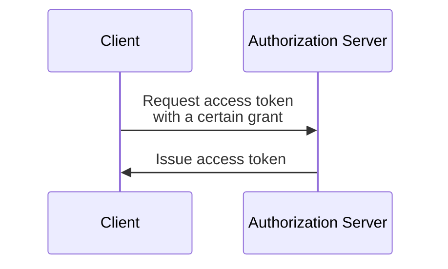

## What is an OAuth 2.0 grant?

An OAuth 2.0 grant is an authorization process that allows a <Ref slug="client" /> to request an <Ref slug="access-token" /> from an <Ref slug="authorization-server" />. You may also hear other terms around this concept, so let's clarify them before diving in:

- **OAuth 2.0 grant**: Also known as an "OAuth 2.0 grant type", "OAuth 2.0 flow", or "OAuth 2.0 authorization grant". In most contexts, these terms refer to the same concept.
- <Ref slug="authorization-server" />: The server that issues access tokens to the client. In OpenID Connect (OIDC), the authorization server is the same as the <Ref slug="openid-connect" headingId="openid-provider-op" />.
- <Ref slug="authorization-request" />: The request made by the client to the authorization server to obtain an access token. In OpenID Connect (OIDC), it is also referred to as an <Ref slug="authentication-request" />.

For the sake of clarity, we will use the initial terms listed above consistently throughout this article.

The high-level process of an OAuth 2.0 grant is quite simple:

After the client receives the access token, it can use it to access protected resources (e.g., APIs) on behalf of a user or itself.

Note that according to the specific grant, the client and the authorization server may exchange additional information and involve more steps in the process. For example, the <Ref slug="authorization-code-flow">authorization code grant</Ref> involves user authentication and authorization, code generation, and token exchange.

## Different OAuth 2.0 grants

The basic OAuth 2.0 specification defines four grants that clients can use to obtain access tokens:

1. <Ref slug="authorization-code-flow">Authorization code grant</Ref>: The most secure and recommended grant for majorities of applications. It's enforced to use <Ref slug="pkce" /> for all clients in <Ref slug="oauth-2.1" />.
2. <Ref slug="implicit-flow">Implicit grant</Ref>: A simplified grant that is deprecated in OAuth 2.1 due to security concerns.
3. [Resource owner password credentials (ROPC) grant](https://datatracker.ietf.org/doc/html/rfc6749#section-4.3): A grant where the user's credentials are directly exchanged for an access token. It is not recommended for most applications due to security risks.
4. <Ref slug="client-credentials-flow">Client credentials grant</Ref>: A grant used by <Ref slug="client" headingId="confidential-clients" /> to obtain an access token without user involvement.

As the industry evolves, implicit and ROPC grants are [being deprecated](https://blog.logto.io/oauth-2-1) in favor of more secure and standardized flows. For new applications, the choices are straightforward:

- For user authentication and authorization, use the authorization code grant with PKCE.
- For <Ref slug="machine-to-machine" /> communication, use the client credentials grant.

### Other OAuth 2.0 grants

In addition to the four basic grants, there are other extensions that define new grants for specific use cases. For example:

- <Ref slug="device-flow">Device authorization grant</Ref> is a grant designed for devices with limited input capabilities, such as smart TVs and IoT devices.
- <Ref slug="hybrid-flow">Hybrid flow</Ref> is an OpenID Connect grant that combines the authorization code grant with the implicit grant.

## Grants in OpenID Connect (OIDC)

In <Ref slug="openid-connect" />, the concept of grants is extended to include <Ref slug="id-token">ID tokens</Ref> that represent user identity information in addition to access tokens. OIDC extends two OAuth 2.0 grants (authorization code and implicit) to include ID tokens, and introduces a new grant called the <Ref slug="hybrid-flow">hybrid flow</Ref> that combines both.

> Like OAuth 2.0, it's only recommended to use the authorization code grant with PKCE in OIDC for user authentication and authorization.

Meanwhile, since OIDC is built on top of OAuth 2.0, other grants like the client credentials grant can still be used on the same authorization server, as long as the server supports them.

<SeeAlso slugs={["pkce", "oauth-2.1", "authorization-code-flow", "implicit-flow", "client-credentials-flow", "device-flow"]} />

<Resources
  urls={[
    "https://blog.logto.io/implicit-flow-is-dead",
    "https://datatracker.ietf.org/doc/html/rfc6749",
    "https://openid.net/specs/openid-connect-core-1_0.html"
  ]}
/>
