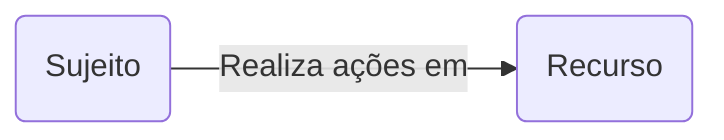
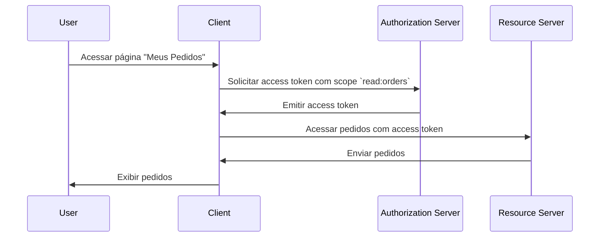

## O que é controle de acesso?

O controle de acesso envolve três componentes principais:

- **Sujeito**: Uma entidade que realiza ações em recursos. Sujeitos podem ser usuários, serviços ou dispositivos.
- **Recurso**: Uma entidade que é protegida pelo controle de acesso. Recursos podem ser arquivos, bancos de dados, APIs ou quaisquer outros ativos digitais.
- **Ação**: Uma operação que um sujeito pode realizar em um recurso. Ações podem ser ler, escrever, executar ou qualquer outra operação.

> O controle de acesso define a restrição seletiva de acesso a **recursos** com base no **sujeito** e na **ação**.

Aqui estão alguns exemplos do mundo real de controle de acesso:

- Um usuário (sujeito) **pode** ler (ação) seus pedidos (recurso) em um sistema de e-commerce.
- Um usuário (sujeito) **não pode** excluir (ação) o perfil de outro usuário (recurso) em uma rede social.
- Um serviço (sujeito) **pode** escrever (ação) dados em um banco de dados (recurso) em uma arquitetura de microsserviços.

Às vezes, o recurso é ignorado em implementações técnicas e o controle de acesso é definido como a restrição de quem (sujeito) pode realizar quais ações. Por exemplo, o framework básico do OAuth 2.0 especifica apenas ações usando scopes (permissões) e não define recursos.

O suporte para controle de acesso pode variar dependendo do <Ref slug="authorization-server" /> ou do <Ref slug="identity-provider" />. Alguns sistemas podem suportar [Resource Indicators for OAuth 2.0](https://datatracker.ietf.org/doc/html/rfc8707), uma extensão do OAuth 2.0 que permite que clientes especifiquem os recursos que desejam acessar.

## Modelos de controle de acesso ||access-control-models||

Decidir restrições entre poucos sujeitos e recursos é simples, mas não escalável. Portanto, a indústria desenvolveu muitos modelos de controle de acesso para gerenciá-lo de forma eficaz. No contexto de <Ref slug="iam" />, os seguintes são alguns modelos comuns de controle de acesso:

- <Ref slug="rbac" />: Um modelo que atribui permissões a papéis e, em seguida, atribui papéis a sujeitos. Por exemplo, um papel de administrador pode ter acesso a todos os recursos, enquanto um papel de usuário pode ter acesso a recursos limitados.
- <Ref slug="abac" />: Um modelo que usa atributos (propriedades) do sujeito, recurso e ambiente para tomar decisões de controle de acesso. Por exemplo, um usuário com o atributo "departamento=engenharia" pode ter acesso a recursos de engenharia.

Existem também outros modelos de controle de acesso, como [controle de acesso baseado em políticas (PBAC)](https://csrc.nist.gov/glossary/term/policy_based_access_control). Cada modelo tem seus próprios pontos fortes e fracos, e a escolha do modelo depende do seu caso de uso e requisitos.

## Controle de acesso no OAuth 2.0

No contexto do OAuth 2.0, o controle de acesso é tipicamente implementado usando <Ref slug="scope">scopes</Ref>. Normalmente, o valor de um scope é uma string que combina o recurso e a ação. Por exemplo, `read:orders` ou `write:profile`.

> [!Note]
> O termo "scopes" é intercambiável com "permissões" na maioria dos casos.

Vale a pena notar que o OAuth 2.0 não define a estrutura e o significado dos scopes. A interpretação dos scopes é deixada para o <Ref slug="resource-server" />, e a emissão dos scopes é deixada para o <Ref slug="authorization-server" />.

Por exemplo, um usuário (sujeito) precisa acessar seus pedidos (recurso) em um sistema de e-commerce. Ao utilizar o OAuth 2.0, você pode definir um scope `read:orders` e um aplicativo web (client) solicitará esse scope do authorization server. Aqui está um fluxo simplificado:

Neste fluxo, dependendo da arquitetura técnica, o resource server pode ser um serviço de API ou pode ser o próprio client (aplicativo web), desde que tenha a capacidade de acessar o recurso (pedidos).

### O parâmetro resource indicator

Embora as pessoas frequentemente definam scopes com recurso e ação (por exemplo, `read:orders`, enquanto `orders` é o recurso e `read` é a ação), a escalabilidade dessa abordagem é limitada quando o número de recursos e ações cresce. O RFC 8707 introduz o parâmetro `resource` (ou seja, <Ref slug="resource-indicator">resource indicators</Ref>) para o OAuth 2.0, que permite que clientes especifiquem os recursos que desejam acessar.

O RFC especifica que o parâmetro `resource` deve ser um URI representando o recurso. Por exemplo, em vez de simplesmente usar `orders`, você poderia usar `https://api.example.com/orders`. Este método ajuda a evitar conflitos de nomenclatura e melhora a precisão da correspondência de recursos, permitindo o uso do URL real do recurso.

### Suporte do authorization server

O OAuth 2.0 não define como o authorization server deve conduzir o controle de acesso. Ele deixa os detalhes de implementação a critério do authorization server. Assim, a escolha do authorization server pode afetar significativamente o mecanismo de controle de acesso. Por exemplo, alguns authorization servers podem suportar resource indicators, enquanto outros podem não suportar. É importante decidir qual modelo de controle de acesso usar com base nos requisitos do seu negócio e, em seguida, escolher um authorization server que suporte esse modelo. Se você não tiver certeza sobre o modelo de controle de acesso, <Ref slug="rbac" /> é suficiente para a maioria dos casos.

<SeeAlso slugs={["rbac", "abac", "resource-indicator", "authorization"]} />

<Resources
  urls={[
    "https://blog.logto.io/mastering-rbac",
    "https://blog.logto.io/rbac-and-abac",
    "https://datatracker.ietf.org/doc/html/rfc8707",
    "https://blog.logto.io/organization-and-role-based-access-control",
  ]}
/>
