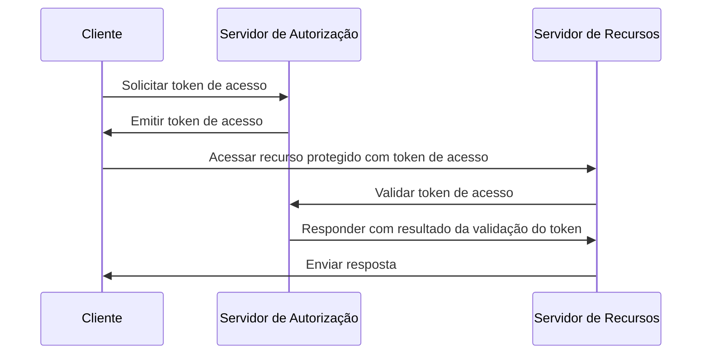
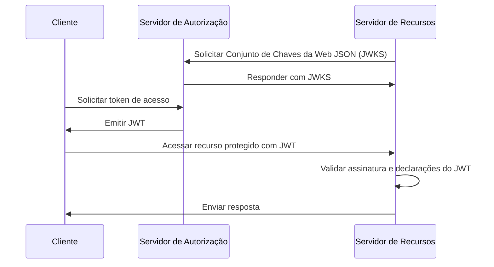
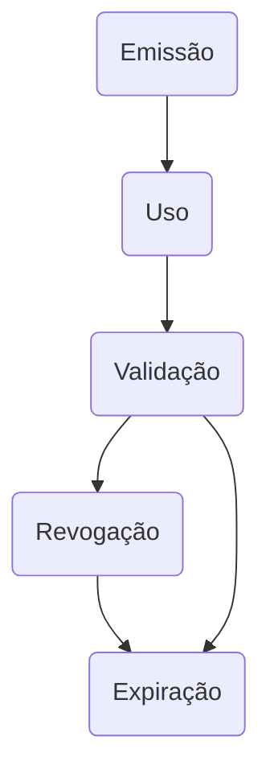

## O que é um token de acesso (access token)?

Um token de acesso (access token) é uma credencial, tipicamente uma sequência de caracteres, usada para acessar recursos protegidos. No contexto de OAuth 2.0 e OpenID Connect (OIDC), <Ref slug="authorization-server">servidores de autorização (authorization servers)</Ref> podem emitir tokens de acesso para clientes (aplicações) após autenticação e autorização bem-sucedidas.

Embora os RFCs para OAuth 2.0 e OIDC não especifiquem os detalhes de implementação dos tokens de acesso, existem dois tipos comuns de tokens de acesso usados na prática:

- <Ref slug="opaque-token" />: Uma sequência aleatória que não tem significado ("opaco") para o cliente. O cliente apresenta o token ao servidor de recursos, que valida o token com o servidor de autorização.
- <Ref slug="jwt" />: Um token autônomo que contém <Ref slug="claim">declarações (claims)</Ref> (por exemplo, ID do usuário, tempo de expiração) com uma assinatura digital. O servidor de recursos pode validar o token sem fazer uma solicitação adicional ao servidor de autorização.

## Como funciona um token de acesso (access token)?

De acordo com o tipo de token de acesso, o fluxo de uso de um token de acesso pode variar.

Aqui está um exemplo simplificado de uso de um token de acesso opaco:

Aqui está um exemplo simplificado de uso de um JWT:

A diferença entre os dois tipos de tokens de acesso é como o servidor de recursos valida o token:

- O servidor de recursos deve fazer uma solicitação adicional ao servidor de autorização para validar um token opaco cada vez que recebe um token.
- O servidor de recursos pode validar um JWT sem fazer uma solicitação adicional ao servidor de autorização porque o token contém todas as informações necessárias e o servidor de recursos pode armazenar em cache a chave pública do Conjunto de Chaves da Web JSON (JWKS) do servidor de autorização.

Tokens de acesso são tipicamente de curta duração e têm um tempo de expiração (por exemplo, 1 hora). Os clientes devem solicitar um novo token de acesso quando o token atual expirar.

## Qual tipo de token devo usar?

A escolha entre um token opaco e um JWT depende do caso de uso e dos requisitos de segurança da aplicação. Aqui está uma comparação dos dois tipos de token:

|                | Token Opaco                    | JWT                                                           |
|----------------|--------------------------------|---------------------------------------------------------------|
| Formato        | Sequência aleatória            | Objetos JSON autônomos                                        |
| Desempenho     | Requer uma solicitação adicional | Validação mais rápida                                         |
| Autônomo       | Não                            | Sim                                                           |
| Tamanho do token| Menor                          | Maior                                                         |
| Revogação      | Instantânea                    | Requer expiração do token ou interação com o servidor de autorização |
| Extensibilidade| Limitada                       | Declarações personalizadas                                    |
| Sem estado     | Não                            | Sim                                                           |
| Segurança      | Requer validação do token      | Requer validação da assinatura                                |
| Padrão         | Não                            | Sim (RFC 7519)                                                |

Para mais informações sobre a escolha entre os dois tipos de token, veja [Token opaco vs JWT](https://blog.logto.io/opaque-token-vs-jwt).

## Os papéis do servidor de autorização e do servidor de recursos

Na maioria dos casos, o <Ref slug="authorization-server" /> tem as seguintes responsabilidades:

- Emite tokens de acesso para clientes após autenticação e autorização bem-sucedidas. O servidor de autorização pode reduzir os escopos (reduzir os escopos para um subconjunto) ou rejeitar a solicitação de token com base nas políticas de controle de acesso (por exemplo, consentimento do usuário, <Ref slug="rbac" />, <Ref slug="abac" />).
- Verifica se o token de acesso foi emitido pelo servidor de autorização e não está expirado ou revogado (<Ref slug="token-introspection" />).
- Fornece informações sobre o token (por exemplo, escopos, tempo de expiração) via introspecção de token ou <Ref slug="userinfo-endpoint" />.

Você pode notar que o servidor de autorização não interpreta o significado do token de acesso. Por exemplo, o token de acesso pode conter um escopo `read:orders`, mas o servidor de autorização não sabe o que o escopo significa. O servidor de recursos é responsável por interpretar o token de acesso e aplicar o <Ref slug="access-control" /> com base nos escopos do token. Ou seja, o <Ref slug="resource-server" /> geralmente tem as seguintes responsabilidades:

- Valida as <Ref slug="claim">declarações (claims)</Ref> no token de acesso (por exemplo, tempo de expiração, indicador de recurso, escopos).
- Aplica o controle de acesso com base nas declarações do token (geralmente escopos).
- Fornece os recursos protegidos se o token de acesso for válido.

## Ciclo de vida do token de acesso

O ciclo de vida de um token de acesso geralmente envolve as seguintes etapas:

<SeeAlso slugs={['opaque-token', 'jwt', 'token-introspection', 'userinfo-endpoint', 'access-control']} />

<Resources
  urls={[
    "https://blog.logto.io/opaque-token-vs-jwt",
    "https://blog.logto.io/oauth2-token-introspection",
    "https://blog.logto.io/understanding-tokens-in-oidc",
    {
      url: "https://datatracker.ietf.org/doc/html/rfc6749#section-1.4",
      result: {
        ogTitle: "OAuth 2.0 Access Token",
      },
    },
    "https://datatracker.ietf.org/doc/html/rfc7662",
  ]}
/>