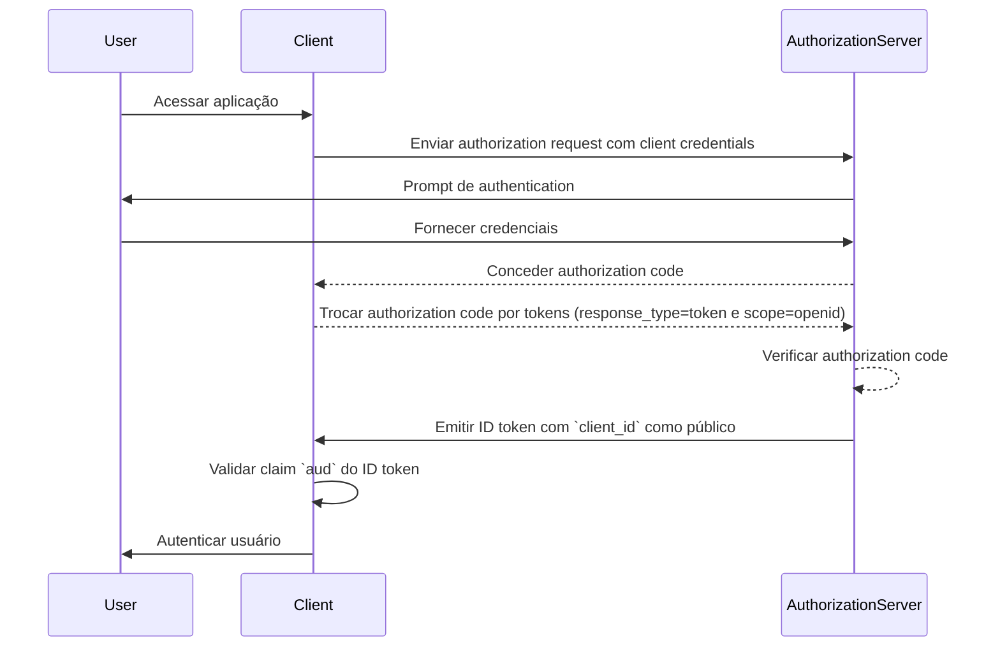
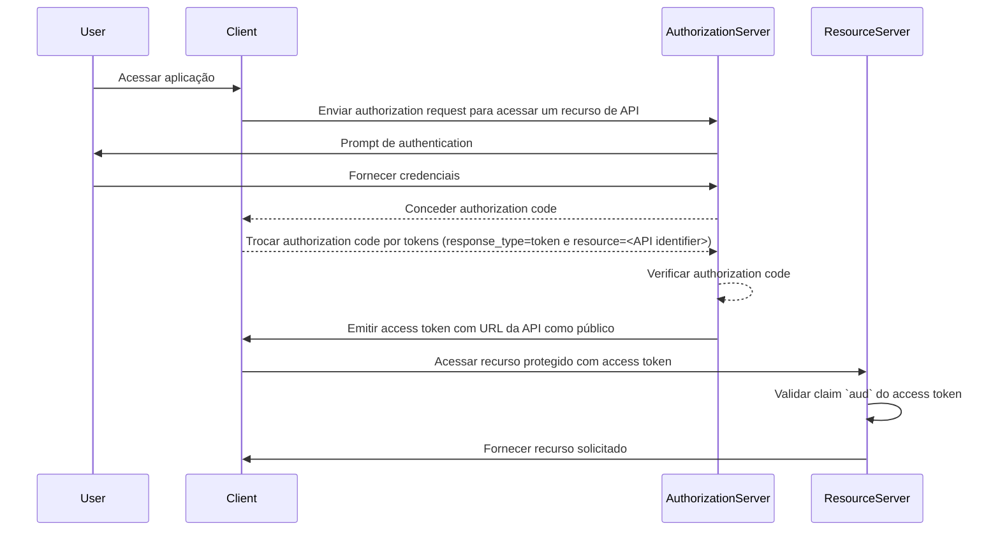

## O que é público (audience)?

No contexto de <Ref slug="authentication" /> e <Ref slug="authorization" />, público (audience) é um componente chave que define os destinatários pretendidos de um token de autorização. Referido como a claim [aud](https://datatracker.ietf.org/doc/html/rfc7519#section-4.1.3) em <Ref slug="jwt" />, essa claim garante que o token seja aceito apenas pelo serviço ou aplicativo designado. Tipicamente, a claim de público contém ou o client_id do aplicativo para o qual o token é destinado ou uma URL representando a API ou recurso que o token está autorizado a acessar. Ao especificar o público, serve como um controle de segurança para prevenir o uso indevido por serviços ou usuários não autorizados.

## Como funciona o público (audience)?

Quando um cliente solicita um <Ref slug="access-token" /> de um authorization server, a claim de público é incluída na resposta do token. Este valor de público é então validado pelo resource server quando o token é apresentado. O resource server verifica se a claim de público no token corresponde ao seu próprio identificador ou ao identificador do serviço que está protegendo. Se não corresponder, o token será rejeitado, aumentando a segurança em sistemas distribuídos, particularmente em cenários envolvendo múltiplos microsserviços ou APIs. Ao controlar a claim de público, os desenvolvedores podem garantir que os tokens sejam usados no contexto correto, adicionando uma camada adicional de proteção aos fluxos de authentication e authorization de suas aplicações.

- **Solicitante**: O aplicativo cliente especifica o valor do público ao solicitar um token.
- **Emissor**: O authorization server inclui a claim de público na resposta do token.
- **Verificador**: O destinatário do token verifica a claim de público em relação ao seu próprio identificador. Se a claim de público corresponder ao identificador do destinatário, o token é considerado válido. Caso contrário, é rejeitado.

## Exemplo de público (audience) em JWT

### Claim de público em um ID token de OpenID Connect (OIDC)

```json
{
  "header": {
    "alg": "RS256",
    "typ": "JWT",
    "kid": "abc123"
  },
  "payload": {
    "iss": "https://auth.logto.io",
    "sub": "test_user",
    "aud": "client_id_foo",
    "exp": 1516239022,
    "iat": 1516239022,
    "nonce": "n-0S6_WzA2Mj",
    "primary_email": "foo@logto.io",
    "email_verified": true,
    "username": "foo"
  },
  "signature": "..."
}
```

Um <Ref slug="id-token" /> em <Ref slug="openid-connect" /> é um token de segurança que contém informações sobre o usuário autenticado, entregue ao aplicativo cliente após uma authentication bem-sucedida. Ao contrário dos access tokens, que são usados para conceder permissão para acessar recursos, os ID tokens são especificamente projetados para transmitir informações de identidade do usuário para a parte confiável (cliente). Esses tokens são tipicamente codificados como JWTs e incluem claims como o identificador do usuário (claim sub), o emissor (claim iss) e o público (claim aud), entre outros.

Neste caso, a claim `aud` especifica o público pretendido para o ID token, que é o aplicativo cliente. O valor da claim `aud` geralmente corresponde ao `client_id` do aplicativo que solicitou o token. Quando o aplicativo cliente recebe o ID token, ele pode verificar a claim de público para garantir que o token foi emitido para seu consumo. Esta etapa de validação ajuda a prevenir o uso indevido do token e o acesso não autorizado a informações do usuário, aumentando a segurança do processo de authentication.



### Claim de público em um access token

```json
{
  "header": {
    "alg": "RS256",
    "typ": "JWT",
    "kid": "abc123"
  },
  "payload": {
    "iss": "https://auth.logto.io",
    "sub": "test_user",
    "aud": "https://example.logto.app/api/users",
    "exp": 1516239022,
    "iat": 1516239022,
    "scope": "read write",
    "client_id": "client_id_foo"
  },
  "signature": "..."
}
```

Ao contrário do ID token, <Ref slug="access-token" /> são usados para autorizar o acesso a recursos protegidos, como APIs ou serviços. A claim `aud` em um access token especifica o destinatário pretendido do token, que é tipicamente a API ou serviço que o token está autorizado a acessar. Tipicamente, o resource server que hospeda a API tem um domínio diferente do aplicativo cliente que solicitou o token. Neste caso, em vez de um `client_id`, a claim `aud` contém a URL do endpoint da API para o qual o token é destinado. Esta URL é frequentemente conhecida como o resource indicator ou API identifier que identifica unicamente o recurso alvo.

Quando o resource server recebe um access token, ele valida a claim `aud` para garantir que o token é destinado ao seu consumo. Ao verificar o público, o resource server pode prevenir o acesso não autorizado aos seus recursos e aplicar políticas de access control baseadas no público pretendido do token. Este mecanismo ajuda a proteger dados sensíveis e garante que os access tokens sejam usados no contexto apropriado, aumentando a segurança do sistema como um todo.



## FAQs

### Por que a claim de público é importante na validação de tokens?

A claim de público é crucial na validação de tokens porque garante que o token seja aceito apenas pelo destinatário pretendido. Ao verificar a claim de público, o destinatário pode prevenir o uso indevido do token e o acesso não autorizado a recursos. Este controle de segurança é particularmente importante em sistemas distribuídos onde múltiplos serviços interagem entre si, pois ajuda a aplicar políticas de access control e proteger dados sensíveis.

### Um token pode ter múltiplos públicos?

Por razões de segurança, é recomendado que um token tenha um único público para prevenir ambiguidades e garantir que o token seja usado no contexto correto. No entanto, alguns cenários podem exigir tokens com múltiplos públicos, como quando um token é destinado a múltiplos serviços ou APIs dentro do mesmo domínio. Nesses casos, os desenvolvedores devem considerar cuidadosamente as implicações de usar tokens com múltiplos públicos e implementar medidas de segurança apropriadas para mitigar riscos potenciais.

### O que devo usar como meu identificador de API na claim de público?

Ao especificar a claim de público em um access token que representa uma API ou serviço, é recomendado usar um URI absoluto que identifique unicamente o recurso. Este URI pode ser a URL base do endpoint da API ou um caminho de recurso específico que o token está autorizado a acessar. Ao usar um URI como identificador de API, você pode garantir que a claim de público seja inequívoca e represente com precisão o destinatário pretendido do token.