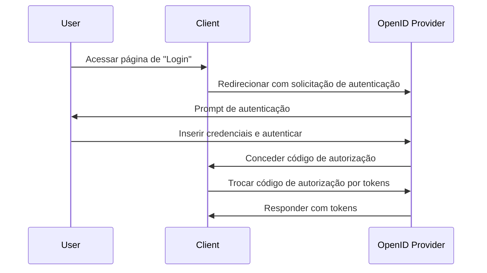

## O que é uma solicitação de autenticação?

Embora o significado de uma solicitação de autenticação possa variar dependendo do contexto, vamos nos concentrar na definição na especificação OpenID Connect (OIDC). No OIDC, uma solicitação de autenticação é uma <Ref slug="authorization-request" /> para o servidor de autorização para autenticar um usuário.

A definição padrão parece muito confusa porque termos semelhantes, como "solicitação de autorização", são usados. Isso ocorre porque o OIDC é construído sobre o OAuth 2.0, que é projetado principalmente para autorização, e o OIDC herda a terminologia do OAuth 2.0 e a estende para suportar autenticação.

Para esclarecer, vamos adicionar algum contexto à definição:

> Uma solicitação de autenticação (OpenID Connect) é uma solicitação de autorização (OAuth 2.0) para o servidor de autorização (OpenID Connect) para autenticar um usuário.

Fica ainda mais longo! Agora vamos remover todos os parênteses:

> Uma solicitação de autenticação é uma solicitação para o servidor para autenticar um usuário.

Após remover todos os atributos, a definição se torna direta. Aqui estão as divisões dos termos:

- **Solicitação de autenticação**: O termo da especificação OIDC.
- <Ref slug="authorization-request" />: O termo da especificação OAuth 2.0. O OIDC reutiliza a especificação e a estende.
- <Ref slug="authorization-server" />: O termo da especificação OAuth 2.0. O OIDC também usa o termo <Ref slug="openid-connect" headingId="openid-provider-op" /> para se referir à mesma entidade que é capaz de autenticar usuários.

Nas seções seguintes, usaremos "OpenID Provider (OP)" para nos referirmos ao servidor de autorização que suporta OIDC.

## Como funciona uma solicitação de autenticação?

Quando um aplicativo cliente deseja autenticar um usuário, ele inicia uma solicitação de autenticação para o OpenID Provider (OP). Como mencionamos anteriormente, a solicitação de autenticação também é uma solicitação de autorização no OAuth 2.0; assim, certos tipos de concessão (fluxos) do OAuth 2.0 podem ser usados para completar o processo de autenticação.

O OIDC define três tipos de concessão (fluxos) para suportar autenticação:

1. <Ref slug="authorization-code-flow" />: O fluxo de autenticação mais recomendado. Geralmente é usado com <Ref slug="pkce" /> para melhor segurança e é adequado para a maioria dos aplicativos.
2. <Ref slug="implicit-flow" />: Um fluxo simplificado que está obsoleto no <Ref slug="oauth-2.1" /> devido a preocupações de segurança.
3. <Ref slug="hybrid-flow" />: Uma combinação do fluxo de código de autorização e do fluxo implícito.

A solicitação de autenticação é o primeiro passo no fluxo de autenticação OIDC. Os parâmetros reais a serem incluídos e as etapas a serem seguidas dependem do fluxo que você escolher. Clique nos nomes dos fluxos acima para saber mais sobre cada fluxo.

Aqui está um exemplo simplificado de uma solicitação de autenticação usando o fluxo de código de autorização:

Uma vez que o cliente recebe os tokens, ele pode usá-los (por exemplo, <Ref slug="access-token" />) para acessar recursos protegidos (por exemplo, uma API) em nome do usuário.

### Parâmetros chave em uma solicitação de autenticação

Aqui estão alguns parâmetros chave em uma solicitação de autenticação:

- **`response_type`**: O tipo de resposta que o cliente espera do servidor de autorização. Pode ser `code` para o fluxo de código de autorização, `id_token` para o fluxo implícito, ou `code id_token` para o fluxo híbrido.
- **`client_id`**: O identificador do cliente emitido pelo OpenID Provider (OP).
- **`redirect_uri`**: O URI para o qual o servidor de autorização redirecionará o agente do usuário após a solicitação de autenticação.
- **`scope`**: Os <Ref slug="scope">escopos</Ref> (permissões) solicitados para o <Ref slug="id-token" /> e <Ref slug="access-token" />.
- **`resource`**: O parâmetro opcional que especifica o <Ref slug="resource-indicator" /> para os recursos solicitados. O servidor de autorização precisa suportar [RFC 8707](https://datatracker.ietf.org/doc/html/rfc8707) para usar este parâmetro.

Note que os parâmetros acima não são exaustivos. Antes de fazer uma solicitação de autenticação, você deve consultar a lista completa de parâmetros para o fluxo específico que está usando.

<SeeAlso slugs={["openid-connect", "oauth-2.0", "authorization-code-flow", "implicit-flow", "hybrid-flow"]} />

<Resources
  urls={[
    "https://openid.net/specs/openid-connect-core-1_0.html",
  ]}
/>