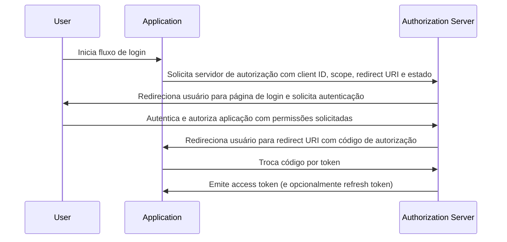

## O que é o fluxo de código de autorização?

O fluxo de código de autorização (também conhecido como concessão de código de autorização), definido na [OAuth 2.0 RFC 6749, seção 4.1](https://datatracker.ietf.org/doc/html/rfc6749#section-4.1), é um mecanismo de autorização OAuth 2.0 amplamente utilizado que permite que aplicações obtenham um access token em nome de um usuário. Este fluxo é particularmente adequado para aplicações confidenciais (por exemplo, aplicações web tradicionais do lado do servidor) onde o segredo do cliente pode ser armazenado com segurança.

O fluxo de código de autorização é um método robusto e seguro para obter access tokens no OAuth 2.0, tornando-se uma escolha preferida para muitas aplicações web. Compreender este fluxo é essencial para desenvolvedores que trabalham com OAuth 2.0 e integrações de API.

## Como funciona o fluxo de código de autorização?

O fluxo de código de autorização envolve os seguintes passos:

1. **Iniciação do fluxo**: O usuário inicia o fluxo, geralmente clicando em um link ou botão na aplicação para fazer login. A aplicação redireciona o usuário para o endpoint de autorização do servidor de autorização, passando o client ID, o scope solicitado, um redirect URI e um parâmetro de estado. O servidor de autorização valida os parâmetros e solicita que o usuário se autentique na página de login do servidor de autorização.
2. **Autenticação e autorização do usuário**: O usuário se autentica com o servidor de autorização e concede à aplicação permissão para acessar os recursos solicitados.
3. **Geração de código e redirecionamento**: O servidor de autorização gera um código de autorização e redireciona o usuário de volta para a aplicação usando o redirect URI fornecido anteriormente. O código de autorização é incluído na string de consulta do redirect URI.
4. **Troca de código**: A aplicação extrai o código de autorização da string de consulta e faz uma solicitação POST para o endpoint de token do servidor de autorização para trocar o código de autorização por um access token. A aplicação também deve incluir o client ID, client secret, redirect URI e o código de autorização na solicitação.
5. **Recuperação do access token**: O servidor de autorização valida o código de autorização e emite um access token (e opcionalmente um refresh token) para a aplicação após a validação bem-sucedida. A aplicação pode então usar o access token para fazer solicitações de API autorizadas em nome do usuário.

Os passos podem ser ilustrados pelo seguinte diagrama de sequência:



## Solicitação de autenticação

Os parâmetros da solicitação são os seguintes:

- **client_id**: OBRIGATÓRIO. Identificador de cliente OAuth 2.0 válido.
- **scope**: OBRIGATÓRIO. Este valor especifica um conjunto de recursos que o usuário está solicitando do servidor de autorização. Ex., `openid profile email`.
- **response_type**: OBRIGATÓRIO. O valor deve ser `code` para indicar que a aplicação espera um código de autorização.
- **redirect_uri**: OBRIGATÓRIO. O URI para o qual a resposta de autenticação será enviada, e deve corresponder exatamente ao redirect URI que o cliente pré-registrou no servidor de autorização.
- **state**: RECOMENDADO. Um valor opaco usado para manter o estado entre a solicitação e o callback. Também é usado para prevenir ataques de <Ref slug="csrf" />.
- **nonce**: OPCIONAL. Uma string aleatória usada para associar uma sessão de cliente com um ID token e mitigar ataques de repetição.
- **prompt**: OPCIONAL. Lista de valores de string delimitada por espaço e sensível a maiúsculas e minúsculas que especifica se o servidor de autorização solicita ao usuário final uma nova autenticação e consentimento. Os valores definidos são:
  - **none**: O servidor de autorização NÃO DEVE exibir nenhuma página de interface de usuário de autenticação ou consentimento. Um erro é retornado se um usuário final não estiver autenticado ou se o cliente não tiver consentimento pré-configurado para os Claims solicitados ou não cumprir outras condições para processar a solicitação. O código de erro será tipicamente `login_required`, `interaction_required`. Isso pode ser usado como um método para verificar a autenticação e/ou consentimento existentes.
  - **login**: O servidor de autorização DEVE solicitar ao usuário final uma nova autenticação. Se não puder reautenticar o usuário final, DEVE retornar um erro, tipicamente `login_required`.
  - **consent**: O servidor de autorização DEVE solicitar ao usuário final consentimento antes de retornar informações ao cliente. Se não puder obter consentimento, DEVE retornar um erro, tipicamente `consent_required`.
  - **select_account**: O servidor de autorização DEVE solicitar ao usuário final que selecione uma conta de usuário. Isso permite que um usuário final que tenha várias contas no servidor de autorização selecione entre as várias contas para as quais ele pode ter sessões atuais. Se não puder obter uma escolha de seleção de conta feita pelo usuário final, DEVE retornar um erro, tipicamente `account_selection_required`.

[Definição completa dos parâmetros da solicitação](https://openid.net/specs/openid-connect-core-1_0.html#AuthRequest)

### Exemplo de solicitação de autenticação

```bash
curl -X GET "https://authorization-server.com/auth" \
  -d "response_type=code" \
  -d "client_id=YOUR_APPLICATION_ID" \
  -d "redirect_uri=https://yourapp.com/callback" \
  -d "scope=openid profile email" \
  -d "state=RANDOM_STRING_FOR_STATE"
```

Uma resposta bem-sucedida típica:

```http
HTTP/1.1 302 Found
Location: https://yourapp.com/callback?
  code=YOUR_AUTHORIZATION_CODE
  &state=RANDOM_STRING_FOR_STATE
```

## Solicitação de troca de token

Uma vez que a solicitação de autenticação acima seja respondida com sucesso, o cliente será automaticamente redirecionado para o callback URI `https://yourapp.com/callback`, com o código como um parâmetro URI.

Espera-se que o cliente obtenha e processe o `code` com uma solicitação de troca de token subsequente, a fim de trocar pelo access token.

### Exemplo de solicitação de troca de token

```bash
curl -X POST "https://authorization-server.com/token" \
  -H "Content-Type: application/x-www-form-urlencoded" \
  -d "client_id=YOUR_CLIENT_ID" \
  -d "code=YOUR_AUTHORIZATION_CODE" \
  -d "redirect_uri=https://yourapp.com/callback" \
  -d "grant_type=authorization_code" \
```

## Benefícios

- **Segurança aprimorada**: O segredo do cliente nunca é exposto ao navegador do usuário, reduzindo o risco de personificação do cliente.
- **Código de autorização único**: O código de autorização tem uma vida útil curta e só pode ser usado uma vez, reduzindo o risco de interceptação e ataques de repetição.
- **Tokens de curta duração**: Access tokens emitidos neste fluxo são de curta duração (tipicamente 1 hora), reduzindo o risco de acesso não autorizado se o token for comprometido.
- **Refresh token**: O servidor de autorização pode opcionalmente emitir um refresh token, permitindo que a aplicação obtenha um novo access token sem exigir interação do usuário.

## Qual é a diferença entre o fluxo de código de autorização e o fluxo implícito?

A principal diferença entre o fluxo de código de autorização e o fluxo implícito é como o access token é obtido:

- **Fluxo de código de autorização**: A aplicação cliente recebe primeiro um código de autorização do endpoint de autorização, depois o troca por um access token em uma solicitação POST subsequente para o endpoint de token.
- **Fluxo implícito**: A aplicação cliente recebe o access token diretamente do endpoint de autorização.

## Qual é a diferença entre o fluxo de código de autorização e o fluxo de credenciais do cliente?

A principal diferença entre o fluxo de código de autorização e o fluxo de credenciais do cliente é o contexto em que o fluxo é usado:

- **Fluxo de código de autorização**: Usado quando a aplicação cliente precisa acessar recursos em nome de um usuário. O fluxo envolve autenticação e autorização do usuário.
- **Fluxo de credenciais do cliente**: Usado quando a aplicação cliente precisa acessar recursos em seu próprio nome. O fluxo envolve autenticação do cliente, mas não autenticação do usuário, sendo mais adequado para comunicação máquina a máquina.

## Quais são os casos de uso típicos para o fluxo de código de autorização?

- Aplicações web tradicionais que requerem autenticação do usuário e acesso a APIs.
- Aplicações que precisam acessar dados de usuários de serviços de terceiros de forma segura.

<SeeAlso slugs={['device-flow', 'implicit-flow', 'client-credentials-flow']} />

<Resources urls={['https://datatracker.ietf.org/doc/html/rfc6749']} />