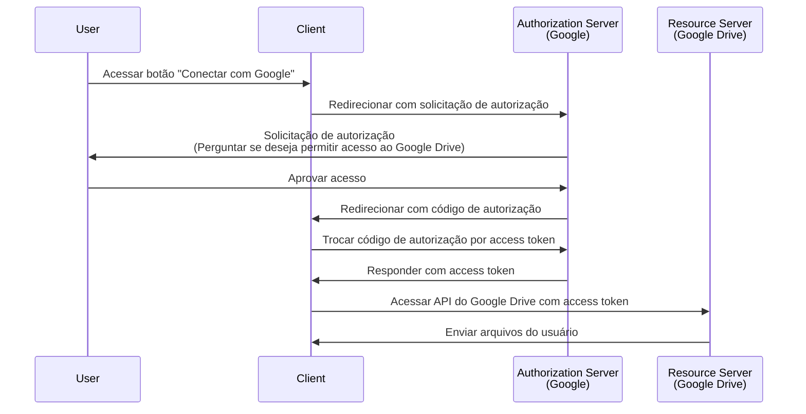

## O que é uma solicitação de autorização (authorization request)?

Dependendo do contexto, o termo "solicitação de autorização" pode se referir a diferentes coisas. Neste artigo, vamos nos concentrar na definição da especificação <Ref slug="oauth-2.0" />.

No OAuth 2.0, existem vários tipos de concessão (fluxos) que definem como um <Ref slug="client" /> pode obter autorização de um usuário para acessar recursos protegidos.

> ![Nota]
> "Solicitações de autorização" são frequentemente confundidas com "solicitações de autenticação" no contexto do <Ref slug="openid-connect" />. Veja <Ref slug="authentication-request" /> para detalhes específicos do OIDC.

## Como funciona uma solicitação de autorização (authorization request)?

Quando um cliente (aplicativo) deseja acessar recursos protegidos em nome de um usuário, ele inicia uma solicitação de autorização para o <Ref slug="authorization-server" />. O cliente deve indicar o tipo de concessão solicitado junto com os parâmetros necessários na solicitação.

Aqui estão alguns tipos de concessão (fluxos) típicos para autorização de usuário final no OAuth 2.0:

- <Ref slug="authorization-code-flow" />: O fluxo mais recomendado para autorização de usuários finais. Geralmente é usado com <Ref slug="pkce" /> para melhor segurança e é adequado para a maioria dos aplicativos.
- <Ref slug="implicit-flow" />: Um fluxo simplificado que está obsoleto no <Ref slug="oauth-2.1" /> devido a preocupações de segurança.
- [Concessão de credenciais de senha do proprietário do recurso (ROPC)](https://datatracker.ietf.org/doc/html/rfc6749#section-4.3): Uma concessão (fluxo) onde as credenciais do usuário são trocadas diretamente por um access token. Este fluxo não é recomendado devido a riscos de segurança.

Existem também outras extensões, como o <Ref slug="device-flow" /> para dispositivos com capacidades de entrada limitadas. Cada fluxo tem suas próprias características e casos de uso. Para a maioria dos aplicativos web, o fluxo de código de autorização é a escolha recomendada.

> A autorização <Ref slug="machine-to-machine" /> é tipicamente feita usando o <Ref slug="client-credentials-flow" />, que não envolve interação do usuário.

Por exemplo, um cliente (aplicativo) pode solicitar autorização para acessar os arquivos do Google Drive de um usuário. Aqui está um diagrama de sequência simplificado do fluxo de código de autorização:

Uma vez que o <Ref slug="access-token" /> é obtido, o cliente pode usá-lo para acessar os arquivos do Google Drive do usuário em nome do usuário.

### Parâmetros chave em uma solicitação de autorização (authorization request)

A solicitação de autorização OAuth 2.0 geralmente inclui os seguintes parâmetros:

- **`response_type`**: O tipo de resposta que o cliente espera. Valores comuns são `code` para o fluxo de código de autorização e `token` para o fluxo implícito.
- **`client_id`**: O identificador do cliente emitido pelo servidor de autorização.
- **`redirect_uri`**: O URI para onde o servidor de autorização envia o usuário após o processo de autorização.
- **`scope`**: Os <Ref slug="scope">escopos</Ref> (permissões) solicitados para o access token.
- **`resource`**: O parâmetro opcional que especifica o <Ref slug="resource-indicator" /> para os recursos solicitados. O servidor de autorização precisa suportar [RFC 8707](https://datatracker.ietf.org/doc/html/rfc8707) para usar este parâmetro.

Os parâmetros acima não são exaustivos. Os parâmetros reais e seus valores dependem do tipo de concessão e dos requisitos específicos do aplicativo.

<SeeAlso slugs={["oauth-2.0", "authentication-request", "authorization-code-flow", "implicit-flow", "device-flow"]} />

<Resources
  urls={[
    { url: "https://datatracker.ietf.org/doc/html/rfc6749#section-4", result: {
      ogTitle: "Obtendo Autorização no OAuth 2.0",
      ogDescription: "Para solicitar um access token, o cliente obtém autorização do proprietário do recurso."
    } }
  ]}
/>