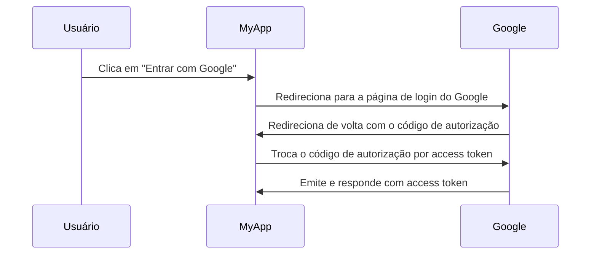

## O que é um servidor de autorização?

O termo "servidor de autorização" pode ser um termo geral que se refere a qualquer servidor que realiza autorização. Vamos nos concentrar na definição no contexto dos frameworks <Ref slug="oauth-2.0" /> e <Ref slug="openid-connect" />.

No OAuth 2.0, um servidor de autorização é um componente que emite <Ref slug="access-token">access tokens</Ref> para <Ref slug="client">clients</Ref> após autenticar e autorizar com sucesso. Os access tokens são usados por clients para acessar recursos protegidos em nome do usuário (resource owner).

Muitos termos? Vamos ver um exemplo do mundo real: um usuário clica em "Entrar com Google" em um aplicativo "MyApp" que usa <Ref slug="authorization-code-flow" /> para login com Google.

Neste exemplo, o Google atua como o **servidor de autorização** que emite um access token para o **client** (MyApp) após o usuário fazer login com sucesso. O client pode então usar o **access token** para buscar o perfil do usuário (recurso protegido) no Google.

### Servidor de autorização no OpenID Connect (OIDC)

Como o OpenID Connect é construído sobre o OAuth 2.0, ele reutiliza alguns termos e conceitos do OAuth 2.0. O OIDC adiciona a capacidade de autenticação ao servidor de autorização do OAuth 2.0, o que torna o servidor de autorização também um <Ref slug="openid-connect" headingId="openid-provider-op" />. Para evitar ambiguidades, recomendamos sempre usar o termo "OpenID Provider" ao se referir ao servidor de autorização no OIDC.

Além de emitir access tokens, o OpenID Provider (servidor de autorização) no OIDC também emite <Ref slug="id-token">ID tokens</Ref> para clients. Os ID tokens contêm informações do usuário e são usados para autenticar usuários.

## Como funciona um servidor de autorização?

Um servidor de autorização deve suportar os <Ref slug="oauth-2.0-grant">OAuth 2.0 grants (fluxos)</Ref> para emitir access tokens para clients. Um tipo de grant geralmente consiste em uma série de etapas que o client e o servidor de autorização seguem para obter um access token.

- Para autorização de usuário, a maioria dos tipos de grant requer que o client inicie uma <Ref slug="authorization-request" /> para o servidor de autorização. No exemplo acima de login com Google, a etapa "Redirecionar para a página de login do Google" é uma authorization request iniciada pelo client.
- Para autorização <Ref slug="machine-to-machine" />, o client pode usar o <Ref slug="client-credentials-flow" /> para enviar diretamente uma <Ref slug="token-request" /> para o servidor de autorização.

O servidor de autorização também deve validar a solicitação do client, autenticar o client e verificar a identidade do usuário antes de emitir um access token. Ele também pode impor medidas de segurança adicionais, como <Ref slug="pkce" /> para o <Ref slug="authorization-code-flow" />.

## Casos de uso do servidor de autorização

Como o nome sugere, servidores de autorização são usados para lidar com <Ref slug="authorization" />. O servidor de autorização pode envolver primeiras e terceiras partes:

- O exemplo acima de login com Google.
- Um site de e-commerce (client) solicitando acesso às informações de pagamento de um usuário (recurso protegido) de outro site.
- Um aplicativo móvel (client) solicitando acesso aos dados de localização de um usuário (recurso protegido) de um provedor de serviços de localização.

Ou, ele pode ser usado apenas para autorização interna, como:

- Um usuário precisa acessar seus pedidos (recurso protegido) em um site de e-commerce (client).
- Um serviço (client) precisa acessar um banco de dados (recurso protegido) em uma arquitetura de microsserviços.

Em aplicações modernas, um servidor de autorização também pode ser um <Ref slug="identity-provider" /> que também suporta <Ref slug="openid-connect" /> para autenticação de usuários.

<SeeAlso slugs={["oauth-2.0", "authorization-request", "access-token"]} />
 
<Resources
  urls={[
    "https://blog.logto.io/ciam-102-authz-and-rbac",
    "https://tools.ietf.org/html/rfc6749",
  ]}
/>