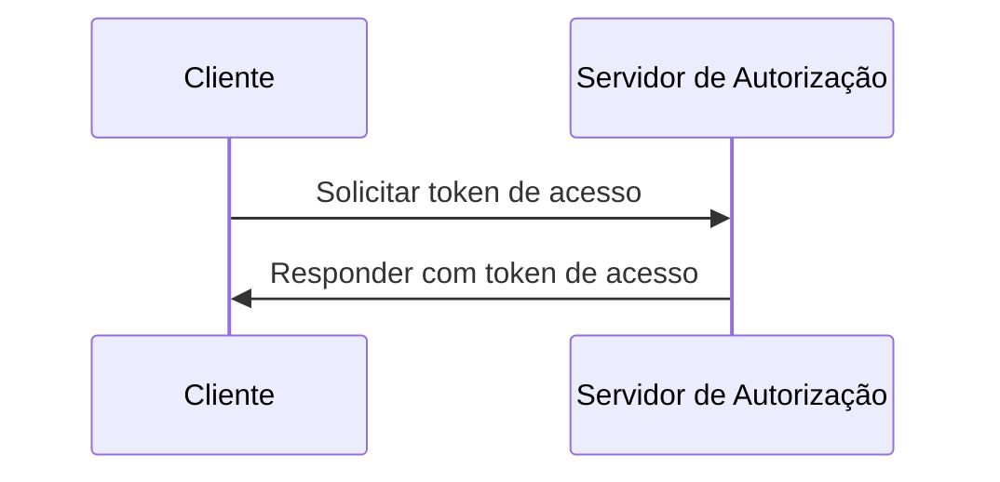
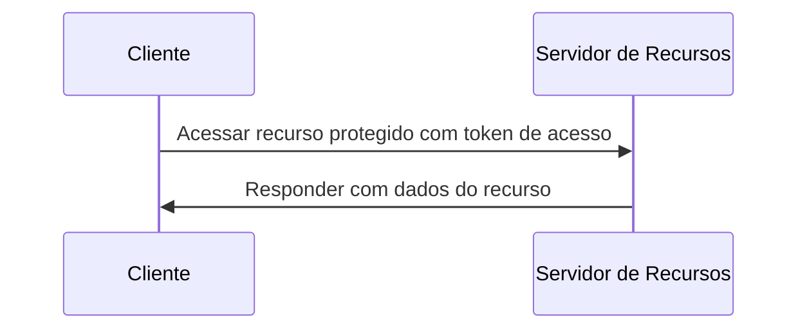

## O que é o fluxo de credenciais do cliente?

O fluxo de credenciais do cliente (client credentials flow) é um tipo de <Ref slug="oauth-2.0-grant" /> que permite que clientes confidenciais obtenham <Ref slug="access-token">tokens de acesso</Ref> para acessar recursos protegidos. Normalmente, esse fluxo é usado para comunicação <Ref slug="machine-to-machine" /> onde o cliente é um servidor ou um serviço.

> [!Note]
> O fluxo de credenciais do cliente não é adequado para autorização de usuário final. Para autorização de usuário final, você deve usar <Ref slug="authentication-request" /> ou <Ref slug="authorization-request" />.

## Como funciona o fluxo de credenciais do cliente?

O fluxo de credenciais do cliente é um processo simples de duas etapas:

1. **Solicitação de token**: O cliente envia uma <Ref slug="token-request" /> com suas credenciais de cliente (ID do cliente e segredo do cliente) e os <Ref slug="scope">escopos</Ref> solicitados.
2. **Resposta de token**: O <Ref slug="authorization-server" /> valida as credenciais do cliente e emite um token de acesso se o cliente estiver autorizado.

Aqui está um diagrama de sequência simplificado do fluxo de credenciais do cliente:



Aqui está um exemplo não normativo de uma solicitação de token no fluxo de credenciais do cliente:

```http
POST /token HTTP/1.1
Host: your-authorization-server.com
Content-Type: application/x-www-form-urlencoded

grant_type=client_credentials
  &client_id=YOUR_CLIENT_ID
  &client_secret=YOUR_CLIENT_SECRET
  &scope=read write
```

O servidor de autorização validará as credenciais do cliente e emitirá um token de acesso se o cliente estiver autorizado. Uma vez que o cliente recebe o token de acesso, ele pode usá-lo para acessar recursos protegidos (por exemplo, uma API) em seu próprio nome. Aqui está um exemplo de como um cliente usa o token de acesso para acessar uma API:



Observe que o <Ref slug="resource-server" /> deve validar o token de acesso e aplicar as políticas de <Ref slug="access-control" /> para garantir que o cliente tenha as permissões necessárias para acessar o recurso.

### Parâmetros chave em uma solicitação de token no fluxo de credenciais do cliente

Ao contrário de outros fluxos do OAuth 2.0, o fluxo de credenciais do cliente tem uma <Ref slug="token-request" /> simples com os seguintes parâmetros chave:

- **`grant_type`**: O tipo de concessão deve ser definido como `client_credentials` para indicar o fluxo de credenciais do cliente.
- **`client_id`**: O identificador do cliente emitido pelo servidor de autorização.
- **`client_secret`**: O segredo do cliente emitido pelo servidor de autorização.
- **`scope`**: Os <Ref slug="scope">escopos</Ref> (permissões) solicitados para o token de acesso.
- **`resource`**: O parâmetro opcional que especifica o <Ref slug="resource-indicator" /> para os recursos solicitados. O servidor de autorização precisa suportar [RFC 8707](https://datatracker.ietf.org/doc/html/rfc8707) para usar este parâmetro.

## Considerações de segurança

### Clientes confidenciais

O fluxo de credenciais do cliente é adequado para <Ref slug="client" headingId="confidential-clients" /> (clientes confidenciais) que podem armazenar com segurança o segredo do cliente. Se o cliente for um cliente público (por exemplo, uma aplicação de página única), ele não deve usar o fluxo de credenciais do cliente porque o segredo do cliente pode ser exposto.

### Expiração do token

Embora o token de acesso obtido no fluxo de credenciais do cliente possa ter um longo tempo de expiração, é recomendado usar tokens de acesso de curta duração (por exemplo, 1 hora) para reduzir o risco de acesso não autorizado se o token for comprometido.

### Rotação do segredo do cliente

Para aumentar a segurança, é recomendado rotacionar o segredo do cliente periodicamente. O servidor de autorização deve suportar a rotação do segredo do cliente sem afetar a capacidade do cliente de obter tokens de acesso. Por exemplo, o servidor de autorização deve suportar múltiplos segredos de cliente para compatibilidade retroativa durante o processo de rotação.

<SeeAlso slugs={["machine-to-machine", "token-request", "access-token", "scope", "resource-indicator"]} />

<Resources
  urls={[
    "https://blog.logto.io/programmatic-authentication-methods",
    { 
      url: "https://datatracker.ietf.org/doc/html/rfc6749#section-4.4",
      result: {
        ogTitle: "Client Credentials Grant",
        ogDescription: "The client can request an access token using only its client credentials (or other supported means of authentication) when the client is requesting access to the protected resources under its control, or those of another resource owner that have been previously arranged with the authorization server."
      }
    }
  ]}
/>