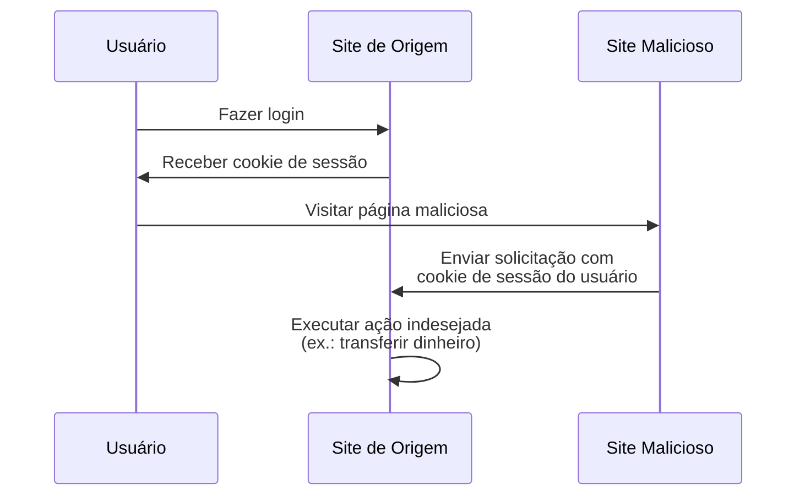

## O que é falsificação de solicitação entre sites (CSRF)?

Ao desenvolver aplicações web, CSRF é um termo frequentemente ouvido que traz medo para desenvolvedores e profissionais de segurança. É um tipo de ataque que engana (ou ilude) usuários autenticados para executar ações indesejadas em uma aplicação web sem consentimento.

CSRF também é conhecido como "ataque de um clique" ou "cavalgar sessão" porque depende da sessão ativa do usuário para realizar ações maliciosas.

## Como o CSRF funciona?

O ataque CSRF funciona explorando a confiança que uma aplicação web tem no navegador do usuário. Veja como isso geralmente acontece:



Você pode ter algumas perguntas sobre essa sequência. Vamos explorar as razões por trás disso.

### Por que o site malicioso pode enviar uma solicitação para o site de origem?

A Política de Mesma Origem (SOP) é um recurso de segurança em navegadores web que restringe como um documento ou script carregado de uma origem pode interagir com um recurso (ex.: cookies, DOM) de outra origem. No entanto, a SOP não impede que o navegador envie solicitações para outra origem.

Assim, embora o site malicioso não possa ler ou modificar diretamente o cookie de sessão, ele ainda pode enviar solicitações para o site de origem usando a sessão ativa do usuário.

Você pode argumentar que a maioria das aplicações web também usa [CORS](https://developer.mozilla.org/en-US/docs/Web/HTTP/CORS) para prevenir solicitações não autorizadas entre origens, mas o CSRF ainda tem uma maneira de contorná-lo:

1. Ataques baseados em GET: O site malicioso pode enganar o usuário para visitar uma URL que executa uma ação no site de origem:

    - Um redirecionamento para `https://example.com/transfer?amount=1000&to=attacker`.
    - Uma tag de imagem que carrega `https://example.com/transfer?amount=1000&to=attacker`.

    Essa é uma razão importante pela qual solicitações GET não devem ter efeitos colaterais.

2. Ataques baseados em formulário: O site malicioso pode criar um formulário oculto que envia dados para o site de origem. Por exemplo, uma solicitação POST para `https://example.com/transfer` com campos de formulário ocultos.

### Por que o site malicioso tem o cookie de sessão do usuário?

O navegador do usuário envia automaticamente cookies para o site de origem ao fazer solicitações. É assim que o site de origem sabe que o usuário está autenticado e pode realizar ações em seu nome.

Na verdade, o site malicioso não "tem" o cookie de sessão; ele apenas explora o comportamento do navegador para enviar o cookie junto com a solicitação.

## Como prevenir ataques CSRF?

Prevenir ataques CSRF requer uma abordagem em várias camadas que envolve tanto o servidor quanto o cliente. Aqui estão algumas técnicas comuns para mitigar vulnerabilidades CSRF:

### Use tokens anti-CSRF

Tokens anti-CSRF são valores aleatórios gerados pelo servidor e incorporados nos formulários da aplicação web. Quando o formulário é enviado, o servidor valida o token para garantir que a solicitação é legítima.

Por exemplo, um campo de entrada oculto em um formulário HTML:

```html
<form action="/transfer" method="post">
  <input type="hidden" name="csrf_token" value="random_token_here" />
  <!-- Outros campos do formulário -->
  <button type="submit">Transferir</button>
</form>
```

Com essa abordagem, o site malicioso não pode forjar uma solicitação porque não conhece o token anti-CSRF. O parâmetro `state` em <Ref slug="redirect-uri" /> é um conceito semelhante.

### Use cookies SameSite

O atributo `SameSite` em cookies pode prevenir ataques CSRF restringindo quando os cookies são enviados para o servidor:

| Valor `SameSite` | Descrição                                                                          |
|------------------|-------------------------------------------------------------------------------------|
| `Strict`         | Cookies são enviados apenas em um contexto de primeira parte.                       |
| `Lax`            | Cookies são enviados em um contexto de primeira parte e com solicitações GET de sites externos. |
| `None`           | Cookies são enviados em todos os contextos. Requer o atributo `Secure`.             |

Ao definir o atributo `SameSite` como `Strict` ou `Lax` sem efeitos colaterais em suas solicitações GET, você pode prevenir ataques CSRF.

Além disso, o atributo `Secure` deve ser sempre definido para garantir que o cookie seja enviado apenas por conexões HTTPS.

### Verifique os cabeçalhos

1. **Cabeçalho Origin**: O cabeçalho `Origin` é enviado pelo navegador para indicar a origem da solicitação. O servidor pode verificar esse cabeçalho para garantir que a solicitação está vindo de uma origem esperada.
2. **Cabeçalho Referer**: O cabeçalho `Referer` contém a URL da página anterior. Embora possa ser falsificado, ainda pode ser usado como uma camada adicional de proteção.

<SeeAlso slugs={["authorization-code-flow", "redirect-uri"]} />

<Resources
  urls={[
    'https://blog.logto.io/csrf',
    "https://cheatsheetseries.owasp.org/cheatsheets/Cross-Site_Request_Forgery_Prevention_Cheat_Sheet.html",
  ]}
/>