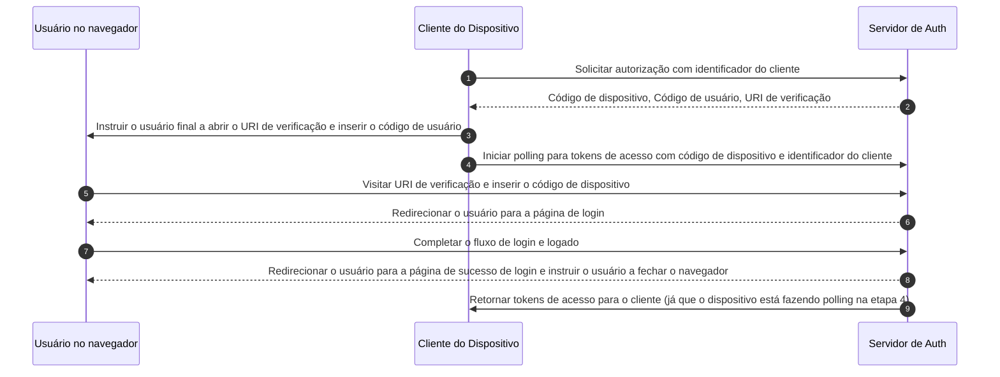

## O que é o fluxo de dispositivo?

O [Fluxo de Autorização de Dispositivo OAuth](https://www.rfc-editor.org/rfc/rfc8628), também conhecido como fluxo de dispositivo, é um <Ref slug="oauth-2.0-grant" /> projetado para dispositivos com capacidades de entrada limitadas (por exemplo, smart TVs, dispositivos IoT, consoles de jogos) ou aplicativos sem interface (por exemplo, ferramentas CLI). Ele permite que os usuários iniciem <Ref slug="authorization-request">solicitações de autorização</Ref> nesses dispositivos e depois completem o processo usando um dispositivo com mais capacidade de entrada, como um smartphone ou laptop.

## Quando usar o fluxo de dispositivo?

1. **Dispositivos com entrada limitada**
    - Fazer login em Smart TVs (por exemplo, aplicativos de mídia)
    - Fazer login em Consoles de Jogos (por exemplo, sistema de jogos ou aplicativos de mídia)
    - Fazer login em Dispositivos de Reunião (por exemplo, aplicativos oficiais ou aplicativos de videoconferência)
    - Fazer login em Dispositivos Vestíveis (por exemplo, smartwatches com entrada limitada)
    - Acessar dispositivos IoT (por exemplo, impressoras, codificadores de vídeo ou alto-falantes)
2. **Aplicativos sem interface**
    - Login em Interface de Linha de Comando (por exemplo, GitHub CLI ou Stripe CLI)
3. **Login com Código QR para Aplicativos de Desktop**
    - Fazer login rápida e seguramente em aplicativos de desktop escaneando um código QR com seu smartphone (por exemplo, Telegram, Steam em desktops). Este fluxo de login com código QR pode ser considerado uma variante do fluxo de dispositivo tradicional OAuth 2.0.

## Como é o fluxo de usuário final do fluxo de dispositivo?

Ignorando a variante de login com código QR, vamos nos concentrar no fluxo de dispositivo padrão OAuth 2.0. Existem dois tipos de dispositivos envolvidos:

### Dispositivo de exibição de código de dispositivo

Este é o dispositivo com entrada limitada ou aplicativo sem interface onde o usuário precisa autorizar o acesso. Ele exibe o [código de dispositivo e URI de verificação](#what-does-device-flow-workflow-look-like), orientando o usuário sobre como proceder.

A interface básica é:


Para melhorar a experiência do usuário, os serviços geralmente geram um código QR para o URL de Verificação:


Para ainda mais eficiência, substitua o recurso de código QR no `verification_uri` (por exemplo, `https://example.com/device`) por `verification_uri_complete` (por exemplo, `https://example.com/device?user_code=DSHP-SNCT`), que inclui o código de dispositivo no URL, ajudando os usuários a pré-preencher o código de dispositivo nos campos.

### Dispositivo de autorização

Seguindo as instruções no dispositivo alvo de login, o usuário irá:

1. Usar outro dispositivo com acesso ao navegador e capacidades de entrada para abrir o URL de Verificação.
2. Inserir o código de dispositivo exibido (que pode estar pré-preenchido) e continuar.
3. Se não houver sessões existentes no navegador, o usuário primeiro fará login no serviço.
4. Uma página de consentimento solicitará aos usuários que autorizem o login do dispositivo.
5. Finalmente, uma página de sucesso será exibida após a autorização.


Aqui estão alguns URLs de Verificação de fluxo de dispositivo de produtos estabelecidos para seu teste:

- Faça login no [Youtube em smart TVs](https://www.youtube.com/watch?v=yTcuazSy5Cs): [youtube.com/activate](https://youtube.com/activate)
- Faça login no Disney+ em smart TV: [disneyplus.com/begin](https://disneyplus.com/begin)
- Faça login no [Shopify no Samsung Galaxy Watch](https://www.drmare.com/spotify-music/spotify-on-galaxy-watch.html): [spotify.com/pair](https://spotify.com/pair)
- Faça login no [Zoom em dispositivos de reunião](https://developers.zoom.us/blog/device-authorization/): [zoom.us/oauth_device](https://zoom.us/oauth_device)
- Faça login no [GitHub CLI](https://docs.github.com/en/apps/oauth-apps/building-oauth-apps/authorizing-oauth-apps#device-flow): [github.com/login/device](https://github.com/login/device)
- Utilize o [fluxo de dispositivo do Google](https://www.oauth.com/oauth2-servers/device-flow/user-flow/): https://www.google.com/device

## Como é o fluxo de trabalho do fluxo de dispositivo?

Primeiro, você deve entender os parâmetros da resposta de autorização de dispositivo, que é usada para lidar com as informações exibidas no dispositivo de exibição de código de dispositivo:

| Parâmetro                              | Descrição                                                                                                                                                                    |
| -------------------------------------- | ---------------------------------------------------------------------------------------------------------------------------------------------------------------------------- |
| `device_code`                          | O código de verificação do dispositivo.                                                                                                                                      |
| `user_code`                            | O código de verificação do usuário final.                                                                                                                                    |
| `verification_uri`                     | O URI de verificação do usuário final no servidor de autorização. O URI deve ser curto e fácil de lembrar, pois os usuários finais serão solicitados a digitá-lo manualmente em seu agente de usuário. |
| `verification_uri_complete` (opcional) | Um URI de verificação que inclui o "user_code" (ou outras informações com a mesma função que o "user_code"), que é projetado para transmissão não textual.                   |
| `expires_in`                           | O tempo de vida em segundos do "device_code" e "user_code".                                                                                                                  |
| `interval`                             | A quantidade mínima de tempo em segundos que o cliente DEVE esperar entre solicitações de polling para o endpoint de token. Se nenhum valor for fornecido, os clientes DEVEM usar 5 como padrão. |

```json
{
    "device_code": "GmRhmhcxhwAzkoEqiMEg_DnyEysNkuNhszIySk9eS",
    "user_code": "WDJBMJHT",
    "verification_uri": "https://custom.domain.com/device",
    "verification_uri_complete":
        "https://custom.domain.com/device?user_code=WDJB-MJHT",
    "expires_in": 900,
    "interval": 5
}
```

Quando um usuário usa o fluxo de dispositivo para autenticação, ele inclui principalmente as seguintes etapas:



1. O cliente do dispositivo solicita autorização do servidor de auth com um identificador de cliente (geralmente o id do cliente na plataforma do servidor de auth).
2. O servidor de auth responde ao cliente do dispositivo com código de dispositivo, código de usuário e URI de verificação.
3. O cliente do dispositivo exibe o URI de verificação e o código de usuário para o usuário na forma de texto (ou um código QR, etc.), instruindo o usuário a visitar o URI e inserir o código.
4. Ao mesmo tempo que a etapa 3, o cliente do dispositivo inicia o polling para tokens de acesso com código de dispositivo e identificador do cliente do servidor de auth e começa a esperar que o usuário revise a <Ref slug="authorization-request" /> e complete a autorização do usuário.
5. O usuário visita o URI de verificação hospedado pelo servidor de auth, via um navegador em outro dispositivo, e insere o código de usuário.
6. O servidor de auth redireciona o usuário para a página de login e instrui o usuário a completar o login.
7. O usuário completa o fluxo de login e loga com sucesso.
8. O servidor de auth redireciona o usuário para a página de sucesso de login e instrui o usuário a fechar o navegador.
9. Ao mesmo tempo que a etapa 8, o servidor de auth retorna tokens de acesso para o cliente do dispositivo, já que o cliente está fazendo polling desde a etapa 4.

Após esses processos, o cliente do dispositivo poderá obter o <Ref slug="access-token" /> para serviços subsequentes.

Para mais detalhes, leia [RFC 8628 OAuth 2.0 Device Authorization Grant](https://datatracker.ietf.org/doc/html/rfc8628#autoid-3).

## Quais são as considerações de segurança para o fluxo de dispositivo?

O fluxo de dispositivo envolve interação entre dois dispositivos, expondo-o a potenciais riscos de segurança, como exposição de código de dispositivo, ataques de força bruta ou ataques man-in-the-middle (MitM).

Embora obter um código de dispositivo sozinho não conceda imediatamente autorização (já que o usuário ainda deve autenticar e autorizar), um atacante poderia tentar reproduzir uma solicitação de código de dispositivo durante seu período de validade. Isso poderia resultar em acesso repetido não autorizado. Para aumentar a segurança, considere as seguintes precauções:

- **Reduzir a duração de `expires_in`:** Reduza a janela de oportunidade para ataques minimizando o período de validade do código de dispositivo.
- **Limitar tentativas falhas:** Restrinja o número de entradas de código incorretas para evitar ataques de força bruta.
- **Impor HTTPS:** Garanta que toda a comunicação entre o dispositivo e o servidor de autorização seja criptografada usando HTTPS para evitar ataques man-in-the-middle.
- **Limitar códigos de dispositivo de uso único:** Restrinja cada código de dispositivo a **uma única sessão** para evitar seu reuso por partes não autorizadas.

Note que o uso único para códigos de dispositivo não é um requisito embutido do Fluxo de Dispositivo OAuth 2.0. É uma prática recomendada opcional. Alguns desenvolvedores podem intencionalmente projetar para autorizações de dispositivo concorrentes com o mesmo código (por exemplo, em centenas de dispositivos), mas essa abordagem aumenta os riscos de segurança e deve ser cuidadosamente avaliada.

## Os provedores OIDC suportam o fluxo de dispositivo?

Embora o fluxo de dispositivo seja tradicionalmente associado ao OAuth, os provedores de <Ref slug="openid-connect" /> também podem suportá-lo. O OIDC oferece vantagens adicionais além do foco principal do OAuth na autorização. Ele se estende à autenticação, permitindo que aplicativos obtenham tanto <Ref slug="access-token" /> quanto <Ref slug="id-token" /> em um único fluxo.

A robusta gestão de identidade unificada do OIDC, incluindo validação de token e <Ref slug="refresh-token">atualização</Ref>, o torna bem adequado para <Ref slug="authentication" /> segura e confiável e <Ref slug="authorization" /> entre dispositivos e aplicativos, particularmente aqueles com capacidades de entrada limitadas.

<SeeAlso slugs={['oauth-2.0-grant', 'authorization-code-flow', 'implicit-flow', 'client-credentials-flow']} />

<Resources urls={['https://blog.logto.io/a-brief-introduction-to-oauth2-device-flow', 'https://datatracker.ietf.org/doc/html/rfc8628']} />