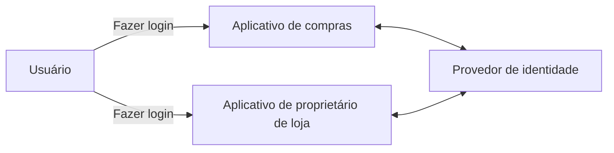
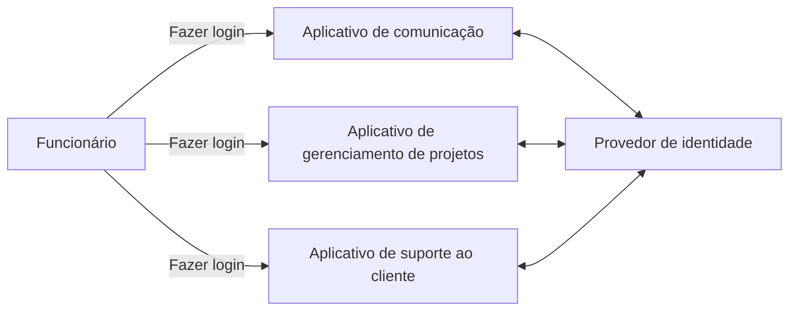
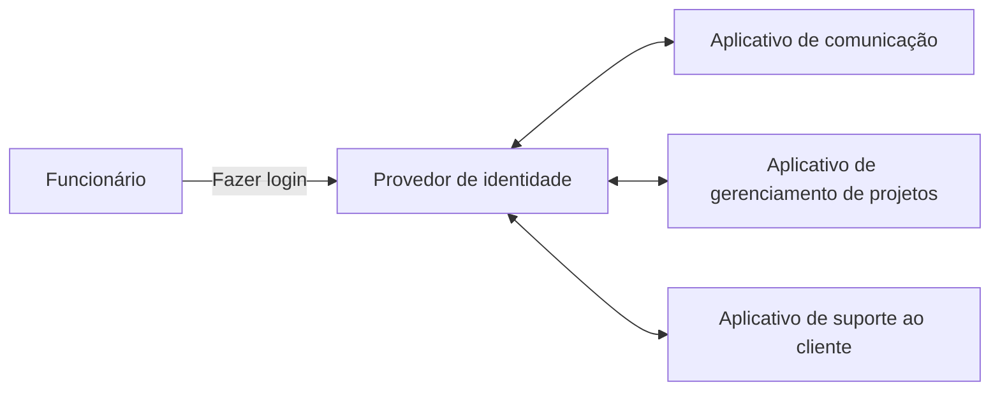
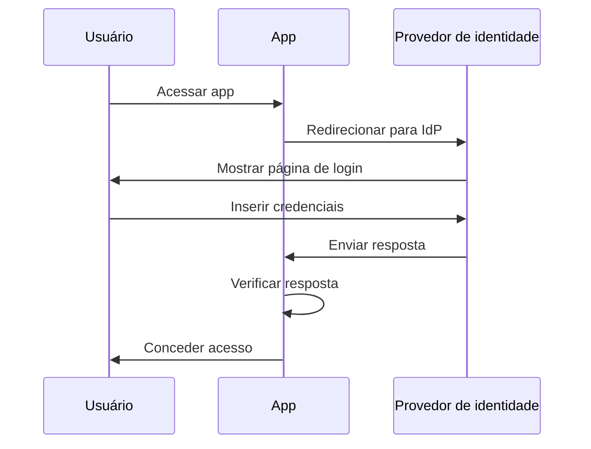
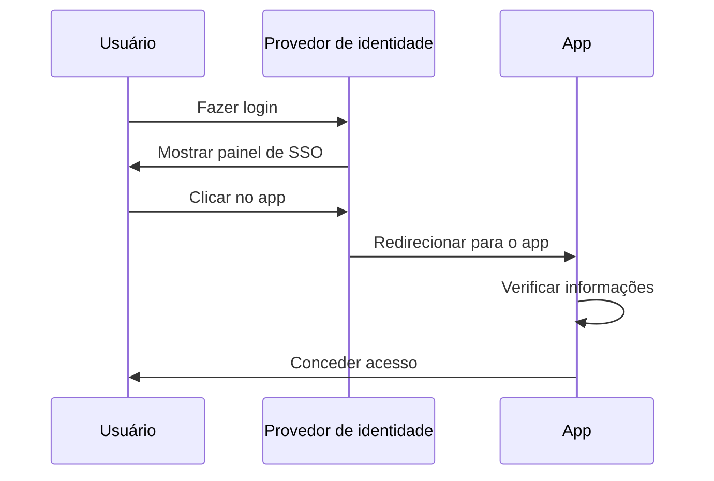
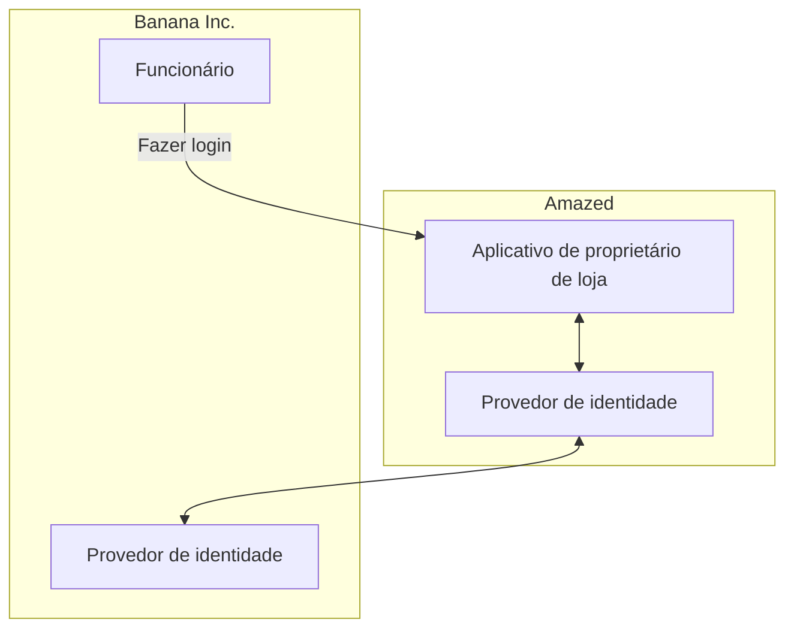

## O que é SSO Empresarial?

Antes de mergulhar na definição, é importante esclarecer a diferença entre SSO e SSO Empresarial, pois isso pode causar confusão.

- <Ref slug="single-sign-on" /> é um termo geral que se refere à capacidade de um usuário de fazer login uma vez e acessar múltiplas aplicações ou recursos sem precisar fazer login novamente.
- SSO Empresarial é um tipo específico de SSO projetado para funcionários dentro de uma organização.

Ainda está em dúvida? Vamos ver um exemplo:

Um site de compras online chamado _Amazed_ tem duas aplicações web: uma para clientes e outra para proprietários de lojas. Os clientes fazem login no aplicativo de compras para comprar produtos, enquanto os proprietários de lojas fazem login no aplicativo de proprietários de lojas para gerenciar suas lojas. Ambos os aplicativos usam o mesmo provedor de identidade para autenticação. Como resultado, os usuários só precisam fazer login uma vez para acessar ambos os aplicativos, proporcionando uma experiência de single sign-on.

Internamente, _Amazed_ usa múltiplas aplicações para comunicação em equipe, gerenciamento de projetos e suporte ao cliente. Para simplificar os fluxos de trabalho diários, _Amazed_ implementa SSO Empresarial para seus funcionários. Com o SSO Empresarial, os funcionários podem acessar todas as aplicações internas com um único login.

Tipicamente, soluções de SSO Empresarial também fornecem um painel centralizado para que os funcionários acessem todas as aplicações com um clique. Este painel é frequentemente chamado de painel de SSO.

Em resumo, ambos os cenários são exemplos de single sign-on. A diferença é que o primeiro exemplo é um SSO genérico, enquanto o segundo é SSO Empresarial. Estes são casos de uso típicos para Customer IAM (Identity and Access Management) e Workforce IAM, respectivamente.

## Como funciona o SSO Empresarial?

O SSO Empresarial funciona conectando múltiplas aplicações a um provedor de identidade centralizado. A conexão pode ser unidirecional (da aplicação para o provedor de identidade) ou bidirecional (entre a aplicação e o provedor de identidade). Vários padrões e protocolos, como SAML, OpenID Connect e OAuth 2.0, são usados para essas conexões.

Independentemente do protocolo, o fluxo básico geralmente é semelhante:

1. O usuário acessa uma aplicação (por exemplo, aplicativo de comunicação) que requer autenticação.
2. A aplicação redireciona o usuário para o provedor de identidade para autenticação.
3. O usuário faz login no provedor de identidade.
4. O provedor de identidade envia uma resposta de autenticação de volta para a aplicação.
5. A aplicação verifica a resposta e concede acesso ao usuário.

Quando o usuário acessa outra aplicação (por exemplo, aplicativo de gerenciamento de projetos) conectada ao mesmo provedor de identidade, ele é automaticamente logado sem precisar inserir suas credenciais novamente. Nesse caso, o passo 3 é pulado, e como os passos 2, 4 e 5 ocorrem em segundo plano, o usuário pode nem perceber o processo de autenticação.

Esse processo é chamado de SSO Iniciado pelo Provedor de Serviço (SP), onde a aplicação (SP) inicia o processo de autenticação.

Em outro cenário, o provedor de identidade fornece um painel centralizado para que os usuários acessem todas as aplicações conectadas. Um fluxo simplificado é:

1. O usuário faz login no provedor de identidade.
2. O provedor de identidade exibe uma lista de aplicações que o usuário pode acessar.
3. O usuário clica em uma aplicação (por exemplo, aplicativo de suporte ao cliente) para acessá-la.
4. O provedor de identidade redireciona o usuário para a aplicação com informações de autenticação.
5. A aplicação verifica as informações e concede acesso ao usuário.

Esse processo é chamado de SSO Iniciado pelo Provedor de Identidade (IdP), onde o provedor de identidade (IdP) inicia o processo de autenticação.

## Por que o SSO Empresarial é importante?

### SSO Empresarial no Workforce IAM

#### Gestão centralizada

O principal benefício do SSO Empresarial não é apenas a conveniência para os funcionários, mas também a segurança e conformidade aprimoradas para as organizações. Em vez de gerenciar múltiplas credenciais para diferentes aplicações e configurar autenticação e autorização separadamente para cada uma, as organizações podem centralizar o gerenciamento de identidades de usuários, políticas de controle de acesso e logs de auditoria.

Por exemplo, quando um funcionário sai da empresa, o departamento de TI pode desativar a conta do funcionário no provedor de identidade, revogando imediatamente o acesso a todas as aplicações. Isso é crucial para prevenir acessos não autorizados e violações de dados, um processo conhecido como gerenciamento de ciclo de vida.

#### Controle de acesso

Soluções de SSO Empresarial frequentemente incluem recursos de controle de acesso, como controle de acesso baseado em papéis (RBAC) e controle de acesso baseado em atributos (ABAC). Esses recursos permitem que as organizações definam políticas de acesso detalhadas com base em papéis de usuários, atributos e outras informações contextuais, garantindo que os funcionários tenham o nível certo de acesso aos recursos certos.

Para uma comparação detalhada entre RBAC e ABAC, confira [RBAC e ABAC: Os modelos de controle de acesso que você deve conhecer](https://blog.logto.io/rbac-and-abac).

#### Segurança aprimorada

Outro benefício é a capacidade de impor métodos de autenticação fortes, como autenticação multifator (MFA), autenticação sem senha e autenticação adaptativa, em todas as aplicações. Esses métodos ajudam a proteger dados sensíveis e a cumprir com regulamentações do setor.

Para mais informações sobre MFA, consulte [Explorando MFA: Olhando para a autenticação de uma perspectiva de produto](https://blog.logto.io/elaborate-mfa).

### SSO Empresarial no Customer IAM

O termo "SSO Empresarial" também aparece em soluções de Customer IAM. O que isso significa nesse contexto? Vamos revisitar o exemplo do _Amazed_: Alguns proprietários de lojas são incorporados como empresas. Um proprietário de loja, _Banana Inc._, implementa SSO Empresarial para seus funcionários. Como parte do acordo, _Banana Inc._ exige que _Amazed_ imponha SSO Empresarial para todos os endereços de e-mail de _Banana Inc._ (por exemplo, `*@banana.com`) ao acessar o aplicativo de proprietário de loja.

Nesse caso, _Amazed_ precisa integrar seu provedor de identidade com o provedor de identidade de _Banana Inc._ para habilitar o SSO Empresarial para os funcionários de _Banana Inc._. Essa integração, frequentemente feita por meio de protocolos padrão como SAML, OpenID Connect ou OAuth, é comumente referida como conexão de SSO Empresarial, conector de SSO Empresarial ou federação de SSO.

Para uma explicação detalhada sobre Customer IAM, confira a série CIAM:

- [CIAM 101: Autenticação, Identidade, SSO](https://blog.logto.io/ciam-101-intro-authn-sso)
- [CIAM 102: Autorização e Controle de Acesso Baseado em Papéis](https://blog.logto.io/ciam-102-authz-and-rbac)

#### Esteja pronto para empresas

Em cenários B2B (business-to-business), o SSO Empresarial é um recurso indispensável para provedores de SaaS como _Amazed_ para apoiar seus clientes empresariais. Não se trata apenas de conveniência; trata-se de segurança e conformidade para ambas as partes. O SSO Empresarial pode impor que todas as identidades gerenciadas pelo cliente empresarial sejam autenticadas através do provedor de identidade empresarial, garantindo que a empresa mantenha o controle sobre seus usuários, dados, acesso e políticas de segurança.

O SSO Empresarial é um fator chave para alcançar a _prontidão empresarial_, significando a capacidade de atender às necessidades dos clientes empresariais. No entanto, a gestão de identidade e acesso, especialmente no contexto de clientes empresariais, é complexa e requer um investimento significativo em tempo, recursos e expertise. Provedores modernos de SaaS frequentemente escolhem plataformas de IAM para lidar com essas complexidades.

<SeeAlso slugs={['single-sign-on']} />