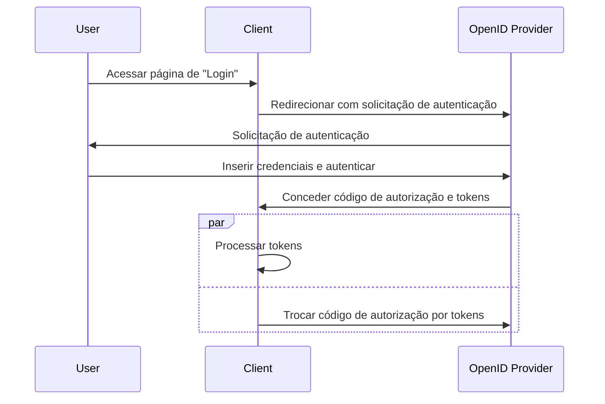

## O que é o fluxo híbrido (hybrid flow)?

O fluxo híbrido (hybrid flow) é um processo de autenticação que combina as características do <Ref slug="authorization-code-flow" /> e do <Ref slug="implicit-flow" />. Vale notar que o fluxo híbrido não faz parte da especificação do <Ref slug="oauth-2.0" />, mas é uma extensão fornecida pelo <Ref slug="openid-connect" />.

Este fluxo é projetado para fornecer um equilíbrio entre segurança e usabilidade para a autenticação do usuário. No entanto, o fluxo híbrido não é recomendado para novas aplicações devido às [considerações de segurança](#security-considerations) associadas ao fluxo implícito. Uma alternativa popular ao fluxo híbrido é usar o fluxo de autorização de código (authorization code flow) com <Ref slug="pkce" /> para melhor segurança.

## Como funciona o fluxo híbrido (hybrid flow)?

Aqui estão as principais etapas do fluxo híbrido:

1. Semelhante a outros fluxos OIDC, o fluxo híbrido começa com o <Ref slug="client" /> iniciando uma <Ref slug="authentication-request" /> para o <Ref slug="openid-connect" headingId="openid-provider-op" />.

    Nota: O cliente deve incluir o parâmetro `response_type` com a combinação de `code` e pelo menos um de `id_token` ou `token`, o que significa que há três combinações possíveis:

      - `code id_token`: O cliente espera um código de autorização e um ID token.
      - `code token`: O cliente espera um código de autorização e um access token.
      - `code id_token token`: O cliente espera um código de autorização, um ID token e um access token.

    O requisito é autoexplicativo: o cliente espera tanto um código de autorização quanto um ou mais tokens, que correspondem ao fluxo de autorização de código (authorization code flow) e ao fluxo implícito (implicit flow), respectivamente.
2. O usuário se autentica no <Ref slug="openid-connect" headingId="openid-provider-op" />.
3. O <Ref slug="openid-connect" headingId="openid-provider-op" /> redireciona o usuário de volta para a aplicação cliente com o código de autorização e os tokens solicitados.
4. A aplicação cliente processa os tokens e pode usá-los para acessar recursos protegidos em nome do usuário; ela também pode usar o código de autorização para obter tokens adicionais via <Ref slug="token-request" />.

Aqui está um diagrama de sequência simplificado do fluxo híbrido:



Aqui está um exemplo não normativo de uma solicitação de autenticação de fluxo híbrido:

```http
GET /authorize?response_type=code%20id_token
  &client_id=YOUR_CLIENT_ID
  &redirect_uri=https%3A%2F%2Fclient.example.com%2Fcallback
  &scope=openid%20profile%20email
  &nonce=123456
  &state=abc123 HTTP/1.1
Host: your-openid-provider.com
```

### Parâmetros principais em uma solicitação de autenticação de fluxo híbrido

A solicitação de autenticação de fluxo híbrido inclui os seguintes parâmetros principais:

- **`response_type`**: O valor deve ser uma combinação de `code` e pelo menos um de `id_token` ou `token`. Por exemplo, `code id_token` ou `code token`.
- **`client_id`**: O identificador do cliente emitido pelo <Ref slug="openid-connect" headingId="openid-provider-op" /> (servidor de autorização).
- **`redirect_uri`**: O URI para onde o servidor de autorização envia o usuário após o processo de autenticação.
- **`scope`**: Os <Ref slug="scope">escopos</Ref> (permissões) solicitados para os tokens.
- **`resource`**: O parâmetro opcional que especifica o <Ref slug="resource-indicator" /> para os recursos solicitados. O servidor de autorização precisa suportar o [RFC 8707](https://datatracker.ietf.org/doc/html/rfc8707) para usar este parâmetro.

Para a lista completa de parâmetros e suas descrições, veja [Autenticação usando o Fluxo Híbrido](https://openid.net/specs/openid-connect-core-1_0.html#HybridFlowAuth).

## Considerações de segurança

O fluxo híbrido inclui o fluxo implícito, que é conhecido por suas limitações de segurança. Os tokens ainda são transmitidos via canal frontal (navegador), o que pode expô-los a ataques potenciais. O fluxo implícito será descontinuado no <Ref slug="oauth-2.1" /> devido a essas preocupações.

<Ref slug="authorization-code-flow" /> com <Ref slug="pkce" /> é a alternativa recomendada ao fluxo híbrido. Ele fornece uma maneira mais segura de autenticar usuários sem expor tokens no canal frontal.

<SeeAlso slugs={["openid-connect", "oauth-2.1", "authorization-code-flow", "pkce", "implicit-flow"]} />

<Resources
  urls={[
    "https://blog.logto.io/implicit-flow-is-dead",
    "https://blog.logto.io/oauth-2-1",
    "https://openid.net/specs/openid-connect-core-1_0.html#HybridFlowAuth",
  ]}
/>