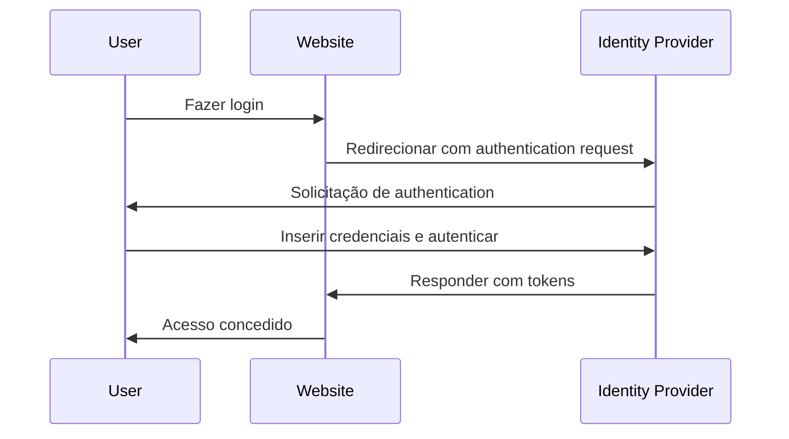

## O que é gerenciamento de identidade e acesso (IAM)?

Como a definição sugere, gerenciamento de identidade e acesso (IAM) é um conceito amplo que envolve muitos aspectos do gerenciamento de identidades digitais e da condução de <Ref slug="access-control" />. Vamos primeiro dividir os termos:

- **Identidade**: Uma representação digital de um usuário, serviço ou dispositivo. Uma identidade pode incluir atributos como identificadores, funções e permissões.
- **Acesso**: A capacidade de interagir com recursos, realizar ações ou usar serviços. Resumindo, acesso é sobre quais ações realizar em certos recursos.

### Gerenciamento de identidade

Gerenciamento de identidade é o processo de gerenciar, autenticar e proteger identidades digitais. Envolve as seguintes atividades principais:

- **Registro de identidade**: Criar novas identidades para usuários, serviços ou dispositivos.
- **Autenticação de identidade**: Verificar a propriedade de uma identidade através de vários mecanismos, como senhas, biometria ou autenticação multifator.
- **Segurança de identidade**: Proteger identidades contra acesso não autorizado, uso indevido ou divulgação.

Cada tópico é vasto e pode ser ainda dividido em subtópicos como gerenciamento de senhas, federação de identidade e gerenciamento do ciclo de vida da identidade.

### Gerenciamento de acesso

Gerenciamento de acesso (ou <Ref slug="access-control" />) é o processo de controlar quem pode realizar quais ações em certos recursos. Envolve as seguintes atividades principais:

- **Políticas de controle de acesso**: Definir regras e políticas que ditam quem pode acessar quais recursos e quais ações podem realizar.
- **Aplicação de acesso**: Aplicar políticas de controle de acesso através de mecanismos como authentication, authorization e auditoria.
- **Governança de acesso**: Monitorar e gerenciar direitos de acesso para garantir conformidade com regulamentos e melhores práticas de segurança.

Cada atividade desempenha um papel importante em aplicações e sistemas modernos para garantir que apenas identidades autorizadas (usuários, serviços ou dispositivos) possam acessar recursos com base nas políticas definidas.

## Quais são os componentes do IAM?

Na aplicação, IAM é implementado usando uma combinação de software, serviços e melhores práticas. Dois componentes importantes do IAM são:

- **<Ref slug="identity-provider" />**: Um serviço que gerencia identidades de usuários e authentication.
- **<Ref slug="service-provider" />**: Um serviço que depende de um identity provider para authentication e authorization. Na maioria dos casos, é a aplicação ou serviço que você está desenvolvendo.

Uma separação clara entre o identity provider e o service provider ajudará a desacoplar o IAM da lógica da aplicação, tornando mais fácil gerenciar e escalar.

## Gerenciamento de identidade e acesso na prática

Vamos ver um exemplo de como o IAM funciona: quando você faz login em um site, o processo de verificar quem você é e conceder acesso ao site pode ser considerado um processo de gerenciamento de identidade e acesso.

Normalmente, o processo de IAM envolve duas etapas principais: authentication e authorization:

- <Ref slug="authentication" /> responde à pergunta “Qual identidade você possui?”
- <Ref slug="authorization" /> responde à pergunta “O que você pode fazer?”

> Às vezes, authentication será interpretada como "Quem é você?" No entanto, ao discutir identidades digitais, é mais preciso demonstrar authentication como "provar a propriedade da identidade".

Além disso, o conceito de gerenciamento de identidade e acesso é grande o suficiente para dar origem a novos conceitos, como WIAM (Workforce IAM) e CIAM (Customer IAM).

Embora WIAM e CIAM compartilhem a mesma base, eles têm casos de uso distintos: WIAM é tipicamente usado para usuários internos, enquanto CIAM é usado para clientes externos. Alguns exemplos:

- **WIAM**: Sua empresa tem um sistema de identidade unificado para funcionários, assim todos podem usar a mesma conta para acessar recursos da empresa, como assinaturas de software, serviços de computação em nuvem, etc.
- **CIAM**: Sua livraria online requer um sistema de identidade de usuário para clientes e vendedores. A experiência de login é uma parte crítica da integração, pois está localizada no topo do funil de conversão.

Para saber mais sobre o conceito de CIAM e tópicos relacionados, você pode consultar [CIAM 101: Authentication, Identity, SSO](https://blog.logto.io/ciam-101-intro-authn-sso).

### Authentication

Aqui estão alguns métodos comuns de authentication usados no IAM:

- **Authentication baseada em senha**: O método mais comum, onde os usuários fornecem um nome de usuário e senha para provar sua identidade.
- **Authentication <Ref slug="passwordless" />**: Um método que permite que os usuários façam login sem uma senha, como usando um código único enviado para seu e-mail ou telefone. Note que authentication passwordless também pode se referir a outros métodos, como authentication biométrica.
- **Login social**: Um método que permite que os usuários façam login usando suas contas de mídia social, como Google, Facebook ou Twitter.
- **<Ref slug="passkey" /> (WebAuthn)**: Um método que permite que os usuários façam login usando uma chave de segurança, como uma chave USB ou um smartphone que suporte WebAuthn.
- **Authentication biométrica**: Um método que usa características físicas, como impressões digitais, reconhecimento facial ou reconhecimento de voz, para verificar a identidade de um usuário.
- **Authentication <Ref slug="machine-to-machine" />**: Um método que permite que serviços ou dispositivos autentiquem uns aos outros sem intervenção humana, como usando api keys ou certificados.

Para uma camada adicional de segurança, <Ref slug="mfa" /> pode ser usado em combinação com esses métodos de authentication. MFA requer que os usuários forneçam dois ou mais fatores para provar sua identidade, como algo que sabem (senha), algo que têm (chave de segurança ou <Ref slug="totp" />), ou algo que são (dados biométricos).

### Authorization

Com authentication em vigor, authorization determina quais ações uma identidade pode realizar. Authorization pode ser baseada em vários fatores, como a função da identidade, associação a grupos, permissões, atributos, políticas, etc. Existem vários modelos comuns de authorization:

- **<Ref slug="rbac" />**: Um modelo que atribui permissões a funções e, em seguida, atribui funções a identidades. Por exemplo, uma função de funcionário pode ter acesso a certos recursos, enquanto uma função de administrador pode ter acesso a todos os recursos.
- **<Ref slug="abac" />**: Um modelo que usa atributos (propriedades) da identidade, recurso e ambiente para tomar decisões de controle de acesso. Por exemplo, uma identidade com o atributo "departamento=engenharia" pode ter acesso a recursos de engenharia.
- **Controle de acesso baseado em políticas (PBAC)**: Um modelo que usa políticas para definir regras de controle de acesso. As políticas podem ser baseadas em vários fatores, como hora do dia, localização, tipo de dispositivo, etc.
- **Controle de acesso granular**: Um modelo que fornece controle mais granular sobre o acesso, permitindo que permissões sejam definidas no nível de recursos ou ações individuais.

## Quais são os padrões abertos amplamente utilizados para IAM?

Existem vários padrões e protocolos abertos que são amplamente utilizados no IAM:

- **<Ref slug="oauth-2.0" />**: Um protocolo que permite que aplicações acessem recursos em nome de um usuário sem compartilhar as credenciais do usuário. OAuth 2.0 é comumente usado para authorization, como permitir que uma aplicação de terceiros acesse os arquivos do Google Drive de um usuário.
- **<Ref slug="openid-connect" />**: Uma camada de identidade construída sobre o OAuth 2.0 que permite que aplicações verifiquem a identidade de um usuário e obtenham informações básicas de perfil sobre o usuário. Single sign-on (SSO) é um caso de uso comum para OpenID Connect. Combinar OAuth 2.0 e OpenID Connect é uma prática comum para IAM moderno.
- **<Ref slug="saml" />**: Um padrão baseado em XML para troca de dados de authentication e authorization entre identity providers e service providers. SAML é comumente usado para SSO em ambientes empresariais.
- **SCIM (System for Cross-domain Identity Management)**: Um padrão para automatizar a troca de informações de identidade de usuário entre identity providers e service providers. SCIM é comumente usado para provisionamento e desprovisionamento de usuários em aplicações baseadas em nuvem.

## Quais são as principais considerações de design para IAM?

Ao projetar um sistema IAM, há várias considerações importantes a serem lembradas:

- **Segurança**: A segurança é primordial no IAM. Garanta que os métodos de authentication estejam seguindo as melhores práticas, como usar hashing de senha forte, aplicar MFA e proteger contra ataques comuns como phishing e força bruta.
- **Privacidade**: Respeite a privacidade do usuário coletando apenas as informações necessárias e obtendo o consentimento do usuário quando necessário.
- **Escalabilidade**: Faça o sistema IAM escalável para lidar com um grande número de usuários e aplicações. Considere usar identity providers baseados em nuvem para escalabilidade.
- **Interoperabilidade**: Um benefício de usar padrões abertos é que isso permite a interoperabilidade entre diferentes sistemas. Por exemplo, a maioria dos identity providers populares como Google, Facebook e Microsoft suportam OAuth 2.0 e OpenID Connect.
- **Experiência do usuário**: A experiência do usuário para authentication e authorization impacta muito a conversão e retenção de usuários. Equilibrar segurança com facilidade de uso é uma arte no IAM.

<SeeAlso slugs={['openid-connect', 'oauth-2.0', 'single-sign-on', 'enterprise-sso']} />

<Resources
  urls={[
    "https://blog.logto.io/ciam-101-intro-authn-sso",
    "https://blog.logto.io/ciam-102-authz-and-rbac"
  ]}
/>