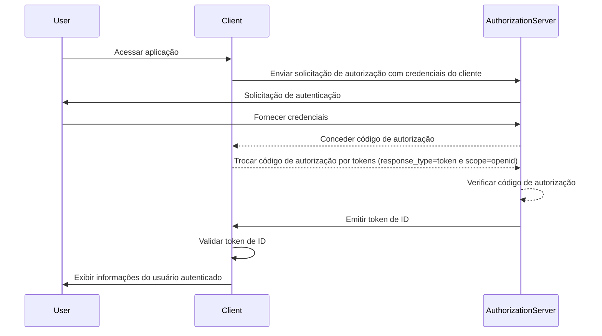

## O que é um token de ID (ID token)?

Um token de ID (ID token) é um tipo específico de token de segurança que contém informações sobre o usuário autenticado, entregue ao aplicativo cliente após uma <Ref slug="authentication" /> bem-sucedida. O token de ID é a característica chave que distingue o <Ref slug="openid-connect" /> do <Ref slug="oauth-2.0" />. Enquanto o OAuth 2.0 foca exclusivamente na autorização, o OIDC se baseia nele para adicionar a autenticação do usuário introduzindo o token de ID.

No processo de autenticação do OIDC, um aplicativo cliente (parte confiável) inicia a autenticação redirecionando o usuário para um servidor de autorização. Após a autenticação bem-sucedida, o servidor responde com um token de ID, entre outros tokens como o <Ref slug="access-token" />. O token de ID é tipicamente codificado como um <Ref slug="jwt" /> e inclui claims chave, como o identificador do usuário (sub), o issuer (iss), audience (aud) e outras informações específicas do usuário.

A função principal do token de ID é verificar a identidade do usuário e transmitir essa informação para o aplicativo cliente. Isso permite que o aplicativo autentique o usuário sem lidar diretamente com credenciais. Como o cliente só recebe o token de ID após o usuário ter sido autenticado pelo servidor de autorização, o token de ID pode ser usado como uma maneira segura de verificar a identidade do usuário.

## Como funciona o token de ID (ID token)?

O aplicativo cliente inicia o processo de autenticação redirecionando o usuário para o servidor de autorização. O usuário se autentica com o servidor, que então emite um token de ID junto com outros tokens, como o access token. O token de ID é retornado ao aplicativo cliente, que pode então usá-lo para verificar a identidade do usuário.

Como o OIDC é um protocolo popular e padronizado, muitas bibliotecas e frameworks oferecem suporte embutido para lidar com tokens de ID. Isso torna os tokens de ID fáceis de integrar em aplicativos clientes e amplamente usados em cenários de <Ref slug="single-sign-on" /> e identidade federada.

## Claims em um token de ID (ID token)

Um token de ID (ID token) é um JWT que contém um conjunto de <Ref slug="claim" /> sobre o usuário autenticado. Esses claims incluem tanto claims padrão do JWT que são definidos na [especificação JWT](https://datatracker.ietf.org/doc/html/rfc7519#section-4), quanto claims específicos do OIDC que são usados para transmitir informações de identidade do usuário.

Claims padrão do token JWT:

- **iss (Issuer)**: OBRIGATÓRIO. O claim issuer identifica o issuer do token de ID. Este é tipicamente o URL do servidor de autorização que emitiu o token.
- **sub (Subject)**: OBRIGATÓRIO. O claim subject identifica o usuário sobre o qual o token de ID se refere. Este é tipicamente um identificador único para o usuário.
- **aud (Audience)**: OBRIGATÓRIO. O claim audience identifica o <Ref slug="audience" /> para o token de ID. Este é tipicamente o aplicativo cliente que solicitou o token.
- **exp (Expiration time)**: OBRIGATÓRIO. O claim expiration time identifica o momento em que o token expira. Após esse tempo, o token não deve ser aceito para processamento.
- **iat (Issued at)**: OBRIGATÓRIO. O claim issued at identifica o momento em que o token foi emitido.
- **auth_time (Authentication time)**: OPCIONAL. O claim authentication time identifica o momento em que o usuário foi autenticado. Este claim só está presente se o usuário foi autenticado durante a sessão atual.
- **nonce**: OPCIONAL. O claim nonce é usado para associar uma sessão do cliente com um token de ID. É tipicamente usado para prevenir ataques de repetição.

Claims padrão de informações do usuário do OIDC:

- **name**: Nome completo do usuário.
- **given_name**: Nome do usuário.
- **family_name**: Sobrenome do usuário.
- **middle_name**: Nome do meio do usuário.
- **nickname**: Apelido ou outro nome curto do usuário.
- **preferred_username**: Nome de usuário preferido do usuário.
- **profile**: Um URL que aponta para a página de perfil do usuário.
- **picture**: Um URL que aponta para a foto de perfil do usuário.
- **website**: Um URL que aponta para o site do usuário.
- **email**: Endereço de e-mail do usuário.
- **email_verified**: Um valor booleano indicando se o endereço de e-mail do usuário foi verificado.
- **gender**: Gênero do usuário.
- **birthdate**: Data de nascimento do usuário. Representada como uma string no formato YYYY-MM-DD.
- **zoneinfo**: Fuso horário do usuário. String do [Banco de Dados de Fuso Horário da IANA](https://www.iana.org/time-zones).
- **locale**: Localidade do usuário. Representa o idioma e a região preferidos do usuário para formatação de datas, horas e números.
- **phone_number**: Número de telefone do usuário.
- **phone_number_verified**: Um valor booleano indicando se o número de telefone do usuário foi verificado.
- **address**: Endereço postal do usuário. O valor é um objeto JSON que contém as informações de endereço do usuário.
- **updated_at**: O momento em que as informações do usuário foram atualizadas pela última vez.

Esses claims fornecem uma maneira padronizada de transmitir informações de identidade do usuário no token de ID. Embora a especificação defina apenas um conjunto de claims padrão, claims personalizados também podem ser incluídos no token de ID para transmitir informações adicionais específicas do usuário conforme necessário.

## Validação do token de ID (ID token)

Quando o aplicativo cliente recebe um token de ID, ele deve validar o token para garantir sua autenticidade e integridade. O processo de validação tipicamente envolve os seguintes passos:

1. **Verificar a assinatura**: O cliente deve verificar a assinatura do token de ID usando a chave pública do servidor de autorização. Isso garante que o token não foi adulterado e foi emitido pela parte esperada.
2. **Verificar o issuer**: O cliente deve verificar se o claim `iss` no token de ID corresponde ao URL do servidor de autorização que emitiu o token. Isso ajuda a prevenir ataques de substituição de token.
3. **Verificar o audience**: O cliente deve verificar se o claim `aud` no token de ID corresponde ao `client_id` do aplicativo cliente. Isso garante que o token foi emitido para o aplicativo cliente.
4. **Verificar o tempo de expiração**: O cliente deve verificar se o claim `exp` no token de ID não passou. Se o token expirou, ele não deve ser aceito. Implementações podem fornecer uma margem para compensar a diferença de relógio.
5. **Verificar o nonce**: Se o cliente incluiu um parâmetro `nonce` na solicitação de autenticação, ele deve verificar se o claim `nonce` no token de ID corresponde ao valor do parâmetro `nonce`. Isso ajuda a prevenir ataques de repetição.

## Token de ID (ID token) vs token de acesso (access token)

Embora ambos os tokens de ID e tokens de acesso sejam amplamente usados no OIDC, eles servem a propósitos diferentes e têm características distintas:

|              | Token de ID (ID token)                                                                 | Token de acesso (Access token)                                                                                               |
| ------------ | -------------------------------------------------------------------------------------- | ---------------------------------------------------------------------------------------------------------------------------- |
| **Propósito**| Verifica a identidade do usuário e transmite informações do usuário para o aplicativo cliente. | Fornece acesso a recursos protegidos em nome do usuário.                                                                     |
| **Formato**  | Tipicamente um JWT que contém claims de identidade do usuário.                         | Pode ser um JWT ou um <Ref slug="opaque-token" />.                                                                           |
| **Audience** | Destinado ao aplicativo cliente que solicitou o token.                                 | Destinado ao servidor de recursos que hospeda os recursos protegidos.                                                        |
| **Duração**  | Token de curta duração que é tipicamente válido por alguns minutos. Uso único.         | Token de longa duração que é válido por um período mais longo (por exemplo, horas). Pode ser reutilizado várias vezes dentro de seu período de validade. |
| **Conteúdo** | Contém informações de identidade do usuário, como nome, e-mail e outros dados específicos do usuário. | Contém informações sobre as permissões do usuário (scopes) para recursos específicos.                                        |

## Melhores práticas para usar tokens de ID (ID tokens)

Ao trabalhar com tokens de ID no OIDC, é importante seguir as melhores práticas para garantir a segurança e integridade do processo de autenticação. Algumas das principais melhores práticas incluem:

1. **Validar tokens de ID**: Sempre valide o token de ID recebido do servidor de autorização para garantir sua autenticidade e integridade. Isso ajuda a prevenir ataques de substituição de token e acesso não autorizado.
2. **Usar canais seguros**: Garanta que os tokens de ID sejam transmitidos por canais seguros (por exemplo, HTTPS) para prevenir interceptação e adulteração.
3. **Proteger informações sensíveis**: Como os JWTs são tipicamente codificados, mas não criptografados, o que torna o conteúdo transparente. Evite incluir informações sensíveis no payload do token de ID para prevenir a exposição de dados sensíveis em caso de vazamento de token.
4. **Não para autorização**: Tokens de ID são destinados à autenticação do usuário e não devem ser usados para fins de autorização. Use tokens de acesso para autorização para acessar recursos protegidos.
5. **Uso único**: Tokens de ID são geralmente destinados a uso único. Uma vez que um aplicativo cliente tenha validado um token de ID, ele não deve ser reutilizado para solicitações subsequentes ou preservação de estado de sessão. Para manter o estado de sessão do usuário, aplicativos clientes devem empregar mecanismos como <Ref slug="refresh-token" /> e solicitações de troca de token. (Tokens de atualização são tokens opacos de longa duração que podem ser usados para obter novos tokens de acesso e tokens de ID quando eles expiram.)

<SeeAlso slugs={["openid-connect", "jwt", "signing-key", "access-token"]} />