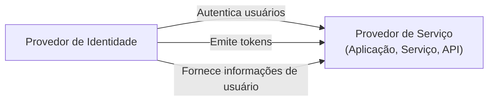
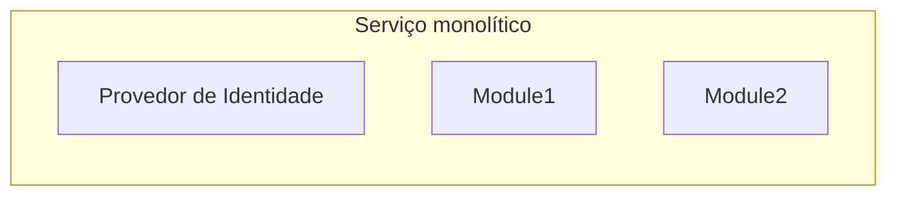
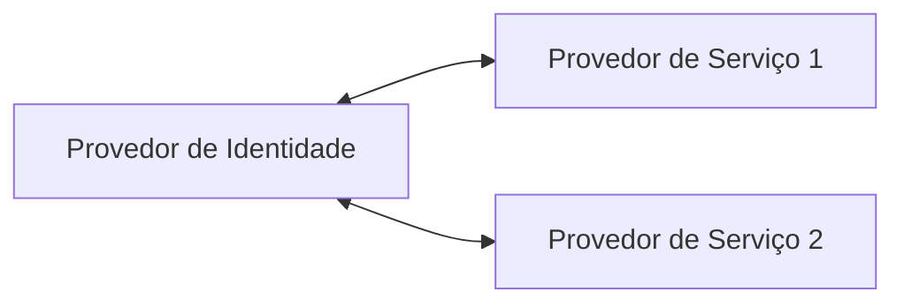

## O que é um provedor de identidade (IdP)?

No domínio de <Ref slug="iam" />, um provedor de identidade (IdP) é o serviço central para gerenciar identidades. Ele é responsável por autenticar usuários, emitir tokens de identidade e fornecer informações de usuário para <Ref slug="service-provider">provedores de serviço</Ref> (por exemplo, aplicações, serviços, APIs).

Além de <Ref slug="authentication" />, provedores de identidade modernos também são responsáveis por <Ref slug="authorization" /> (aplicando políticas de <Ref slug="access-control" />) e suportando recursos avançados como <Ref slug="single-sign-on" /> e <Ref slug="multi-tenancy" />.

## Padrões de provedores de identidade

Devido à natureza do gerenciamento de identidade e à necessidade de interoperabilidade, seria impraticável e ineficiente construir provedores de identidade sem padrões. Aqui estão alguns cenários típicos:

- Dois provedores de identidade precisam se comunicar para trocar informações de usuário (por exemplo, login social).
- Uma aplicação precisa autenticar usuários usando múltiplos provedores de identidade (por exemplo, identidade federada).
- Um provedor de identidade precisa suportar múltiplos tipos de clientes (por exemplo, web, mobile, IoT).

Para lidar com esses cenários, a indústria desenvolveu vários padrões populares para provedores de identidade:

- <Ref slug="oauth-2.0" />: Um framework de autorização amplamente utilizado que permite que aplicações obtenham acesso em nome de usuários ou serviços.
- <Ref slug="openid-connect" />: Uma camada de identidade construída sobre o OAuth 2.0 que fornece autenticação e informações de usuário.
- <Ref slug="saml" />: Um padrão para troca de dados de autenticação e autorização entre domínios de segurança.

Para novas aplicações, OpenID Connect (OIDC) é o padrão recomendado para usar, seja para construir um provedor de identidade ou integrar com provedores de identidade existentes.

## Arquitetura do provedor de identidade

O termo "provedor de identidade" não especifica uma arquitetura ou implementação particular. Isso significa que um provedor de identidade pode ser uma aplicação monolítica, um microsserviço ou um serviço em nuvem.

Devido à complexidade e criticidade do gerenciamento de identidade, aplicações modernas tendem a usar provedores de identidade especializados que são serviços independentes ou soluções de fornecedores.

## Recursos do provedor de identidade

Provedores de identidade modernos oferecem uma ampla gama de recursos para suportar vários casos de uso e requisitos. Aqui estão alguns recursos comuns:

- <Ref slug="authentication" />: Verificar a identidade dos usuários usando vários métodos (por exemplo, nome de usuário/senha, login social, <Ref slug="mfa" />).
- <Ref slug="authorization" />: Aplicar políticas de controle de acesso e gerenciar permissões de usuário (por exemplo, <Ref slug="rbac" />, <Ref slug="abac" />).
- **Gerenciamento de usuários**: Criar, atualizar e excluir contas e perfis de usuário; fornecer dados de usuário para <Ref slug="service-provider">provedores de serviço</Ref>.
- **Gerenciamento de tokens**: Emitir e gerenciar tokens de identidade (por exemplo, ID token, access token, refresh token).
- <Ref slug="single-sign-on" />: Permitir que os usuários se autentiquem uma vez e acessem múltiplas aplicações.
- <Ref slug="multi-tenancy" />: Suportar múltiplas organizações ou locatários com dados e configurações de usuário isolados.

<SeeAlso slugs={["service-provider", "iam", "openid-connect", "oauth-2.0"]} />

<Resources
  urls={[
    "https://blog.logto.io/secure-cloud-apps-with-oauth-and-openid-connect",
    "https://blog.logto.io/incorporate-identity-solution",
    "https://blog.logto.io/centralized-identity-system"
  ]}
/>