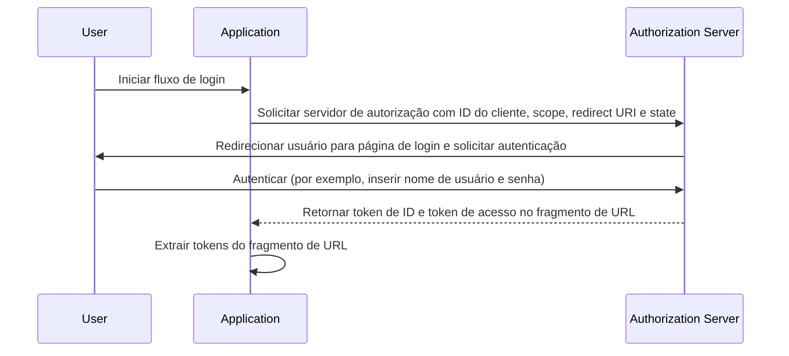

## O que é o fluxo implícito (implicit flow)

O fluxo implícito (implicit flow) do OIDC (OpenID Connect) é um processo de autenticação usado principalmente por aplicações cliente implementadas em um navegador usando uma linguagem de script, por exemplo, aplicações de página única (SPAs). Ele permite que aplicações cliente obtenham diretamente tokens de ID e tokens de acesso do servidor de autorização sem realizar a autenticação do cliente.

## Como funciona o fluxo implícito (implicit flow)?

Os principais passos do fluxo implícito (implicit flow) são os seguintes:

1. **Envio da solicitação de autenticação (authentication request)**: O usuário inicia o fluxo normalmente clicando em um link ou botão na aplicação para fazer login. A aplicação envia uma solicitação de autenticação para o endpoint de autorização do servidor de autorização. O servidor de autorização valida os parâmetros e redireciona o usuário para autenticar na página de login do servidor de autorização.
2. **Autenticação do usuário**: O usuário se autentica no servidor de autorização (por exemplo, inserindo nome de usuário e senha).
3. **Resposta do servidor de autorização**: O servidor de autorização retorna um token de ID e, se solicitado, um token de acesso para a aplicação cliente como fragmento de URL.
4. **Processamento dos tokens pelo cliente**: A aplicação cliente extrai os tokens do fragmento de URL.



### Solicitação de autenticação (authentication request)

Os parâmetros da solicitação são os seguintes:
- **client_id**: OBRIGATÓRIO. Identificador de cliente OAuth 2.0 válido, que está disponível no Logto como o ID da aplicação (ou ID do app).
- **scope**: OBRIGATÓRIO. Este valor especifica um conjunto de recursos que o usuário está solicitando do servidor de autorização. Por exemplo, `openid profile email`
- **response_type**: OBRIGATÓRIO. O valor é `id_token` ou `id_token token`. Nenhum token de acesso é retornado quando o valor é `id_token`.
- **redirect_uri**: OBRIGATÓRIO. O URI para o qual a resposta de autenticação será enviada e deve corresponder exatamente ao redirect URI que o cliente pré-registrou no <Ref slug="openid-connect" headingId="openid-provider-op" />. Por exemplo, `Sign-in redirect URI` no Logto Admin Console.
- **nonce**: OBRIGATÓRIO. Uma string aleatória usada para mitigar ataques de repetição, que é passada sem modificações da solicitação de autenticação para a claim do token de ID.

### Exemplo de uma solicitação de autenticação

```bash
curl -X GET "https://authorization-server.com/auth" \
  -d "response_type=id_token token" \
  -d "client_id=YOUR_APPLICATION_ID" \
  -d "redirect_uri=https://yourapp.com/callback" \
  -d "scope=openid profile email" \
  -d "nonce=RANDOM_STRING"
```

## Limitações

O fluxo implícito (implicit flow) foi desenvolvido em uma época em que os navegadores não adotavam amplamente o Cross-Origin Resource Sharing (CORS). Portanto, o envio de solicitações POST para servidores de autorização hospedados em um domínio diferente é proibido.

Devido a essa limitação, o servidor de autorização retorna diretamente os tokens no fragmento de URL, o que pode expô-los ao usuário final e a aplicações que têm acesso ao User Agent do usuário final.

Além disso, a autenticação do cliente não é realizada no fluxo implícito (implicit flow), o que significa que qualquer aplicação pode fingir ser o cliente que está solicitando a autenticação, já que o ID do cliente está sempre exposto em aplicações baseadas em navegador.

Devido às limitações acima, o fluxo implícito (implicit flow) é geralmente considerado menos seguro do que o Authorization Code Flow.

## Alternativas ao fluxo implícito (implicit flow)

Dadas as limitações de segurança do fluxo implícito (implicit flow), outros fluxos são frequentemente recomendados:
- **Authorization Code Flow**: Este fluxo envolve uma etapa adicional onde o cliente troca um código de autorização por tokens, proporcionando uma camada extra de segurança.
- **PKCE (Proof Key for Code Exchange)**: Uma extensão do Authorization Code Flow que adiciona uma camada adicional de segurança usando um verificador de código e um desafio de código.

<SeeAlso slugs={['device-flow', 'authorization-code-flow', 'client-credentials-flow']} />

<Resources
  urls={[
    "https://blog.logto.io/implicit-flow-is-dead",
    {
      url: "https://tools.ietf.org/html/rfc6749#section-4.2",
      result: {
        ogTitle: "The OAuth 2.0 Authorization Framework: Implicit Grant",
        ogDescription: "O tipo de concessão implícita é usado para obter tokens de acesso (não suporta a emissão de tokens de atualização) e é otimizado para clientes públicos conhecidos por operar um URI de redirecionamento específico. Esses clientes são tipicamente implementados em um navegador usando uma linguagem de script como JavaScript."
      }
    },
    "https://openid.net/specs/openid-connect-core-1_0.html",
  ]}
/>