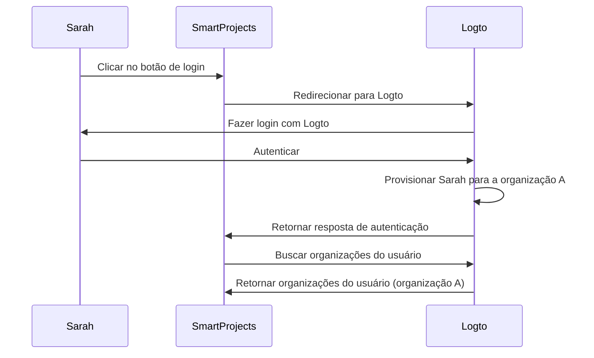
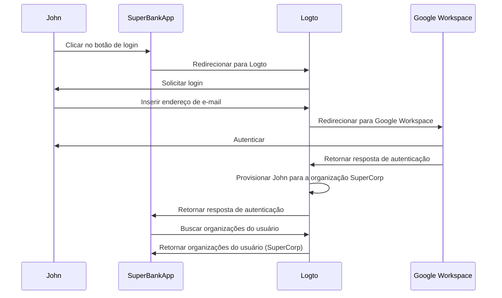

## O que é provisionamento just-in-time?

O provisionamento Just-in-time (JIT) é um processo usado em <Ref slug="iam" /> onde contas de usuário são provisionadas de acordo com a identidade do usuário e a configuração do sistema de forma dinâmica quando o usuário tenta fazer login pela primeira vez.

## Quais são os casos de uso para o provisionamento just-in-time?

Esses casos são comuns ao construir um aplicativo B2B que envolve arquitetura multi-tenant, Enterprise SSO, ou que requer recursos de integração de equipe. Aqui estão alguns cenários de exemplo que você ou seu cliente podem encontrar.

### Integração de funcionários

Imagine que um de seus clientes, *SuperFantasy*, está passando por contratações frequentes ou crescimento rápido e pode usar o provisionamento JIT para configurar rapidamente contas de usuário para novos funcionários. *SuperFantasy* usa Logto para gerenciamento de identidade e acesso e SmartProjects para gerenciamento de projetos. Quando uma nova funcionária, Sarah, faz login no SmartProjects pela primeira vez, sua conta é automaticamente criada e configurada com base em suas credenciais do Logto.

De acordo com o diagrama acima, quando Sarah faz login no SmartProjects pela primeira vez, sua conta é automaticamente provisionada para a organização A no Logto. Este processo garante que Sarah tenha o acesso necessário ao SmartProjects sem exigir intervenção manual da equipe de TI.

### Integração de clientes empresariais

Imagine outro cliente, *SuperBank*, uma instituição financeira que fornece serviços bancários online para seus clientes. *SuperBank* usa Logto para gerenciamento de identidade e acesso e SuperBankApp para serviços bancários online. *SuperBank* recentemente assinou um contrato com um novo cliente empresarial, *SuperCorp*, para fornecer serviços bancários online para seus funcionários.

*SuperCorp* usa Google Workspace para suas contas de funcionários. O SuperBankApp precisa garantir que, quando um funcionário da *SuperCorp* fizer login pela primeira vez, sua conta seja automaticamente adicionada à organização *SuperCorp* no Logto.

No diagrama acima, quando John faz login no SuperBankApp pela primeira vez, sua conta é automaticamente provisionada para a organização SuperCorp no Logto de acordo com sua identidade no Google Workspace.

## É específico para SAML e Enterprise SSO?

O provisionamento Just-in-time (JIT) é frequentemente associado ao <Ref slug="enterprise-sso" /> na autenticação SAML, mas não é exclusivo do <Ref slug="saml" />. O provisionamento JIT também pode ser usado com outros protocolos de autenticação como <Ref slug="oauth-2.0" /> e <Ref slug="openid-connect" />, e não requer necessariamente uma configuração de <Ref slug="enterprise-sso" />.

Por exemplo, o provisionamento JIT baseado em e-mail pode ser usado quando seu <Ref slug="identity-provider" /> suporta esse recurso. Nesse caso, o endereço de e-mail do usuário é o único atributo necessário para o provisionamento, independentemente do protocolo de autenticação ou configuração de SSO.

## Aplica-se a novos ou usuários existentes do aplicativo?

O provisionamento Just-in-time (JIT) geralmente se refere à primeira tentativa de acessar um aplicativo. No entanto, diferentes produtos percebem essa funcionalidade de maneira diferente. Alguns usam o provisionamento JIT apenas para criação de identidade e conta, enquanto outros também incluem atualizações de conta just-in-time, como reprovisionamento e sincronização de atributos.

Por exemplo, o Provisionamento JIT SAML permite conceder e revogar associações de grupo como parte do provisionamento. Ele também pode atualizar usuários provisionados para manter seus atributos na loja do <Ref slug="service-provider" /> em sincronia com os atributos da loja do <Ref slug="identity-provider" />.

Se você quiser considerar o cenário de login de usuário existente subsequente, certifique-se de ter um sistema de provisionamento robusto junto com seu sistema JIT. Por exemplo:

- **Resolução de conflitos**: Seu sistema deve ter uma estratégia para lidar com conflitos se uma conta já existir com informações diferentes das fornecidas pelo IdP durante o processo JIT. Isso pode exigir controle detalhado das políticas da sua organização e configuração do IdP.
- **Trilhas de auditoria**: É importante manter registros de ambas as criações de novas contas e atualizações de contas existentes através de processos JIT por razões de segurança e conformidade.
- **Desempenho**: Embora o provisionamento JIT aconteça rapidamente, considere o impacto potencial nos tempos de login, especialmente para usuários existentes se você estiver atualizando suas informações a cada login.
- **Consistência de dados**: Certifique-se de que seu processo de provisionamento JIT mantenha a consistência dos dados, especialmente ao atualizar contas de usuários existentes.

## Qual é a diferença entre JIT e System for Cross-domain Identity Management (SCIM)?

SCIM é um protocolo padrão aberto projetado para simplificar e automatizar o gerenciamento de identidade de usuários em diferentes sistemas e domínios. É comumente usado em cenários de sincronização de diretórios.

A principal diferença entre JIT e SCIM é que JIT geralmente se refere à primeira tentativa de acessar um aplicativo (ou integração de novo usuário), e é um termo amplo que descreve o processo de provisionamento dinâmico de contas de usuário; enquanto SCIM é um protocolo específico para gerenciar o ciclo de vida do usuário em sistemas e não é limitado ao primeiro login.

Além disso, JIT carece de uma implementação padronizada em sistemas, enquanto SCIM é um protocolo padronizado definido pelo [RFC 7644](https://datatracker.ietf.org/doc/html/rfc7644) para gerenciamento de identidade.

Algumas organizações maiores usam SCIM para provisionamento de contas, integrando-o com seus próprios sistemas. Isso pode ser muito complexo e variar caso a caso. Para a maioria dos casos de uso, o provisionamento JIT é uma abordagem mais simples e direta.

<Resources urls={['https://blog.logto.io/jit-provisioning', 'https://datatracker.ietf.org/doc/html/rfc7644']} />